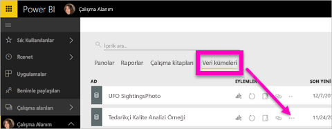
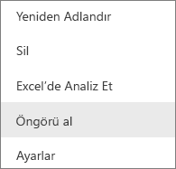
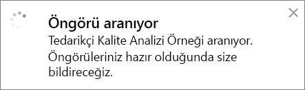
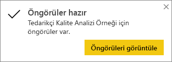
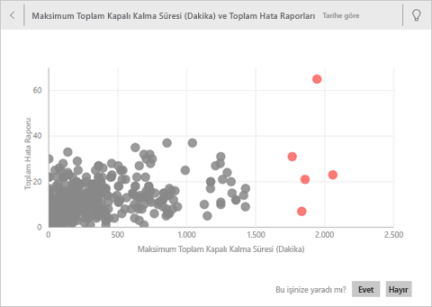
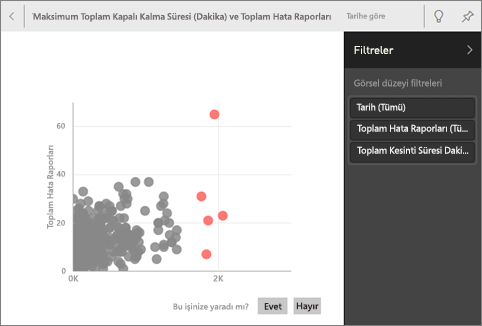
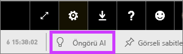
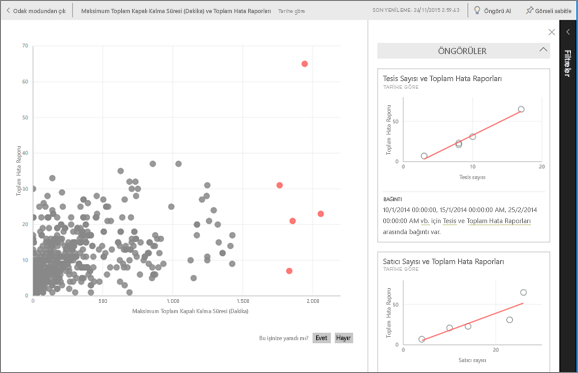
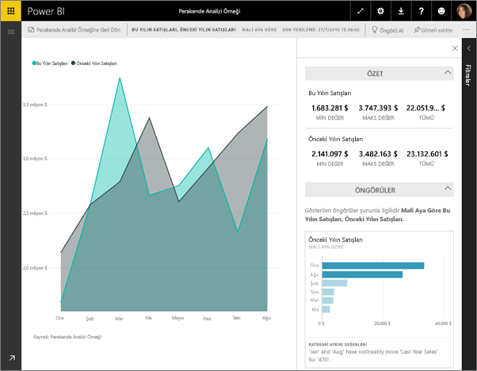

# Power BI ile Hızlı Öngörüler
Yeni bir veri kümeniz var ve keşfetmeye nereden başlayacağınızı bilemiyor musunuz?  Hızla bir pano mu oluşturmanız gerekiyor?  Gözünüzden kaçmış olabilecek öngörülere hızla göz atmak mı istiyorsunuz?

Verilerinizi temel alan ilgi çekici ve etkileşimli görselleştirmeler oluşturmak için Hızlı Öngörüler özelliğini çalıştırın. Hızlı Öngörüler, bir veri kümesinin tamamında (Hızlı Öngörüler) veya belirli bir pano kutucuğu üzerinde (Kapsamlı Öngörüler) çalıştırılabilir. Hızlı Öngörüler'i bir Öngörü üzerinde bile çalıştırabilirsiniz!

> **NOT**: Hızlı Öngörüler DirectQuery ile birlikte çalışmaz. Yalnızca Power BI'a yüklenmiş olan verilerle birlikte çalışır.
> 
> 

Hızlı Öngörüler özelliği Microsoft Research ekibiyle birlikte geliştirilen ve sayısı artmaya devam eden [gelişmiş analiz algoritmaları kümesi](service-insight-types.md) üzerine kurulmuştur. Bu özelliği, daha fazla kullanıcının, verilerindeki öngörülere yeni ve sezgisel yöntemlerle ulaşmasını sağlamak için kullanmaya devam edeceğiz.

## Hızlı Öngörüler'i bir veri kümesi üzerinde çalıştırma
Bir veri kümesi üzerinde Hızlı Öngörüler özelliğini çalıştıran, Öngörü'leri Odak modunda açan, Hızlı Öngörüler'den birini panosuna kutucuk olarak sabitleyen ve Hızlı Öngörüler'i bir görsel için kullanan Amanda'yı izleyin.

<iframe width="560" height="315" src="https://www.youtube.com/embed/et_MLSL2sA8" frameborder="0" allowfullscreen></iframe>

Şimdi sıra sizde. [Tedarikçi Kalite Analizi örneğini](sample-supplier-quality.md) kullanarak Hızlı Öngörüler'i keşfedin.

1. **Veri kümeleri** sekmesinden üç nokta simgesini (...) ve **Öngörü Al**'ı seçin.
   
    
   
    
2. Power BI [çeşitli algoritmalar](service-insight-types.md) kullanarak veri kümenizdeki eğilimleri arar.
   
    
3. Öngörüleriniz saniyeler içinde hazır duruma gelir.  Görselleştirmeleri görüntülemek için **Öngörüleri Görüntüle**'yi seçin.
   
    
   
   > **NOT**: Bazı veri kümelerindeki veriler istatistiksel olarak önemsiz olduğundan bu veri kümelerinde Hızlı Öngörüler oluşturulamaz.  Daha fazla bilgi için bkz. [Verilerinizi Hızlı Öngörüler için en iyi duruma getirme](service-insights-optimize.md).
   > 
   > 
4. Görselleştirmeler, en fazla 32 ayrı öngörü kartını destekleyen özel bir **Hızlı Öngörüler** tuvalinde görüntülenir. Her kartta bir grafik veya graf ile kısa bir açıklama bulunur.
   
    

## Hızlı Öngörüler kartlarıyla etkileşim kurma
  

1. Kartlardan birinin üzerine gelin ve görselleştirmeyi bir panoya eklemek için raptiye simgesini seçin.
2. Kartlardan birinin üzerine gelin ve kartı tam ekran görüntülemek için Odak modu simgesini seçin.
   
    
3. Odak modunda şunları yapabilirsiniz:
   
   * Görselleştirmeleri [filtreleyebilirsiniz](service-interact-with-a-report-in-reading-view.md).  Filtreleri görüntülemek için sağ üst köşedeki oku seçerek Filtreler bölmesini genişletin.
     
        
   * Raptiye   simgesini veya **Görseli sabitle**'yi seçerek öngörü kartını bir panoya sabitleyebilirsiniz.
   * Kart üzerinde Hızlı Öngörüler özelliğini çalıştırın. Bu işlem **Kapsamlı Hızlı Öngörüler** olarak adlandırılır. Sağ üst köşedeki ampul simgesini   veya **Öngörü Al**'ı seçin.
     
       
     
     Hızlı Öngörüler sol tarafta, yalnızca tek bir Hızlı Öngörü'deki verileri temel alan yeni kartlar da sağ tarafta görüntülenir.
     
       
4. Özgün Hızlı Öngörüler tuvaline geri dönmek için sol üst köşedeki **Odak modundan çık**'ı seçin.

## Hızlı Öngörüler'i bir pano kutucuğu üzerinde çalıştırma
Öngörüleri bir veri kümesinin tamamında aramak yerine aramanızı tek bir pano kutucuğunu oluşturmak için kullanılan verilerle sınırlayabilirsiniz. Bu işlem **Kapsamlı Hızlı Öngörüler** olarak adlandırılır.

1. Bir pano açın.
2. Bir kutucuk seçin ve [kutucuğu Odak modunda açın](service-focus-mode.md).
3. Sol üst köşedeki **Öngörü Al**'ı seçin.
   
    
4. Power BI, kutucuğun sağ tarafında öngörü kartlarını görüntüler.
   
    
5. Öngörülerden biri ilginizi mi çekti? İlgili öngörü kartını seçerek detaylandırabilirsiniz. Seçilen Hızlı Öngörü sol tarafta, yalnızca tek bir Hızlı Öngörü'deki verileri temel alan yeni öngörü kartları da sağ tarafta görüntülenir.
6. Verileri detaylandırmaya devam edin ve ilginizi çeken bir Hızlı Öngörü bulduğunuzda sağ üst köşedeki **Görseli sabitle**'yi seçerek görselini panonuza sabitleyin. Dilerseniz ilgili veri kümesinin sahibine geri bildirim göndererek bulduğunuz Hızlı Öngörü'nün faydalı olup olmadığını belirtebilirsiniz.
   
    

## Sonraki adımlar
Bir veri kümesine sahipseniz [bu veri kümesini Hızlı Öngörüler için en iyi duruma getirebilirsiniz](service-insights-optimize.md)

[Kullanılabilir Hızlı Öngörü türleri](service-insight-types.md) hakkında daha fazla bilgi edinin

Başka bir sorunuz mu var? [Power BI Topluluğu'na başvurun](http://community.powerbi.com/)

