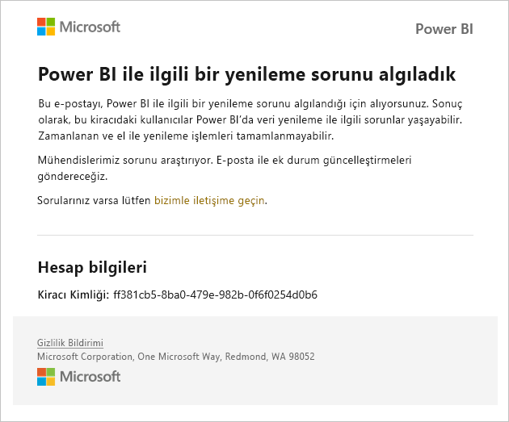
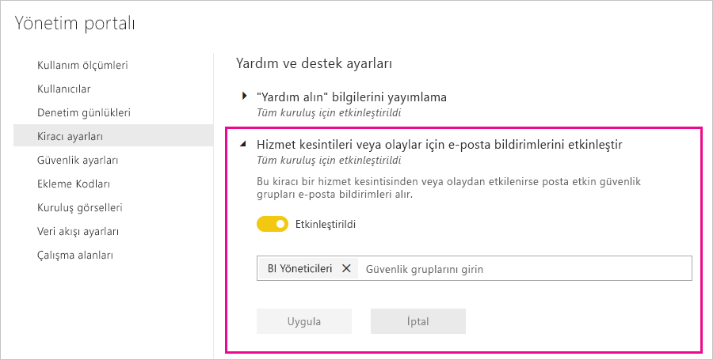

# Hizmet kesintisi bildirimleri

Görev açısından kritik iş uygulamalarınızın kullanılabilirliği hakkında içgörü sahibi olmak önemlidir. Power BI, hizmet kesintisi veya hizmette performans düşüşü yaşandığında e-postaları almaya devam edebilmeniz için seçenek olarak olay bildirimi özelliğini sunar. Power BI’ın %99,9 hizmet düzeyi sözleşmesi (SLA) ile bunlar nadir yaşansa da, bilgileri almaya devam etmenizi garantilemek istiyoruz. Aşağıdaki ekran görüntüsü, bildirimleri etkinleştirirseniz ne tür e-postalar alacağınızı gösterir.

Şu anda, aşağıdaki _güvenilirlik senaryoları_için e-posta göndeririz:

- Rapor güvenilirliğini açma
- Model yenileme güvenilirliği
- Sorgu yenileme güvenilirliği

Kullanıcıların, raporları açma, veri kümelerini yenileme veya sorgu yürütme gibi işlemlerde daha fazla gecikme yaşaması durumları, bu bildirimlerin örneklerine dahil edilebilir. Bir olay çözümlendikten sonra bir izleme e-postası alırsınız.

> [!NOTE]
> Bu özellik, şu anda yalnızca Power BI Premium’daki ayrılmış kapasiteler için sunulmaktadır. Paylaşılan veya ekli kapasite için sunulmamaktadır.

## Bildirimleri etkinleştirme

Power BI kiracı yöneticisi, yönetici portalından bildirimleri etkinleştirir:

1. Bildirimleri alması gereken bir e-posta etkin güvenlik grubu tanımlayın veya oluşturun.

1. Yönetici portalında **Kiracı ayarlarını** seçin. **Yardım ve destek ayarlarının** altında **Hizmet kesintileri veya olaylar için e-posta bildirimlerini etkinleştir** seçeneğini genişletin.

1. E-posta bildirimlerini etkinleştirin, bir güvenlik grubu girin ve **Uygula**’yı belirleyin.

    

> [!NOTE]
> Power BI şu hesaptan bildirim gönderir: no-reply-powerbi@microsoft.com. Bildirimlerin istenmeyen veya önemsiz posta klasörlerine düşmemesi için bu hesabın beyaz listede bulunduğundan emin olun.

## Sonraki adımlar

[Power BI Pro ve Power BI Premium destek seçenekleri](service-support-options.md)

Başka bir sorunuz mu var? [Power BI Topluluğu'na başvurun](http://community.powerbi.com/)