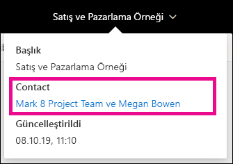
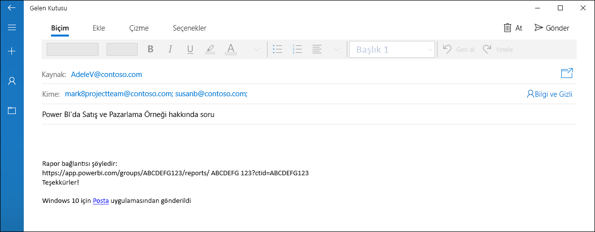
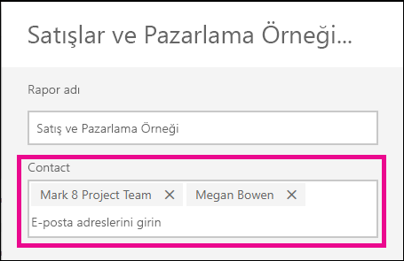
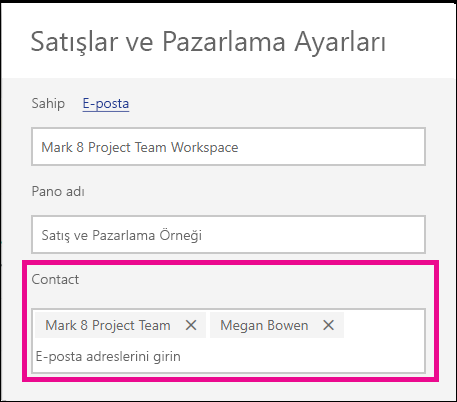

# Power BI hizmetindeki rapor ve panolara yönelik iletişim bilgilerini ayarlama
Bu makalede, Power BI hizmetindeki pano veya raporlara yönelik iletişim bilgilerini ayarlamayı öğreneceksiniz.

> [!NOTE]
> İletişim bilgileri, klasik veya yeni bir çalışma alanında bulunan bir öğe kümesi için ayarlanabilir. Çalışma Alanım’da bulunan öğeler için iletişim bilgileri ayarlayamazsınız. Bilgi kartı, bir rapor veya pano [yeni görünümde](service-new-look.md) görüntülenirken gösterilir.

Bir öğenin kişilerine birden fazla kullanıcıyı veya grubu ekleyebilirsiniz. Kişilere şunlar dahildir:
* Bir kişi
* Office 365 Grubu
* E-posta etkin bir güvenlik grubu
* Dağıtım listesi

Varsayılan olarak, yeni bir raporu veya panoyu oluşturan kişi bunlara ilişkin kişi olur. Bir değer ayarlarsanız, varsayılan değer geçersiz kılınır. Tüm kişileri ve grupları kişi listesinden kaldırabilirsiniz. Bunu yaptığınızda, klasik çalışma alanları için çalışma alanına yönelik Office 365 Grubu gösterilir. Yeni çalışma alanı deneyimi çalışma alanları için, [çalışma alanı kişi listesi](service-create-the-new-workspaces.md#workspace-contact-list) kullanılır. Çalışma alanı kişi listesi ayarlanmamışsa, çalışma alanı yöneticileri gösterilir.

Kişi bilgileri, öğeyi görüntüleyen kişiye gösterilir. 

 

Kişi listesine tıkladığınızda, soru sorup yardım alabilmeniz için bir e-posta iletisi oluşturulur. 

 
 
Kişi listesi bilgileri farklı yerlerde de kullanılır. Örneğin, hata iletişim kutusundaki bazı hata senaryolarında gösterilir. Erişim istekleri gibi, öğeyle ilgili olan otomatikleştirilmiş e-posta iletileri kişi listesine gönderilir. 

> [!NOTE]
> Bir uygulama yayımlanırken, ayrı öğelere ayarlanan kişi bilgileri uygulamayı yayımlayan veya güncelleştiren kişiye ayarlanır. Uygulama kullanıcılarının ihtiyaç duyduğu yardımı alması için uygulamaya yönelik destek URL’sini ayarlayabilirsiniz.

## Bir rapor için iletişim bilgilerini ayarlama
1. Çalışma alanınızda **Raporlar** sekmesini seçin.
2. İstenen raporu bulup **Ayarlar** simgesini seçin.
3. **Kişi** giriş alanını bulup bir değer ayarlayın.

     

## Panolara yönelik iletişim bilgilerini ayarlama
1. Çalışma alanınızda **Panolar** sekmesini seçin.
2. İstenen panoyu bulup **Ayarlar** simgesini seçin
3. **Kişi** giriş alanını bulup bir değer ayarlayın.

     

## Sınırlamalar ve önemli noktalar
* Kişi, Power BI hizmetinde oluşturulan yeni öğeler için otomatik olarak ayarlanır. Mevcut öğeler, çalışma alanının varsayılanını gösterir.
* Kişi listesinde yer alan herhangi bir kullanıcıyı veya grubu ayarlayabilirsiniz. Ancak, bu kullanıcılara veya gruplara öğeye yönelik izinler otomatik olarak verilmez. Paylaşımı kullanın veya çalışma alanı erişimine ihtiyaç duyan kullanıcıya bunu bir rol aracılığıyla verin. 
* Öğe düzeyi kişi listesi yayımlandığında uygulamalara gönderilmez. Yeni uygulama gezinti deneyimi bir destek URL’si sağlar. Büyük sayılardaki uygulama kullanıcılarından gelen geri bildirimleri yönetmeye yardımcı olmak için bunu yapılandırabilirsiniz.

## Sonraki adımlar

Başka bir sorunuz mu var? [Power BI Topluluğu'na başvurun](https://community.powerbi.com/)
