# Power BI’da Otomatikleştirilmiş Makine Öğrenmesi

Veri akışları için otomatik makine öğrenmesi (AutoML), iş analistlerinin Makine Öğrenmesi (ML) modellerini doğrudan Power BI’da eğitmesine, doğrulamasına ve çağırmasına olanak tanır. Analistlerin modeli eğitmeye yönelik giriş verilerini belirtmek için veri akışlarını kullanabileceği yeni bir ML modeli oluşturmak için basit bir deneyim içerir. Hizmet en ilgili özellikleri otomatik olarak ayıklar, uygun bir algoritma seçer ve ML modelini ayarlayıp doğrular. Bir model eğitildikten sonra Power BI, doğrulama sonuçlarını içeren bir raporu otomatik olarak oluşturur. Model daha sonra veri akışı içindeki yeni veya güncelleştirilmiş veriler üzerinde çağrılabilir.

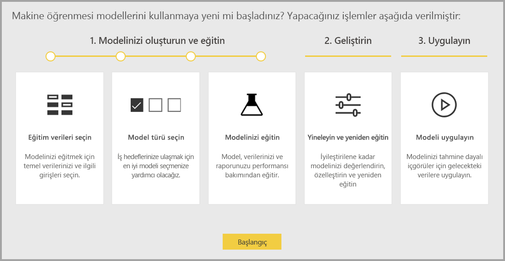

Otomatik makine öğrenmesi, Power BI Premium ve Embedded kapasitelerinde barındırılan veri akışları için kullanılabilir.

## AutoML ile çalışma

[Power BI veri akışları](service-dataflows-overview.md), büyük veriler için self servis veri hazırlığı sunar. AutoML, veri akışlarıyla tümleşiktir ve makine öğrenmesi modellerini Power BI içinden oluşturmak için veri hazırlığı çalışmalarınızdan yararlanmanızı sağlar.

Power BI’da AutoML, veri analistlerinin Power BI becerilerini kullanarak basitleştirilmiş bir deneyimle makine öğrenmesi modelleri oluşturmak için veri akışlarını kullanmasına olanak tanır. ML modellerinin oluşturulmasının altında yatan veri biliminin büyük bölümü Power BI ile otomatikleştirilir. AutoML, oluşturulan modelin kaliteli olduğundan ve ML modelinizi oluşturmak için kullanılan işlemin görünürlüğünü sağladığından emin olmaya yönelik korumalara sahiptir.

AutoML, veri akışları için **İkili Tahmin**, **Sınıflandırma** ve **Regresyon Modelleri**’nin oluşturulmasını destekler. Bunlar, denetimli makine öğrenmesi tekniklerinin türleridir. Diğer bir deyişle, diğer gözlemlerin sonuçlarını tahmin etmek için geçmiş gözlemlerin bilinen sonuçlarını öğrenirler. Bir AutoML modelinin eğitimine yönelik giriş veri kümesi, bilinen sonuçlarla **etiketlenmiş** bir kayıt kümesidir.

Power BI’da AutoML, modellerinizi oluşturmak için [Azure Machine Learning](https://docs.microsoft.com/azure/machine-learning/service/overview-what-is-azure-ml)'in [otomatik ML](https://docs.microsoft.com/azure/machine-learning/service/concept-automated-ml) özelliğini tümleştirir. Ancak, Power BI’da AutoML kullanmak için bir Azure aboneliğinizin olması gerekmez. ML modellerini eğitme ve barındırma işlemi tamamen Power BI hizmeti tarafından yönetilir.

Bir ML modeli eğitildikten sonra AutoML, ML modelinizin olası performansını açıklayan bir Power BI raporunu otomatik olarak oluşturur. AutoML, girişleriniz arasında, modeliniz tarafından döndürülen tahminleri etkileyen başlıca etkileyicileri vurgulayarak açıklanabilirliği ön plana çıkarır. Rapor ayrıca modelin önemli ölçümlerini içerir.

Oluşturulan raporun diğer bölümlerinde modelin istatistiksel özeti ve eğitim ayrıntıları gösterilir. İstatistiksel özet, modelin standart veri bilimi performans ölçümlerini görmek isteyen kullanıcıları ilgilendirir. Eğitim ayrıntıları, modelinizi oluşturmak için çalıştırılan tüm yinelemeleri, ilişkili modelleme parametreleriyle birlikte özetler. Ayrıca, ML modelini oluşturmak için her bir girişin nasıl kullanıldığını açıklar.

Daha sonra ML modelinizi puanlama için verilerinize uygulayabilirsiniz. Veri akışı yenilendiğinde, verileriniz ML modelinizdeki tahminlerle güncelleştirilir. Power BI ayrıca ML modelinin ürettiği her tahmin için ayrı bir açıklama içerir.

## Makine öğrenmesi modeli oluşturma

Bu bölümde bir AutoML modelinin nasıl oluşturulacağı açıklanmaktadır.

### ML modeli oluşturmak için veri hazırlığı

Power BI’da bir makine öğrenmesi modeli oluşturmak için öncelikle ML modelini eğitmek için kullanılan geçmiş sonuç bilgilerini içeren bir veri akışı oluşturmanız gerekir. Ayrıca, tahmin etmeye çalıştığınız sonuç için güçlü bir tahmin olabilecek herhangi bir iş ölçümünün hesaplanmış sütunlarını ekleyebilirsiniz. Veri akışınızı yapılandırma hakkında ayrıntılı bilgi için bkz. [Power BI’da self servis veri akışı hazırlığı](service-dataflows-overview.md).

AutoML bir makine öğrenmesi modelini eğitmek için belirli veri gereksinimlerine sahiptir. Bu gereksinimler, ilgili model türlerine göre aşağıdaki bölümlerde açıklanmıştır.

### ML modeli girişlerini yapılandırma

Bir AutoML modeli oluşturmak için, veri akışı varlığının **Eylemler** sütunundaki ML simgesini seçin ve **Makine öğrenmesi modeli ekle** seçeneğini belirleyin.

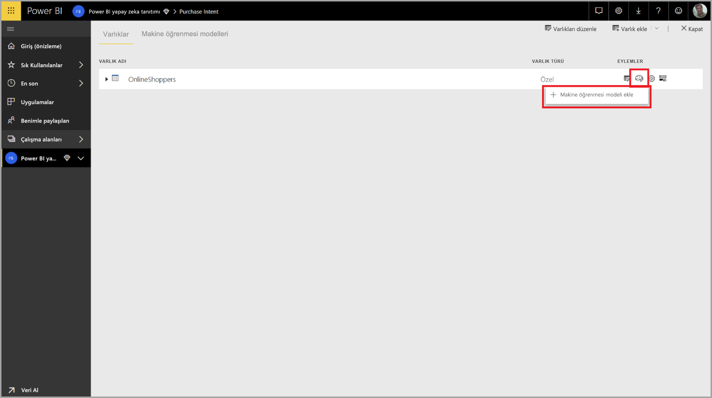

ML modeli oluşturma işleminde size kılavuzluk eden sihirbazın bulunduğu basitleştirilmiş bir deneyim başlatılır. Sihirbaz aşağıdaki adımları içerir.

**1. Geçmiş verilerini içeren varlığı ve tahminini istediğiniz sonuç alanını seçin**

Sonuç alanı, aşağıdaki görüntüde gösterildiği gibi ML modeli eğitimine yönelik etiket özniteliğini tanımlar.

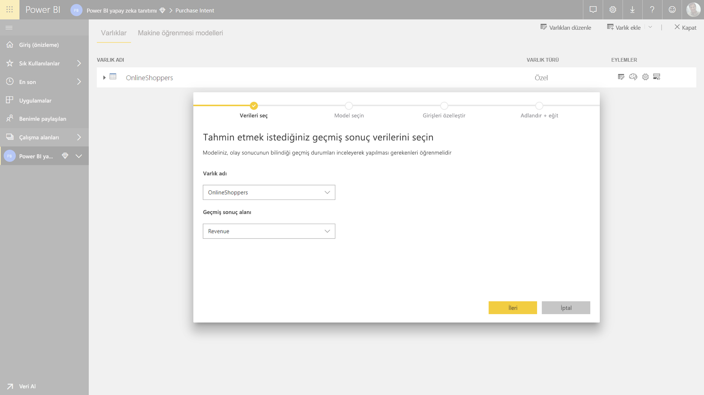

**2. Model türü seçin**

Sonuç alanını belirttiğinizde AutoML, eğitilme olasılığı en yüksek ML modelini önermek üzere etiket verilerini analiz eder. Aşağıda gösterildiği gibi "Farklı bir model seçin" seçeneğine tıklayarak farklı bir model türü seçebilirsiniz.

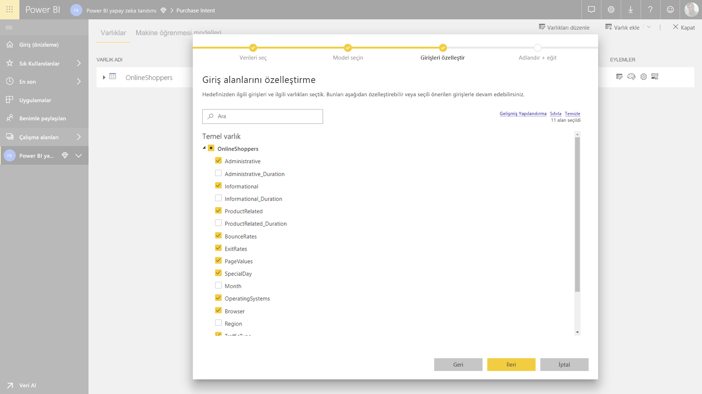

> [!NOTE]
> Bazı model türleri, seçtiğiniz veriler için desteklenmeyebilir ve bu nedenle devre dışı bırakılabilir. Yukarıdaki örnekte, sonuç alanı olarak bir metin sütunu seçildiği için Regresyon devre dışı bırakılmıştır.

**3. Modelin öngörücü sinyal olarak kullanmasını istediğiniz girişleri seçin**

AutoML, ML modeli eğitimi için kullanılabilecek girişleri önermek amacıyla seçili varlığın bir örneğini analiz eder. Seçili olmayan alanların yanında açıklamalar verilir. Belirli bir alanda çok fazla farklı değer veya yalnızca bir değer varsa ya da çıkış alanı ile düşük veya yüksek bağıntı varsa, bunun yapılması önerilmez.

Sonuç alanına (veya etiket alanına) bağlı olan hiçbir giriş, kendi performansını etkileyeceğinden ML modelini eğitmek için kullanılmamalıdır. Bu tür alanlar "çıkış alanı ile kuşku verici düzeyde yüksek bağıntılı" olarak işaretlenir. Bu alanları eğitim verilerine eklemek, modelin doğrulama veya test verileri üzerinde iyi performans gösterdiği ancak puanlama için üretimde kullanıldığında aynı performansı gerçekleştiremediği etiket sızıntısı durumuna neden olur. Etiket sızıntısı, eğitim modeli performansı doğru olamayacak kadar iyi olduğunda AutoML modellerinde olası bir sorun olabilir.

Bu özellik önerisi bir veri örneğini temel aldığı için kullanılan girişleri gözden geçirmeniz gerekir. Seçimleri yalnızca modelin incelemesini istediğiniz alanları içerecek şekilde değiştirme seçeneğiniz vardır. Ayrıca, varlık adının yanındaki onay kutusunu seçerek tüm alanları seçebilirsiniz.

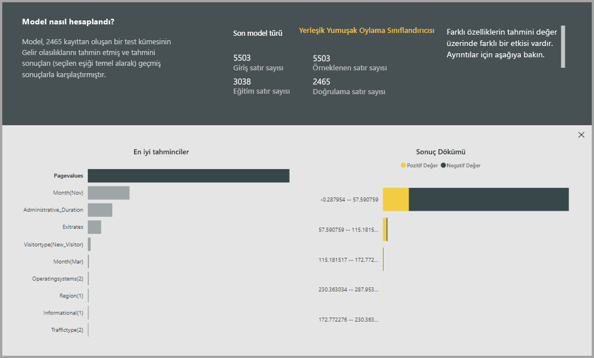

**4. Modelinizi adlandırma ve yapılandırmanızı kaydetme**

Son adımda, modeli adlandırabilir ve Kaydet ve eğit’i seçerek ML modelinin eğitimini başlatabilirsiniz. Hızlı sonuçlar görmek için eğitim süresini azaltmayı veya en iyi modeli elde etmek için eğitim süresini artırmayı seçebilirsiniz.

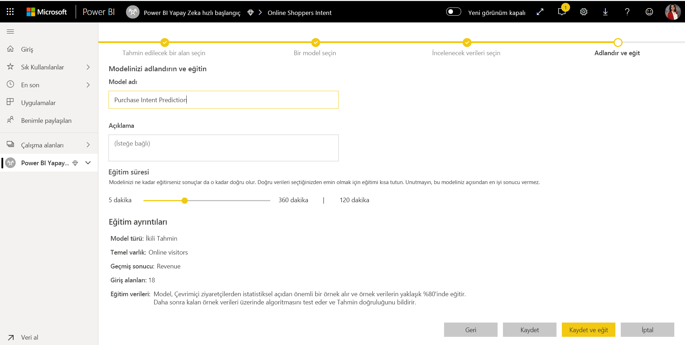

### ML modeli eğitimi

AutoML modellerinin eğitimi, veri akışını yenilemenin bir parçasıdır. AutoML ilk olarak verilerinizi eğitim için hazırlar.
AutoML, sağladığınız geçmiş verileri eğitim ve test veri kümelerine böler. Test veri kümesi, eğitimin ardından model performansını doğrulamak için kullanılan bir gizleme kümesidir. Bunlar veri akışında **Eğitim ve Test** varlıkları olarak uygulanır. AutoML, model doğrulaması için çapraz doğrulamayı kullanır.

Ardından, her giriş alanı analiz edilir ve görevlendirme yapılır. Bu işlem eksik değerlerin yerine değiştirilen değerleri getirir. AutoML tarafından birkaç farklı görevlendirme stratejisi kullanılır. Sayısal özellikler olarak ele alınan giriş özniteliklerinin atanması için sütun değerlerinin ortalaması kullanılır. Kategori özellikleri olarak ele alınan giriş özniteliklerinin atanması için AutoML sütun değerlerinin modunu kullanır. Atama için kullanılan değerlerin ortalaması ve modu, alt örneği alınmış eğitim veri kümesinde AutoML çerçevesi tarafından hesaplanır.

Ardından, örnekleme ve normalleştirme gereken şekilde verilerinize uygulanır. Sınıflandırma modelleri için, AutoML giriş verilerini çok katmanlı örnekleme aracılığıyla çalıştırır ve satır sayılarının tümü için eşit olduğundan emin olmak üzere sınıfları dengeler.

AutoML, veri türüne ve istatistiksel özelliklerine göre her bir seçili giriş alanına birkaç dönüşüm uygular. AutoML, ML modelinizi eğitirken kullanılacak özellikleri eğitmek için bu dönüşümleri kullanır.

AutoML modellerinin eğitim süreci, en iyi performansa sahip modeli bulmak için farklı modelleme algoritmalarına ve hiper parametre ayarlarına sahip 50'ye kadar yinelemeden oluşur. AutoML gözlemlenen bir performans iyileşmesi olmadığını fark ederse eğitim daha az yinelemeyle sona erebilir. Bu modellerin her birinin performansı, gizleme testi veri kümesiyle doğrulama yapılarak değerlendirilir. Bu eğitim adımı sırasında AutoML, bu yinelemelerin eğitimi ve doğrulanması için birkaç işlem hattı oluşturur. Veri kümenizin boyutuna ve kullanılabilir ayrılmış kapasite kaynaklarına bağlı olarak, modellerin performansını değerlendirme işlemi sihirbazda yapılandırılmış eğitim süresine kadar birkaç dakika ile birkaç saat arasında sürebilir.

Bazı durumlarda, oluşturulan son model daha iyi tahmine dayalı performans sağlamak için birden çok modelin kullanıldığı grup öğrenmesini kullanabilir.

### AutoML modelinin açıklanabilirliği

Model eğitildikten sonra AutoML, giriş özellikleri ile model çıkışı arasındaki ilişkiyi analiz eder. Her giriş özelliği için gizleme test veri kümesinin model çıkışındaki değişikliğin büyüklüğünü değerlendirir. Bu, _özelliğin önemi_ olarak bilinir. Bu işlem, eğitim tamamlandıktan sonra yenilemenin bir parçası olarak gerçekleşir. Bu nedenle, yenileme işleminiz sihirbazda yapılandırılan eğitim süresinden daha uzun sürebilir.

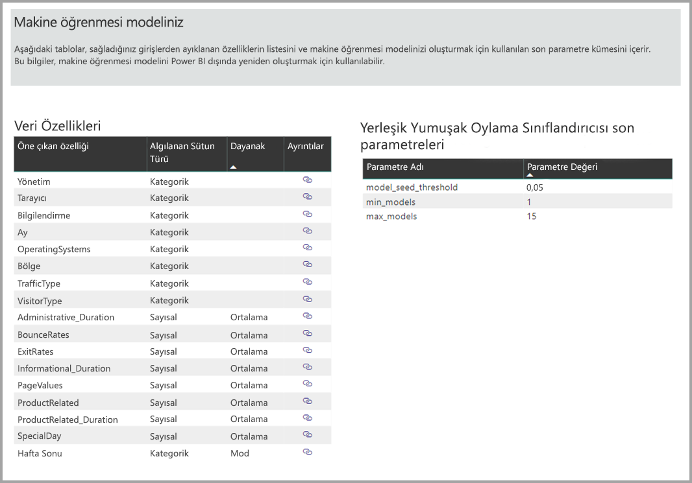

### AutoML model raporu

AutoML, genel özellik önemiyle birlikte doğrulama sırasında modelin performansını özetleyen bir Power BI raporu oluşturur. Veri akışı yenilemesi başarılı olduktan sonra bu rapora Makine Öğrenmesi Modeli sekmesinden erişilebilir. Rapor, ML modelinin gizleme test verilerine uygulanması ve bilinen sonuç değerleriyle tahminlerin karşılaştırılması sonucunda elde edilecek sonuçları özetler.

Performansını anlamak için model raporunu gözden geçirebilirsiniz. Ayrıca, modelin önemli etkileyicilerinin bilinen sonuçlar hakkındaki iş öngörüleriyle uyumlu olduğunu doğrulayabilirsiniz.

Rapordaki model performansını açıklamak için kullanılan grafikler ve ölçüler model türüne bağlıdır. Bu performans grafikleri ve ölçümler aşağıdaki bölümlerde açıklanmıştır.

Rapordaki ek sayfalar, modelle ilgili istatistiksel ölçümleri bir veri bilimi perspektifinden açıklayabilir. Örneğin, **İkili Tahmin** raporu bir kazanç grafiği ve modelin ROC eğrisini içerir.

Raporlar ayrıca modelin nasıl eğitildiğine ilişkin açıklama içeren bir **Eğitim Ayrıntıları** sayfası ve yineleme çalıştırmalarının her birindeki model performansını açıklayan bir grafik içerir.

Bu sayfadaki başka bir bölümde, giriş alanında algılanan tür ve eksik değerleri doldurmak için kullanılan atama yöntemi açıklanmaktadır. Ayrıca son model tarafından kullanılan parametreleri içerir.

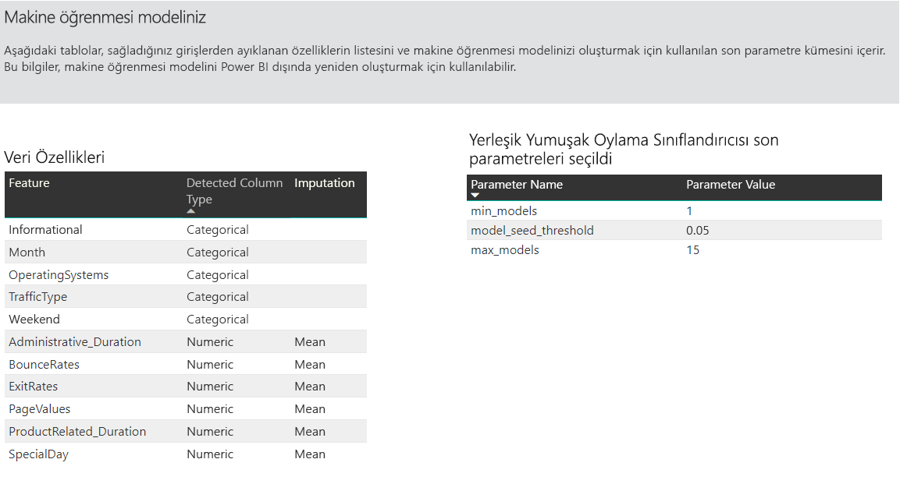

Oluşturulan model grup öğrenmesi kullanıyorsa, **Eğitim Ayrıntıları** sayfasında grubu oluşturan her bir üyenin ağırlığını ve parametrelerini gösteren bir grafik de bulunur.

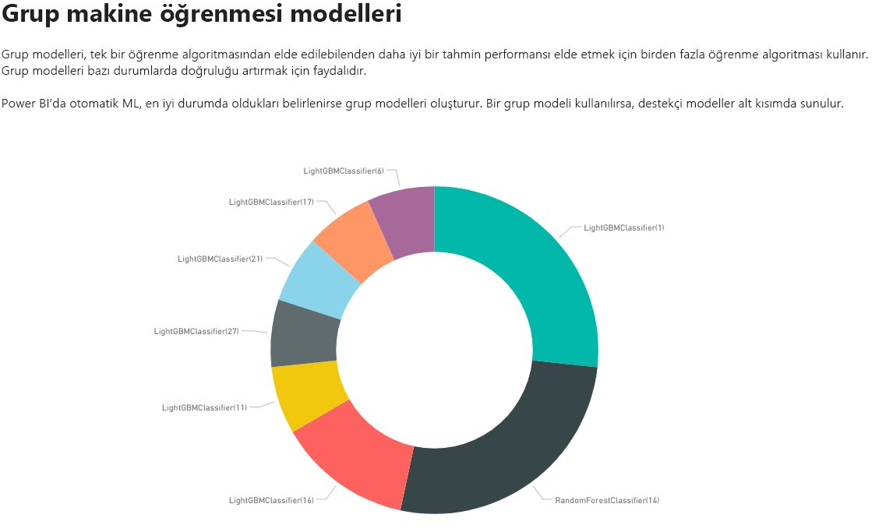

## AutoML modelini uygulama

Oluşturulan ML modelinin performansından memnunsanız, veri akışınız yenilendiğinde modeli yeni veya güncelleştirilmiş verilere uygulayabilirsiniz. Bu işlemi, model raporunda sağ üst köşedeki **Uygula** düğmesini veya Makine Öğrenmesi Modelleri sekmesindeki ML Modeli Uygula düğmesini seçerek yapabilirsiniz.

ML modelini uygulamak için, uygulanması gereken varlığın adını ve model çıkışı için bu varlığa eklenecek sütunların ön ekini belirtmeniz gerekir. Sütun adları için varsayılan ön ek, model adıdır. _Uygula_ işlevi, model türüne özgü ek parametreler içerebilir.

ML modelinin uygulanması, çıkış varlığında puan veren her bir satır için tahminler ve kişiselleştirilmiş açıklamalar içeren iki yeni veri akışı varlığı oluşturur. Örneğin, _PurchaseIntent_ modelini _OnlineShoppers_ varlığına uygularsanız, çıkış **OnlineShoppers zenginleştirilmiş PurchaseIntent** ve **OnlineShoppers zenginleştirilmiş PurchaseIntent açıklamaları** varlıklarını oluşturur. Zenginleştirilmiş varlıktaki her satır için **Açıklamalar**, giriş özelliğine göre zenginleştirilmiş açıklamalar varlığındaki birden fazla satıra bölünür. **ExplanationIndex**, zenginleştirilmiş açıklamalar varlığındaki satırları zenginleştirilmiş varlıktaki satırla eşlemeye yardımcı olur.

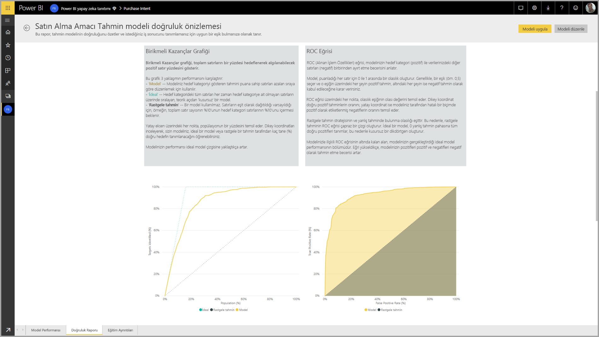

Modeli uyguladıktan sonra, veri akışı her yenilendiğinde AutoML tahminlerinizi güncel tutar.

Bir Power BI raporundaki ML modelinden içgörü ve tahminleri kullanmak için, **dataflows** bağlayıcısını kullanarak Power BI Desktop’tan çıkış varlığına bağlanabilirsiniz.

## İkili Tahmin Modelleri

Daha resmi adıyla **ikili sınıflandırma modelleri** olarak bilinen İkili Tahmin modelleri, bir veri kümesini iki grup halinde sınıflandırmak için kullanılır. Bunlar, ikili sonucu olan olayları tahmin etmek için kullanılır. Örneğin, bir satış fırsatının dönüştürüp dönüştürmeyeceği, bir hesabın değişip değişmeyeceği, bir faturanın zamanında ödenip ödenmeyeceği, bir işlemin hileli olup olmadığı vb.

İkili Tahmin modelinin çıkışı, hedef sonuca ulaşma olasılığını tanımlayan bir olasılık puandır.

### İkili Tahmin modelini eğitme

Önkoşullar:

- Her sonuç sınıfı için en az 20 satır geçmiş veri gereklidir

İkili Tahmin modeli oluşturma işlemi, yukarıdaki **ML modeli girişlerini yapılandırma** bölümünde açıklanan diğer AutoML modelleriyle aynı adımları izler. Tek fark, en çok ilgilendiğiniz hedef sonuç değerini seçebileceğiniz "Bir model seçin" adımındadır. Model doğrulama sonuçlarını özetleyecek otomatik olarak oluşturulan raporda kullanılacak sonuçlar için kolay etiketler de sağlayabilirsiniz.

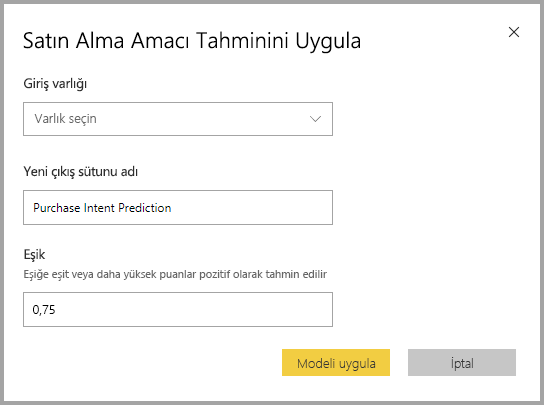

### İkili Tahmin modeli raporu

İkili Tahmin modeli, bir kaydın hedef sonuca ulaşma olasılığını çıkış olarak oluşturur. Rapor, olasılık eşiğinin üstünde ve altındaki puanların nasıl yorumlandığını etkileyen bir dilimleyici içerir.

Rapor, modelin performansını _Gerçek Pozitifler, Hatalı Pozitifler, Gerçek Negatifler ve Hatalı Negatifler_ cinsinden açıklar. Gerçek Pozitifler ve Gerçek Negatifler, çıkış verilerindeki iki sınıfın doğru şekilde tahmin edilmiş sonuçlardır. Hatalı Pozitifler, Hedef sonuca ulaşacağı tahmin edilen ancak gerçekte ulaşmayan kayıtlardır. Buna karşılık, Hatalı Negatifler Hedef sonuca ulaşmış ancak ulaşmadığı tahmin edilen kayıtlardır.

Duyarlılık ve Yakalama gibi ölçüler, öngörülen sonuçlar üzerinde olasılık eşiğinin etkisini anlatmaktadır. Duyarlık ile Yakalama arasında dengeli bir uzlaşma sağlayan eşiği seçmek için olasılık eşiği dilimleyicisini kullanabilirsiniz.

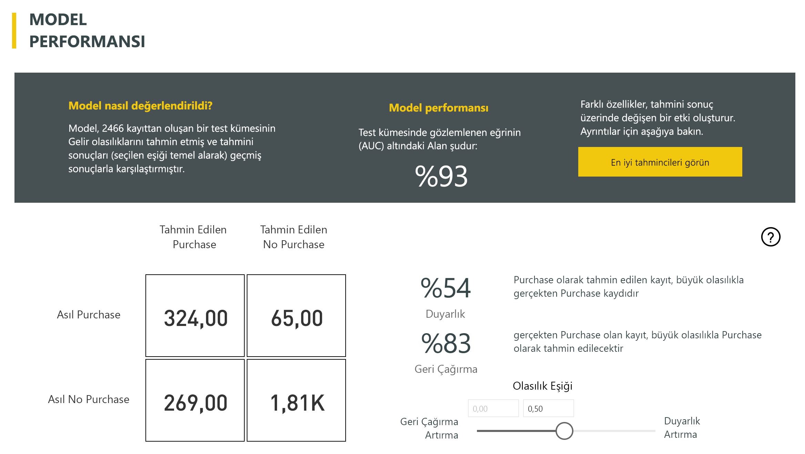

Rapor ayrıca en yüksek kârı üretmek için hedeflenmesi gereken nüfus alt kümesini tanımlamaya yardımcı olacak bir Maliyet-Fayda analizi de içerir. Hedeflemenin tahmini birim maliyeti ve hedef sonucu elde etmenin birim kazancı bilinen Maliyet-Kazanç analizinde kârın en üst düzeye çıkarılması amaçlanır. Bu aracı kullanarak, kârı en üst düzeye çıkarmak için grafikteki maksimum noktaya göre olasılık eşiğinizi seçebilirsiniz. Bu grafiği, olasılık eşiği seçiminizin kâr veya maliyetini hesaplamak üzere de kullanabilirsiniz.

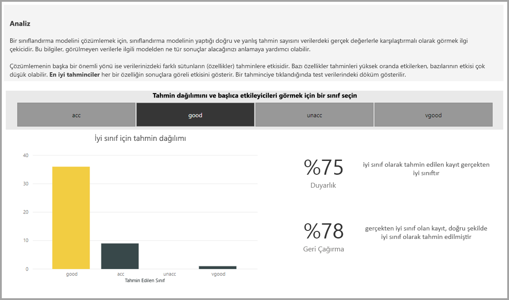

Model raporunun **Doğruluk Raporu** sayfasında, _Kümülatif Kazançlar_ grafiği ve modelin ROC eğrisi bulunur. Bunlar, model performansının istatistiksel ölçüleridir. Raporlar gösterilen grafiklerin açıklamalarını içerir.

### İkili Tahmin modeli uygulama

İkili tahmin modelini uygulamak için, ML modelinden tahminleri uygulamak istediğiniz verileri içeren varlığı belirtmeniz gerekir. Diğer parametreler, çıkış sütunu adı önekini ve tahmin edilen sonucun sınıflandırılmasına yönelik olasılık eşiğini içerir.

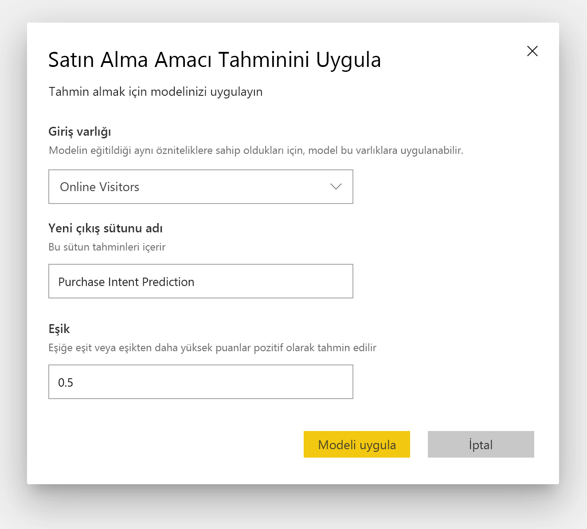

Bir İkili Tahmin modeli uygulandığında zenginleştirilmiş çıkış varlığına dört çıkış sütunu ekler: **Outcome**, **PredictionScore**, **PredictionExplanation** ve **ExplanationIndex**. Model uygulandığında, varlıktaki sütun adları belirtilen ön eki alır.

**PredictionScore**, hedef sonuca ulaşma olasılığını tanımlayan bir olasılık puanıdır.

**Outcome** sütunu tahmin edilen sonuç etiketini içerir. Eşiği aşma olasılıklarını içeren kayıtların hedef sonuca ulaşma olasılığı yüksek olarak tahmin edilir ve bu kayıtlar True olarak etiketlenir. Eşiğin altındaki kayıtlar, sonuca ulaşma olasılığı düşük olarak tahmin edilir ve False olarak etiketlenir.

**PredictionExplanation** sütunu, giriş özelliklerinin **PredictionScore** üzerinde sahip olduğu etki ile birlikte bir açıklama içerir.

## Sınıflandırma modelleri

Sınıflandırma modelleri, bir veri kümesini birden çok grup veya sınıfa ayırmak için kullanılır. Birden çok olası sonuçtan birine ulaşabilecek olayları tahmin etmek için kullanılır. Örneğin, müşterinin çok yüksek, yüksek, orta veya düşük Ömür Değerine sahip olma olasılığı, varsayılan riskin Yüksek, Orta, Düşük veya Çok Düşük olması vb.

Sınıflandırma modelinin çıkışı, bir kaydın belirli bir sınıfa yönelik ölçütlere ulaşmasının olasılığını belirleyen bir olasılık puandır.

### Sınıflandırma modeli eğitimi

Sınıflandırma modeline ait eğitim verilerinizi içeren giriş varlığının, bilinen sonuçları tanımlayan geçmiş sonuç alanı olarak bir dize veya tam sayı alanına sahip olması gerekir.

Önkoşullar:

- Her sonuç sınıfı için en az 20 satır geçmiş veri gereklidir

Sınıflandırma modeli oluşturma işlemi, yukarıdaki **ML modeli girişlerini yapılandırma** bölümünde açıklanan diğer AutoML modelleriyle aynı adımları izler.

### Sınıflandırma modeli raporu

Sınıflandırma modeli raporu, ML modelinin gizleme test verilerine uygulanmasıyla ve bir kaydın tahmin edilen sınıfı gerçek bilinen sınıfla karşılaştırılarak oluşturulur.

Model raporu, bilinen her sınıf için doğru ve yanlış sınıflandırılmış kayıtların dökümünden oluşan bir grafik içerir.

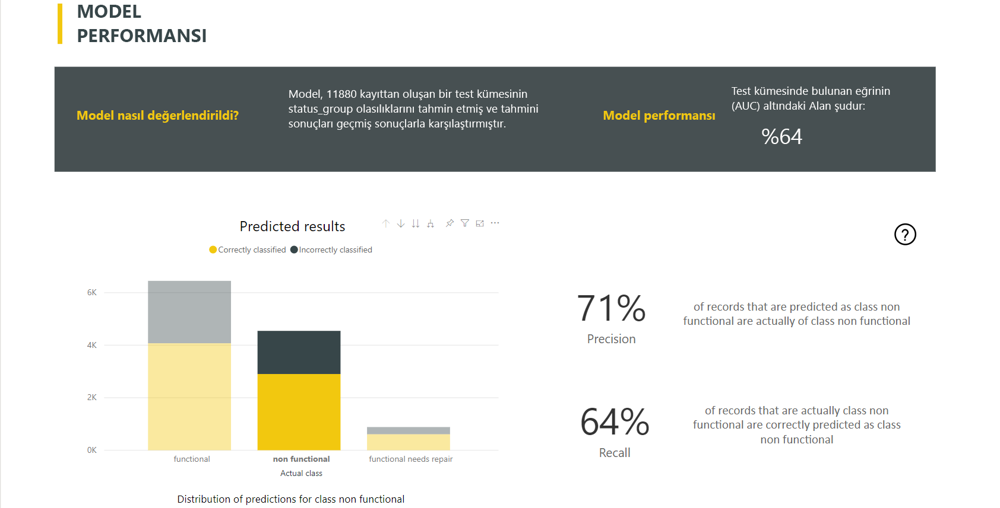

Sınıfa özgü daha fazla ayrıntıya gitmek, bilinen bir sınıfa yönelik tahminlerin nasıl dağıtıldığına ilişkin bir analiz sağlar. Bu analiz, söz konusu bilinen sınıfın kayıtlarının hatalı sınıflandırılabileceği diğer sınıfları gösterir.

Rapordaki model açıklaması her sınıf için en iyi tahmin unsurlarını da içerir.

Sınıflandırma modeli raporu ayrıca bu makalenin önceki kısımlarında yer alan **AutoML model raporu** bölümünde açıklandığı gibi diğer model türlerinin sayfalarına benzer bir Eğitim Ayrıntıları sayfası içerir.

### Sınıflandırma modelini uygulama

Bir Sınıflandırma ML modelini uygulamak için, giriş verileri ve çıkış sütunu adı ön ekiyle birlikte varlığı belirtmeniz gerekir.

Bir Sınıflandırma modeli uygulandığında zenginleştirilmiş çıkış varlığına beş çıkış sütunu ekler: **ClassificationScore**, **ClassificationResult**, **ClassificationExplanation**, **ClassProbabilities** ve **ExplanationIndex**. Model uygulandığında, varlıktaki sütun adları belirtilen ön eki alır.

**ClassProbabilities** sütunu, her olası sınıfın kaydına ait olasılık puanlarının listesini içerir.

**ClassificationScore**, bir kaydın belirli bir sınıfa yönelik ölçütlere ulaşma olasılığını tanımlayan bir olasılık yüzdesidir.

**ClassificationResult** sütunu, kayıt için en yüksek olasılıkla tahmin edilen sınıfı içerir.

**ClassificationExplanation** sütunu, giriş özelliklerinin **ClassificationScore** üzerinde sahip olduğu etki ile birlikte bir açıklama içerir.

## Regresyon modelleri

Regresyon modelleri, sayısal bir değeri tahmin etmek için kullanılır. Örneğin, bir satış kaynağından gerçekleştirilme olasılığı yüksek olan gelir, bir hesabın ömür değeri, ödenme olasılığı yüksek bir alacak faturasının tutarı, bir faturanın ödenebileceği tarih vb.

Regresyon modelinin çıkışı, tahmin edilen değerdir.

### Regresyon modeli eğitimi

Regresyon modeline ait eğitim verilerinizi içeren giriş varlığının, bilinen sonuç değerlerini tanımlayan sonuç alanı olarak bir sayısal alana sahip olması gerekir.

Önkoşullar:

- Regresyon modeli için en az 100 satır geçmiş veri gereklidir

Regresyon modeli oluşturma işlemi, yukarıdaki **ML modeli girişlerini yapılandırma** bölümünde açıklanan diğer AutoML modelleriyle aynı adımları izler.

### Regresyon modeli raporu

Diğer AutoML model raporları gibi Regresyon raporu da modelin gizleme test verilerine uygulanmasından elde edilen sonuçları temel alır.

Model raporu, tahmin edilen değerleri gerçek değerlerle karşılaştıran bir grafik içerir. Bu grafikte köşegenden uzaklık, tahmindeki hatayı gösterir.

Fazlalık hata grafiği, gizleme testi veri kümesindeki farklı değerler için ortalama hata yüzdesinin dağılımını gösterir. Yatay eksen, grubun gerçek değerinin ortalamasını, söz konusu aralıktaki sıklığı veya değer sayısını gösteren kabarcığın boyutuyla temsil eder. Dikey eksen ortalama fazlalık hatasıdır.

Regresyon modeli raporu ayrıca yukarıdaki **AutoML model raporu** bölümünde açıklandığı gibi diğer model türlerinin raporlarına benzer bir Eğitim Ayrıntıları sayfası içerir.

### Regresyon modelini uygulama

Bir Regresyon ML modelini uygulamak için, giriş verileri ve çıkış sütunu adı ön ekiyle birlikte varlığı belirtmeniz gerekir.

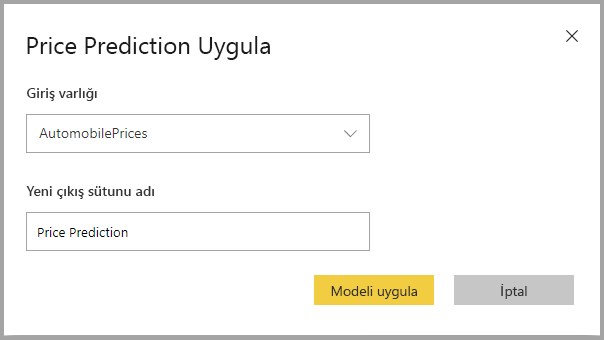

Bir Regresyon modeli uygulandığında zenginleştirilmiş çıkış varlığına üç çıkış sütunu ekler: **RegressionResult**, **RegressionExplanation** ve **ExplanationIndex**. Model uygulandığında, varlıktaki sütun adları belirtilen ön eki alır.

**RegressionResult** sütunu, giriş alanlarını temel alarak kaydın tahmin edilen değerini gösterir. **RegressionExplanation** sütunu, giriş özelliklerinin **RegressionResult** üzerinde sahip olduğu etki ile birlikte bir açıklama içerir.

## Sonraki adımlar

Bu makalede, Power BI hizmetinde Veri Akışları için Otomatik Makine Öğrenmesi’ne genel bir bakış verilmiştir. Aşağıdaki makaleler de yararlı olabilir.

- [Öğretici: Power BI’da Makine Öğrenmesi modeli oluşturma ](service-tutorial-build-machine-learning-model.md)
- [Öğretici: Power BI’da Bilişsel Hizmetler’i kullanma](service-tutorial-use-cognitive-services.md)
- [Öğretici: Power BI'da Machine Learning Studio (klasik) modelini çağırma (Önizleme)](service-tutorial-invoke-machine-learning-model.md)
- [Power BI'da Bilişsel Hizmetler](service-cognitive-services.md)
- [Power BI'da Azure Machine Learning tümleştirmesi](service-machine-learning-integration.md)

Veri akışları hakkında daha fazla bilgi için şu makaleleri okuyabilirsiniz:

- [Power BI’da veri akışları oluşturma ve kullanma](service-dataflows-create-use.md)
- [Power BI Premium'da hesaplanan varlıkları kullanma](service-dataflows-computed-entities-premium.md)
- [Şirket içi veri kaynakları ile veri akışlarını kullanma](service-dataflows-on-premises-gateways.md)
- [Power BI veri akışları için geliştirici kaynakları](service-dataflows-developer-resources.md)
- [Veri akışları ve Azure Data Lake tümleştirmesi (Önizleme)](service-dataflows-azure-data-lake-integration.md)
