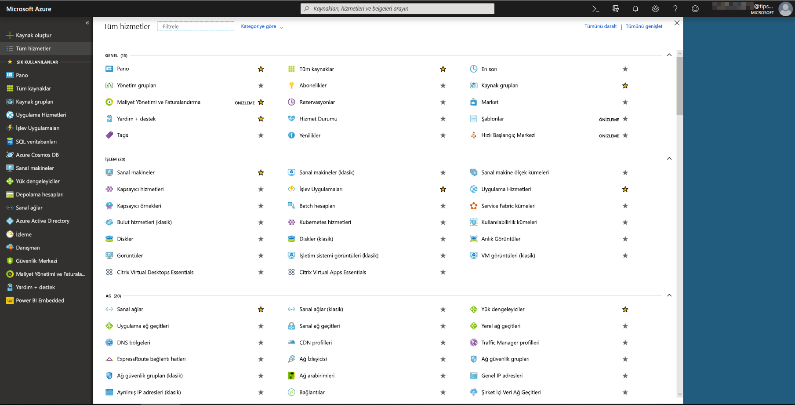
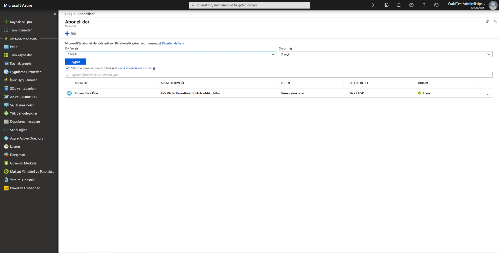
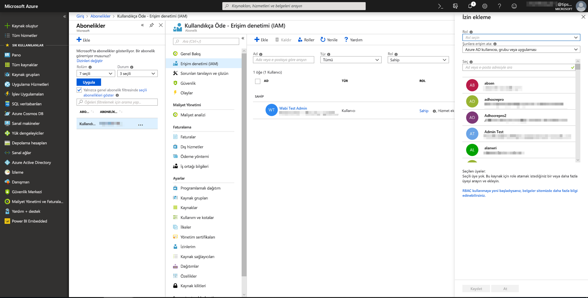
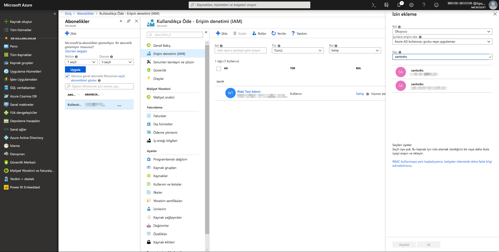
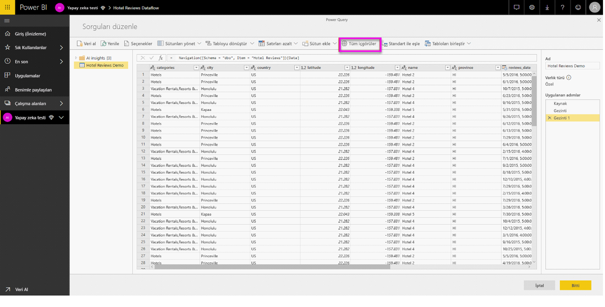
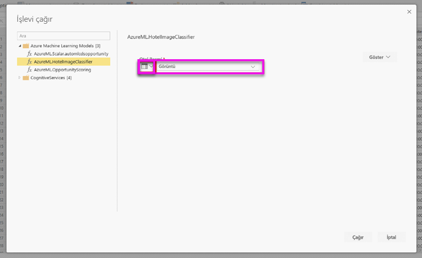
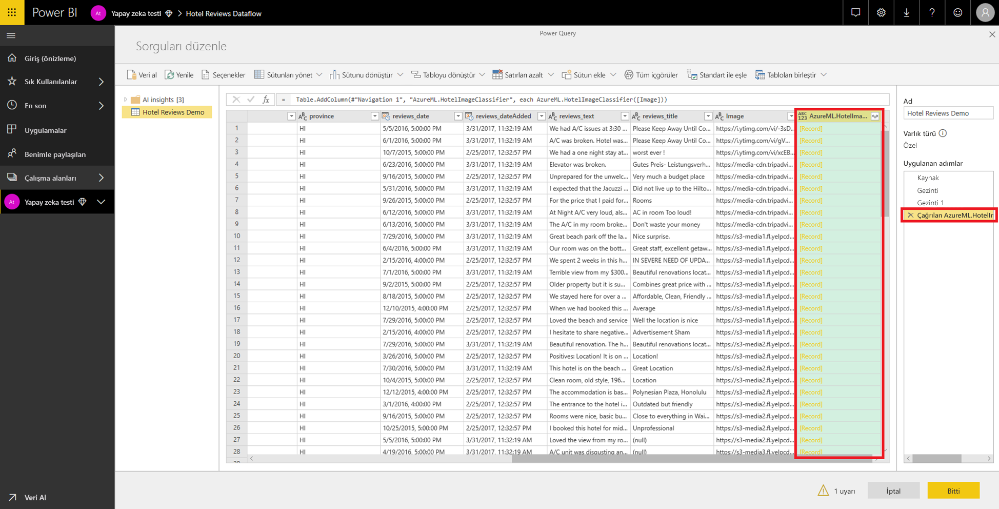
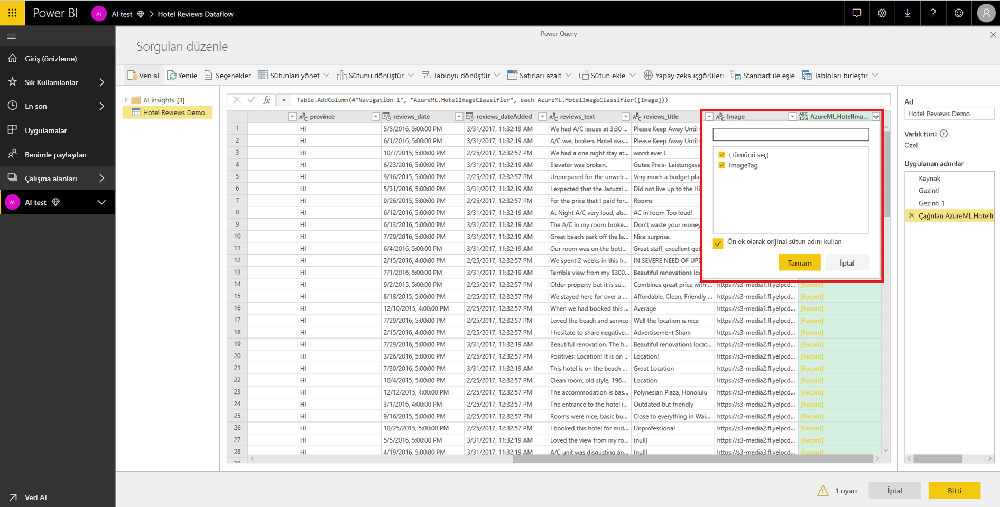

# Power BI'da Azure Machine Learning tümleştirmesi

Pek çok kuruluş işleriyle ilgili daha iyi öngörüler ve tahminler elde etmek için **Machine Learning** modellerini kullanıyor. Raporlarınızda, panolarınızda ve diğer analizlerinizde bu modelleri görselleştirme ve içgörüleri çağırma olanağı, bu içgörüleri en çok ihtiyaç duyan işletme kullanıcılarına yaymanıza yardımcı olabilir.  Power BI şimdi sorunsuz işaretleyip tıklama hareketlerini kullanarak Azure Machine Learning hizmetinde barındırılan modellerden gelen içgörüleri birleştirmenizi basitleştirir.

Bu özelliği kullanmak için bir veri bilimcisi Azure portalını kullanarak BI analistine Azure ML modeli üzerinde erişim verebilir.  Ardından, her oturumun başlangıcında Power Query kullanıcının erişimi olan tüm Azure ML modellerini keşfeder ve bunları dinamik Power Query işlevleri olarak kullanıma sunar.  Kullanıcı Power Query Düzenleyicisi'nin şeridinden bu işlevlere erişerek bunları çağırabileceği gibi M işlevini doğrudan da çağırabilir. Ayrıca Power BI bir satır kümesi için Azure ML modelini çağırırken erişim isteklerini otomatik toplu iş olarak işleyerek daha iyi bir performans elde edebilir.

Bu işlevsellik şu anda yalnızca Power BI veri akışlarında ve Power BI hizmetindeki Power Query çevrimiçinde desteklenmektedir.

Veri akışları hakkında daha fazla bilgi edinmek için bkz. [Power BI'da self servis veri hazırlığı](service-dataflows-overview.md).

Azure Machine Learning hakkında daha fazla bilgi edinmek için bkz:

- Genel Bakış:  [Azure Machine Learning hizmeti nedir?](https://docs.microsoft.com/azure/machine-learning/service/overview-what-is-azure-ml)
- Azure Machine Learning için Hızlı Başlangıçlar ve Öğreticiler:  [Azure Machine Learning Belgeleri](https://docs.microsoft.com/azure/machine-learning/)

## Power BI kullanıcısına Azure ML modeli üzerinde erişim verme

Power BI'dan Azure ML modeline erişmek için, kullanıcının Azure aboneliğine **Okuma** erişimi olmalıdır.  Ek olarak:

- Machine Learning Studio modelleri için, Machine Learning Studio web hizmetine **Okuma** erişiminiz olmalıdır
- Machine Learning Hizmeti modelleri için, Machine Learning hizmeti çalışma alanına **Okuma** erişiminiz olmalıdır

Bu makaledeki adımlarda Power BI kullanıcısına Azure ML hizmetinde barındırılan model üzerinde erişim verme işlemi açıklanır. Bu sayede bu modele bir Power Query işlevi olarak erişebilirler.  Diğer ayrıntılar için bkz. [RBAC'yi ve Azure portalını kullanarak erişimi yönetme](https://docs.microsoft.com/azure/role-based-access-control/role-assignments-portal).

1. [Azure portalında](https://portal.azure.com) oturum açın.

2. **Abonelikler** sayfasına gidin. **Abonelikler** sayfasını, Azure portalının sol gezinti menüsündeki **Tüm Hizmetler** listesi aracılığıyla bulabilirsiniz.

    

3. Aboneliğinizi seçin.

    

4. **Erişim Denetimi (IAM)** öğesini ve sonra da **Ekle** düğmesini seçin.

    

5. Rol olarak **Okuyucu**'yu seçin. Azure ML modeline erişim vermek istediğiniz Power BI kullanıcısını seçin.

    

6. **Kaydet**'i seçin.

7. Kullanıcıya belirli bir Machine Learning Studio web hizmeti *veya* modeli barındıran Machine Learning hizmeti çalışma alanı üzerinde **Okuma** erişimi vermek için üç ile altı arasındaki adımları yineleyin.

## Machine Learning Hizmeti modelleri için şema bulma

Veri bilimcileri Machine Learning Hizmeti için makine öğrenmesi modellerini geliştirir hatta dağıtırken öncelikli olarak Python kullanır.  Model için şema dosyası oluşturma görevini otomatikleştirmenize yardımcı olan Machine Learning Studio'dan farklı olarak, veri bilimcisinin Python kullanarak şema dosyasını açıkça oluşturması gerekir.

Bu şema dosyası, Machine Learning hizmeti modelleri için dağıtılan web hizmetine dahil edilmelidir. Şemayı web hizmeti için otomatik olarak oluşturmak isterseniz, dağıtılan modelin giriş betiğinde bir giriş/çıkış örneği sağlamalısınız. Lütfen, Azure Machine Learning hizmeti belgelerine sahip Dağıtım modellerindeki Otomatik Swagger şema oluşturma alt bölümüne (İsteğe bağlı) bakın. Bu bağlantı, şema oluşturma deyimlerine sahip örnek giriş betiğini içerir. 

Özellikle, giriş betiğindeki *\@input_schema* ve *\@output_schema* işlevleri, *input_sample* ve *output_sample* değişkenlerindeki giriş ve çıkış örneği biçimlerine başvurur ve dağıtım sırasında web hizmeti için bir OpenAPI (Swagger) belirtimi oluşturmak üzere bu örnekleri kullanır.

Bu şema oluşturma yönergeleri, giriş betiği güncelleştirilerek, Azure Machine Learning SDK kullanan otomatik makine öğrenimi denemeleri kullanılarak oluşturulan modellere de uygulanmalıdır.

> [!NOTE]
> Azure Machine Learning hizmeti görsel arabirimi kullanılarak oluşturulan modeller şu anda şema oluşturmayı desteklemiyor ancak daha sonraki sürümlerde destekleyecek. 

## Power BI'da Azure ML modelini çağırma

Size erişim verilmiş olan herhangi bir Azure ML modelini veri akışınız içinde doğrudan Power Query Düzenleyicisi'nden çağırabilirsiniz. Azure ML modellerine erişmek için, aşağıdaki resimde gösterildiği gibi Azure ML modelinizden gelen içgörülerle zenginleştirmek istediğiniz varlığa ilişkin **Düzenle** düğmesini seçin.

**Düzenle** düğmesi seçildiğinde veri akışınızdaki varlıklar için Power Query Düzenleyicisi açılır.

Şeritte **AI Öngörüler** düğmesini seçin ve ardından sol gezinti menüsünden _Azure Machine Learning Modelleri_ klasörünü seçin. Erişiminiz olan tüm Azure ML modelleri burada Power Query işlevleri olarak listelenir. Ayrıca, Azure ML modeli için giriş parametreleri de otomatik olarak ilgili Power Query işlevinin parametreleri olarak eşlenir.

Azure ML modelini çağırmak için, açılan listeden seçilen tüm varlık sütunlarını giriş olarak belirtebilirsiniz. Sütun simgesini giriş iletişim kutusunun sol tarafına doğru döndürerek giriş olarak bir sabitin kullanılmasını da belirtebilirsiniz.

Azure ML modeli çıkışının önizlemesini varlık tablosunda yeni bir sütun olarak görüntülemek için **Çağır**'ı seçin. Ayrıca model çağrısını da sorgu için uygulanmış bir adım olarak görürsünüz.

Model birden çok çıkış parametresi döndürürse, bunlar çıkış sütununda bir kayıt olarak gruplandırılır. Sütunu genişletip ayrı sütunlarda tek tek çıkış parametreleri oluşturabilirsiniz.

Veri akışınızı kaydettikten sonra, varlık tablosundaki yeni veya güncelleştirilmiş satırlar için veri akışını her yenilediğinizde model otomatik olarak çağrılır.

## Sonraki Adımlar

Bu makalede Machine Learning'i Power BI hizmetine tümleştirme işlemine genel bakış sağlanır. Aşağıdaki makaleleri de ilginç ve yararlı bulabilirsiniz. 

* [Öğretici: Power BI'da Machine Learning Studio modelini çağırma](service-tutorial-invoke-machine-learning-model.md)
* [Öğretici: Power BI’da Bilişsel Hizmetler’i kullanma](service-tutorial-use-cognitive-services.md)
* [Power BI'da Bilişsel Hizmetler](service-cognitive-services.md)

Veri akışları hakkında daha fazla bilgi için şu makaleleri okuyabilirsiniz:
* [Power BI’da veri akışları oluşturma ve kullanma](service-dataflows-create-use.md)
* [Power BI Premium'da hesaplanan varlıkları kullanma](service-dataflows-computed-entities-premium.md)
* [Şirket içi veri kaynakları ile veri akışlarını kullanma](service-dataflows-on-premises-gateways.md)
* [Power BI veri akışları için geliştirici kaynakları](service-dataflows-developer-resources.md)
* [Veri akışları ve Azure Data Lake tümleştirmesi (Önizleme)](service-dataflows-azure-data-lake-integration.md)

