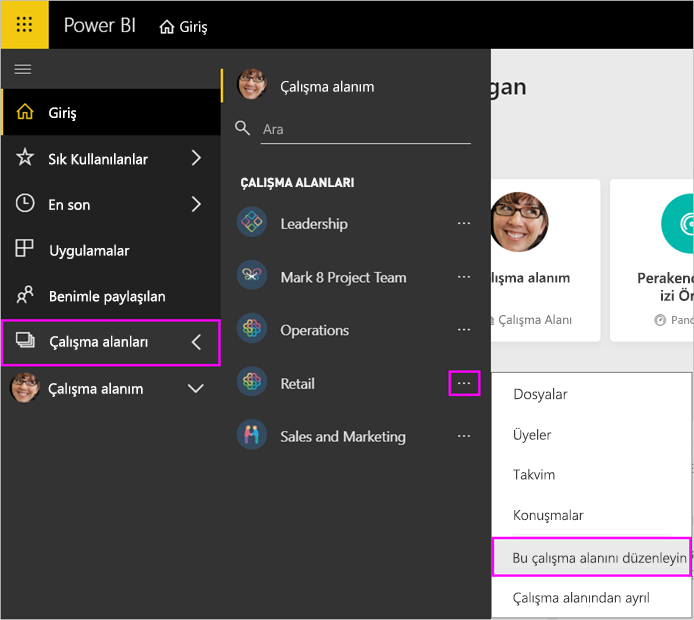
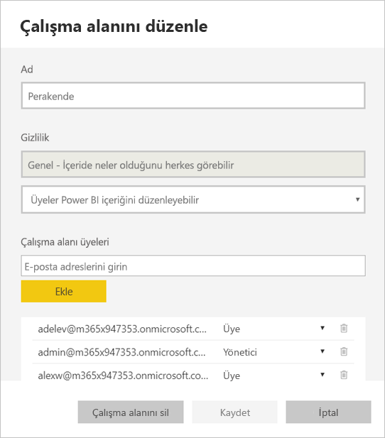
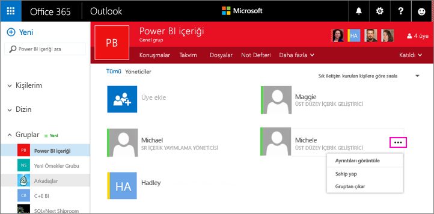
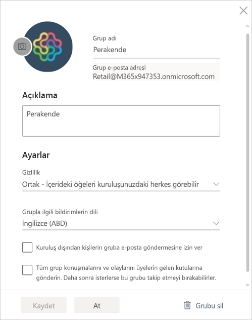

# Power BI ve Office 365'te uygulama çalışma alanınızı yönetme
Office 365 veya [Power BI'daki bir uygulama çalışma alanının](service-install-use-apps.md) oluşturucusu veya yöneticisi olarak Power BI çalışma alanının bazı özelliklerini yönetebilirsiniz. Diğer özellikleri Office 365'te yönetirsiniz. 

**Power BI'da** gerçekleştirebileceğiniz işlemler:

* Uygulama çalışma alanı üyelerini ekleyip kaldırabilir, çalışma alanı üyelerini yönetici yapabilirsiniz.
* Uygulama çalışma alanı adını düzenleyebilirsiniz.
* Uygulama çalışma alanını silebilirsiniz.

**Office 365'te** gerçekleştirebileceğiniz işlemler:

* Uygulama çalışma alanı grup üyelerini ekleyip kaldırabilir, üyeleri yönetici yapabilirsiniz.
* Grup adını, resmini, açıklamasını ve diğer ayarları düzenleyebilirsiniz.
* Grup e-posta adresini görebilirsiniz.
* Grubu silebilirsiniz.

Uygulama çalışma alanının yöneticisi veya üyesi olabilmek için [Power BI Pro](service-free-vs-pro.md) lisansınız olması gerekir. Uygulama çalışma alanınız bir Power BI Premium kapasitesinde değilse uygulamanızın kullanıcılarının da Power BI Pro lisansına sahip olması gerekir. Bu durumda iş kullanıcıları, uygulamanıza Power BI ücretsiz lisansıyla da erişebilir. Ayrıntılar için [Power BI Premium nedir?](service-premium.md) makalesini okuyun.

## Power BI'da uygulama çalışma alanınızı düzenleme
1. Power BI hizmetinde **Çalışma Alanı**'nın yanındaki oku > çalışma adınızın yanındaki üç nokta (**…**) simgesini > **Çalışma alanını düzenle**'yi seçin. 
   
   
   
   > [!NOTE]
   > **Çalışma alanını düzenle** seçeneğini yalnızca uygulama çalışma alanı yöneticileri görebilir.
   > 
   > 
2. Buradan üyelerle ilgili yeniden adlandırma, ekleme veya kaldırma işlemlerini gerçekleştirebilir ya da uygulama çalışma alanını silebilirsiniz. 
   
   
3. **Kaydet**'i veya **İptal**'i seçin.

## Office 365'te Power BI uygulama çalışma alanı özelliklerini düzenleme
1. Power BI hizmetinde **Çalışma Alanı**'nın yanındaki oku > çalışma adınızın yanındaki üç nokta (**…**) simgesini > **Üyeler**'i seçin. 
   
   
   
   Uygulama çalışma alanınıza ait Office 365 için Outlook grup görünümü açılır.
   
   Kurumsal hesabınızda oturum açmanız gerekebilir.
2. Yönetici yapmak veya uygulama çalışma alanından silmek istediğiniz üyenin adının yanındaki üç nokta (**…**) simgesine dokunun. 
   
   

## Office 365 grubunda resim ekleme ve diğer çalışma alanı özelliklerini ayarlama
Uygulamanızı, uygulama çalışma alanından dağıttığınızda burada eklediğiniz resim, uygulamanın resmi olur. [Power BI'da uygulama oluşturma ve dağıtma](service-create-distribute-apps.md) makalesinin [Add an image to your app (Uygulamanıza resim ekleme)](service-create-distribute-apps.md#add-an-image-to-your-app-optional) bölümünü inceleyin.

1. Uygulama çalışma alanınızın Office 365 için Outlook görünümünde, grup çalışma alanı özelliklerini düzenlemek için grup resmini seçin.
   
   
2. Burada adı, açıklamayı ve dili düzenleyebilir, resim ekleyebilir ve diğer özellikleri ayarlayabilirsiniz.
   
   
3. **Kaydet**'i veya **At**'ı seçin.

## Sonraki adımlar
* [Power BI uygulamaları nelerdir?](service-install-use-apps.md)
* [Power BI'da uygulama ve uygulama çalışma alanı oluşturma](service-create-distribute-apps.md)
* Başka bir sorunuz mu var? [Power BI Topluluğu'na başvurun](http://community.powerbi.com/)

