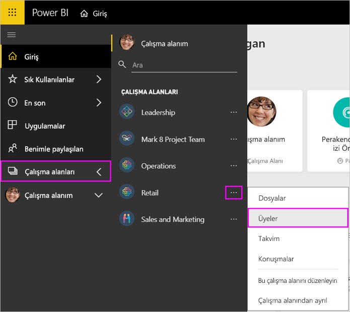

# Power BI ve Office 365'te çalışma alanınızı yönetme

Office 365 veya [Power BI'daki bir çalışma alanının](service-create-distribute-apps.md) oluşturucusu veya yöneticisi olarak Power BI çalışma alanının bazı özelliklerini yönetebilirsiniz. Diğer özellikleri Office 365'te yönetirsiniz.

> [!NOTE]
> Yeni çalışma alanı deneyimi, Power BI çalışma alanlarıyla Office 365 grupları arasındaki ilişkileri değiştiriyor. Yeni çalışma alanlarından birini her oluşturduğunuzda otomatik olarak bir Office 365 grubu oluşturmazsınız. [Yeni çalışma alanları oluşturma](service-create-the-new-workspaces.md) hakkındaki yazıyı okuyun.

**Power BI**'da gerçekleştirebileceğiniz işlemler:

* Çalışma alanı üyelerini ekleyip kaldırabilir, çalışma alanı üyelerini yönetici yapabilirsiniz.
* Çalışma alanı adını düzenleyebilirsiniz.
* Çalışma alanını silin; Office 365 grubu da silinir.

**Office 365**'te gerçekleştirebileceğiniz işlemler:

* Çalışma alanı grup üyelerini ekleyip kaldırabilir, üyeleri sahip yapabilirsiniz.
* Grup adını, resmini, açıklamasını ve diğer ayarları düzenleyebilirsiniz.
* Grup e-posta adresini görebilirsiniz.
* Grubu silebilirsiniz.

Çalışma alanı yöneticisi veya üyesi olabilmeniz için bir [Power BI Pro lisansınız](service-features-license-type.md) olması gerekir. Çalışma alanınız bir Power BI Premium kapasitesinde değilse uygulamanızın kullanıcılarının da Power BI Pro lisansına sahip olması gerekir. Ayrıntılar için [Power BI Premium nedir?](service-premium-what-is.md) makalesini okuyun.

## Power BI'da çalışma alanınızı düzenleme

1. Power BI hizmetinde **Çalışma Alanları**'nın yanındaki oku > çalışma alanı adının yanındaki **Diğer seçenekler**’i (…) > **Bu çalışma alanını düzenle**'yi seçin.

   

   > [!NOTE]
   > **Bu çalışma alanını düzenle** seçeneğini yalnızca çalışma alanı yöneticisi görebilir.

1. Buradan çalışma alanını yeniden adlandırabilir, üye ekleyip kaldırabilir ya da çalışma alanını silebilirsiniz.

   

1. **Kaydet**'i veya **İptal**'i seçin.

## Office 365'te Power BI çalışma alanı özelliklerini düzenleme

Ayrıca, bir çalışma alanının farklı yönlerini doğrudan Office 365 için Outlook'ta düzenleyebilirsiniz.

### Çalışma alanı grubunun üyelerini düzenleme

1. Power BI hizmetinde **Çalışma Alanlarım**’ın yanındaki oku seçin > çalışma alanı adının yanındaki **Diğer seçenekler**’i (...) > **Üyeler**’i seçin.

   

   Çalışma alanınıza ait Office 365 için Outlook grup görünümü açılır. Kurumsal hesabınızda oturum açmanız gerekebilir.

1. Takım arkadaşınızın adının yanındaki rolü seçerek kişiyi **Üye** veya **Sahip** yapın. Kişiyi gruptan kaldırmak **X**'i seçin.

   

### Görüntü ekleme ve diğer çalışma alanı özelliklerini ayarlama

Uygulamanızı, çalışma alanından dağıttığınızda burada eklediğiniz resim, uygulamanın resmi olur. [Yeni çalışma alanları oluşturma](service-create-workspaces.md#add-an-image-to-your-office-365-workspace-optional) makalesinin **Office 365 çalışma alanınıza görüntü ekleme** bölümüne bakın.

1. Çalışma alanınızın Office 365 için Outlook görünümünde **Hakkında** sekmesine gidip **Düzenle**’yi seçin.

    
1. Grupla ilgili bildirimler için ad, açıklama ve dili düzenleyebilirsiniz. Ayrıca bir görüntü ekleyebilir ve diğer özellikleri buradan ayarlayabilirsiniz.

   

1. **Kaydet**'i veya **At**'ı seçin.

## Sonraki adımlar

* [Uygulamayı Power BI'da yayımlama](service-create-distribute-apps.md)

* Başka bir sorunuz mu var? [Power BI Topluluğu'na başvurun](https://community.powerbi.com/)
