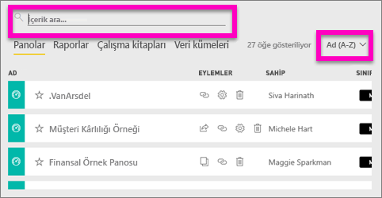
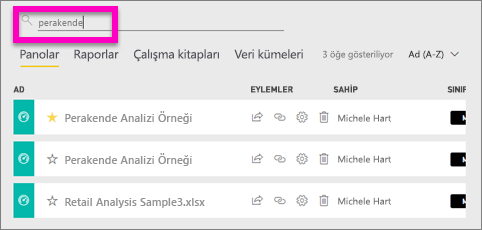
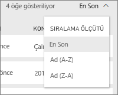
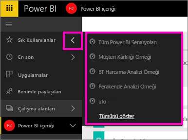

# Gezinme: Power BI hizmetinde içerik arama, bulma ve sıralama
Power BI hizmetindeki içeriğinizde gezinmek için kullanabileceğiniz birçok farklı yöntem vardır. Çalışma alanındaki içerik türe göre düzenlenmiştir: panolar, raporlar, çalışma kitapları ve veri kümeleri.  İçerik ayrıca kullanıma göre de düzenlenmiştir: sık kullanılanlar, son görüntülenenler, benimle paylaşılanlar ve öne çıkan. Bu farklı yollardan faydalanarak Power BI hizmetinde aradığınızı kolayca bulabilirsiniz.  

>[!NOTE] 
>Bu makale, Power BI Desktop uygulamasına değil Power BI hizmetine (app.powerbi.com) yöneliktir.

## Çalışma alanlarında gezinme

Power BI hizmeti, çalışma alanınızdaki içeriği türe göre ayırmıştır: panolar, raporlar, çalışma kitapları ve veri kümeleri. Bir çalışma alanını seçtiğinizde bu düzenle karşılaşırsınız. Bu örnekte "Sales and marketing app sample" adlı çalışma alanında 2 pano, 6 rapor, 1 çalışma kitabı ve 5 veri kümesi mevcuttur.

________________________________________

## Çalışma alanlarını arama ve sıralama
Çalışma alanlarında dört içerik sekmesi vardır: Panolar, Raporlar, Çalışma Kitapları ve Veri Kümeleri.  Bu sekmelerin her birinde bir arama alanı ve bir sıralama düğmesi bulunur.  Power BI hizmetiyle çalışmaya başladığınızda her sekmede yalnızca bir veya iki öğe olacağından bu özellikler size kullanışlı gelmeyebilir.  Ancak zaman içinde uzun içerik listeleri oluşabilir.  Arama ve sıralama işlevlerini kullanarak, istediğiniz öğeyi kolayca bulabilirsiniz.

* Geçerli ekranda eşleşme bulmak için bir arama terimi girin
  
   
* Geçerli sayfaya ilişkin seçenekleri görüntülemek için sıralama düğmesini seçin. Ada veya sahibe göre sıralama seçenekleri görüntülenir.
  
   

## Sol gezinti çubuğunu kullanarak gezinme
Sol gezinti bölmesi, aradıklarınızı daha hızlı bulmanızı kolaylaştıracak şekilde içeriğinizi sınıflandırır.  

Kendiniz için oluşturduğunuz içerikler **Çalışma Alanım** bölümünde, oluşturup bir grupla paylaştığınız içerikler **Uygulamalar** çalışma alanında, sizinle paylaşılan içerikler **Benimle paylaşılan** sayfasında, son görüntülediğiniz içerikler ise **Son görüntülenen** bölümünde bulunur.

Ayrıca içerikleri [sık kullanılan](service-dashboard-favorite.md) ve [öne çıkan](service-dashboard-featured.md) olarak etiketleyebilirsiniz. En sık görüntülemeyi planladığınız panoyu seçip *öne çıkan* panonuz olarak ayarlayabilirsiniz. Power BI hizmetini her açtığınızda ilk olarak bu pano görüntülenir. Sık ziyaret ettiğiniz panolar ve uygulamalar mı var? Bu öğeleri sık kullanılanlara ekleyerek, her zaman sol gezinti çubuğunda kalmalarını sağlayabilirsiniz.

geçin.

## Önemli noktalar ve sorun giderme
* Veri kümelerinde **Sıralama ölçütü**, belge sahipleri tarafından kullanılamaz.

## Sonraki adımlar
[Power BI - Temel Kavramlar](service-basic-concepts.md)

Başka bir sorunuz mu var? [Power BI Topluluğu'na başvurun](http://community.powerbi.com/)