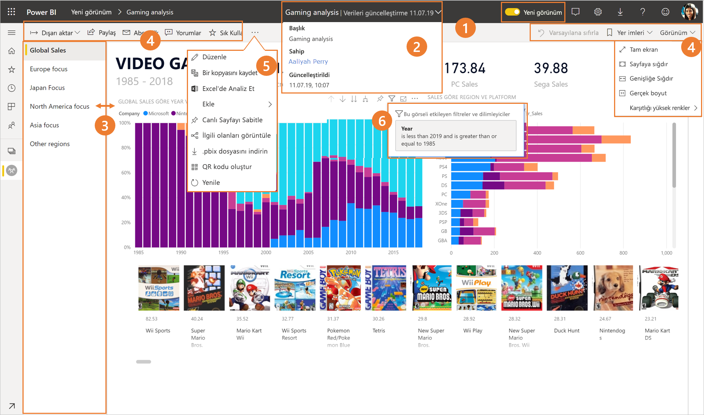
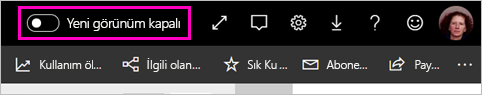
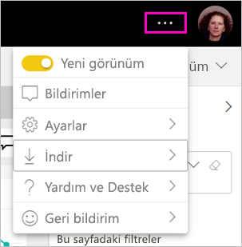
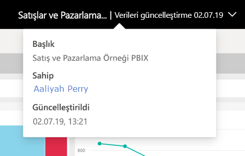
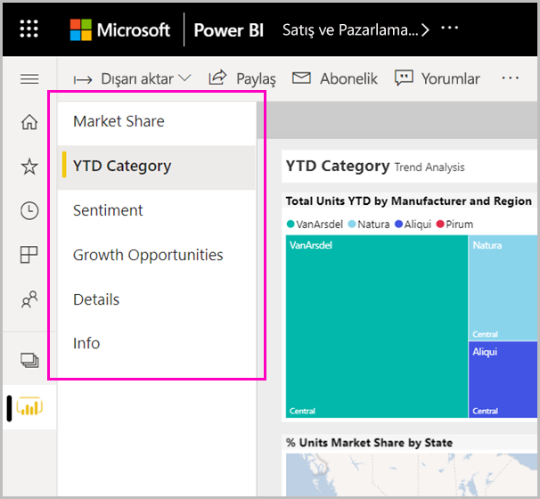
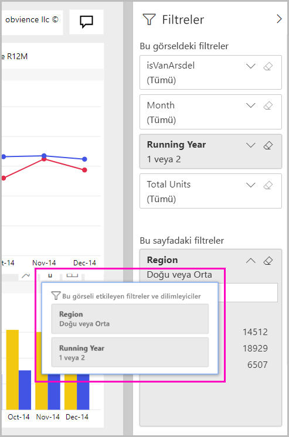

# Power BI hizmetinin 'yeni görünümü'

Power BI hizmeti (app.powerbi.com) raporları görüntülemeyi ve bunlarla etkileşim kurmayı kolaylaştıran yeni bir görünüme kavuştu. Yeni görünüm, daha basit olan ve diğer Microsoft ürünlerine yönelik bilgilerinizden yararlanan modern bir deneyimdir. Power BI hizmeti içinde, daha açık bir renk temasına geçerek ve simgeleri güncelleştirerek, rapor içeriğini ana odak noktası haline getirdik. İşte yeni görünümde nelerin değiştiğine ilişkin genel bakış. Ayrıntılar için numaralandırılmış bölümlere bakın:

## Değişikliklerin hızlı turu

Bu animasyon, raporların nasıl görüneceğine ilişkin değişiklikleri işlem halinde gösterir.

## 1. Yeni görünümü kabul etme

Herhangi bir Power BI hizmeti kullanıcısı yeni görünümü kullanmayı seçebilir. **Yeni görünüm kapalı** öğesini **Yeni görünüm açık** konumuna kaydırın.

Eski görünüme dönmeniz gerekirse bunu **kapalı**  konumuna geri kaydırmanız yeterlidir. Bu düğmeyi görmüyorsanız sağ üst köşedeki üç nokta menüsünü seçin.

## 2. Rapor ayrıntılarını görüntüleme 

Son yenileme tarihi ve iletişim bilgileri gibi ayrıntılara, en üstteki başlıkta hızlı bir şekilde bakın.  Raporla ilgili ek ayrıntıları görüntülemek için menüyü açın. Rapor sahibine e-posta da gönderebilirsiniz.

## 3. Sayfaların dikey listesi 
Rapor sayfası adları artık dikey bölmedeki bir liste içinde görüntülenir. Bunlar göze çarpan konumlardadır, kaçırılması zordur ve Word ve PowerPoint'te gezinmeye benzer. Dikey bölmeyi yeniden boyutlandırarak rapor alanının geri kalanını artırabilir veya azaltabilirsiniz.

## 4. Basitleştirilmiş eylem çubuğu 

En üstteki güncelleştirilmiş eylem çubuğu, rapor tüketicileri için en ilgili komutları önde ve ortada sunar. Filtreler ve yer işaretleri aracılığıyla dışarı aktarmak, abone olmak, başkalarıyla işbirliği yapmak ve daha ayrıntılı bir şekilde göz atmak daha kolaydır.

## 5. Rapor komutları nerede?

Eski görünümden işlevlerden hiçbirini kaldırmadık. Eylem çubuğunda üç noktayı (... menüsü) genişleterek düzenleme, kopya kaydetme vb. gibi ek komutları bulabilirsiniz. Ayrıca, kullanım ölçümlerine içerik listesinden erişebilirsiniz.

### Dosya menüsü eylemleri nerede?

**Dosya** menüsü eylemlerini mi arıyorsunuz? Eskiden **Dosya** menüsünde olan eylemler artık üç nokta (...) menüsünde de bulunur. 

## 6. Yeni filtre deneyimi

Uygulanan filtreleri ve yeni filtreler bölmesini görüntüleme gibi son güncelleştirmeler, yeni görünüm ile varsayılan olarak kullanılabilir. Rapor tasarımcıları yeni filtreler deneyimine yükseltilmese de, yeni filtreler bölmesini görürsünüz.

## Panonun 'yeni görünüm' deneyimi 

Panolar ayrıca, tutarlı bir deneyim için, işlevsel farklılıkları korurken, tıpkı raporlar ve uygulamalar gibi basitleştirilmiş bir eylem çubuğuna da sahiptir. Bir panodaki eylemlere ilişkin bir adım adım kılavuz aşağıda verilmiştir.
 

## Düzenleme modunda değişiklik yapılmadı 

Yazma deneyimini Desktop’taki deneyime benzer şekilde bıraktık. Yeni görünüm değişiklikleri yalnızca okuma görünümü için geçerlidir.

## Sonraki adımlar

[Tüketiciler için Power BI](consumer/end-user-consumer.md)
