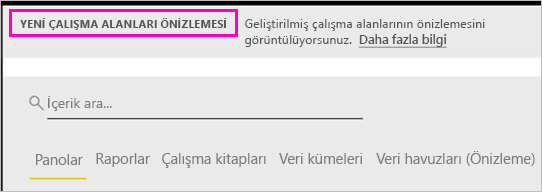

# Power BI'da yeni çalışma alanlarında çalışmayı düzenleme (önizleme)

Çalışma alanları, çalışma arkadaşlarınızla işbirliği yaparak pano ve rapor koleksiyonları oluşturabildiğiniz yerlerdir. Sonra, bu koleksiyonları *uygulamaların* içinde paketleyebilir ve kuruluşunuzun tamamına veya belirli kişi veya gruplara dağıtabilirsiniz. Power BI yeni bir çalışma alanı deneyimini önizleme olarak sunuyor. 

Yeni çalışma alanları önizlemesiyle şimdi şunları yapabilirsiniz:

- Çalışma alanı rollerini kullanıcı gruplarına atayabilirsiniz: güvenlik grupları, dağıtım listeleri, Office 365 grupları ve bireyler.
- Office 365 grubu oluşturmadan Power BI'da bir çalışma alanı oluşturabilirsiniz.
- Çalışma alanında daha esnek bir izin yönetimi için daha ayrıntılı çalışma alanı rolleri kullanabilirsiniz.

[Yeni çalışma alanlarından birini oluşturma](service-create-the-new-workspaces.md) hakkında bilgi edinin.
 
Yeni çalışma alanlarından birini oluşturduğunuzda, temel, ilişkili bir Office 365 grubu oluşturmuş olmazsınız. Çalışma alanı yönetiminin tamamı Office 365'te değil Power BI'dadır. Yine çalışma alanına Office 365 grubu ekleyebilir ve içeriğe kullanıcı erişimini Office 365 grupları aracılığıyla yönetmeye devam edebilirsiniz. Öte yandan, ek olarak güvenlik gruplarını, dağıtım listelerini kullanabilir ve doğrudan Power BI'ın içinden kişileri ekleyebilirsiniz. Bu özellik, çalışma alanı erişimini yönetmek için daha esnek bir yol sağlar. Artık çalışma alanı yönetimi Power BI'da olduğundan, kuruluşta çalışma alanlarını kimlerin oluşturabileceğine Power BI yöneticileri karar verir. Yönetici portalındaki **Çalışma alanı ayarlarında**, yöneticiler kuruluştaki kişilerin tümüne çalışma alanı oluşturma izni verebilir veya hiçbirine vermeyebilir. Ayrıca çalışma alanı oluşturmayı belirli güvenlik gruplarının üyeleriyle de sınırlayabilir.

[Power BI yönetici portalı](service-admin-portal.md) hakkında daha fazla bilgi edinin.

## Yeni çalışma alanlarının dağıtımı

Önizleme döneminde, eski ve yeni çalışma alanları birlikte yan yana bulunabilir ve bunlardan herhangi birini oluşturabilirsiniz. Yeni çalışma alanlarının önizlemesi sona erdiğinde ve bunlar genel kullanıma sunulduğunda, eski çalışma alanları bir süre daha kullanımda kalabilir. Artık bunları oluşturamazsınız ve çalışma alanlarınızı yeni çalışma alanı altyapısına geçirme hazırlığı yapmanız gerekir. Endişelenmeyin; geçişi tamamlamak için birkaç ayınız olacaktır.

## Yeni çalışma alanlarındaki roller

Yeni çalışma alanlarına kullanıcı gruplarını ve kişileri üye, katkıda bulunan veya yönetici olarak eklersiniz. Kullanıcı grubundaki herkes tanımladığınız rolü alır. Bir kişi birkaç kullanıcı grubunda yer alıyorsa, rol tarafından sağlanan en yüksek izin düzeyine sahip olur.

Bir çalışma alanına eklediğiniz herkesin Power BI Pro lisansına ihtiyacı vardır. Bu kullanıcılar çalışma alanında hep birlikte, daha geniş bir kitleye, hatta tüm kuruluşunuza dağıtmayı planladığınız panolar ve raporlar üzerinde işbirliği yapabilir. Kuruluşunuzun içindeki diğer kişilere içerik dağıtmak istiyorsanız, söz konusu kullanıcılara Power BI Pro lisansları atayabilir veya çalışma alanını Power BI Premium kapasitesine getirebilirsiniz.

Roller çalışma alanında kimlerin neler yapabileceğini yönetmenizi sağlar ve bu sayede ekipler işbirliği yapabilir. Yeni çalışma alanları kişilere ve kullanıcı gruplarına (güvenlik grupları, Office 365 grupları ve dağıtım listeleri) roller atamanıza olanak tanır. 

Bir kullanıcı grubuna roller atadığınızda, gruptaki kişiler içeriğe erişim sahibi olur. İç içe kullanıcı gruplarınız varsa, kapsam içinde yer alan tüm kullanıcıların izni olur. Farklı rollere sahip birden çok kullanıcı grubunda yer alan bir kullanıcı, kendisine verilen en yüksek izin düzeyine sahip olur. 

Yeni çalışma alanları üç rol sunar: yöneticiler, üyeler ve katkıda bulunanlar.

**Yöneticiler şunları yapabilir:**

- Çalışma alanını güncelleştirebilir ve silebilir. 
- Diğer yöneticiler de dahil olmak üzere kişileri ekleyebilir/kaldırabilir.
- Üyelerin yapabildiği her şeyi yapabilir.

**Üyeler şunları yapabilir:** 

- Üyeleri ve düşük izinlere sahip diğer kişileri ekleyebilir.
- Uygulama yayımlayabilir ve güncelleştirebilir.
- Öğe veya uygulama paylaşabilir.
- Diğer kişilerin öğeleri yeniden paylaşmasına izin verebilir.
- Katkıda bulunanların yapabildiği her şeyi yapabilir.

**Katkıda Bulunanlar şunları yapabilir:** 

- Çalışma alanında içerik oluşturabilir, düzenleyebilir ve silebilir. 
- Çalışma alanında rapor yayımlayabilir, içeriği silebilir.
- Yeni kişilere içerik erişimi veremez. Yeni içerik paylaşamaz ama çalışma alanının, öğenin veya uygulamanın önceden paylaşıldığı biriyle paylaşabilir. 
- Grup üyelerini değiştiremez.
 
Erişimi olmayan kullanıcıların erişim isteyebilmesi için hizmet genelinde Erişim İsteme iş akışları oluşturuyoruz. Erişim İsteme iş akışları şu anda panolar, raporlar ve uygulamalar için sağlanıyor.

## Eski çalışma alanlarını yeni çalışma alanlarına dönüştürme

Önizleme döneminde, eski çalışma alanlarınızı otomatik olarak yenilerine dönüştüremezsiniz. Öte yandan yeni bir çalışma alanı oluşturabilir ve içeriğinizi yeni konumda yayımlayabilirsiniz. 

Yeni çalışma alanları genel kullanıma sunulduğunda, eskilerin otomatik olarak geçirilmesini tercih edebilirsiniz. Genel kullanıma sunulduktan sonra, bir noktada bunları geçirmeniz gerekecektir.

## Yeni çalışma alanlarıyla geçerli çalışma alanları arasında ne fark vardır?

Yeni çalışma alanlarıyla, bazı özellikleri yeniden tasarlıyoruz. Önizlemeyle birlikte kalıcı hale getirilmesini bekleyebileceğiniz değişiklikler şunlardır. 

* Çalışma alanları oluşturmak, geçerli çalışma alanlarının yaptığı gibi Office 365'te kendilerine karşılık gelen varlıklar oluşturmaz. (Office 365 grubuna bir rol atayarak bunu çalışma alanınıza yine ekleyebilirsiniz). 
* Geçerli çalışma alanlarında, üyeler ve yöneticiler listesine sadece bireyleri ekleyebilirsiniz. Yeni çalışma alanlarında, kullanıcı yönetimini kolaylaştırmak için bu listelere birden çok AD güvenlik grubu, dağıtım listesi veya Office 365 grubu ekleyebilirsiniz. 
- Geçerli çalışma alandan bir kurumsal içerik paketi oluşturabilirsiniz. Yeni çalışma alanlarından oluşturamazsınız.
- Geçerli çalışma alanından kurumsal içerik paketini kullanabilirsiniz. Yeni çalışma alanlarından kullanamazsınız.
- Önizleme döneminde, yeni çalışma alanları için bazı özellikler henüz etkinleştirilmemiştir. Ayrıntılar için sonraki bölüme ([Planlanan yeni çalışma alanı özellikleri](service-new-workspaces.md#planned-new-workspace-preview-features)) bakın.

## Sınırlamalar ve önemli noktalar

Dikkat edilmesi gereken sınırlamalar:

- Çalışma alanları en çok 1.000 veri kümesi veya veri kümesi başına 1.000 rapor içerebilir. 
- Power BI Pro lisansı olan biri, en çok 250 çalışma alanına üye olabilir.

## Planlanan yeni çalışma alanı önizleme özellikleri

Önizlemeyi başlattığımızda yeni çalışma alanı önizleme özelliklerinden bazılarını hala geliştirme aşamasındayız ve bunlar henüz kullanıma sunulmadı:

- **Çalışma alanından ayrıl** düğmesi yok.
- Kullanım ölçümleri henüz desteklenmiyor.
- Premium'un işleyişi: Premium kapasitede çalışma alanlarını atayabilir ve oluşturabilirsiniz ama çalışma alanını kapasiteler arasında taşımak için çalışma alanının ayarlarına gitmelisiniz.
- SharePoint web bölümü ekleme işlemi henüz desteklenmiyor.
- Verileri/Dosyaları Al altında Office 365 grupları için **OneDrive** düğmesi yok.

## Farklı çalışan çalışma alanı özellikleri

Yeni çalışma alanlarındaki bazı özellikler geçerli çalışma alanlarından farklı çalışır. Bu farklılıklar, müşterilerden aldığınız geri bildirimler temelinde isteyerek yapılmıştır ve çalışma alanlarıyla işbirliğine daha esnek bir yaklaşım getirecektir:

- Üyeler yeniden paylaşabilir veya paylaşamaz: bunun yerini Katkıda Bulunan rolü almıştır
- Salt okunur çalışma alanları: Kullanıcılara bir çalışma alanı için salt okuma erişim vermek yerine çalışma alanındaki içeriğe benzer salt okuma erişim sunan ve hazırlanmakta olan Görüntüleyici rolünü atarsınız.

## Bilinen sorunlar

Bu özellik önizleme aşamasında olduğundan, bilmeniz gereken bazı sınırlamalar vardır. Aşağıdaki sorunlar bilinmektedir ve bunların düzeltmeleri geliştirme aşamasındadır:

- E-postalara aboneliklerin alıcısı olarak eklenen ücretsiz kullanıcılar veya kullanıcı grupları, almaları gerekirken e-postaları alamıyor. Yeni çalışma alanlarından biri Premium kapasitedeyken, aboneliği oluşturan kullanıcıya ait Çalışma Alanım Premium kapasitede olmadığında, bu sorunla karşılaşılıyor. Çalışma Alanım Premium kapasiteyse, ücretsiz kullanıcılar ve kullanıcı grupları e-postaları alacaktır.
- Çalışma alanı Premium kapasiteden paylaşılan kapasiteye taşındığında, bazı durumlarda ücretsiz kullanıcılar ve kullanıcı grupları, almamaları gerekirken e-postaları almaya devam edecektir. Aboneliği oluşturan kullanıcıya ait Çalışma Alanım Premium kapasitede olduğunda, bu sorunla karşılaşılıyor.

## Sonraki adımlar
* [Power BI'da yeni çalışma alanları oluşturma (önizleme)](service-create-the-new-workspaces.md)
* [Geçerli çalışma alanlarını oluşturma](service-create-workspaces.md)
* [Power BI'da uygulamaları yükleme ve kullanma](service-create-distribute-apps.md)
* Sorularınız mı var? [Power BI Topluluğu'na sorun](http://community.powerbi.com/)
