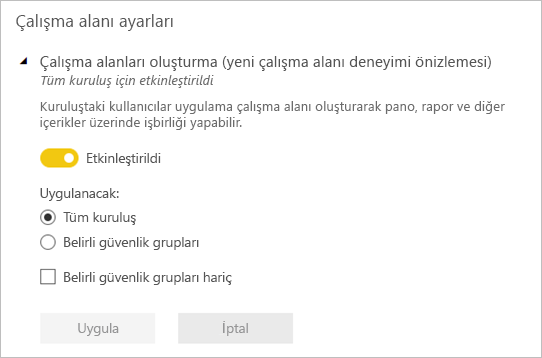

# Yeni çalışma alanlarında çalışmayı düzenleme

 *Çalışma alanları*, çalışma arkadaşlarınızla işbirliği yaparak pano, rapor ve sayfalandırılmış rapor koleksiyonları oluşturabildiğiniz yerlerdir. Yeni çalışma alanı deneyimi içeriğe erişimi daha iyi yönetmenize yardımcı olur. Bu makalede yeni çalışma alanları açıklanır ve klasik çalışma alanlarından farkları ortaya konur.  Klasik çalışma alanları gibi bunları da uygulamaları oluşturmak ve dağıtmak için kullanırsınız. [Yeni çalışma alanı deneyimi oluşturma](service-create-the-new-workspaces.md) hakkında bilgi edinin.

Yeni çalışma alanı deneyimi genel kullanılabilirlik (GA) aşamasına ulaştı ve artık varsayılan çalışma alanı oldu. Yine de Office 365 Gruplarını temel alarak [klasik çalışma alanlarını](service-create-workspaces.md) oluşturmaya ve kullanmaya devam edebilirsiniz. 

> [!NOTE]
> Çalışma alanındaki içeriğe göz atan kullanıcılarda satır düzeyi güvenliği (RLS) zorunlu tutmak için Görüntüleyici rolünü kullanın. Çalışma alanına erişim vermeden RLS'yi zorunlu tutmak için söz konusu kullanıcılara bir Power BI uygulaması yayımlayın veya içeriği dağıtmak için paylaşım kullanın.

Yeni çalışma alanlarıyla şunları yapabilirsiniz:

- Çalışma alanı rollerini kullanıcı gruplarına atayabilirsiniz: güvenlik grupları, dağıtım listeleri, Office 365 grupları ve bireyler.
- Office 365 grubu oluşturmadan Power BI'da bir çalışma alanı oluşturabilirsiniz.
- Çalışma alanında daha esnek bir izin yönetimi için daha ayrıntılı çalışma alanı rolleri kullanabilirsiniz.
- Power BI yöneticisi Power BI'da kimlerin çalışma alanı oluşturabileceğini denetleyebilir.

Yeni çalışma alanlarından birini oluşturduğunuzda, temel, ilişkili bir Office 365 grubu oluşturmuş olmazsınız. Çalışma alanı yönetiminin tamamı Office 365'te değil Power BI'dadır. Yeni çalışma alanı deneyiminde şimdi çalışma alanı erişim listesine Office 365 grubu ekleyebilir ve içeriğe kullanıcı erişimini Office 365 grupları aracılığıyla yönetmeye devam edebilirsiniz.

## Yeni çalışma alanı deneyimi çalışma alanlarını yönetme
Artık yeni çalışma alanı deneyiminde çalışma alanlarının yönetimi Power BI'dadır ve kuruluşta çalışma alanlarını kimlerin oluşturabileceğine Power BI yöneticileri karar verir. Ayrıca, Power BI yönetici portalını veya PowerShell Cmdlet'lerini kullanarak çalışma alanlarını yönetebilir ve kurtarabilirler. Office 365 Gruplarını temel alan klasik çalışma alanlarında yönetim yine Office 365 yönetim portalında ve Azure Active Directory'de gerçekleşir.

Yöneticiler yönetim portalındaki **Çalışma alanı ayarları**'nda Çalışma alanları oluşturma (yeni çalışma alanı deneyimi) ayarını kullanarak kuruluştaki herkesin yeni çalışma alanı deneyimi çalışma alanları oluşturmasına izin verebilir veya kimsenin oluşturmasına izin vermeyebilir. Ayrıca çalışma alanı oluşturmayı belirli güvenlik gruplarının üyeleriyle de sınırlayabilir.

> [!NOTE]
> Çalışma alanları oluşturma (yeni çalışma alanı deneyimi) ayarının varsayılan değeri yalnızca Office 365 Grupları oluşturabilen kullanıcılara Power BI'da yeni çalışma alanları oluşturma izni verilmesidir. Power BI yönetim portalında uygun kullanıcıların yeni çalışma alanı deneyimi çalışma alanları oluşturabilmesini sağlayacak bir değer ayarlamaya dikkat edin.

Power BI yönetim portalında [çalışma alanları listesi sağlanır](service-admin-portal.md#workspaces). 

## Klasik çalışma alanlarıyla yan yana yeni çalışma alanları

Yeni, yükseltilmiş çalışma alanları ve mevcut klasik çalışma alanları yan yana bulunabilir ve ikisini de oluşturabilirsiniz. Yeni çalışma alanı deneyimi varsayılan çalışma alanı türüdür. Power BI mevcut iş akışlarının değiştirilmesini önlemek için kullanıcının Power BI'da Üye olduğu tüm Office 365 Gruplarını listelemeye devam eder. Yeni çalışma alanı oluşturmayı öğrenmek için [Yeni çalışma alanları oluşturma](service-create-the-new-workspaces.md) konusunu okuyun. Klasik çalışma alanı oluşturmayı öğrenmek için [Klasik çalışma alanları oluşturma](service-create-workspaces.md) konusunu okuyun.

## Yeni çalışma alanlarındaki roller

Yeni çalışma alanına erişim vermek için, kullanıcı gruplarını veya kişileri çalışma alanı rollerinden birine atayın: yöneticiler, üyeler, katkıda bulunanlar veya görüntüleyiciler. Kullanıcı grubundaki herkes tanımladığınız rolü alır. Bir kişi birkaç kullanıcı grubunda yer alıyorsa, atandıkları rol tarafından sağlanan en yüksek izin düzeyine sahip olur.

Roller çalışma alanında kimlerin neler yapabileceğini yönetmenizi sağlar ve bu sayede ekipler işbirliği yapabilir. Yeni çalışma alanları kişilere ve kullanıcı gruplarına (güvenlik grupları, Office 365 grupları ve dağıtım listeleri) roller atamanıza olanak tanır. 

Bir kullanıcı grubuna roller atadığınızda, gruptaki kişiler içeriğe erişim sahibi olur. İç içe kullanıcı gruplarınız varsa, kapsam içinde yer alan tüm kullanıcıların izni olur.

Dört rolün yetenekleri şunlardır: yöneticiler, üyeler, katkıda bulunanlar ve görüntüleyiciler. Görüntüleme ve etkileşim dışında bu özelliklerin tamamı için bir Power BI Pro lisansı gerekir.

|Özellik   | Yönetici  | Üye  | Katılımcı  | Görüntüleyici |
|---|---|---|---|---|
| Çalışma alanını güncelleştirebilir ve silebilir.  | X  |   |   |   | 
| Diğer yöneticiler de dahil olmak üzere kişileri ekleyebilir/kaldırabilir.  | X  |   |   |   |
| Üyeleri ve düşük izinlere sahip diğer kişileri ekleyebilir.  |  X | X  |   |   |
| Uygulama yayımlayabilir ve güncelleştirebilir. |  X | X  |   |   |
| Öğe veya uygulama paylaşabilir.1 |  X | X  |   |   |
| Diğer kişilerin öğeleri yeniden paylaşmasına izin verebilir.1 |  X | X  |   |   |
| İş arkadaşlarının Giriş Sayfasında uygulamaları öne çıkarabilir |  X | X  |   |   |
| İş arkadaşlarının Giriş Sayfasında panoları ve raporları öne çıkarabilir |  X | X  | X |   |
| Çalışma alanında içerik oluşturabilir, düzenleyebilir ve silebilir.  |  X | X  | X  |   |
| Çalışma alanında rapor yayımlayabilir, içeriği silebilir.  |  X | X  | X  |   |
| Başka bir çalışma alanında, bu çalışma alanındaki bir veri kümesini temel alan rapor oluşturun.1 |  X | X  | X  |   |
| Bir raporu kopyalayın.2 | X | X | X |  |
| Öğeleri açın ve öğelerle etkileşim kurun.3 |  X | X  | X  | X  |
| Çalışma alanı veri akışlarında depolanan verileri okuma | X | X | X | X |

1. Katkıda Bulunanlar ve Görüntüleyiciler, bir çalışma alanındaki öğeleri ancak yeniden paylaşma izinleri varsa paylaşabilir.
2. Raporu kopyalamak ve bu çalışma alanındaki veri kümesini temel alarak başka bir çalışma alanında rapor oluşturmak için ek ölçütlere uymanız gerekir:
    - Power BI Pro lisansına ihtiyacınız vardır. Ayrıntılar için sonraki kısım olan [Lisanslama](#licensing)’ya bakın.
    - Veri kümesi için Oluşturma izniniz olmalıdır. Bu çalışma alanındaki veri kümeleri için Yönetici, Üye ve Katkıda Bulunan rollerine sahip kişilerin çalışma alanı rolleri aracılığıyla Oluşturma izinleri olur.
2. Power BI Pro lisansınız olmasa bile, öğeler Premium kapasitedeki bir çalışma alanında yer alıyorsa Power BI hizmetinde öğeleri görüntüleyebilir ve bunlarla etkileşim kurabilirsiniz.

## Lisanslama
Paylaşılan bir kapasitedeki çalışma alanına eklediğiniz herkesin Power BI Pro lisansına ihtiyacı vardır. Bu kullanıcılar çalışma alanında hep birlikte, daha geniş bir kitleye, hatta tüm kuruluşunuza dağıtmayı planladığınız panolar ve raporlar üzerinde işbirliği yapabilir. 

Kuruluşunuzun içindeki diğer kişilere içerik dağıtmak istiyorsanız, söz konusu kullanıcılara Power BI Pro lisansları atayabilir veya çalışma alanını Power BI Premium kapasitesine getirebilirsiniz.

Çalışma alanı Power BI Premium kapasitesinde olduğunda, Görüntüleyici rolüne sahip kullanıcılar Power BI Pro lisansları olmasa bile çalışma alanına erişebilir. Öte yandan bu kullanıcıları Yönetici, Üye veya Katkıda Bulunan gibi daha yüksek bir role atarsanız, kullanıcılar çalışma alanına erişmeye çalıştığında bir Pro Denemesi başlatmaları istenir. Pro lisansı olmayan kullanıcıların Görüntüleyici özelliğinden yararlanabilmesi için, Görüntüleyici rolündeki kullanıcıların bireysel olarak veya bir kullanıcı grubu aracılığıyla başka bir çalışma alanı rolünde olmadığından emin olun. 

> [!NOTE]
> Raporları yeni çalışma alanı deneyiminde yayımlama işlemi mevcut lisans kurallarının daha sıkı uygulanmasını gerektirir. Pro lisansı olmadan Power BI Desktop'tan veya başka istemci araçlarından yayımlamayı deneyen kullanıcılar "Yalnızca Power BI Pro lisansı olan kullanıcılar bu çalışma alanında yayımlayabilir" hatasını görür.

## Yeni çalışma alanlarının farkı

Yeni çalışma alanlarıyla bazı özellikleri yeniden tasarladık. Kalıcı hale getirilmesini bekleyebileceğiniz değişiklikler şunlardır. 

* Bu çalışma alanlarının oluşturulması klasik çalışma alanlarında olduğu gibi Office 365 gruplarının oluşturulmasına neden olmaz. Öte yandan şimdi kullanıcılara bir rol atayarak çalışma alanınıza erişme vermek için Office 365 grubunu kullanabilirsiniz. 
* Klasik çalışma alanlarında, üyeler ve yöneticiler listesine sadece kişileri ekleyebilirsiniz. Yeni çalışma alanlarında, kullanıcı yönetimini kolaylaştırmak için bu listelere birden çok AD güvenlik grubu, dağıtım listesi veya Office 365 grubu ekleyebilirsiniz. 
- Klasik çalışma alandan bir kurumsal içerik paketi oluşturabilirsiniz. Yeni çalışma alanlarından oluşturamazsınız.
- Klasik çalışma alandan bir kurumsal içerik paketini kullanabilirsiniz. Yeni çalışma alanlarından kullanamazsınız.

## Çalışma alanı kişi listesi
Yeni **Kişi listesi** özelliği çalışma alanında oluşan sorunlar hakkında hangi kullanıcıların bildirim alacağını belirtmenize olanak tanır. Varsayılan olarak çalışma alanı yöneticisi olarak belirtilen tüm kullanıcı veya gruplar bildirim alır ama listeyi özelleştirebilirsiniz. Kullanıcıların çalışma alanıyla ilgili yardım alabilmesi için kişi listesinde yer alan kullanıcılar ve gruplar kullanıcı arabiriminde gösterilir. 

[Çalışma alanı kişi listesini ayarlama](service-create-the-new-workspaces.md#workspace-contact-list) hakkında daha fazla bilgi edinin.

## OneDrive Çalışma Alanı
OneDrive Çalışma Alanı özelliği, SharePoint Belge Kitaplığı dosya depolama alanının çalışma alanı kullanıcıları tarafından kullanılabildiği bir Office 365 Grubu yapılandırmanızı sağlar. Grubun Power BI'ın dışında oluşturulması gerekir. 

Power BI, Office 365 Grubu üyeliğiyle çalışma alanı erişimi olacak şekilde yapılandırılmış kullanıcı veya grupların izinlerini eşitlemez. En iyi yöntem çalışma alanı erişimini yönetmek için bu ayarda dosya depolama alanını yapılandırdığınız aynı Office 365 Grubunu kullanmaktır. 

[OneDrive Çalışma Alanı'nı ayarlama ve bu çalışma alanına erişme](service-create-the-new-workspaces.md#workspace-onedrive) hakkında bilgi edinin.  

## Denetim

Yeni çalışma alanı deneyimi çalışma alanları için aşağıdaki etkinlikler Power BI tarafından denetlenir.

| Kolay ad | İşlem adı |
|---|---|
| Power BI klasörü oluşturuldu | CreateFolder |
| Power BI klasörü silindi | DeleteFolder |
| Power BI klasörü güncelleştirildi | UpdateFolder |
| Power BI klasörüne erişim güncelleştirildi| UpdateFolderAccess |

[Power BI denetimi](service-admin-auditing.md) ile ilgili daha fazla bilgi edinin.

## Konuk kullanıcılar

Varsayılan olarak [Azure AD B2B Konuk kullanıcıları](service-admin-azure-ad-b2b.md) çalışma alanlarına erişemez. Power BI yöneticileri [dış konuk kullanıcıların kuruluşta içeriği düzenlemesine ve yönetmesine izin verebilir](service-admin-azure-ad-b2b.md#guest-users-who-can-edit-and-manage-content). Etkinleştirilen Konuk kullanıcılar izinleri olan çalışma alanlarına erişebilir.

## Sınırlamalar ve önemli noktalar

Dikkat edilmesi gereken sınırlamalar:

- Çalışma alanları en çok 1.000 veri kümesi veya veri kümesi başına 1.000 rapor içerebilir. 
- Power BI Pro lisansı olan biri, en çok 1.000 çalışma alanına üye olabilir.
- Excel için Power BI Publisher desteklenmez.

## Farklı çalışan çalışma alanı özellikleri

Yeni çalışma alanlarındaki bazı özellikler geçerli çalışma alanlarından farklı çalışır. Bu farklılıklar, müşterilerden aldığımız geri bildirimler temelinde isteyerek yapılmıştır ve çalışma alanlarıyla işbirliğine daha esnek bir yaklaşım getirecektir:

- Lisanslama zorunluluğu: Raporları yeni çalışma alanı deneyiminde yayımlama işleminde, Power BI hizmetinde çalışma alanlarında işbirliği yapan veya başkalarıyla içerik paylaşan kullanıcılar için Power BI Pro lisansını gerektiren mevcut lisans kuralları zorunlu tutulur. Pro lisansı olmayan kullanıcılar "Yalnızca Power BI Pro lisansı olan kullanıcılar bu çalışma alanında yayımlayabilir" hatasını görür.
- Üyeler yeniden paylaşabilir veya paylaşamaz: bunun yerini Katkıda Bulunan rolü almıştır
- Salt okunur çalışma alanları: Kullanıcılara bir çalışma alanı için salt okuma erişimi vermek yerine çalışma alanındaki içeriğe benzer bir salt okuma erişimi sağlayan Görüntüleyici rolünü atayın.
- Pro lisansı olmayan ve yalnızca Görüntüleyici rolü olan kullanıcılar, çalışma alanı Power BI Premium kapasitesinde olduğunda bu çalışma alanına erişebilir.
- Görüntüleyici rolü olan kullanıcıların verileri dışarı aktarmasına izin vermek için, çalışma alanındaki veri kümeleri üstünde Derleme iznine sahip olduklarından emin olun. [Veri kümeleri için oluşturma izni](service-datasets-build-permissions.md) hakkında daha fazla bilgi edinin.
- **Çalışma alanından ayrıl** düğmesi yok.

## Sık sorulan sorular

**Yeni çalışma alanı deneyiminin genel kullanıma sunulması mevcut içerik bağlantılarını etkiler mi?**

Hayır. Klasik çalışma alanlarındaki mevcut öğelerin bağlantıları yeni çalışma alanı deneyiminden etkilenmez. Yeni çalışma alanı deneyiminin genel kullanılabilirliği, oluşturduğunuz varsayılan çalışma alanını değiştirir ama mevcut çalışma alanlarını değiştirmez. 

**Genel kullanılabilirlikle birlikte mevcut çalışma alanları yükseltilir mi?**

Hayır. Yeni çalışma alanı deneyimi genel kullanılabilirliği yalnızca varsayılan çalışma alanı türünü yeni çalışma alanı deneyimi olarak değiştirir. Office 365 Gruplarını temel alan mevcut klasik çalışma alanları olduğu gibi kalır.

**Office 365 Grupları için yine otomatik olarak çalışma alanları oluşturuluyor mu?**

Evet. Her iki türde çalışma alanlarını da yan yana desteklediğimiz için, çalışma alanları listesinde kullanıcının erişimi olan tüm Office 365 Gruplarını listelemeye devam ediyoruz.

## Sonraki adımlar
* [Power BI'da yeni çalışma alanları oluşturma](service-create-the-new-workspaces.md)
* [Klasik çalışma alanları oluşturma](service-create-workspaces.md)
* [Power BI'da uygulamaları yükleme ve kullanma](service-create-distribute-apps.md)
* Sorularınız mı var? [Power BI Topluluğu'na sorun](https://community.powerbi.com/)
