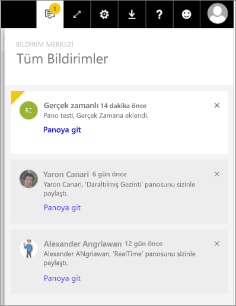

# Power BI Bildirimleri
Bildirim Merkezi, Power BI deneyiminizle ilgili bilgilerin sıralı bir akışıdır. Sizinle paylaşılan yeni panolar, Grup alanınızda yapılan değişiklikler, Power BI etkinliklerine ve toplantılarına ilişkin bilgiler, ayarladığınız uyarılar ve daha fazlası hakkındaki iletileri görmek için Bildirim Merkezi'ni açın. Power BI hizmetinin yanı sıra Power BI Mobil uygulamalarında da [uyarılar ayarlayabilirsiniz](service-set-data-alerts.md).

Amanda'nın aldığı bildirimleri gözden geçirmesini, bildirimlerini yönetmesini ve bunlar için işlem yapmasını izleyin. Ardından kendiniz denemek için videonun altındaki yönergeleri uygulayın.

<iframe width="560" height="315" src="https://www.youtube.com/embed/bZMSv5KAlcE" frameborder="0" allowfullscreen></iframe>

1. Power BI'da oturum açtığınızda, siz çevrimdışıyken size gönderilen tüm bildirimler, akışınıza eklenir. Yeni bildirimleriniz varsa Power BI, yeni öğe sayısının yer aldığı sarı bir baloncuk görüntüler.
   
   
2. Power BI menü çubuğunda Bildirimler simgesini seçin.
   
   
3. Bildirimler, son görüntülenenler üstte yer alacak ve okunmamış iletiler vurgulanacak şekilde görüntülenir. Bildirimler, daha önce silmediğiniz veya 100 üst sınırına ulaşmadığınız sürece 90 gün boyunca saklanır.
   
   
4. Bir bildirimi kapatmak için X simgesini seçin.

### Sonraki adımlar
* [Power BI hizmetindeki veri uyarıları](service-set-data-alerts.md)
* [Power BI veri uyarısıyla tetiklenen bir Microsoft Flow oluşturma](service-flow-integration.md)
* [iPhone uygulamasında (iOS için Power BI) veri uyarıları ayarlama](mobile-set-data-alerts-in-the-mobile-apps.md)
* [Windows 10 için Power BI mobil uygulamasında veri uyarıları ayarlama](mobile-set-data-alerts-in-the-mobile-apps.md)
* Başka bir sorunuz mu var? [Power BI Topluluğu'na başvurun](http://community.powerbi.com/)

