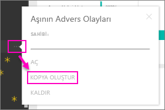

# Kurumsal içerik paketleri: kopyalama, yenileme ve erişim elde etme
> [!NOTE]
> Yeni *uygulamalardan* haberiniz var mı? Uygulamalar, Power BI'da geniş kitlelere içerik dağıtmak için kullanılan yeni yöntemdir. Kurumsal içerik paketlerini kullanımdan kaldırmayı planladığımız için, bunlar yerine uygulamaları kullanmanız önerilir. [Uygulamalar hakkında daha fazla bilgi](service-install-use-apps.md) edinin.
> 
> 

Bir kurumsal içerik paketi yayımlandığında, bütün alıcılar aynı panoyu, raporları, Excel çalışma kitaplarını, veri kümelerini ve verileri görür (SQL Server Analysis Services (SSAS) veri kaynağı olmadığı sürece).  İçerik paketini, [yalnızca içerik paketi oluşturucusu düzenleyebilir ve yeniden yayımlayabilir](service-organizational-content-pack-manage-update-delete.md).  Ancak, tüm alıcılar, özgün içerik paketiyle birlikte kullanılabilecek bir kopyasını kaydedebilir.

İçerik paketi oluşturma işlemi, pano paylaşmaktan veya bir grupta bunlara yönelik işbirliği yapmaktan farklıdır. Kendi durumunuz için en iyi seçeneği belirlemek üzere [Panolar ve raporlar üzerinde nasıl işbirliği yapabilir ve bunları nasıl paylaşabilirim?](service-how-to-collaborate-distribute-dashboards-reports.md) makalesini okuyun.

## Kurumsal içerik paketinin bir kopyasını oluşturma
İçerik paketinin, size ait ve başkalarına görünemeyecek bir kopyasını oluşturun.

1. İçerik paketi panosu yanındaki üç nokta (...) simgesini ve Kopya oluştur'u seçin.
   
    
2. **Kaydet**'i seçin.  

Artık, değiştirebileceğiniz bir kopyanız var. Yaptığınız değişiklikleri sizden başka kimse göremez.

## Yardım!  İçerik paketine artık erişemiyorum
Bu durum çeşitli nedenlerle oluşabilir:

* **Üyelik değişiklikleri**: İçerik paketleri e-posta dağıtım gruplarında, güvenlik gruplarında ve [Office 365'i temel alan Power BI gruplarında](https://support.office.com/article/Create-a-group-in-Office-365-7124dc4c-1de9-40d4-b096-e8add19209e9) yayımlanır.  Gruptan çıkarılırsanız içerik paketine erişiminiz olmayacaktır.
* **Dağıtım değişiklikleri**: Dağıtımı, içerik paketi oluşturucusu değiştirir. Örneğin, içerik paketi ilk olarak bütün kuruluşta yayımlanmış ancak oluşturucusu daha küçük bir kitle için onu yeniden yayımlamışsa belki bu kitleye dahil olmayabilirsiniz.
* **Güvenlik ayarları değişiklikleri**: Pano ve raporlar şirket içi SSAS veri kaynaklarına bağlanıyorsa ve güvenlik ayarlarında değişiklik yapılmışsa sunucu izinleriniz iptal edilebilir.

## Kurumsal içerik paketleri nasıl yenilenir?
İçerik paketi oluşturulduğunda yenileme ayarları veri kümesiyle birlikte devralınır.  İçerik paketinin bir kopyasını oluşturduğunuzda yeni sürüm, özgün veri kümesi ve yenileme zamanlamasına olan bağlantısını korur. 

Bkz. [Kurumsal içerik paketlerini yönetme, güncelleştirme ve silme](service-organizational-content-pack-manage-update-delete.md).

## Sonraki adımlar
* [Kurumsal içerik paketlerine giriş](service-organizational-content-pack-introduction.md)
* [Power BI'da bir grup oluşturma](service-create-distribute-apps.md)
* Başka bir sorunuz mu var? [Power BI Topluluğu'na başvurun](http://community.powerbi.com/)

