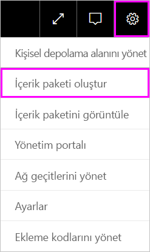
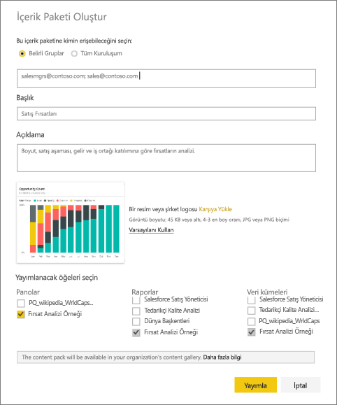
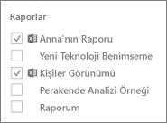
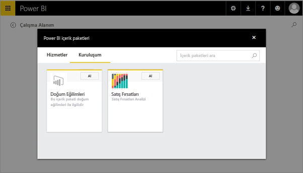

# Power BI kurumsal içerik paketi oluşturma ve yayımlama (eğitim)

Bu eğitim kapsamında Power BI'da bir kurumsal içerik paketi oluşturacak, belirli bir gruba erişim izni sağlayacak ve içerik paketini kuruluşunuzun içerik paketi kitaplığında yayımlayacaksınız.

İçerik paketi oluşturma, pano paylaşmaktan veya bir grupta panolar üzerinde işbirliği yapmaktan farklıdır. Kendi durumunuz için en iyi seçeneği belirlemek üzere [Panolar ve raporlar üzerinde nasıl işbirliği yapabilir ve bunları nasıl paylaşabilirim?](service-how-to-collaborate-distribute-dashboards-reports.md) bölümünü okuyun.

Kurumsal içerik paketleri oluşturabilmek için bir [Power BI Pro hesabına](https://powerbi.microsoft.com/pricing) sahip olunması gerekir. 

> [!NOTE]
> Yeni çalışma alanı deneyimi önizlemesinde kurumsal içerik paketleri oluşturamaz veya yükleyemezsiniz. Henüz yapmadıysanız, şimdi içerik paketlerinizi uygulamalara yükseltmek için iyi bir zamandır. [Yeni çalışma alanı deneyimi hakkında daha fazla bilgi](service-create-the-new-workspaces.md) edinin.
> 

Contoso'da Yayın Yöneticisi olduğunuzu ve yeni bir ürün lansmanı için hazırlandığınızı hayal edin.  Raporlar içeren bir pano oluşturuyor ve bu panoyu, ürün lansmanını yöneten diğer çalışanlarla paylaşmak istiyorsunuz. Panoyu ve raporları iş arkadaşlarınıza paket halinde bir çözüm olarak sunmak istiyorsunuz. 

Birlikte ilerlemek ister misiniz? [Power BI hizmetinde](https://powerbi.com) **Veri Al > Örnekler > Fırsat Analizi Örneği** > **Bağlan** seçeneğini belirleyerek örneğin bir kopyasını edinin. 

1. Sol gezinti bölmesinde **Opportunity Analysis Sample** panosunu seçin.
2. Üst gezinti çubuğunda dişli simgesi  > **İçerik paketi oluştur**'u seçin.    
   
3. **İçerik Paketi Oluştur** penceresinde aşağıdaki bilgileri girin.  
   
   Kuruluşunuzun içerik paketi kitaplığında, kuruluş veya gruplar için yayımlanmış yüzlerce içerik paketinin bulunabileceğini unutmayın. İçerik paketinize anlamlı bir ad verin, iyi bir açıklama ekleyin ve doğru kitleyi seçin.  İçerik paketinizin arama yoluyla kolayca bulunabilmesini sağlayacak sözcükler kullanın.
   
   1. **Belirli Gruplar**'ı seçtikten sonra kişilerin, [Office 365 gruplarının](https://support.office.com/article/Create-a-group-in-Office-365-7124dc4c-1de9-40d4-b096-e8add19209e9), dağıtım gruplarının veya güvenlik gruplarının tam e-posta adreslerini girin. Örnek:
      
        salesmgrs@contoso.com; sales@contoso.com
      
      Bu eğitim için kendi e-posta adresinizi veya grubunuzun e-posta adresini kullanın.
   
   2. İçerik paketini **Sales Opportunities** olarak adlandırın.
   
      > [!TIP]
      > İçerik paketini adlandırırken panonun adını da ekleyebilirsiniz. Bu sayede iş arkadaşlarınız, içerik paketinize bağlandıktan sonra panoyu daha kolay bir şekilde bulur.
      > 
      > 
   
   3. Öneri: Bir **açıklama** ekleyin. Bu sayede iş arkadaşlarınız, ihtiyaç duydukları içerik paketlerini daha kolay bir şekilde bulabilir. Açıklamanın yanı sıra, iş arkadaşlarınızın bu içerik paketini aramak için kullanabilecekleri anahtar sözcükler ekleyin. Soru sormak isteyen veya yardıma ihtiyacı olan iş arkadaşlarınız için iletişim bilgilerinizi ekleyin.
   
   4. Grup üyelerinin, içerik paketini daha kolay bir şekilde bulabilmesi için **karşıya bir resim veya logo yükleyin**. Resimleri bulmak, metinleri bulmaktan daha hızlıdır. Aşağıdaki ekran görüntüsünde, Opportunity Count adlı %100 Yığılmış sütun grafik kutucuğuna ait bir resim kullandık.
   
   5. **Opportunity Analysis Sample** panosunu seçerek içerik paketine ekleyin.  Power BI, ilişkili raporu ve veri kümesini otomatik olarak ekler. İsterseniz başka öğeler de ekleyebilirsiniz.
   
      > [!NOTE]
      >  Yalnızca düzenleyebileceğiniz panolar, raporlar, veri kümeleri ve çalışma kitapları listelenir. Sizinle paylaşılmış olan öğer bu listede yer almaz.
      > 
      > 
   
       
   
   6. Excel çalışma kitaplarınız varsa bunları Raporlar bölümünde, bir Excel simgesiyle birlikte görürsünüz. Çalışma kitaplarınızı da içerik paketine ekleyebilirsiniz.
   
      
   
      > [!NOTE]
      > Grup üyeleri, Excel çalışma kitabını görüntüleyemezse [OneDrive İş'te çalışma kitabını söz konusu kullanıcılarla paylaşmanız](https://support.office.com/en-us/article/Share-documents-or-folders-in-Office-365-1fe37332-0f9a-4719-970e-d2578da4941c) gerekebilir.
      > 
      > 
4. İçerik paketini grubun kurumsal içerik paketi kitaplığına eklemek için **Yayımla**'yı seçin.  
   
   İçerik paketi başarıyla yayımlandığında bir başarılı iletisi görürsünüz. 
5. Grubunuzdaki üyeler **Veri Al > Kuruluşum** bölümüne giderek arama kutusuna dokunup "Sales Opportunities" yazar.
   
    
6. Ardından, içerik paketinizi görürler.  
    
   
   > [!TIP]
   > Tarayıcınızda görüntülenen URL, bu içerik paketi için benzersiz bir adrestir.  İş arkadaşlarınızı bu yeni içerik paketinden haberdar etmek ister misiniz?  URL'yi bir e-postaya yapıştırmanız yeterli.
   > 
   > 
7. **Bağlan**'ı seçtiklerinde [içerik paketinizi görüntüleyebilir ve çalışmaya başlayabilirler](service-organizational-content-pack-copy-refresh-access.md). 

### Sonraki adımlar
* [Kurumsal içerik paketlerine giriş](service-organizational-content-pack-introduction.md)  
* [Kurumsal içerik paketlerini yönetme, güncelleştirme ve silme](service-organizational-content-pack-manage-update-delete.md)  
* [Power BI'da grup oluşturma](service-create-distribute-apps.md)  
* [OneDrive İş nedir?](https://support.office.com/en-us/article/What-is-OneDrive-for-Business-187f90af-056f-47c0-9656-cc0ddca7fdc2)
* Başka bir sorunuz mu var? [Power BI Topluluğu'na başvurun](http://community.powerbi.com/)

