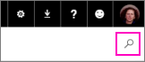

# Kurumsal içerik paketleri bulma ve bunlara bağlanma
> [!NOTE]
> Yeni *uygulamalardan* haberiniz var mı? Uygulamalar, Power BI'da geniş kitlelere içerik dağıtmanın yeni yoludur. Kurumsal içerik paketleri veya salt okunur çalışma alanları yerine uygulamaları kullanmanızı öneririz. [Uygulamalar hakkında daha fazla bilgi](service-install-use-apps.md) edinin.
> 
> 

Kuruluşunuzda herhangi birisi, dahil olduğunuz dağıtım veya güvenlik gruplarında ya da [Office 365 gruplarında](https://support.office.com/article/Create-a-group-in-Office-365-7124dc4c-1de9-40d4-b096-e8add19209e9) kurumsal içerik paketi yayımladığında bu paket AppSource'ta görünür.  Kurumsal içerik paketlerini bulmak ve açmak için AppSource'a göz atın veya burada arama yapın.

İçerik paketi oluşturma, pano paylaşmaktan veya bir grupta bunlar üzerinde işbirliği yapmaktan farklıdır. Kendi durumunuz için en iyi seçeneği belirlemek üzere [Panolar ve raporlar üzerinde nasıl işbirliği yapabilir ve bunları nasıl paylaşabilirim?](service-how-to-collaborate-distribute-dashboards-reports.md) bölümünü okuyun.

## Kurumsal içerik paketi bulma
[Power BI Pro](https://powerbi.microsoft.com/pricing) kullanıcılarının tümü AppSource'a gidebilir; AppSource tüm kuruluşla, dahil oldukları dağıtım veya güvenlik gruplarıyla ve Office 365 gruplarıyla paylaşılan içerik paketlerini görüntüler.  

1. Sol Gezinti Bölmesi'nden **Veri Al\> Kuruluşum** \> **Al** seçeneğini belirleyin.
2. Aradığınız içerik paketini göremiyor musunuz? Arama kutusuna dokunun ve anahtar sözcükler yazın:  
    
3. Ek bilgilerin gösterilmesi için bir içerik paketini seçin.

## Kurumsal içerik paketine bağlanma
* İçerik paketine bağlanmak ve bu paketi etkin çalışma alanınıza eklemek için **Şimdi edinin** seçeneğini belirleyin. Yeni panolar, raporlar, Excel çalışma kitapları ve veri kümeleri sarı bir yıldızla işaretlenmiştir.

İçerik paketinde bir Excel çalışma kitabı varsa çalışma kitabını görüntüleme izinlerine sahip olmadığınızı belirten bir uyarıyla karşılaşabilirsiniz. Bu durumda içerik paketinin sahibinden [OneDrive İş'te çalışma kitabını sizinle paylaşmasını](https://support.office.com/en-us/article/Share-documents-or-folders-in-Office-365-1fe37332-0f9a-4719-970e-d2578da4941c) isteyin. 

İçerik paketi kilitlidir. [Kendi pano ve rapor kopyalarınızı kaydedebilirsiniz](service-organizational-content-pack-copy-refresh-access.md). 

## İçerik paketindeki değişiklikler
İçerik paketinin sahibi, içerik paketini değiştirirse: 

* **Kopya oluşturmadıysanız** içerik paketi otomatik olarak güncelleştirilir.
* **Kopya oluşturduysanız** kopyanız güncelleştirilmez. 

## Sonraki adımlar
* [Kurumsal içerik paketlerine giriş](service-organizational-content-pack-introduction.md)  
* [Power BI'da uygulama oluşturma ve dağıtma](service-create-distribute-apps.md)
* Sorularınız mı var? [Power BI Topluluğu'na sorun](http://community.powerbi.com/)

