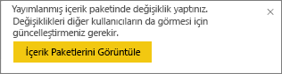
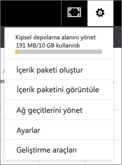

# Kurumsal içerik paketlerini yönetme, güncelleştirme ve silme
> [!NOTE]
> Yeni çalışma alanı deneyiminde kurumsal içerik paketleri oluşturamaz veya bunları yükleyemezsiniz. Henüz yapmadıysanız, şimdi içerik paketlerinizi uygulamalara yükseltmek için iyi bir zamandır. [Yeni çalışma alanı deneyimi hakkında daha fazla bilgi](service-create-the-new-workspaces.md) edinin.
> 

Panolarınızı, raporlarınızı, Excel çalışma kitaplarınızı ve veri kümelerinizi [kurumsal içerik paketleri](service-organizational-content-pack-introduction.md) olarak paketleyip iş arkadaşlarınızla paylaşabilirsiniz. İş arkadaşlarınız bunları olduğu gibi kullanabilir veya kendi kopyalarını oluşturabilir.

İçerik paketi oluşturma işlemi, pano paylaşmaktan veya bir grupta bunlara yönelik işbirliği yapmaktan farklıdır. Kendi durumunuz için en iyi seçeneği belirlemek üzere [Panolar ve raporlar üzerinde nasıl işbirliği yapabilir ve bunları nasıl paylaşabilirim?](service-how-to-collaborate-distribute-dashboards-reports.md) makalesini okuyun.

Bazı kurumsal içerik paketi görevlerini gerçekleştirebilmeniz için içerik paketi oluşturucusu olmanız gerekir. Bu görevler arasında şunlar yer alır:

* Yeniden yayımlama.
* İçerik paketine erişimi kısıtlama veya genişletme.
* Zamanlanmış yenilemeyi ayarlama ve değiştirme.
* İçerik paketini silme.

## Kurumsal bir içerik paketini değiştirme ve yeniden yayımlama
Özgün içerik paketi panosunda, raporda veya Excel çalışma kitabında değişiklik yaparsanız Power BI bunları yeniden yayımlamak isteyip istemediğinizi sorar. Ayrıca içerik paketi oluşturucusu olarak, özgün içerik paketini oluştururken İçerik Paketi Oluştur penceresinde seçtiğiniz seçeneklerden herhangi birini güncelleştirebilirsiniz. 

## Yeni içerikle yeniden yayımlama
Bir içerik paketine eklediğiniz panoda değişiklik yapıp kaydettiğinizde Power BI, size başkalarının değişiklikleri görebilmesi için panoyu güncelleştirmeyi anımsatır. Örneğin, yeni bir kutucuk sabitlediğinizde veya yalnızca panonun adını değiştirdiğinizde.

1. İletideki **İçerik Paketlerini Görüntüle** seçeneğini belirleyin.
   
   
2. Alternatif olarak, sağ üst köşedeki dişli simgesini  seçip **İçerik Paketini Görüntüle** seçeneğini de belirleyebilirsiniz.
   
   
   
   Uyarı simgesine  dikkat edin.  Bu, içerik paketini bir şekilde değiştirdiğinizi ve içerik paketinin, yayımladığınız haliyle artık eşleşmediğini bildirme amacı taşır.
3. **Düzenle**'yi seçin.  
4. **İçerik Paketini Güncelleştir** penceresinde tüm gerekli değişiklikleri yapın ve **Güncelleştir** seçeneğini belirleyin. **Başarılı** iletisi görüntülenir.
   
   * İçerik paketini özelleştirmemiş grup üyeleri için güncelleştirme otomatik olarak uygulanır.
   * İçerik paketini özelleştirmiş olan grup üyeleri yeni bir sürüm olduğuna ilişkin bir bildirim alır.  Bu üyeler AppSource'a giderek, kendi kişiselleştirilmiş sürümlerini kaybetmeden güncelleştirilmiş içerik paketini alabilir.  Artık 2 sürüme sahip olurlar: kişiselleştirilmiş sürüm ve güncelleştirilmiş içerik paketi.  Kişiselleştirilmiş sürümde özgün içerik paketine ait tüm kutucuklar kaybolur.  Ancak diğer raporlardan sabitlenmiş kutucuklar görünmeye devam eder. Öte yanda, içerik paketi sahibi içerik paketinde temel alınan veri kümesini silerse, raporun tamamı gidecektir.  

## Hedef kitleyi güncelleştirme: genişletme veya erişimi kısıtlama
İçerik paketi oluşturucularının gerçekleştirebileceği diğer bir değiştirme işlemi de içerik paketine erişimi genişletmek ve kısıtlamaktır.  Bir içerik paketini geniş bir hedef kitleye yönelik olarak yayımlamış ancak daha sonra erişimi daha küçük bir grupla kısıtlamaya karar vermiş olabilirsiniz.  

1. Dişli simgesini  seçin ve **İçerik Paketlerini Görüntüle** seçeneğini belirleyin.
2. **Düzenle**'yi seçin. 
3. **İçerik Paketini Güncelleştir** penceresinde tüm gerekli değişiklikleri yapın ve **Güncelleştir** seçeneğini belirleyin. Örneğin, **Belirli Gruplar** alanındaki özgün dağıtım grubunu silin ve farklı (daha az sayıda üyesi olan) bir dağıtım grubu ile değiştirin.
   
   Başarılı iletisi görüntülenir.
   
   Yeni takma adın parçası olmayan herhangi bir iş arkadaşınız için:
   
   * İçerik paketini özelleştirmemiş grup üyeleri söz konusu içerik paketiyle ilişkili pano ve raporları artık kullanamaz ve içerik paketi, gezinti bölmesinde görünmez.
   * İçerik paketini özelleştirmiş olan grup üyeleri özelleştirilmiş panoyu tekrar açtıklarında özgün içerik paketine ait tüm kutucuklar kaybolmuş olur.  Ancak diğer raporlardan sabitlenmiş kutucuklar görünmeye devam eder. Özgün içerik paketi raporları ve veri kümesi artık kullanılamaz ve içerik paketi, gezinti bölmesinde görünmez.   

## Bir kurumsal içerik paketini yenileme
İçerik paketi oluşturucusu olarak, [veri kümelerinin yenilenmesini zamanlayabilirsiniz](refresh-data.md).  İçerik paketi oluşturup karşıya yüklediğinizde, söz konusu yenileme zamanlaması veri kümeleriyle birlikte karşıya yüklenir. Yenileme zamanlamasını değiştirirseniz içerik paketini yeniden yayımlamanız gerekir. (Yukarıya bakın.)

## AppSource'taki kurumsal bir içerik paketini silme
AppSource'ta yalnızca oluşturucusu olduğunuz içerik paketlerini silebilirsiniz. Bir çalışma alanında kurumsal içerik paketi oluşturduysanız ve sonra bu çalışma alanını silmeye karar verirseniz, ilk olarak içerik paketini sildiğinizden emin olun. İlk olarak içerik paketini silmeden çalışma alanını silerseniz, bu içerik paketlerine tüm erişimi kaybedersiniz ve yardım için Microsoft Desteği’ne başvurmanız gerekir. 

> [!TIP]
> Oluşturucusu olmadığınız [bir içerik paketine yönelik bağlantınızı silebilirsiniz](service-organizational-content-pack-disconnect.md). Bu, içerik paketinin AppSource'tan silinmesine neden olmaz.
> 
> 

1. AppSource'taki bir içerik paketini silmek için, içerik paketini oluşturduğunuz çalışma alanına gidin, dişli simgesini  seçin ve **İçerik Paketlerini Görüntüle** seçeneğini belirleyin.
2. **Sil \> Sil** seçeneğini belirleyin. 
   
   * İçerik paketini özelleştirmemiş grup üyeleri için, söz konusu içerik paketiyle ilişkili raporlar ve pano otomatik olarak kaldırılır. Bunlar artık kullanılamaz ve içerik paketi, gezinti bölmesinde görünmez.
   * İçerik paketini özelleştirmiş olan grup üyeleri özelleştirilmiş panoyu tekrar açtıklarında özgün içerik paketine ait tüm kutucuklar kaybolmuş olur.  Ancak diğer raporlardan sabitlenmiş kutucuklar görünmeye devam eder. Özgün içerik paketi raporları ve veri kümesi artık kullanılamaz ve içerik paketi, gezinti bölmesinde görünmez.   

## Sonraki adımlar
* [Kurumsal içerik paketlerine giriş](service-organizational-content-pack-introduction.md)
* [Power BI'da uygulama oluşturma ve dağıtma](service-create-distribute-apps.md) 
* Başka bir sorunuz mu var? [Power BI Topluluğu'na başvurun](https://community.powerbi.com/)

