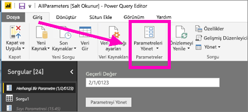
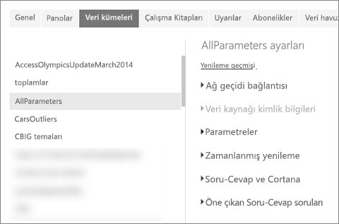
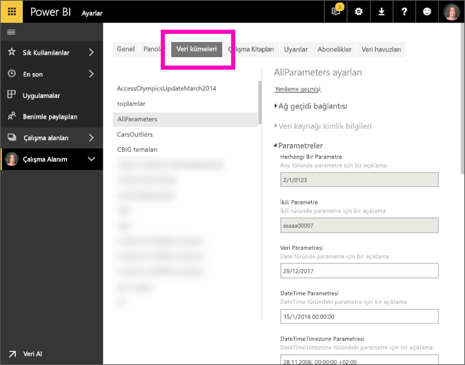

# Power BI hizmetinde parametre ayarlarını düzenleme
Rapor oluşturucular raporlara Power BI Desktop’ta sorgu parametreleri ekler. Parametreler, raporların bölümlerini bir veya birden çok parametre *değerine* bağımlı hale getirmeye olanak sağlar. Örneğin, rapor oluşturucu verileri tek bir ülke/bölge ile kısıtlayan bir parametre veya tarih, saat ve metin gibi alanlara kabul edilebilir biçimler tanımlayan bir parametre oluşturabilir.

## Power BI hizmetinde parametreleri gözden geçirme ve düzenleme

Rapor oluşturucusu olarak Desktop'ta parametreleri siz belirlersiniz. [Bu raporu Power BI hizmetinde yayımladığınızda](desktop-upload-desktop-files.md), parametre ayarları ve seçimleri de birlikte gelir. Bazı parametre ayarlarını Power BI hizmetinde gözden geçirebilir ve düzenleyebilirsiniz; bunlar kullanılabilir verileri kısıtlayan parametreler değil, kabul edilebilir değerleri tanımlayan ve açıklayan parametrelerdir.

1. Power BI hizmetinde, dişli simgesini  seçerek **Ayarlar**'ı açın.

2. **Veri Kümeleri**'nin sekmesini seçin ve listede bir veri kümesini vurgulayın. 
    
    

3. **Parametreler**'i genişletin.  Seçilen veri kümesinin parametresi yoksa, Sorgu parametreleri hakkında daha fazla bilgi edinin bağlantısını içeren bir ileti görürsünüz. Ancak veri kümesinin parametreleri varsa, **Parametreler** başlığının genişletilmesi söz konusu parametreleri gösterir. 

    

    Parametre ayarlarını gözden geçirin ve gereken değişiklikleri yapın. Soluk gösterilen alanlar düzenlenemez. 

## Sonraki adımlar
Basit parametreleri eklemenin geçici bir yolu da [URL'de değişiklik yapmaktır](service-url-filters.md).