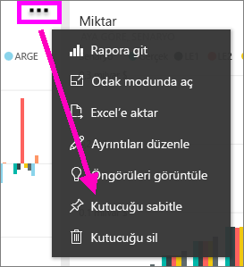
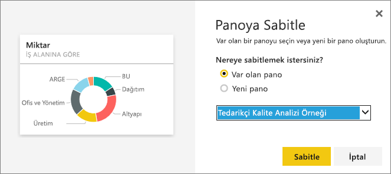
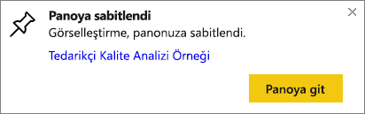

# Panolardaki kutucukları başka panolara sabitleme
Yeni [pano kutucuğu](service-dashboard-tiles.md) eklemenin bir yolu da kutucuğu başka bir panodan kopyalamaktır. Bu kutucukların her biri, tıklandığında oluşturulduğu yere (Soru-Cevap veya bir rapor) yönlendiren birer bağlantıdır. 

> [!NOTE]
> Paylaşılan panolardan kutucuk sabitleyemezsiniz.

## Bir kutucuğu başka bir panoya sabitleme
1. [Veri alın](service-get-data.md). Bu örnekte [BT Harcama Analizi Örneği](sample-it-spend.md) kullanılmaktadır.
2. Bir [pano](service-dashboards.md) açın.
3. Sabitlemek istediğiniz kutucuğun üzerine gelip üç nokta (...) simgesini ve ardından **Kutucuğu sabitle**'yi seçin.  
   
   
4. Kutucuğu, mevcut bir panoya veya yeni bir panoya sabitleyin. 
   
   * **Var olan pano**: Açılan listeden panonun adını seçin.
   * **Yeni pano**: Yeni panonun adını girin.
   
   
5. **Sabitle**'yi seçin.
   Sağ üst köşenin yakınında görüntülenen Başarılı iletisi, görselleştirmenin bir kutucuk olarak seçili panoya eklendiğini bildirir.
   
   
6. Sabitlenmiş kutucuğu görmek için **Panoya git**'i seçin. Burada, sabitlenmiş görselleştirmeyi [yeniden adlandırabilir, yeniden boyutlandırabilir, bağlantılı hale getirebilir ve taşıyabilirsiniz](service-dashboard-edit-tile.md).

## Sonraki adımlar
[Power BI'daki kutucuklar](service-dashboard-tiles.md)  
[Power BI'daki panolar](service-dashboards.md)  
Başka bir sorunuz mu var? [Power BI Topluluğu'na başvurun](http://community.powerbi.com/)

