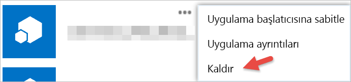

# Üçüncü taraf uygulamalarla çalışmaya başlama

Power BI ile birlikte Microsoft dışında bir şirket veya bir şahıs tarafından oluşturulmuş olan uygulamaları kullanabilirsiniz. Örneğin, Power BI kutucuklarını özel bir web uygulamasıyla tümleştiren bir üçüncü taraf uygulamayı kullanabilirsiniz. Üçüncü taraf uygulamaları kullandığınızda ilgili uygulamalara, Power BI hesabınıza ve kaynaklarınıza yönelik erişim izni vermeniz istenir. Yalnızca bildiğiniz ve güvendiğiniz uygulamalara erişim izni vermeniz önemlidir. Bir uygulamaya verdiğiniz izinleri dilediğiniz zaman iptal edebilirsiniz. Bkz. [Üçüncü taraf uygulama izinlerini iptal etme](#revoke).

Bir uygulamanın talep edebileceği erişim türleri aşağıda verilmiştir.

## Power BI Uygulama izinleri

* **Tüm Panoları Görüntüleme**
  
  * Bu izin ile uygulamaya, erişiminiz olan tüm panoları görüntüleme yetkisi verilir. Buna sahibi olduğunuz, içerik paketlerinden edindiğiniz, sizinle paylaşılan ve üyesi olduğunuz gruplarda bulunan panolar dahildir. Uygulama, pano üzerinde herhangi bir değişiklik yapamaz. Uygulamalar bu izni, pano içeriğinizi kendi sunduğu deneyime ekleme amacıyla da kullanabilir.

* **Tüm Raporları Görüntüleme**
  
  * Bu izin ile uygulamaya, erişiminiz olan tüm raporları görüntüleme yetkisi verilir. Buna sahibi olduğunuz, içerik paketlerinden edindiğiniz ve üyesi olduğunuz gruplarda bulunan raporlar da dahildir. Raporu görüntüleme iznine sahip olan uygulamalar içeriğindeki verileri de görebilir. Uygulama raporlar üzerinde herhangi bir değişiklik yapamaz. Uygulamalar bu izni, rapor içeriğinizi kendi sunduğu deneyime ekleme amacıyla da kullanabilir.

* **Tüm Veri Kümelerini Görüntüleme**
  
  * Bu izin ile uygulamaya, erişiminiz olan tüm veri kümelerini listeleme yetkisi verilir. Buna sahibi olduğunuz, içerik paketlerinden edindiğiniz ve üyesi olduğunuz gruplarda bulunan veri kümeleri dahildir. Uygulamalar tüm veri kümelerinizin adlarının yanı sıra tablo ve sütun adları da dahil olmak üzere yapılarını görebilir. Bu izin, veri kümesindeki verileri okuma yetkisi verir. Bu izin, uygulamalara veri kümesi ekleme veya var olan veri kümelerinde değişiklik yapma yetkisi vermez.
* **Tüm Veri Kümelerini Okuma ve Yazma**
  
  * Bu izin ile uygulamaya, erişiminiz olan tüm veri kümelerini listeleme yetkisi verilir. Buna sahibi olduğunuz, içerik paketlerinden edindiğiniz ve üyesi olduğunuz gruplarda bulunan veri kümeleri dahildir. Uygulamalar tüm veri kümelerinizin adlarının yanı sıra tablo ve sütun adları da dahil olmak üzere yapılarını görebilir. Bu izin, veri kümesindeki verileri okuma ve yazma yetkisi verir. Uygulamalar ayrıca yeni veri kümesi oluşturabilir veya var olan veri kümelerinde değişiklik yapabilir. Uygulamalar bu izni genellikle verileri Power BI'a doğrudan göndermek için kullanır.

* **Kullanıcının Gruplarını Görüntüleme**
  
  * Bu izin ile uygulamaya, üyesi olduğunuz tüm grupları listeleme yetkisi verilir. Uygulamalar bu izni listedeki diğer izinlerle birlikte kullanarak belirli bir gruba ait içeriği görüntüleyebilir veya güncelleştirebilir. Uygulama, grup üzerinde değişiklik yapamaz.

<a name="revoke"/>

## Üçüncü taraf uygulama izinlerini iptal etme

Üçüncü taraf uygulamalara verdiğiniz izinleri iptal etmek için Office 365 Uygulamalarım sitesine gitmeniz gerekir.

**Office 365 Uygulamalarım** sitesinde üçüncü taraf uygulamaların izinlerini iptal etmek için:

1. [Office 365 Uygulamalarım sitesine](https://portal.office.com/myapps) gidin.

2. **Uygulamalarım** sayfasında üçüncü taraf uygulamayı bulun.

3. Uygulama kutucuğunun üzerine gelin, **(...)** düğmesine ve ardından **Kaldır**'a tıklayın.

   