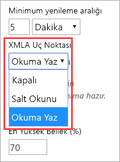
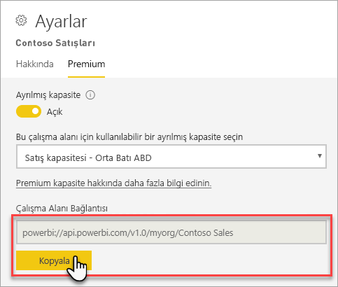
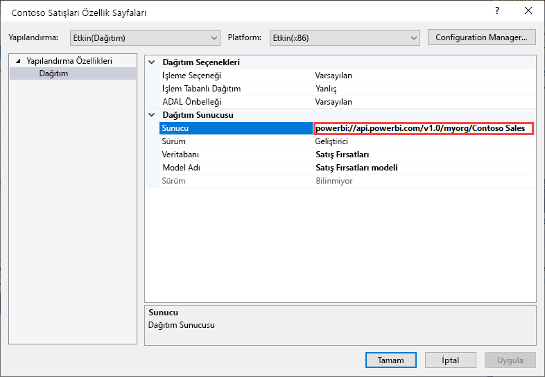
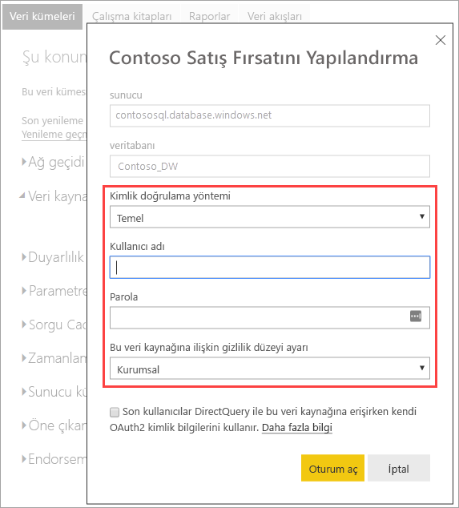
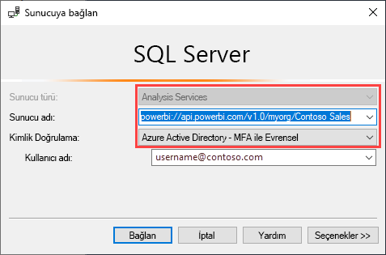

# XMLA uç noktasıyla veri kümesi bağlantısı (Önizleme)

1500 ve üzeri uyumluluk düzeyindeki Power BI Premium çalışma alanları ve veri kümeleri, *XMLA uç noktası* kullanarak gem Microsoft’un açık platform bağlantısını hem de üçüncü taraf istemci uygulamalarını ve araçlarını destekler.

> [!NOTE]
> Bu özellik, **Önizleme** aşamasındadır. Önizleme aşamasındaki özellikler üretim ortamında kullanılmamalıdır. Belirli işlevler, destek ve belgeler sınırlıdır.  Ayrıntılar için [Microsoft Çevrimiçi Hizmet Koşulları’na (OST)](https://www.microsoft.com/licensing/product-licensing/products?rtc=1) göz atın.

## XMLA uç noktası nedir?

Power BI Premium, istemci uygulamalarıyla Power BI çalışma alanınızı ve veri kümelerinizi yöneten altyapı arasında iletişimi sağlamak için [XML for Analysis](https://docs.microsoft.com/analysis-services/xmla/xml-for-analysis-xmla-reference?view=power-bi-premium-current) (XMLA) protokolünü kullanır. Bu iletişimler genellikle XMLA olarak adlandırılan uç noktalar üzerinden gerçekleştirilir. XMLA, Microsoft Analysis Services altyapısı tarafından kullanılan iletişim protokolüyle aynıdır. Bu protokol, yakından bakıldığında Power BI’ın anlamsal modellemesi, yönetim, yaşam döngüsü ve veri yönetimini çalıştırır.

Varsayılan olarak, uç noktayı kullanan *salt okunur* bağlantı, bir kapasitedeki **Veri kümeleri iş yükü** için etkindir. Veri görselleştirme uygulamaları ve araçları, salt okunur ile veri kümesi model verilerini, meta verileri, olayları ve şemayı sorgulayabilir. Uç noktayı kullanan *okuma/yazma* işlemleri ek veri kümesi yönetimi, idare, gelişmiş anlam modelleme, hata ayıklama ve izleme sağlanarak etkinleştirilebilir. Okuma/Yazma etkinken Power BI Premium veri kümeleri, Azure Analysis Services ve SQL Server Analysis Services kurumsal düzeyde tablosal modelleme araçları ve işlemleriyle daha fazla eşliğe sahiptir.

## Veri modelleme ve yönetim araçları

Bunlar Azure Analysis Services ve SQL Server Analysis Services ile kullanılan en yaygın araçlardan bazılarıdır ve artık Power BI Premium veri kümeleri tarafından desteklenir:

**Analysis Services projeleri ile Visual Studio** : SQL Server Veri Araçları (veya **SSDT**) olarak da bilinen bu araçlar, Analysis Services tablosal modellere yönelik kurumsal düzeyde bir model yazma aracıdır. Analysis Services projeleri uzantıları, ücretsiz Topluluk sürümü de dahil olmak üzere tüm Visual Studio 2017 ve üzeri sürümlerde desteklenir. Tablosal modelleri bir Premium çalışma alanına dağıtmak için uzantının 2.9.6 veya üzeri sürümleri gerekir. Premium çalışma alanına dağıtırken model 1500 veya üzeri uyumluluk düzeyinde olmalıdır. XMLA okuma/yazma, veri kümeleri iş yükünde gereklidir. Daha fazla bilgi için bkz. [Analysis Services Araçları](https://docs.microsoft.com/analysis-services/tools-and-applications-used-in-analysis-services?view=power-bi-premium-current).

**SQL Server Management Studio (SSMS)**  : DAX, MDX ve XMLA sorgularını destekler. [Tablosal Model Betik Dilini](https://docs.microsoft.com/analysis-services/tmsl/tabular-model-scripting-language-tmsl-reference) (TMSL) kullanarak hassas yenileme işlemleri gerçekleştirin ve veri kümesi meta verilerinde betik oluşturun. Sorgu işlemleri için salt okunur bağlantı gerekir. Meta verilerin betiğini oluşturma işlemi için okuma/yazma bağlantısı gerekir. SSMS sürüm 18.4 veya üzeri gerekir.  [Buradan](https://docs.microsoft.com/sql/ssms/download-sql-server-management-studio-ssms) indirin.

**SQL Server Profiler** : SSMS ile yüklenen bu araç, veri kümesi olayları için izleme ve hata ayıklama desteği sağlar. SQL Server için resmi olarak kullanım dışı bırakılmış olsa da Profiler SSMS’ye eklenmeye, Analysis Services ve Power BI Premium için desteklenmeye devam eder. XMLA salt-okunur gereklidir. Daha fazla bilgi için bkz.  [Analysis Services için SQL Server Profiler](https://docs.microsoft.com/analysis-services/instances/use-sql-server-profiler-to-monitor-analysis-services?view=power-bi-premium-current).

**Analysis Services Dağıtım Sihirbazı** : SSMS ile yüklenen bu araç, Visual Studio tarafından yazılan tablosal model projelerinin Analysis Services ve Power BI Premium çalışma alanlarına dağıtılmasını sağlar. Bu araç, etkileşimli olarak veya otomasyon için komut satırından çalıştırılabilir. XMLA okuma/yazma gereklidir. Daha fazla bilgi için bkz. [Analysis Services Dağıtım Sihirbazı](https://docs.microsoft.com/analysis-services/deployment/deploy-model-solutions-using-the-deployment-wizard?view=power-bi-premium-current).

**PowerShell cmdlet’leri** : Analysis Services cmdlet’leri, yenileme işlemleri gibi veri kümesi yönetim görevlerini otomatikleştirmek için kullanılabilir. XMLA okuma/yazma gereklidir. [SqlServer PowerShell modülünün](https://www.powershellgallery.com/packages/SqlServer/) **21.1.18221** veya üzeri bir sürümü gerekir. Az.AnalysisServices modülündeki Azure Analysis Services cmdlet’leri, Power BI Premium için desteklenmez. Daha fazla bilgi için bkz. [Analysis Services PowerShell Başvurusu](https://docs.microsoft.com/analysis-services/powershell/analysis-services-powershell-reference?view=power-bi-premium-current).

**Power BI Report Builder** : Sayfalandırılmış raporlar yazmaya yarayan bir araçtır. Hangi verilerin nereden alınacağını ve nasıl görüntüleneceğini belirten bir rapor tanımı oluşturur. Rapor Oluşturucusu’nda raporunuzun önizlemesini görüntüleyebilir, ardından raporunuzu Power BI hizmetinde yayımlayabilirsiniz. XMLA salt-okunur gereklidir. Daha fazla bilgi için bkz.  [Power BI Report Builder](https://docs.microsoft.com/power-bi/report-builder-power-bi).

**Tablo Düzenleyicisi**: Sezgisel ve hafif bir düzenleyici kullanarak tablosal modelleri oluşturmaya, sürdürmeye ve yönetmeye yarayan açık kaynaklı bir araçtır. Tablosal modelinizdeki tüm nesneler hiyerarşik bir görünümde gösterilir. Nesneler, çoklu seçim özellik düzenlemesi ve DAX söz dizimi vurgulaması için görüntüleme klasörleri tarafından düzenlenir. Sorgu işlemleri için XMLA salt okunur gerekir. Meta veri işlemleri için okuma/yazma bağlantısı gerekir. Daha fazla bilgi için bkz. [tabulareditor.github.io](https://tabulareditor.github.io/).

**DAX Studio** : DAX yazma, tanılama, performans ayarlama ve analiz etmeye yönelik açık kaynaklı bir araçtır. Özellikler arasında nesne göz atma, tümleşik izleme, ayrıntılı istatistiklere sahip sorgu yürütme dökümleri, DAX söz dizimi vurgulama ve biçimlendirme yer alır. Sorgu işlemleri için XMLA salt okunur gerekir. Daha fazla bilgi edinmek için bkz.  [daxstudio.org](https://daxstudio.org/).

**ALM Araç Seti**: En çok uygulama yaşam döngüsü yönetimi (ALM) senaryolarında kullanılan, Power BI veri kümeleri için açık kaynaklı bir şema karşılaştırma aracıdır. Ortamlar arasında dağıtım gerçekleştirir ve artımlı yenileme geçmiş verilerini korur. Meta veri dosyalarını, dallarını ve depolarını ayırıp birleştirir. Veri kümeleri arasındaki yaygın tanımları yeniden kullanır. Sorgu işlemleri için salt okunur bağlantı gerekir. Meta veri işlemleri için okuma/yazma bağlantısı gerekir. Daha fazla bilgi için bkz.  [alm-toolkit.com](http://alm-toolkit.com/).

**Microsoft Excel** : Excel PivotTable’lar Power BI veri kümelerindeki özet verileri özetlemek, analiz etmek, bulmak ve sunmak için kullanılan en yaygın araçlardan biridir. Sorgu işlemleri için salt okunur bağlantı gerekir. Office 16.0.11326.10000 veya üzeri bir Tıkla-Çalıştır sürümü gerekir.

**Üçüncü taraf** : Power BI Premium’daki veri kümelerine bağlanabilen, bunları sorgulayıp tüketebilen istemci veri görselleştirme uygulama ve araçlarını içerir. Araçların çoğu MSOLAP istemci kitaplıklarının en son sürümlerini gerektirir ama bazıları ADOMD kullanabilir. Salt okunur veya okuma/yazma XMLA Uç Noktası, işlemlere bağımlıdır.

### İstemci kitaplıkları

İstemci uygulamaları XMLA uç noktasıyla doğrudan iletişim kurmaz. Bunun yerine, özet düzeyi olarak *istemci kitaplıklarını* kullanırlar. Bunlar, Azure Analysis Services ve SQL Server Analysis Services’a bağlanmak için kullanılan istemci kitaplıkları uygulamalarının aynısıdır. Excel, SQL Server Management Studio (SSMS) ve Visual Studio için Analysis Services projeleri uzantısı gibi Microsoft uygulamaları, üç istemci kitaplığını da yükleyip normal uygulama ve uzantı güncelleştirmeleriyle birlikte bu kitaplıkları da güncelleştirir. Geliştiriciler de özel uygulamalar oluşturmak için istemci kitaplıklarını kullanabilir. Bazı durumlarda, özellikle üçüncü taraf uygulamalar söz konusu olduğunda, uygulamalarla yüklü gelmediyse istemci kitaplıklarının daha yeni sürümlerini yüklemeniz gerekebilir. İstemci kitaplıkları aylık olarak güncelleştirilir. Daha fazla bilgi için bkz.  [Analysis Services’a bağlanmak için istemci kitaplıkları](https://docs.microsoft.com/azure/analysis-services/analysis-services-data-providers).

## Desteklenen yazma işlemleri

Veri kümesi meta verileri, geliştiricilerin özel uygulamalar oluşturması için Tablosal Nesne Modeli (TOM) temelli istemci kitaplıkları üzerinden kullanıma sunulur. Bu, Tablosal Düzenleyici gibi açık kaynaklı topluluk araçları ve Visual Studio’nun henüz Power BI Desktop’ta desteklenmeyen, ancak Analysis Services altyapısı tarafından desteklenen ek veri modellemesi ve dağıtım özellikleri sunmasına olanak verir. Ek veri modelleme işlevi şunları içerir:

- Hesaplama yeniden kullanılabilirliği ve karmaşık modellerin basitleştirilmiş kullanımına yönelik [hesaplama grupları](https://docs.microsoft.com/analysis-services/tabular-models/calculation-groups?view=power-bi-premium-current).

- Çok dilli raporları ve veri kümelerini desteklemeye yönelik [meta veri çevirileri](https://docs.microsoft.com/analysis-services/tabular-models/translations-in-tabular-models-analysis-services?view=power-bi-premium-current).

- Veri kümesi meta verilerinin odaklanmış, iş alanına özgü görünümlerini tanımlamaya yönelik [perspektifler](https://docs.microsoft.com/analysis-services/tabular-models/perspectives-ssas-tabular?view=power-bi-premium-current).

Nesne düzeyinde güvenlik (OLS) henüz Power BI Premium veri kümelerinde desteklenmiyor.

## Yazma işlemleri için veri kümelerini iyileştirme

Veri kümesi yönetimi için XMLA uç noktasını yazma işlemleriyle birlikte kullanırken, veri kümesini büyük modeller için etkinleştirmeniz önerilir. Bu eylem, yazma işlemlerinin ek yükünü azaltarak onları önemli ölçüde daha hızlı hale getirir. Boyutu 1 GB’tan fazla olan veri kümelerinde (sıkıştırdıktan sonra) bu fark daha da belirgin olabilir. Daha fazla bilgi için bkz. [Power BI Premium’da büyük modeller](service-premium-large-models.md).

## XMLA okuma/yazmayı etkinleştirme

Varsayılan olarak, Premium kapasitede XMLA Uç Noktası özelliği ayarı salt okunurdur. Bu, uygulamaların yalnızca bir veri kümesini sorgulayabileceği anlamına gelir. Uygulamaların yazma işlemlerini gerçekleştirmesi için, XMLA Uç Noktası özelliğinin, okuma/yazma için etkinleştirilmesi gerekir. Bir kapasite için XMLA Uç Noktası özellik ayarı, **Veri kümeleri iş yükünde** yapılandırılır. XMLA Uç Noktası ayarı, kapasiteye atanan *tüm çalışma alanları ve veri kümeleri* için geçerlidir.

### Bir kapasitede okuma/yazma özelliğini etkinleştirmek için:

1. Yönetim portalında **Kapasite ayarları** > **Power BI Premium** > kapasite adına tıklayın.
2. **İş yüklerini** genişletin. **XMLA Uç Noktası** ayarında **Okuma/Yazma**’yı seçin.

    

## Premium çalışma alanına bağlanma

Ayrılmış kapasiteye atanan çalışma alanlarının `powerbi://api.powerbi.com/v1.0/[tenant name]/[workspace name]` gibi, URL biçiminde bir bağlantı dizesi vardır.

Çalışma alanına bağlanan uygulamalar, URL’yi Analysis Services sunucu adında olduğu gibi kullanır. Örneğin, `powerbi://api.powerbi.com/v1.0/contoso.com/Sales Workspace`.

Aynı kiracıdaki (B2B olmayan) UPN’ye sahip kullanıcılar, kiracı adını `myorg` ile değiştirebilir. Örneğin  `powerbi://api.powerbi.com/v1.0/myorg/Sales Workspace`.

### Çalışma alanı bağlantı URL’sini almak için:

Çalışma alanında **Ayarlar** > **Premium** > **Çalışma Alanı Bağlantısı** adımlarını izleyip **Kopyala**’ya tıklayın.

## Bağlantı gereksinimleri

### İlk katalog

SQL Server Profiler gibi bazı araçlarda *İlk Katalog* belirtmeniz gerekebilir. Çalışma alanınızdaki bir veri kümesini (veritabanı) belirtin. **Sunucuya Bağlan** iletişim kutusunda **Seçenekler** > **Bağlantı Özellikleri** > **Veritabanına bağlan** adımlarını izleyip veri kümesi adını girin.

### Yinelenen çalışma alanı adı

Power BI’daki [Yeni çalışma alanları](service-new-workspaces.md) (yeni çalışma alanı deneyimi kullanılarak oluşturulan), yinelenen adlara sahip çalışma alanlarının oluşturulmasına veya yeniden adlandırılmasına izin vermemek için doğrulama işlemi uygular. Geçirilmeyen çalışma alanları yinelenen adlara neden olabilir. Başka bir çalışma alanıyla aynı adı taşıyan bir çalışma alanına bağlanırken şu hatayı alabilirsiniz:

**powerbi://api.powerbi.com/v1.0/[kiracı adı]/[çalışma alanı adı] bağlantısı yapılamıyor.**

Bu sorunu geçici olarak çözmek için, çalışma alanı adına ek olarak ObjectIDGuid değerini de belirtin (bu değer URL'deki çalışma alanı objectID bölümünden kopyalanabilir). objectID değerini bağlantı URL'sine ekleyin. Örneğin,  
“powerbi://api.powerbi.com/v1.0/myorg/Contoso Sales - 9d83d204-82a9-4b36-98f2-a40099093830”.

### Yinelenen veri kümesi adı

Aynı çalışma alanındaki başka bir veri kümesiyle aynı adı taşıyan bir veri kümesine bağlanırken, veri kümesi adının sonuna veri kümesi guid değerini ekleyin. SSMS’de çalışma alanına bağlandığınızda hem veri kümesi adını hem de GUID değerini alabilirsiniz.

### Veri kümelerinin gecikmeli gösterilmesi

Çalışma alanına bağlandığınızda yeni, silinmiş ve yeniden adlandırılmış veri kümelerindeki değişikliklerin gösterilmesi birkaç dakika kadar sürebilir.

### Desteklenmeyen veri kümeleri

Aşağıdaki veri kümelerine XMLA uç noktalarından erişilemez. Bu veri kümeleri SSMS’de veya diğer araçlarda çalışma alanının altında görüntülenmez:

- Azure Analysis Services ve SQL Server Analysis Services modeline yönelik bir canlı bağlantıyı temel alan veri kümeleri. 
- Başka bir çalışma alanındaki Power BI veri kümesine yönelik bir canlı bağlantıyı temel alan veri kümeleri. Daha fazla bilgi için bkz. [Çalışma alanları arasında veri kümelerine giriş](service-datasets-across-workspaces.md).
- REST API kullanılarak veri gönderme özelliği olan veri kümeleri.
- Excel çalışma kitabı veri kümeleri.

## Güvenlik

XMLA Uç Noktası özelliğinin okuma/yazma özelliği kapasite yöneticisi tarafından etkinleştirilir. Buna ek olarak, Excel’deki Analiz için de gerekli olan, Power BI Yönetici Portalı’nda kiracı düzeyindeki **Verileri dışarı aktarma** ayarının da etkinleştirilmesi gerekir.

XMLA uç noktası üzerinden erişim, çalışma alanı/uygulama düzeyine ayarlanan güvenlik grubu üyelerini kabul eder.

Çalışma alanına katkıda bulunanlar ve daha üst düzeydekiler veri kümesine yazma erişimine sahip olduklarından, Analysis Services veritabanı yöneticileriyle eşit haklara sahiptir. Bu kişiler, Visual Studio’dan yeni veri kümeleri dağıtıp SSMS’de TMSL betiklerini yürütebilir.

Sunucu düzeyinde izlemeler ve [EffectiveUserName](https://docs.microsoft.com/analysis-services/instances/connection-string-properties-analysis-services?view=power-bi-premium-current#bkmk_auth) bağlantı/dize özelliğini kullanarak kullanıcıların kimliğine bürünme gibi Analysis Services sunucu yöneticisi izinleri (veritabanı yöneticisi yerine) gerektiren işlemler şu anda Power BI Premium’da desteklenmiyor.

Veri kümesinde [Oluşturma iznine](service-datasets-build-permissions.md) sahip olan diğer kullanıcılar, Analysis Services veritabanı okuyucularıyla eşit haklara sahiptir. Bu kişiler, veri kullanımı ve görselleştirmesi için veri kümelerine bağlanıp göz atabilirler. Satır düzeyi güvenlik (RLS) kuralları kabul edilir ve bu kişiler iç veri kümesi meta verilerini görüntüleyemez.

### Model rolleri

XMLA uç noktası üzerinden veri kümesi meta verileri, satır düzeyi güvenlik (RLS) filtrelerini ayarlamak da dahil olmak üzere bir veri kümesindeki model rollerini oluşturabilir ve değiştirip silebilir. Power BI’daki model rolleri yalnızca RLS için kullanılır. RLS dışındaki izinleri denetlemek için Power BI güvenlik modelini kullanın.

XMLA uç noktası aracılığıyla veri kümesi rolleriyle çalışırken şu sınırlamalar geçerlidir:

- **Genel önizleme aşamasında, XMLA uç noktası kullanılarak bir veri kümesi için rol üyeliği belirtilemez**. Bunun yerine, Power BI hizmetindeki bir veri kümesi için Satır Düzeyi Güvenlik sayfası üzerinden rol üyelerini belirtebilirsiniz.
- Power BI veri kümeleri için ayarlanabilecek tek rol izni, Okuma iznidir. Veri kümeleri rollerinin var olup olmaması fark etmeksizin, XMLA uç noktası üzerinden okuma erişimi için bir veri kümesine yönelik Oluşturma izni gerekir. RLS dışındaki izinleri denetlemek için Power BI güvenlik modelini kullanın.
- Nesne düzeyinde güvenlik (OLS) kuralları, şu anda Power BI’da desteklenmiyor.

### Veri kaynağı kimlik bilgilerini ayarlama

XMLA uç noktası üzerinden belirtilen meta veriler veri kaynaklarına bağlantı oluşturabilir, ancak veri kaynağı kimlik bilgilerini ayarlayamaz. Bunun yerine, Power BI hizmetindeki veri kümesi ayarları sayfasından kimlik bilgileri ayarlanabilir.

### Hizmet sorumluları

Genel önizleme aşamasında, otomasyon senaryolarında bir [hizmet sorumlusu](https://docs.microsoft.com/azure/active-directory/develop/app-objects-and-service-principals) kullanarak XMLA uç noktasıyla bağlantı kurma desteklenmiyor.

## Visual Studio’dan model projelerini dağıtma (SSDT)

Visual Studio’daki bir tablosal model projesini Power BI Premium çalışma alanına dağıtmak, Azure veya SQL Server Analysis Services sunucusuna dağıtmakla neredeyse aynıdır. Aralarındaki tek fark, işleme işlemlerinin veri kaynaklarındaki verileri çalışma alanındaki yeni veri kümesine içeri aktarmasını sağlayabilmesi için proje için belirtilen Dağıtım Sunucusu özelliğinde ve veri kaynağı kimlik bilgilerinin nasıl belirlendiğindedir.

> [!IMPORTANT]
> Genel önizleme aşamasında rol üyelikleri, XMLA uç noktaları kullanan araçlar tarafından belirlenemez. Model projeniz dağıtılamazsa herhangi bir rolde hiçbir kullanıcının belirtilmediğinden emin olun. Model başarıyla dağıtıldıktan sonra, Power BI hizmetindeki veri kümesi rolleri için kullanıcıları belirtin. Daha fazla bilgi edinmek için, bu makalenin önceki kısımlarında yer alan [Model rollerine](#model-roles) bakın.

Visual Studio’da yazılmış bir tablosal model projesini dağıtmak için, öncelikle projedeki **Dağıtım Sunucusu** özelliğindeki çalışma alanı bağlantı URL’sini ayarlamanız gerekir. Visual Studio’da, **Çözüm Gezgini**’nde projeye sağ tıklayıp **Özellikler**’i seçin. **Sunucu** özelliğinde, çalışma alanı bağlantı URL’sini yapıştırın.

Proje, Dağıtım Sunucusu özelliği belirtildikten sonra dağıtılabilir.

**İlk kez dağıtıldığında**, model.bim öğesindeki meta veriler kullanılarak çalışma alanında bir veri kümesi oluşturulur. Dağıtım işleminin bir parçası olarak, çalışma alanında model verilerinden bir veri kümesi oluşturulduktan sonra, veri kaynaklarından veri kümesine veri yükleme işlemi başarısız olur.

Azure veya SQL Server Analysis Server örneğine dağıtırken veri kaynağı kimlik bilgileri dağıtım işleminin bir parçası olarak istenirken, Premium çalışma alanına dağıtım yapılırken çalışma alanı veri kaynağı kimlik bilgileri, dağıtım işleminin bir parçası olarak belirtilemeyeceği için işlem başarısız olur. Bu işlemde veri kaynağı kimlik bilgileri, ancak meta veri dağıtımı başarılı olduktan ve veri kümesi oluşturulduktan sonra Power BI hizmetinde veri kümesi ayarlarında belirtilir. Çalışma alanında **Veri kümeleri** > **Ayarlar** > **Veri kaynağı kimlik bilgileri** > **Kimlik bilgilerini düzenle**’ye tıklayın.

Veri kaynağı kimlik bilgileri belirtildikten sonra Power BI hizmetindeki veri kümesini yenileyebilir, zamanlama yenilemesini yapılandırabilir veya veri kümesine veri yüklemek amacıyla yenilemeyi SQL Server Management Studio’dan işleyebilirsiniz.

Dağıtımın Visual Studio’daki projede belirtilen **İşleme Seçeneği** özelliği gözlemlenir. Ancak, veri kaynağının kimlik bilgileri henüz Power BI hizmetinde belirtilmediyse meta veri dağıtımı başarılı olsa bile, işlem başarısız olur. Dağıtımın bir parçası olarak işleme denemesini önlemek için, özelliği **İşleme** olarak ayarlayabilirsiniz. Ancak yeni veri kümesi için veri kaynağı kimlik bilgileri veri kaynağı ayarlarında belirtildikten sonra, ardışık dağıtım işlemlerinin bir parçası olarak işleme başarılı olacağından, özelliği yeniden **Varsayılan** olarak ayarlamanız önerilir.

## SSMS ile bağlanma

Bir çalışma alanına bağlanmak için SSMS kullanmak, Azure veya SQL Server Analysis Services sunucusuna bağlanmaya çok benzer. Tek fark, sunucu adında çalışma alanı URL’sini belirtmeniz ve **Active Directory - MFA ile Evrensel** kimlik doğrulamasını kullanmanız gerekir.

### SSMS kullanarak çalışma alanına bağlanma

1. SQL Server Management Studio’da **Bağlan** > **Sunucuya Bağlan**’a tıklayın.

2. **Sunucu Türü**’nde **Analysis Services**’i seçin. **Sunucu adı**’na çalışma alanı URL’sini girin. **Kimlik Doğrulaması**’nda **Active Directory - MFA ile Evrensel**’i seçin ve **Kullanıcı adı** olarak kurumsal kullanıcı kimliğinizi girin.

    

Bağlandığınızda, çalışma alanı bir Analysis Services sunucusu olarak ve çalışma alanındaki veri kümeleri de veritabanları olarak gösterilir.  

SSM’yi betik meta verilerinde kullanma hakkında daha fazla bilgi için bkz. [Analysis Services betikleri oluşturma](https://docs.microsoft.com/analysis-services/instances/create-analysis-services-scripts-in-management-studio?view=power-bi-premium-current) ve [Tablosal Model Betik Dili (TMSL)](https://docs.microsoft.com/analysis-services/tmsl/tabular-model-scripting-language-tmsl-reference?view=power-bi-premium-current).

## Veri kümesi yenilemesi

XMLA uç noktası SSMS kullanarak hassas yenilemenin özellikleri ve TOM kullanarak PowerShell ile otomasyon, [Azure Otomasyonu](https://docs.microsoft.com/azure/automation/automation-intro) ile [Azure İşlevleri](https://docs.microsoft.com/azure/azure-functions/functions-overview) gibi çok çeşitli senaryolar sunar. Örneğin, tüm geçmiş verileri yeniden yüklemek zorunda kalmadan, belirli geçmiş bölümlerde [artımlı yineleme](service-premium-incremental-refresh.md) yapabilirsiniz.

Power BI hizmetinde yenilemeyi yapılandırmanın aksine, XMLA uç noktası üzerinden yapılan yenileme işlemleri günlük 48 yenileme işlemiyle sınırlı değildir ve [zamanlanan yenileme zaman aşımı](refresh-troubleshooting-refresh-scenarios.md#scheduled-refresh-timeout) uygulanmaz.

## Dinamik Yönetim Görünümleri (DMV)

Analysis Services [DMV’leri](https://docs.microsoft.com/analysis-services/instances/use-dynamic-management-views-dmvs-to-monitor-analysis-services) veri kümesi meta verilerine, veri kökenine ve kaynak kullanımına yönelik görünürlük sağlar. XMLA uç noktası üzerinden Power BI’da sorgulama yapmak için kullanılan DMV’ler, en fazla veritabanı/yönetici izinleri gerekenlerle sınırlıdır. Örneğin, bazı DMV’ler için Analysis Services sunucu/yönetici izinleri gerektiğinden bunlara erişilemez.

## Power BI Desktop’ta yazılan veri kümeleri

### Gelişmiş meta veriler

Power BI Desktop’ta yazılan ve gelişmiş meta verilere ihtiyaç duyan bir Premium çalışma alanında yayımlanan veri kümelerine yönelik XMLA yazma işlemleri etkindir. Daha fazla bilgi için bkz. [Gelişmiş veri kümesi meta verileri](desktop-enhanced-dataset-metadata.md).

> [!CAUTION]
> Şu anda, Power BI Desktop’ta yazılmış bir veri kümesine yönelik yazma işlemi, bu veri kümesinin PBIX dosyası olarak geri indirilmesini engeller. Özgün PBIX dosyanızı sakladığınızdan emin olun.

### Veri kaynağı bildirimi

Veri kaynaklarına bağlanılıp veriler sorgulanırken Power BI Desktop, satır içi veri kaynağı bildirimi olarak Power Query M ifadelerini kullanır. Power Query M satır içi veri kaynağı bildirimi Power BI Premium çalışma alanlarında desteklenirken, Azure Analysis Services veya SQL Server Analysis Services tarafından desteklenmez. Bunun yerine Visual Studio gibi Analysis Services veri modelleme araçları, meta verileri *yapılandırılmış* ve/veya *sağlayıcı* veri kaynağı bildirimleri kullanarak oluşturur. XMLA uç noktası sayesinde Power BI Premium, yapılandırılmış ve sağlayıcı veri kaynaklarını da destekler. Ancak bu destek, Power BI Desktop modellerinde Power Query M satır içi veri kaynağı bildirimlerinin bir parçası olarak yer almaz. Daha fazla bilgi için bkz. [Sağlayıcıları anlama](https://docs.microsoft.com/azure/analysis-services/analysis-services-datasource#understanding-providers).

### Canlı bağlanma modunda Power BI Desktop

Power BI Desktop bir Power BI Premium veri kümesine, Azure Analysis Services veya SQL Server Analysis Services’a dağıtılan bir model veritabanıymış gibi bağlanabilir. Bu durumda Power BI Desktop, XMLA uç noktasını kullanır. Ancak bunun yerine, Power BI Desktop kullanıcılarının Power BI veri kümeleri için özel olarak oluşturulan Canlı bağlanma özelliğini kullanması önerilir. Veri kümelerinin onay cümlelerini gösteren Canlı bağlanmayı kullanarak iyileştirilmiş bir bulma deneyimi elde edersiniz. Kullanıcıların da çalışma alanı URL’lerinin kaydını tutması gerekmez, veri kümesinin adını yazmaları yeterli olur. Daha fazla bilgi için bkz. [Power BI hizmetindeki veri kümelerine Power BI Desktop’tan bağlanma](desktop-report-lifecycle-datasets.md).

## Denetim günlükleri

Uygulamalar bir çalışma alanına bağlandığında, XMLA uç noktaları üzerinden erişim Power BI denetim günlüklerine şu işlemlerin altına kaydedilir:

|Kolay işlem adı   |İşlem adı   |
|---------|---------|
|Dış uygulamadan Power BI veri kümesine bağlanıldı      |  ConnectFromExternalApplication        |
|Dış uygulamadan Power BI veri kümesi yenilemesi istendi      | RefreshDatasetFromExternalApplication        |
|Dış uygulamadan Power BI veri kümesi oluşturuldu      |  CreateDatasetFromExternalApplication        |
|Dış uygulamadan Power BI veri kümesi düzenlendi     |  EditDatasetFromExternalApplication        |
|Dış uygulamadan Power BI veri kümesi silindi      |  DeleteDatasetFromExternalApplication        |

Daha fazla bilgi için bkz.  [Power BI’ı denetleme](service-admin-auditing.md).

## Ayrıca bkz.

Başka bir sorunuz mu var? [Power BI Topluluğu'na sorun](https://community.powerbi.com/)
