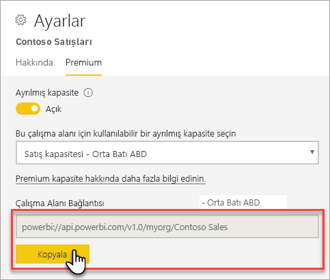
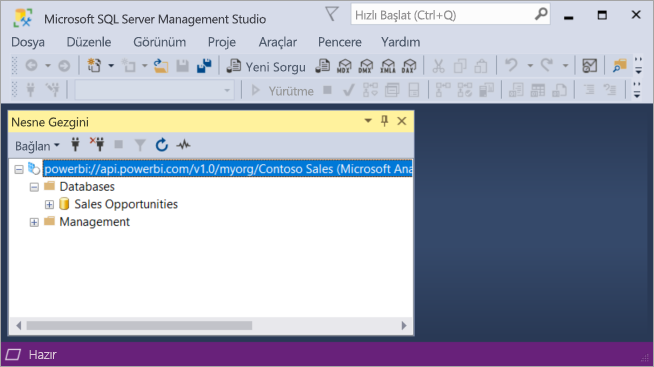

# İstemci uygulamaları ve araçlarıyla veri kümelerine bağlanma (Önizleme)

Power BI Premium çalışma alanları ve veri kümeleri Microsoft ve üçüncü taraf istemci uygulamalarından ve araçlarından gelen *salt okunur* bağlantıları destekler. Bağlantılar varsayılan olarak etkinleştirilir.

> [!NOTE]
> Bu makalenin tek amacı Power BI Premium çalışma alanları ve veri kümelerine salt okunur bağlantıyı tanıtmaktır. Programlama, belirli araç ve uygulamalar, mimari ve çalışma alanı ile veri kümesi yönetimi hakkında ayrıntılı bilgi sağlamayı *amaçlamaz*. Burada açıklanan konular Analysis Services tablosal model veritabanı mimarisi ve yönetimi hakkında üst düzey bilgi gerektirir.

## Protokol

Power BI Premium, istemci uygulamalarıyla çalışma alanınızı ve veri kümelerinizi yöneten altyapı arasında iletişimi sağlamak için [XML for Analysis](https://docs.microsoft.com/bi-reference/xmla/xml-for-analysis-xmla-reference) (XMLA) protokolünü kullanır. Bu iletişimler genellikle XMLA olarak adlandırılan uç noktalar üzerinden gerçekleştirilir. XMLA, Microsoft Analysis Services altyapısı tarafından kullanılan iletişim protokolüyle aynıdır. Bu protokol, yakından bakıldığında Power BI’ın anlamsal modellemesi, yönetim, yaşam döngüsü ve veri yönetimini çalıştırır. 

İstemci uygulamalarının ve araçlarının büyük çoğunluğu XMLA uç noktalarını kullanarak altyapıyla açıkça iletişim kurmaz. Bunun yerine istemci uygulaması ve altyapı için aracı görevini üstlenen ve XMLA kullanarak açıkça iletişim kuran MSOLAP, ADOMD ve AMO gibi istemci kitaplıklarını kullanırlar.

## Desteklenen araçlar

Bu araçlar Power BI Premium çalışma alanları ve veri kümelerine salt okunur erişimi destekler:

**SQL Server Management Studio (SSMS)** - DAX, MDX, XMLA ve TraceEvent sorgularını destekler. Sürüm 18.0 gerektirir. [Buradan](https://docs.microsoft.com/sql/ssms/download-sql-server-management-studio-ssms) indirin. 

**SQL Server Profiler** - SSMS 18.0 (Önizleme) sürümüne dahil edilmiştir. Bu araç sunucu olayları için izleme ve hata ayıklama desteği sağlar. Her olayın verilerini yakalayıp daha sonra analiz etmek üzere bir dosya veya tabloya kaydedebilirsiniz. SQL Server için resmi olarak kullanım dışı bırakılmış olsa da Profiler SSMS'ye eklenmeye, Analysis Services için ve şimdi de Power BI Premium için desteklenmeye devam eder. Daha fazla bilgi edinmek için bkz. [SQL Server Profiler](https://docs.microsoft.com/sql/tools/sql-server-profiler/sql-server-profiler).

**DAX Studio** - Analysis Services'te DAX sorgularını yürütmeye ve analiz etmeye yönelik açık kaynak topluluk aracı. Sürüm 2.8.2 veya üstünü gerektirir. Daha fazla bilgi edinmek için bkz. [daxstudio.org](https://daxstudio.org/).

**Excel PivotTable'ları** - Office 16.0.11326.10000 veya üstünün Tıkla-Çalıştır sürümünü gerektirir.

**Üçüncü taraf** - Power BI Premium'daki veri kümelerine bağlanabilen, bunları sorgulayabilen ve tüketebilen istemci veri görselleştirme uygulamalarıyla araçlarını içerir. Araçların çoğu MSOLAP istemci kitaplıklarının en son sürümlerini gerektirir ama bazıları ADOMD kullanabilir.

## İstemci kitaplıkları

İstemci kitaplıkları istemci uygulamalarının ve araçlarının Power BI Premium çalışma alanlarına bağlanması için gereklidir. Analysis Services'e bağlanmak için kullanılan istemci kitaplıkları Power BI Premium'da da desteklenir. Excel, SQL Server Management Studio (SSMS) ve SQL Server Veri Araçları (SSDT) gibi Microsoft istemci uygulamaları üç istemci kitaplığını da yükler ve normal uygulama güncelleştirmeleriyle birlikte bunları da güncelleştirir. Bazı durumlarda, özellikle üçüncü taraf uygulama ve araçlar söz konusu olduğunda istemci kitaplıklarının daha yeni sürümlerini yüklemeniz gerekebilir. İstemci kitaplıkları aylık olarak güncelleştirilir. Daha fazla bilgi edinmek için bkz. [Analysis Services'e bağlanmak için istemci kitaplıkları](https://docs.microsoft.com/azure/analysis-services/analysis-services-data-providers).

## Premium çalışma alanına bağlanma

Premium ayrılmış kapasitelere atanan çalışma alanlarına bağlanabilirsiniz. Ayrılmış kapasiteye atanan çalışma alanlarının URL biçiminde bir bağlantı dizesi vardır. 

Çalışma alanı bağlantı dizesini almak için, Power BI'da **Çalışma Alanı Ayarları**'nın **Premium** sekmesindeki **Çalışma Alanı Bağlantısı** alanında **Kopyala**'ya tıklayın.

Çalışma alanı bağlantıları çalışma alanını belirtmek için, bir Analysis Services sunucu adıymış gibi şu URL biçimini kullanır:   
`powerbi://api.powerbi.com/v1.0/[tenant name]/[workspace name]` 

Örneğin, `powerbi://api.powerbi.com/v1.0/contoso.com/Sales Workspace`

### SSMS'ye bağlanmak için

**Sunucuya Bağlan** > **Sunucu Türü** altında **Analysis Services**'i seçin. **Sunucu adı**'na URL'yi girin. **Kimlik Doğrulaması**'nda **Active Directory - MFA Desteğiyle Evrensel**'i seçin ve **Kullanıcı adı** olarak kurumsal kullanıcı kimliğinizi girin. 

Bağlandığınızda, çalışma alanı bir Analysis Services sunucusu olarak ve çalışma alanındaki veri kümeleri de veritabanları olarak gösterilir.  

### İlk katalog

SQL Server Profiler gibi bazı araçlarda *İlk Katalog* belirtmeniz gerekebilir. Çalışma alanınızdaki bir veri kümesini (veritabanı) belirtin. **Sunucuya Bağlan** alanında **Seçenekler**'e tıklayın. **Sunucuya Bağlan** iletişim kutusunun **Bağlantı Özellikleri** sekmesindeki **Veritabanına bağlan** alanına veri kümesi adını girin.

### Yinelenen çalışma alanı adı

Başka bir çalışma alanıyla aynı adı taşıyan bir çalışma alanına bağlanırken şu hatayı alabilirsiniz: **powerbi://api.powerbi.com/v1.0/[kiracı adı]/[çalışma alanı adı] bağlantısı yapılamıyor.**

Bu hatadan kaçınmak için, çalışma alanı adına ek olarak ObjectIDGuid değerini de belirtin (bu değer URL'deki çalışma alanı objectID bölümünden kopyalanabilir). objectID değerini bağlantı URL'sine ekleyin. Örneğin, `powerbi://api.powerbi.com/v1.0/myorg/Contoso Sales - 9d83d204-82a9-4b36-98f2-a40099093830'

### Yinelenen veri kümesi adı

Aynı çalışma alanındaki başka bir veri kümesiyle aynı adı taşıyan bir veri kümesine bağlanırken, veri kümesi adının sonuna veri kümesi guid değerini ekleyin. SSMS'de çalışma alanına bağlandığınızda hem veri kümesi adını *hem de* guid değerini alabilirsiniz. 

### Veri kümelerinin gecikmeli gösterilmesi

Çalışma alanına bağlandığınızda yeni, silinmiş ve yeniden adlandırılmış veri kümelerindeki değişikliklerin gösterilmesi 5 dakika kadar sürebilir. 

### Desteklenmeyen veri kümeleri

Aşağıdaki veri kümelerine XMLA uç noktaları kullanılarak erişilemez. Bu veri kümeleri SSMS'de veya diğer araçlarda çalışma alanının altında *görüntülenmez*: 

- Analysis Services modellerine Canlı bağlantısı olan veri kümeleri. 
- REST API kullanılarak veri gönderme özelliği olan veri kümeleri.
- Excel çalışma kitabı veri kümeleri. 

Aşağıdaki veri kümeleri Power BI hizmetinde desteklenmez:   

- Power BI Veri Kümesine Canlı bağlantısı olan veri kümeleri.

### Roller ve rol üyelikleri

Şu anda, model rolleri ve rol üyelikleri XMLA uç noktaları kullanarak bulunamaz veya görüntülenemez.

## Denetim günlükleri 

İstemci uygulamaları ve araçları bir çalışma alanına bağlandığında, XMLA uç noktaları üzerinden erişim Power BI denetim günlüklerine **GetWorkspaces** işleminin altına kaydedilir. Daha fazla bilgi edinmek için bkz. [Power BI'ı denetleme](service-admin-auditing.md).

## Ayrıca bkz.

[Analysis Services Başvuruları](https://docs.microsoft.com/bi-reference/?pivot=home&panel=home-all)   
[SQL Server Management Studio](https://docs.microsoft.com/sql/ssms/sql-server-management-studio-ssms)   
[SQL Server Analysis Services Tablosal Protokolü](https://docs.microsoft.com/openspecs/sql_server_protocols/ms-ssas-t/b98ed40e-c27a-4988-ab2d-c9c904fe13cf)   
[Dinamik Yönetim Görünümleri (DMV)](https://docs.microsoft.com/sql/analysis-services/instances/use-dynamic-management-views-dmvs-to-monitor-analysis-services)   

Başka bir sorunuz mu var? [Power BI Topluluğu'na sorun](https://community.powerbi.com/)
