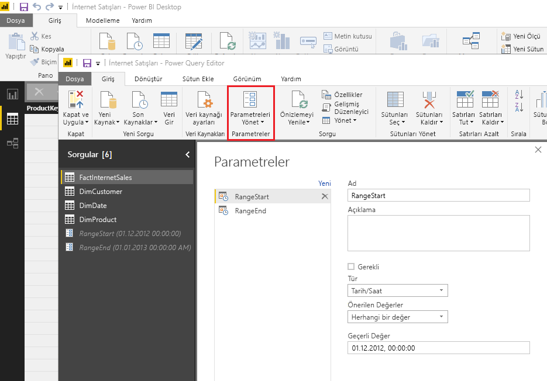
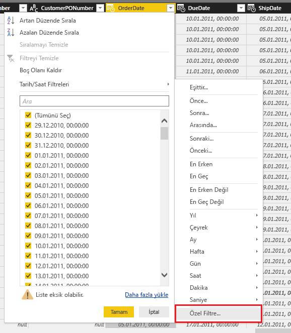
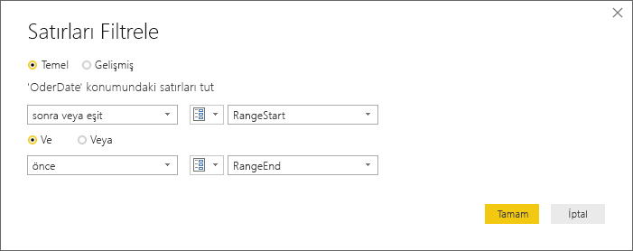
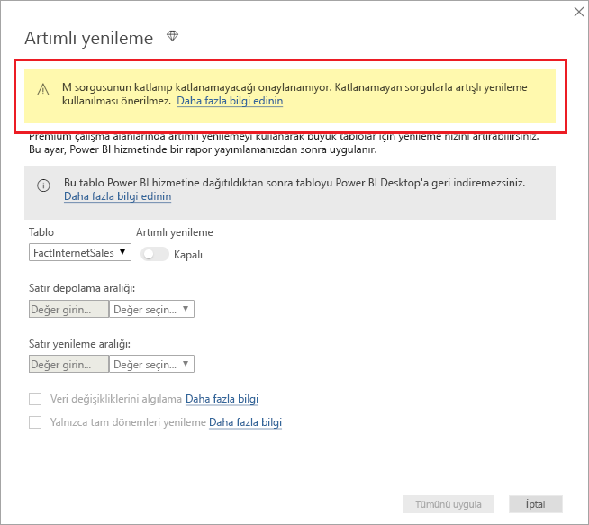
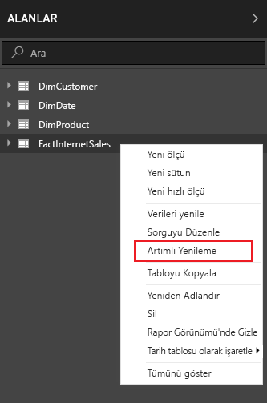
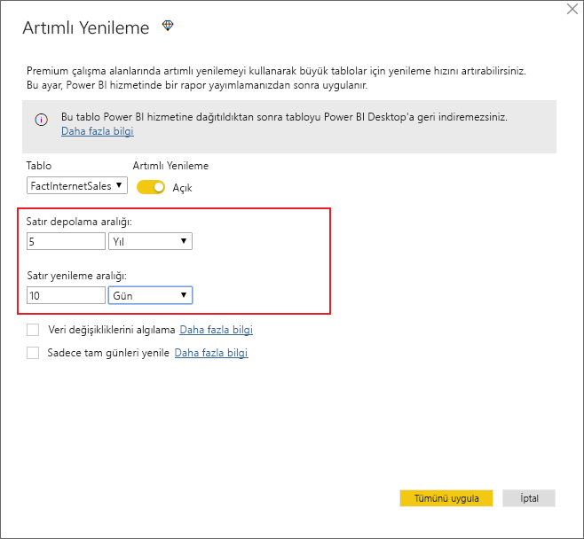
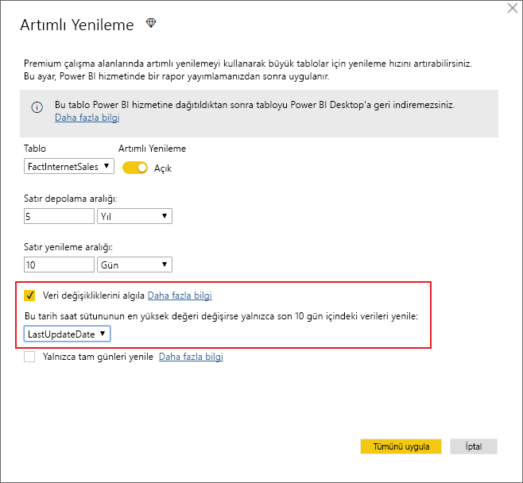
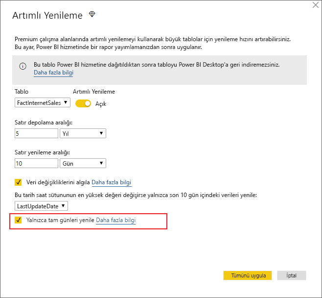

# <a name="incremental-refresh-in-power-bi"></a>Power BI’da artımlı yenileme

Artımlı yenileme, aşağıdaki avantajlarla Power BI'daki çok büyük veri kümelerini etkinleştirir:

> [!div class="checklist"]
> * **Yenilemeler daha hızlıdır** - Yalnızca değişmiş olan verilerin yenilenmesi gerekir. Örneğin, on yıllık bir veri kümesinin yalnızca son beş gününü yenileyin.
> * **Yenilemeler daha güvenilir olur** - Artık geçici kaynak sistemlerine uzun süreli bağlantıların sürdürülmesi gerekmez.
> * **Kaynak tüketimi azaltılır** - Yenilenecek verilerin daha az olması, belleğin ve diğer kaynakların genel tüketimini azaltır.

> [!NOTE]
> Artımlı yenileme artık Power BI Pro, Premium ve paylaşılan abonelikler ve veri kümelerinde kullanılabilir. 

## <a name="configure-incremental-refresh"></a>Artımlı yenilemeyi yapılandırma

Artımlı yenileme ilkeleri, Power BI Desktop’ta tanımlanır ve Power BI hizmetinde yayımlandıktan sonra uygulanır.


### <a name="filter-large-datasets-in-power-bi-desktop"></a>Power BI Desktop’ta büyük veri kümelerini filtreleme

Milyarlarca satır içerebilecek büyük veri modelleri Power BI Desktop modeline sığmayabilir çünkü PBIX dosyası masaüstü bilgisayarda kullanılabilir olan bellek kaynaklarıyla sınırlanmıştır. Bu nedenle genellikle bu tür veri kümeleri içeri aktarmanın ardından filtrelenir. Bu tür filtreleme artımlı yenileme kullanılıp kullanılmadığına göre uygulanır. Artımlı yenileme için Power Query tarih/saat parametreleri kullanılarak filtrelenir.

#### <a name="rangestart-and-rangeend-parameters"></a>RangeStart ve RangeEnd parametreleri

Artımlı yenileme için veri kümeleri ayrılmış, büyük/küçük harfe duyarlı **RangeStart** ve **RangeEnd** adlı Power Query tarih/saat parametreleri kullanılarak filtrelenir. Bu parametreler Power BI Desktop’a aktarılan verileri filtrelemek için ve aynı zamanda Power BI hizmetine yayımlandıktan sonra verileri dinamik olarak aralıklara bölmek için kullanılır. Her bölümü filtrelemek için parametre değerleri hizmet tarafından değiştirilir. Bunları hizmette veri kümesi ayarları içinde ayarlamak gerekmez. Yayımlandıktan sonra parametre değerleri otomatik olarak Power BI hizmeti tarafından geçersiz kılınır.

Parametreleri varsayılan değerlerle tanımlamak için, Power Query Düzenleyicisi’nde **Parametreleri Yönet**’i seçin.



Parametreler tanımlandığında, bir sütun için **Özel Filtre** menü seçeneğini belirterek filtreyi uygulayabilirsiniz.



Sütun değerinin **RangeStart** değerinden *sonra veya eşit* olduğu ve **RangeEnd** değerinden *önce* olduğu satırların filtrelendiğinden emin olun. Diğer filtre birleşimleri satırların çift sayılmasına yol açabilir.



> [!IMPORTANT]
> Sorgularda **RangeStart** veya **RangeEnd** parametresinde eşittir (=) işareti olduğunu ama her ikisinde birden olmadığını doğrulayın. Her iki parametrede de eşittir (=) işareti varsa, bir satır iki bölüm için de koşullara uyabilir ve bu durum modelde yinelenen verilere yol açabilir. Örneğin,  
> \#"Filtrelenen Satırlar" = Table.SelectRows(dbo_Fact, each [OrderDate] **>= RangeStart** and [OrderDate] **<= RangeEnd**) yinelenen veriler oluşması sonucunu verebilir.

> [!TIP]
> Parametrelerin veri türünün tarih/saat olması gerekse de, parametreler veri kaynağının gereksinimleriyle eşleşecek şekilde dönüştürülebilir. Örneğin, aşağıdaki Power Query işlevi bir tarih/saat değerini, veri ambarları için ortak olan *yyyyaagg* biçimindeki bir tamsayı vekil anahtarına benzeyecek şekilde dönüştürür. İşlev, filtre adımı tarafından çağrılabilir.
>
> `(x as datetime) => Date.Year(x)*10000 + Date.Month(x)*100 + Date.Day(x)`

Power Query Düzenleyicisi’nden **Kapat ve Uygula**’yı seçin. Power BI Desktop’ta veri kümesinin bir alt kümesi bulunmalıdır.

#### <a name="filter-date-column-updates"></a>Tarihi sütunu filtre güncelleştirmeleri

Tarih sütunundaki filtre Power BI hizmetinde verileri dinamik olarak aralıklara bölmek için kullanılır. Artımlı yenileme, filtrelenmiş tarih sütununun kaynak sistemde güncelleştirildiği durumları destekleyecek şekilde tasarlanmamıştır. Güncelleştirme, gerçek bir güncelleştirme olarak değil ekleme ve silme olarak yorumlanır. Artımlı aralıkta değil geçmiş aralıkta gerçekleştirilen silme işlemleri seçilmez. Bu durum bölüm anahtarı çakışmaları nedeniyle veri yenileme hatalarına neden olabilir.

#### <a name="query-folding"></a>Sorgu katlama

Yenileme işlemleri için sorgu gönderildiğinde bölüm filtresinin kaynağa gönderilmesi önemlidir. Filtrelemenin gönderilmesi, veri kaynağının sorgu katlama özelliğini desteklemesi gerektiği anlamına gelir. SQL sorgularını destekleyen veri kaynaklarının çoğu sorgu katlamayı da destekler. Öte yandan düz dosyalar, bloblar, web ve OData akışları genellikle desteklemez. Filtrenin veri kaynağı arka ucu tarafından desteklenmediği durumlarda filtre gönderilemez. Böyle durumları karma altyapısı telafi eder ve filtreyi yerel olarak uygular. Bunun için veri kaynağından tam veri kümesinin alınması gerekebilir. Bu da artımlı yenilemenin çok yavaş olmasına neden olabilir ve bu durumda işlem Power BI hizmetinde veya kullanılması durumunda şirket içi veri ağ geçidinde kaynakları tüketebilir.

Her veri kaynağı için farklı sorgu katlama düzeyleri söz konusu olduğundan filtre mantığının kaynak sorgularına dahil edildiğinden emin olmak için bunu doğrulamanız önerilir. Bunu kolaylaştırmak için Power BI Desktop bu doğrulamayı sizin yerinize gerçekleştirmeyi dener. Doğrulanamazsa, artımlı yenileme ilkesi tanımlanırken artımlı yenileme iletişim kutusunda bir uyarı görüntülenir. SQL, Oracle ve Teradata gibi SQL tabanlı veri kaynakları bu uyarıya güvenebilir. Diğer veri kaynakları sorguları izlemeden doğrulama yapamayabilir. Power BI Desktop onaylayamazsa aşağıdaki uyarı görüntülenir. Bu uyarıyı görüyorsanız ve gerekli sorgu katlama işleminin gerçekleşip gerçekleşmediğini denetlemek istiyorsanız Sorgu Tanılama özelliğini kullanabilir veya kaynak veritabanına ulaşan sorguları izleyebilirsiniz.

 

### <a name="define-the-refresh-policy"></a>Yenileme ilkesini tanımlama

Artımlı yenileme, Canlı Bağlantı modelleri dışında tablolar için bağlam menüsünde kullanılabilir.



#### <a name="incremental-refresh-dialog"></a>Artımlı yenileme iletişim kutusu

Artımlı yenileme iletişim kutusu görüntülenir. İletişim durumunu etkinleştirmek için iki durumlu düğmeyi kullanın.


> [!NOTE]
> Tablo için Power Query ifadesi, ayrılmış adlara sahip parametreleri ifade etmezse, iki durumlu düğme devre dışı bırakılır.

Üst bilgi metni aşağıdakileri açıklar:

- Yenileme ilkeleri, Power BI Desktop’ta tanımlanır ve hizmetteki yenileme işlemleri tarafından uygulanır.

- Power BI hizmetinden artımlı yenileme ilkesini içeren PBIX dosyasını indiremezseniz, bu dosya Power BI Desktop’ta açılamaz. Bu gelecekte desteklenebilse de, söz konusu veri kümelerinin çok büyüyeceğini ve tipik bir masaüstü bilgisayarda indirilip açılmasının elverişsiz hale gelebileceğini unutmayın.

#### <a name="refresh-ranges"></a>Yenileme aralıkları

Aşağıdaki örnekte, toplam beş takvim yılı verisine ek olarak geçerli tarihe kadar mevcut yılın verilerini depolayacak ve on günlük verileri artımlı olarak yenileyecek bir yenileme ilkesi tanımlanır. Birinci yenileme işlemi, geçmiş verileri yükler. Sonraki yenileme işlemleri artımlı olur ve (günlük olarak çalışacak şekilde zamanlanmışsa) aşağıdaki işlemleri gerçekleştirir:

- Veriler için yeni bir gün ekleme.

- Güncel tarihe kadarki on günü yenileme.

- Güncel tarihten beş yıl öncesinden daha eski zamana ait takvim yıllarını kaldırma. Örneğin, güncel tarih 1 Ocak 2019 ise, 2013 yılı kaldırılır.

Power BI hizmetindeki ilk yenilemede beş takvim yılının tamamının içeri aktarılması uzun sürebilir. Sonraki yenilemeler hızlı şekilde tamamlanabilir.




#### <a name="current-date"></a>Geçerli tarih

*Geçerli tarih*, yenileme anındaki sistem tarihini temel alır. Power BI hizmetinde veri kümesi için zamanlanmış yenilemenin etkinleştirilmiş olması durumunda geçerli tarih belirlenirken belirtilen saat dilimi dikkate alınır. Hem el ile çağrılan hem de zamanlanmış yenileme işlemleri varsa saat dilimini dikkate alır. Örneğin 20:00 PT (ABD ve Kanada) itibarıyla gerçekleşen ve saat dilimi belirtilmiş olan bir yenileme işlemi, geçerli tarihi GMT (bu durumda bir sonraki gün olacaktır) değil PT olarak kabul eder.


> [!NOTE]
> Bu aralıkların tanımı tüm ihtiyaçlarınıza yanıt verebilir; bu durumda doğrudan aşağıdaki yayımlama adımına gidebilirsiniz. Ek açılır pencereler, gelişmiş özellikler içindir.

### <a name="advanced-policy-options"></a>Gelişmiş ilke seçenekleri

#### <a name="detect-data-changes"></a>Veri değişikliklerini algılama

On günlük artımlı yenileme, beş yılın tam yenilemesini yapmaktan çok daha verimlidir. Öte yandan bunu daha da iyi hale getirmek mümkündür. **Veri değişikliklerini algıla** onay kutusunu seçerseniz, yalnızca verilerin değiştiği günleri belirleyip o günleri yenilemek için kullanılan bir tarih/saat sütunu seçebilirsiniz. Bu, genellikle denetim amacıyla, kaynak sistemde bir sütunun var olduğunu varsayar. **Bu sütun, RangeStart/RangeEnd parametreleriyle verileri bölmek için kullanılan sütun olmamalıdır.** Artımlı aralıktaki dönemlerin her biri için bu sütunun maksimum değeri değerlendirilir. Son yenilemeden bu yana değişmemişse dönemin yenilenmesi gerekmez. Örnekte bu, artımlı olarak yenilenen gün sayısını ondan ikiye kadar düşürebilir.



> [!TIP]
> Mevcut tasarım gereği, veri değişikliklerini algılayacak sütunun kalıcı duruma getirilmesi ve önbelleğe alınması gerekir. Kardinalite ve bellek kullanımını azaltmak için aşağıdaki tekniklerden birini dikkate almak isteyebilirsiniz.
>
> Power Query işlevini kullanarak, yenileme anında bu sütunun yalnızca maksimum değerini kalıcı duruma getirin.
>
> Duyarlılığı, yenileme sıklığı gereksinimleriniz için kabul edilebilir bir düzeye indirin.
>
> Daha sonraki bir tarihte veri değişikliği algılaması için özel sorguların tanımına olanak sağlamayı planlıyoruz. Bu, sütun değerinin olduğu gibi kalıcı duruma getirilmesini önlemek için kullanılabilir.

#### <a name="only-refresh-complete-periods"></a>Yalnızca tam dönemleri yenileme

Yenilemenin her sabah 4:00’da çalıştırılacak şekilde zamanlandığını varsayalım. Bu 4 saat boyunca kaynak sistemde veri görüntülenirse, bunu hesaba katmak istemeyebilirsiniz. Petrol ve doğal gaz endüstrisindeki günlük fıçı sayısı gibi bazı iş ölçümleri, kısmi günler için bir anlam taşımaz.

Ayın 12. takvim gününde önceki ayın verilerinin onaylandığı bir finansal sistemden verilerin yenilenmesi de başka bir örnek olarak verilebilir. Artımlı aralığı 1 ay olarak ayarlayabilir ve yenilemeyi ayın 12. gününde çalıştırılacak şekilde zamanlayabilirsiniz. Bu seçenek işaretlendiğinde, örneğin, Ocak verileri 12 Şubat’ta yenilenir.



> [!NOTE]
> Hizmetteki yenileme işlemleri, UTC saatine göre çalıştırılır. Bu, geçerlilik tarihini belirleyebilir ve tam dönemleri etkiler. Yenileme işlemi için geçerlilik tarihini geçersiz kılma özelliği eklemeyi planlıyoruz.

## <a name="publish-to-the-service"></a>Hizmette yayımlama

Şimdi modeli yenileyebilirsiniz. İlk yenilemede geçmiş verilerin içeri aktarılması uzun sürebilir. Sonraki yenilemeler artımlı yenilemeyi kullandığından çok daha hızlı olabilir.

## <a name="query-timeouts"></a>Sorgu zaman aşımları

[Yenileme sorunlarını giderme](https://docs.microsoft.com/power-bi/refresh-troubleshooting-refresh-scenarios) makalesinde, Power BI hizmetindeki yenileme işlemlerinin zaman aşımına tabi olduğu açıklanmaktadır. Sorgular, veri kaynağı için varsayılan zaman aşımıyla da sınırlanabilir. Çoğu ilişkisel kaynak, M ifadesindeki zaman aşımlarının geçersiz kılınmasına olanak sağlar. Örneğin, aşağıdaki ifadede zaman aşımını 2 saate ayarlamak için [SQL Server veri erişimi işlevi](https://msdn.microsoft.com/query-bi/m/sql-database) kullanılır. İlke aralıkları tarafından tanımlanan her dönem, komut zaman aşımı ayarını gözlemleyerek bir sorgu gönderir.

```powerquery-m
let
    Source = Sql.Database("myserver.database.windows.net", "AdventureWorks", [CommandTimeout=#duration(0, 2, 0, 0)]),
    dbo_Fact = Source{[Schema="dbo",Item="FactInternetSales"]}[Data],
    #"Filtered Rows" = Table.SelectRows(dbo_Fact, each [OrderDate] >= RangeStart and [OrderDate] < RangeEnd)
in
    #"Filtered Rows"
```

## <a name="limitations"></a>Sınırlamalar

Şu anda [bileşik modeller](desktop-composite-models.md) için yalnızca SQL Server, Azure SQL Veritabanı, SQL Veri Ambarı, Oracle, ve Teradata veri kaynaklarında artımlı yenileme desteklenmektedir.

