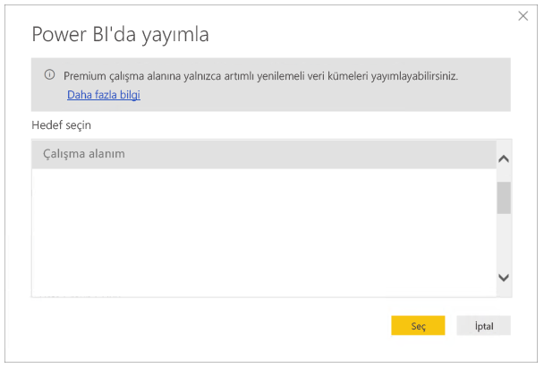

# <a name="incremental-refresh-in-power-bi-premium"></a>Power BI Premium’da artımlı yenileme

Artımlı yenileme, aşağıdaki avantajlarla Power BI Premium hizmetindeki çok büyük veri kümelerini etkinleştirir:

- **Yenileme daha hızlıdır.** Yalnızca değişmiş olan verilerin yenilenmesi gerekir. Örneğin, 10 yıllık bir veri kümesinin yalnızca son 5 gününü yenileyin.

- **Yenileme daha güvenilirdir.** Örneğin, geçici kaynak sistemlerine uzun süreli bağlantıların sürdürülmesi gerekmez.

- **Kaynak tüketimi azalır.** Yenilenecek verilerin daha az olması, belleğin ve diğer kaynakların genel tüketimini azaltır.

## <a name="how-to-use-incremental-refresh"></a>Artımlı yenilemeyi kullanma

Artımlı yenileme ilkeleri, Power BI Desktop’ta tanımlanır ve Power BI hizmetinde yayımlandıktan sonra uygulanır.

Önizleme özelliklerinde artımlı yenilemeyi etkinleştirerek başlayın.


### <a name="filter-large-datasets-in-power-bi-desktop"></a>Power BI Desktop’ta büyük veri kümelerini filtreleme

Power BI Desktop normalde kullanıcının masaüstü bilgisayarında kullanılabilir olan kaynaklarla sınırlanmış olduğundan, milyarlarca satırdan oluşan büyük veri kümeleri, Power BI Desktop’a sığmayabilir. Bu nedenle genellikle bu tür veri kümeleri, Power BI Desktop’a sığması için içeri aktarmanın ardından filtrelenir. Artımlı yenileme kullanılsa da kullanılmasa da bu durum söz konusudur.

#### <a name="rangestart-and-rangeend-parameters"></a>RangeStart ve RangeEnd parametreleri

Power BI hizmetinde artımlı yenilemeyi kullanmak için filtrelemenin ayrılmış, büyük/küçük harfe duyarlı **RangeStart** ve **RangeEnd** adlarıyla Power Query tarih/saat parametreleri kullanılarak yapılması gerekir.

Power Query Düzenleyicisi’nde **Parametreleri Yönet**’i seçerek varsayılan değerlerle parametreleri tanımlayın.


Parametreler tanımlanmış şekilde, bir sütun için **Özel Filtre** menü seçeneğini belirleyerek filtreyi uygulayabilirsiniz.


Sütun değerinin **RangeStart** değerinden *sonra veya eşit* olduğu ve **RangeEnd** değerinden *önce* olduğu satırların filtrelendiğinden emin olun.


> [!TIP]
> Parametrelerin veri türünün tarih/saat olması gerekse de parametreler, veri kaynağının gereksinimleriyle eşleşecek şekilde dönüştürülebilir. Örneğin, aşağıdaki Power Query işlevi bir tarih/saat değerini, veri ambarları için ortak olan *yyyyaagg* biçimindeki bir tamsayı vekil anahtarına benzeyecek şekilde dönüştürür. İşlev, filtre adımı tarafından çağrılabilir.
>
> `(x as datetime) => Date.Year(x)*10000 + Date.Month(x)*100 + Date.Day(x)`

Power Query Düzenleyicisi’nden **Kapat ve Uygula**’yı seçin. Power BI Desktop’ta veri kümesinin bir alt kümesi bulunmalıdır.

> [!NOTE]
> Yayımlandıktan sonra parametre değerleri otomatik olarak Power BI hizmeti tarafından geçersiz kılınır. Veri kümesi ayarlarında bunların ayarlanması gerekmez.

### <a name="define-the-refresh-policy"></a>Yenileme ilkesini tanımlama

Artımlı yenileme, Canlı Bağlantı modelleri dışında tablolar için bağlam menüsünde kullanılabilir.


#### <a name="incremental-refresh-dialog"></a>Artımlı yenileme iletişim kutusu

Artımlı yenileme iletişim kutusu görüntülenir. İletişim durumunu etkinleştirmek için iki durumlu düğmeyi kullanın.


> [!NOTE]
> Tablo için Power Query ifadesi, ayrılmış adlara sahip parametreleri ifade etmezse, iki durumlu düğme devre dışı bırakılır.

Üst bilgi metni aşağıdakileri açıklar:

-   Artımlı yenileme yalnızca Premium kapasitede çalışma alanları için desteklenir. Yenileme ilkeleri, Power BI Desktop’ta tanımlanır; hizmetteki yenileme işlemleri tarafından uygulanır.

-   Power BI hizmetinden artımlı yenileme ilkesi içeren PBIX dosyasını indiremiyorsanız bu dosya Power BI Desktop’ta açılmaz. Daha sonra hiç indiremezsiniz. Bu, gelecekte desteklenebilse de, bu veri kümelerinin çok büyüyeceğini ve tipik bir masaüstü bilgisayarda indirilip açılmasının elverişsiz hale gelebileceğini unutmayın.

#### <a name="refresh-ranges"></a>Yenileme aralıkları

Aşağıdaki örnekte, toplam 5 yıllık veriyi depolanacak ve 10 günlük veri artımlı olarak yenilenecek şekilde bir yenileme ilkesi tanımlanmaktadır. Veri kümesi günlük olarak yenilenirse, her yenileme işlemi için aşağıdaki adımlar gerçekleştirilir.

-   Veriler için yeni bir gün ekleme.

-   Güncel tarihe kadarki 10 günü yenileme.

-   Güncel tarihten 5 yıl öncesinden daha eski zamana ait takvim yıllarını kaldırma. Örneğin, güncel tarih 1 Ocak 2019 ise, 2013 yılı kaldırılır.

Power BI hizmetindeki ilk yenilemede 5 yılın tamamının içeri aktarılması uzun sürebilir. Sonraki yenilemeler hızlı şekilde tamamlanabilir.


**Bu aralıkların tanımı tüm ihtiyaçlarınıza yanıt verebilir; bu durumda doğrudan aşağıdaki yayımlama adımına gidebilirsiniz. Ek açılır pencereler, gelişmiş özellikler içindir.**

#### <a name="detect-data-changes"></a>Veri değişikliklerini algılama

10 günlük artımlı yenileme, 5 yıllık tam yenilemeden çok daha verimlidir. Ancak bunu daha da iyi yapabiliriz. **Veri değişikliklerini algıla** onay kutusunu seçerseniz, yalnızca verilerin değiştiği günleri belirleyip o günleri yenilemek için kullanılan bir tarih/saat sütunu seçebilirsiniz. Bu, genellikle denetim amacıyla, kaynak sistemde bir sütunun var olduğunu varsayar. Artımlı aralıktaki dönemlerin her biri için bu sütunun maksimum değeri değerlendirilir. Son yenilemeden bu yana değişmemişse dönemin yenilenmesi gerekmez. Örnekte bu, artımlı olarak yenilenen gün sayısını 10’dan 2’ye de düşürebilir.


> [!TIP]
> Mevcut tasarım gereği, veri değişikliklerini algılayacak sütunun kalıcı duruma getirilmesi ve önbelleğe alınması gerekir. Kardinalite ve bellek kullanımını azaltmak için aşağıdaki tekniklerden birini dikkate almak isteyebilirsiniz.
>
> Power Query işlevini kullanarak, yenileme anında bu sütunun yalnızca maksimum değerini kalıcı duruma getirin.
>
> Duyarlılığı, yenileme sıklığı gereksinimleriniz için kabul edilebilir bir düzeye indirin.
>
> Daha sonraki bir tarihte veri değişikliği algılaması için özel sorguların tanımına olanak sağlamayı planlıyoruz. Bu, sütun değerinin olduğu gibi kalıcı duruma getirilmesini önlemek için kullanılabilir.

#### <a name="only-refresh-complete-periods"></a>Yalnızca tam dönemleri yenileme

Yenilemenin her sabah 4:00’da çalıştırılacak şekilde zamanlandığını varsayalım. Bu 4 saat boyunca kaynak sistemde veri görüntülenirse, bunu hesaba katmak istemeyebilirsiniz. Petrol ve doğal gaz endüstrisindeki günlük fıçı sayısı gibi bazı iş ölçümleri, kısmi günler için bir anlam taşımaz.

Ayın 12. takvim gününde önceki ayın verilerinin onaylandığı bir finansal sistemden verilerin yenilenmesi de başka bir örnek olarak verilebilir. Artımlı aralığı 1 ay olarak ayarlayabilir ve yenilemeyi ayın 12. gününde çalıştırılacak şekilde zamanlayabilirsiniz. Bu seçenek işaretlendiğinde, örneğin, Ocak verileri 12 Şubat’ta yenilenir.


> [!NOTE]
> Hizmetteki yenileme işlemleri, UTC saatine göre çalıştırılır. Bu, geçerlilik tarihini belirleyebilir ve tam dönemleri etkiler. Yenileme işlemi için geçerlilik tarihini geçersiz kılma özelliği eklemeyi planlıyoruz.

## <a name="publish-to-the-service"></a>Hizmette yayımlama

Artımlı yenileme yalnızca Premium özellik olduğundan yayımlama iletişim kutusunda yalnızca Premium kapasitede bir çalışma alanı seçilmesine izin verilir.



Şimdi modeli yenileyebilirsiniz. İlk yenilemede geçmiş verilerin içeri aktarılması uzun sürebilir. Sonraki yenilemeler artımlı yenilemeyi kullandığından çok daha hızlı olabilir.

## <a name="query-timeouts"></a>Sorgu zaman aşımları

[Yenileme sorunlarını giderme](https://docs.microsoft.com/power-bi/refresh-troubleshooting-refresh-scenarios) makalesinde, Power BI hizmetindeki yenileme işlemlerinin zaman aşımına tabi olduğu açıklanmaktadır. Sorgular, veri kaynağı için varsayılan zaman aşımıyla da sınırlanabilir. Çoğu ilişkisel kaynak, M ifadesindeki zaman aşımlarının geçersiz kılınmasına olanak sağlar. Örneğin, aşağıdaki ifadede zaman aşımını 2 saate ayarlamak için [SQL Server veri erişimi işlevi](https://msdn.microsoft.com/query-bi/m/sql-database) kullanılır. İlke aralıkları tarafından tanımlanan her dönem, komut zaman aşımı ayarını gözlemleyerek bir sorgu gönderir.

```
let
    Source = Sql.Database("myserver.database.windows.net", "AdventureWorks", [CommandTimeout=#duration(0, 2, 0, 0)]),
    dbo_Fact = Source{[Schema="dbo",Item="FactInternetSales"]}[Data],
    #"Filtered Rows" = Table.SelectRows(dbo_Fact, each [OrderDate] >= RangeStart and [OrderDate] < RangeEnd)
in
    #"Filtered Rows"
```
