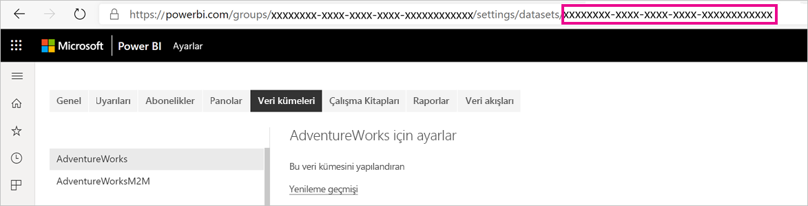
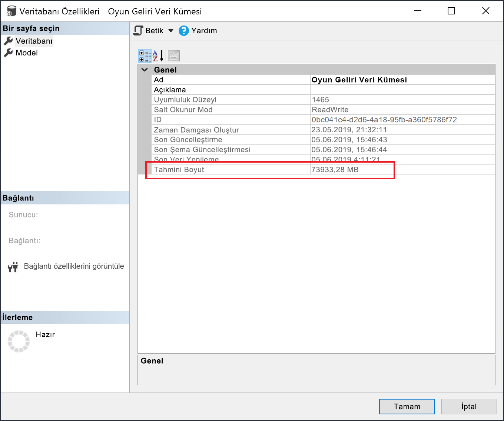

# <a name="large-models-in-power-bi-premium-preview"></a>Power BI Premium'da büyük modeller (önizleme)

Power BI veri kümeleri, sorgu performansını iyileştirmek için verileri yüksek oranda sıkıştırılmış bellek içi önbellekte depolayabilir. Bu sayede kullanıcılar, büyük veri kümeleriyle hızlı etkileşim kurabilirler. Büyük modeller özelliği, Power BI Premium'daki veri kümelerinin 10 GB'ın üzerine çıkmasını sağlar. Veri kümesinin boyutu ise Power BI Premium kapasitesinin boyutuyla sınırlıdır. Bu, Azure Analysis Services'ın model boyutu sınırlamalarına benzer. Power BI Premium'daki kapasite boyutları hakkında daha fazla bilgi için Kapasite düğümlerini inceleyin. Büyük modelleri tüm Premium P SKU'ları ve Embedded A SKU'ları için ayarlayabilirsiniz ancak bu modeller yalnızca [yeni çalışma alanlarıyla](service-create-the-new-workspaces.md) çalışır.

Büyük modeller, PBIX yükleme boyutunu etkilemez ve bu boyut yine 10 GB ile sınırlı olur. Bunun yerine veri kümeleri yenilendiğinde hizmette 10 GB'ı aşar. Bir veri kümesini 10 GB'ın üzerine çıkacak şekilde yapılandırmak için artımlı yenileme özelliğini kullanabilirsiniz.

## <a name="enable-large-models"></a>Büyük modelleri etkinleştirme

10 GB'ı aşan bir veri kümesi oluşturmak için şu adımları izleyin:

1. Power BI Desktop'ta bir veri kümesi oluşturun ve [artımlı yenileme](service-premium-incremental-refresh.md) yapılandırın.

1. Veri kümesini Power BI Premium hizmetinde yayımlayın.

1. Aşağıdaki PowerShell cmdlet'lerini çalıştırarak veri kümesinde büyük modelleri etkinleştirin. Bu cmdlet'ler, Power BI'ın veri kümesini Azure Premium Dosyalar üzerinde depolamasını ve 10 GB sınırını uygulamamasını sağlar.

1. Geçmiş verileri artımlı yenileme ilkesine göre yüklemek için yenileme gerçekleştirin. İlk yenileme işleminin geçmiş verileri yüklemesi uzun sürebilir. Sonraki yenileme işlemleri artımlı olacağından daha hızlı tamamlanacaktır.

### <a name="powershell-cmdlets"></a>PowerShell cmdlet'leri

Büyük modellerin geçerli sürümünde PowerShell cmdlet'lerini kullanarak veri kümesinin Premium Dosyalar depolama alanını kullanmasını sağlayın. PowerShell cmdlet'lerini çalıştırabilmek için kapasite yöneticisi ve çalışma alanı yöneticisi ayrıcalıklarına sahip olmanız gerekir.

1. Veri kümesi kimliğini (GUID) bulun. Kimlik değerini, çalışma alanının **Veri kümeleri** sekmesinin veri kümesi ayarlarında yer alan URL'de görebilirsiniz.

    

1. PowerShell yönetici isteminden [MicrosoftPowerBIMgmt](/powershell/module/microsoftpowerbimgmt.data/) modülünü yükleyin.

    ```powershell
    Install-Module -Name MicrosoftPowerBIMgmt
    ```

1. Oturum açmak ve veri kümesi depolama modunu denetlemek için aşağıdaki cmdlet'leri çalıştırın.

    ```powershell
    Login-PowerBIServiceAccount

    (Get-PowerBIDataset -Scope Organization -Id <Dataset ID> -Include actualStorage).ActualStorage
    ```

    Yanıt aşağıdaki gibi olmalıdır. Depolama modu varsayılan ayar olan ABF (Analysis Services yedekleme dosyası) olacaktır.

    ```
    Id                   StorageMode

    --                   -----------

    <Dataset ID>         Abf
    ```

1. Depolama modunu Premium Dosyalar olarak değiştirmek ve bunu denetlemek için aşağıdaki cmdlet'leri çalıştırın. Premium Dosyalara dönüştürme işlemi birkaç saniye sürebilir.

    ```powershell
    Set-PowerBIDataset -Id <Dataset ID> -TargetStorageMode PremiumFiles

    (Get-PowerBIDataset -Scope Organization -Id <Dataset ID> -Include actualStorage).ActualStorage
    ```

    Yanıt aşağıdaki gibi olmalıdır. Depolama modu artık Premium Dosyalar olarak ayarlanmıştır.

    ```
    Id                   StorageMode
    
    --                   -----------
    
    <Dataset ID>         PremiumFiles
    ```

Veri kümelerini Premium Dosyalara dönüştürme durumunu [Get-PowerBIWorkspaceMigrationStatus](/powershell/module/microsoftpowerbimgmt.workspaces/get-powerbiworkspacemigrationstatus) cmdlet'ini kullanarak denetleyebilirsiniz.

## <a name="dataset-eviction"></a>Veri kümesi çıkarma

Power BI, bellekteki etkin olmayan veri kümelerini çıkarmak için dinamik bellek yönetimi özelliğini kullanır. Power BI, kullanıcı sorgularını karşılama amacıyla farklı veri kümelerini yükleyebilmek için kullanılmayan veri kümelerini çıkarır. Dinamik bellek yönetimi, veri kümesi boyutlarının kapasitedeki kullanılabilir bellekten çok daha büyük olmasına izin verir ancak bunun için tek bir veri kümesinin belleğe sığacak boyutta olması gerekir. Dinamik bellek yönetimi hakkında daha fazla bilgi için bkz. [Kapasiteler nasıl çalışır?](service-premium-what-is.md#how-capacities-function)

Büyük modellerde çıkarmanın etkisini göz önünde bulundurmanız gerekir. Veri kümesi yükleme süreleri kısa olsa da çıkarılan büyük veri kümelerinin yeniden yüklenmesi, kullanıcılar için önemli bir gecikme süresi yaratabilir. Bu nedenle büyük modeller özelliği mevcut halinde self servis BI gereksinimlerinden çok kurumsal BI gereksinimlerine ayrılmış olan kapasiteler için önerilir. Kurumsal BI gereksinimlerine ayrılmış olan kapasitelerde veri kümesi çıkarma ve yeniden yükleme gereksinimi daha az olacaktır. Diğer yandan self servis BI ortamlarında belleğe girip çıkan çok sayıda küçük veri kümesi bulunabilir.

## <a name="checking-dataset-size"></a>Veri kümesi boyutunu denetleme

Geçmiş verileri yükledikten sonra [XMLA uç noktası](service-premium-connect-tools.md) aracılığıyla [SSMS](https://docs.microsoft.com/sql/ssms/download-sql-server-management-studio-ssms) kullanarak model özellikleri penceresinden tahmini veri kümesi boyutunu denetleyebilirsiniz.



Veri kümesi boyutunu denetlemek için SSMS'ten aşağıdaki DMV sorgularını da çalıştırabilirsiniz. Veri kümesi boyutunu bayt cinsinden görmek için çıkıştaki DICTIONARY\_SIZE ve USED\_SIZE sütunlarını toplayın.

```sql
SELECT * FROM SYSTEMRESTRICTSCHEMA
($System.DISCOVER_STORAGE_TABLE_COLUMNS,
 [DATABASE_NAME] = '<Dataset Name>') //Sum DICTIONARY_SIZE (bytes)

SELECT * FROM SYSTEMRESTRICTSCHEMA
($System.DISCOVER_STORAGE_TABLE_COLUMN_SEGMENTS,
 [DATABASE_NAME] = '<Dataset Name>') //Sum USED_SIZE (bytes)
```

## <a name="current-feature-restrictions"></a>Geçerli özellik kısıtlamaları

Büyük modelleri kullanırken aşağıdaki kısıtlamalara dikkat edin:

- **Kendi anahtarını getir (KAG) şifrelemesi** : Premium Dosyaların etkinleştirildiği veri kümeleri [KAG](service-encryption-byok.md) ile şifrelenmez.
- **Multi-geo desteği**: Premium Dosyaların etkinleştirildiği veri kümeleri, [multi-geo](service-admin-premium-multi-geo.md) özelliğinin de etkin olduğu kapasitelerde hata verecektir.

- **Power BI Desktop'a indirme**: Premium Dosyalarda depolanan veri kümeleri için [.pbix olarak indirme](service-export-to-pbix.md) işlemi başarısız olur.
- **Desteklenen bölgeler**: Büyük modeller Premium Dosya Depolama'yı destekleyen tüm Azure bölgelerinde desteklenir. Daha fazla bilgi edinmek için bkz. [Bölgeye göre kullanılabilir ürünler](https://azure.microsoft.com/global-infrastructure/services/?products=storage).
