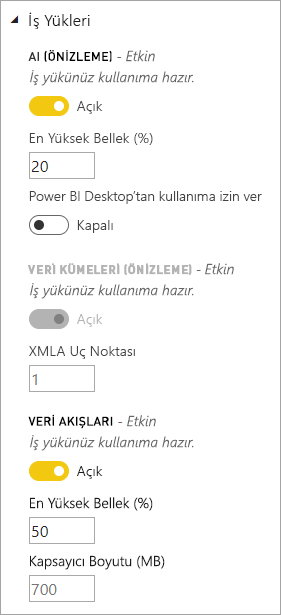
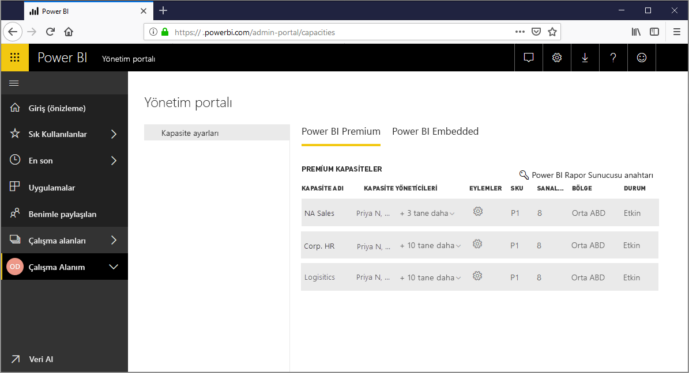
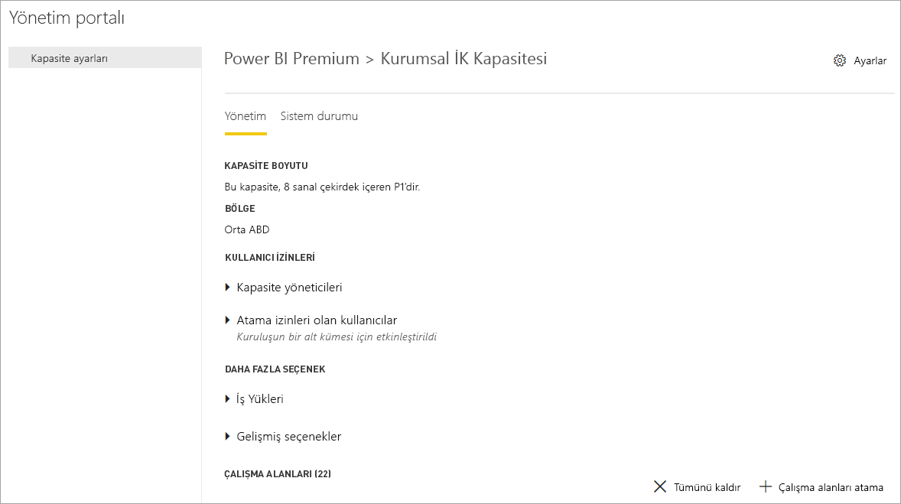
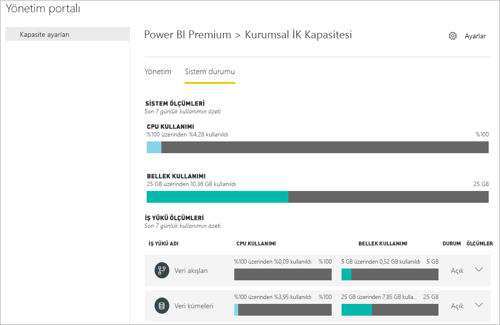
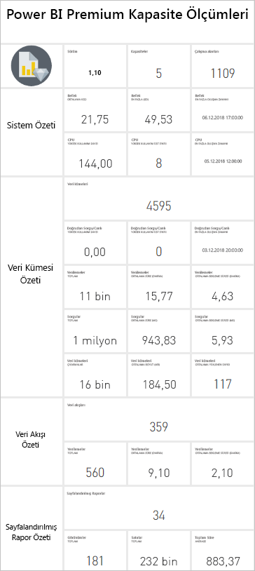
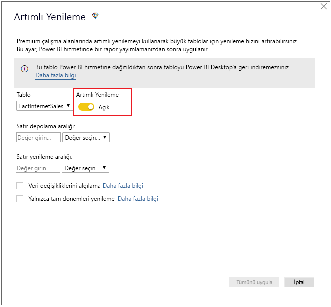
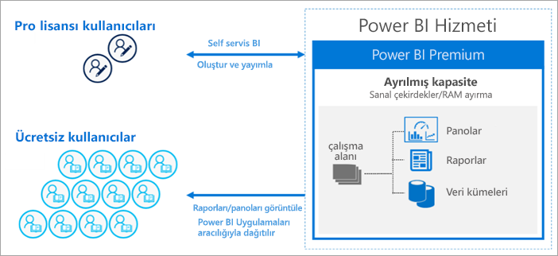
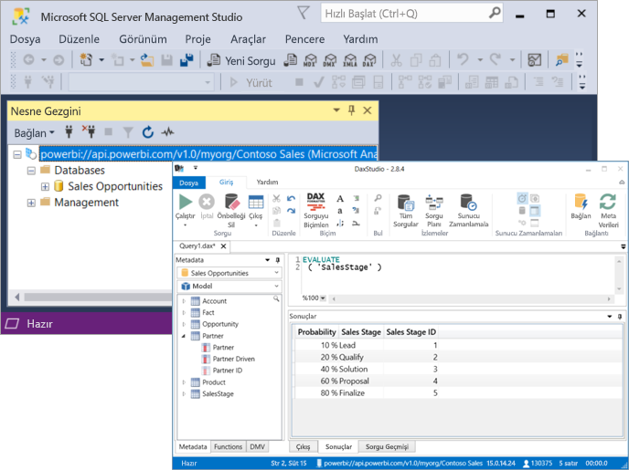

# Power BI Premium nedir?

Power BI Premium, kuruluşunuzda Power BI hizmetinin çalıştırılması için ayrılmış ve iyileştirilmiş kaynaklar sağlar. Örnek:

> [!div class="checklist"]
> * Daha büyük ölçek ve performans
> * Kapasiteye göre lisanslama esnekliği
> * Self servis ile kurumsal BI'ı birleştirme
> * Şirket içi BI'ı Power BI Rapor Sunucusu ile genişletme
> * Bölgeye göre veri yerleşimi desteği (Multi-Geo)
> * Kullanıcı başına lisans satın almadan verileri herkesle paylaşma

Bu makalede Power BI Premium'un önemli özellikleri tanıtılır. Gerektiğinde, daha ayrıntılı bilgiler içeren makalelerin bağlantıları sağlanır.

## Abonelikler ve lisanslama

Power BI Premium iki SKU (Stok Saklama Birimi) ailesinde sağlanan kiracı düzeyi bir Office 365 aboneliğidir:

- **EM** SKU'ları (EM1-EM3) eklemeye yöneliktir, yıllık taahhüt gerektirir, aylık faturalanır. EM1 ve EM2 SKU'ları yalnızca toplu lisans planlarıyla sağlanır. Bunları doğrudan satın alamazsınız.
- **P** SKU'ları (P1-P3) eklemeye ve kurumsal özelliklere yöneliktir, aylık veya yıllık taahhüt gerektirir, aylık faturalanır ve şirket içinde Power BI Rapor Sunucusu'nu yüklemek için bir lisans içerir.

Alternatif bir yaklaşım, yalnızca eklemeye ve kapasite testi amaçlarına yönelik tek bir **A** (A1-A6) SKU ailesi içeren bir **Azure Power BI Embedded** aboneliği satın almaktır. Tüm SKU'lar kapasiteleri oluşturmak için sanal çekirdekler getirir ama EM SKU'ları daha küçük ölçekli eklemeyle sınırlanmıştır. Dörtten az sanal çekirdeği olan EM1, EM2, A1 ve A2 SKU'ları ayrılmış altyapı üzerinde çalıştırılmaz.

Bu makale P SKU'larına odaklansa da, buradaki açıklamaların büyük bölümü A SKU'larına da uygundur. Premium aboneliği SKU'larının aksine, Azure SKU'ları hiçbir taahhüt süresi gerektirmez ve saatlik faturalanır. Bunlar tam esneklik getirerek ölçek büyütmeye, ölçek küçültmeye, duraklatmaya, sürdürmeye ve silmeye olanak tanırlar. 

Azure Power BI Embedded büyük ölçüde bu makalenin kapsamı dışında kalır ama iş yüklerini test etmek ve ölçmek için pratik ve ekonomik bir seçenek olarak Premium kapasiteleri iyileştirme makalesinin [Test Yaklaşımları](service-premium-capacity-optimize.md#testing-approaches) bölümünde açıklanmıştır. Azure SKU'ları hakkında daha fazla bilgi edinmek için bkz. [Azure Power BI Embedded Belgeleri](https://azure.microsoft.com/services/power-bi-embedded/).

### Satın alma

Power BI Premium abonelikleri Microsoft 365 yönetim merkezinde yöneticiler tarafından satın alınır. Özel olarak yalnızca Office 365 Genel yöneticileri veya Faturalama Yöneticileri SKU satın alabilir. Satın alındığında, kiracı kapasitelere atamak üzere alışverişe karşılık gelen sayıda sanal çekirdek alır; bu *sanal çekirdek havuzu* olarak bilinir. Örneğin, P3 SKU satın almak kiracıya 32 sanal çekirdek sağlar. Daha fazla bilgi edinmek için bkz. [Power BI Premium'u satın alma](service-admin-premium-purchase.md).

## Ayrılmış kapasiteler

Power BI Premium ile *ayrılmış kapasiteler* elde edersiniz. İş yüklerinin başka müşterilerle paylaşılan bilgi işlem kaynaklarında çalıştırıldığı paylaşılan kapasitenin tersine, ayrılmış kapasite özel olarak kuruluşun kullanımına yöneliktir. Barındırılan içerik için güvenilir ve tutarlı bir performans sağlayan ayrılmış bilgi işlem kaynaklarıyla yalıtılmıştır. 

Çalışma alanları kapasitelerin içinde yer alır. Her Power BI kullanıcısının **Çalışma Alanım** olarak bilinen kendi kişisel çalışma alanı vardır. İşbirliğine olanak tanımak için ek **çalışma alanları** oluşturulabilir. Kişisel çalışma alanları da dahil olmak üzere çalışma alanları varsayılan olarak paylaşılan kapasitede oluşturulur. Premium kapasiteleriniz varsa, hem Çalışma Alanlarım hem de çalışma alanları Premium kapasitelere atanabilir.

### Kapasite düğümleri

[Abonelikler ve Lisanslama](#subscriptions-and-licensing) bölümünde açıklandığı gibi, iki Power BI Premium SKU ailesi vardır: **EM** ve **P**. Tüm Power BI Premium SKU'ları kapasite *düğümleri* olarak sağlanır; bunlardan her biri işlemci, bellek ve depolamadan oluşan belirli bir miktar kaynağı temsil eder. Kaynaklara ek olarak, her SKU'nun saniyede kurulan Canlı Bağlantı ve DirectQuery bağlantılarının sayısıyla ve paralel model yenilemesi sayısıyla ilgili çalışma sınırlamaları vardır.

İşleme, arka uç ile ön üç arasında eşit olarak bölünmüş belirli sayıda sanal çekirdekle gerçekleştirilir.

**Arka uç sanal çekirdekleri** temel Power BI işlevselliğinden sorumludur: sorgu işleme, önbellek yönetimi, R hizmetlerini çalıştırma, veri yenileme, doğal dil işleme (Soru-Cevap), raporlar ile resimlerin sunucu tarafında işlenmesi. Arka uç sanal çekirdeklerine sabit bir miktar bellek atanır ve bu bellek öncelikli olarak etkin veri kümeleri olarak da bilinen modelleri barındırmak için kullanılır.

**Ön uç sanal çekirdekleri** web hizmetinden, pano ve rapor belge yönetiminden, erişim hakları yönetiminden, zamanlamadan, API'lerden, karşıya yüklemelerden ve indirmelerden, kısacası kullanıcı deneyimiyle ilgili her şeyden sorumludur.

Depolama **kapasite düğümü başına 100 TB** olarak ayarlanır.

Aşağıdaki tabloda her Premium SKU'sunun (ve eşdeğer boyutlu A SKU'sunun) kaynakları ve sınırları açıklanır:

| Kapasite Düğümleri | Toplam sanal çekirdek sayısı | Arka uç sanal çekirdek sayısı | RAM (GB) | Ön uç sanal çekirdek sayısı | DirectQuery/Canlı Bağlantı (saniyede) | Model Yenileme Paralelliği |
| --- | --- | --- | --- | --- | --- | --- |
| EM1/A1 | 1 | 0,5 | 3 | 0,5 | 3,75 | 1 |
| EM2/A2 | 2 | 1 | 5 | 1 | 7,5 | 2 |
| EM3/A3 | 4 | 2 | 10 | 2 | 15 | 3 |
| P1/A4 | 8 | 4 | 25 | 4 | 30 | 6 |
| P2/A5 | 16 | 8 | 50 | 8 | 60 | 12 |
| P3/A6 | 32 | 16 | 100 | 16 | 120 | 24 |
| | | | | | | |

### Kapasite iş yükleri

Kapasite iş yükleri kullanıcılarının kullanımına sunulan hizmetlerdir. Varsayılan olarak, Premium ve Azure kapasiteleri yalnızca çalışan Power BI sorgularıyla ilişkili veri kümesi iş yüklerini destekler. Veri kümesi iş yükleri devre dışı bırakılamaz. [AI (Bilişsel Hizmetler)](https://powerbi.microsoft.com/blog/easy-access-to-ai-in-power-bi-preview/), [Veri akışları](service-dataflows-overview.md#dataflow-capabilities-on-power-bi-premium) ve [Sayfalandırılmış raporlar](paginated-reports-save-to-power-bi-service.md) için ek iş yükleri etkinleştirilebilir. Bu iş yükleri yalnızca Premium aboneliklerinde desteklenir. 

Eklenen her iş yükünde, bu iş yükü için kullanılabilecek maksimum belleğin yapılandırılmasına (toplam kullanılabilir belleğin yüzdesi olarak) izin verilir. Maksimum bellek için varsayılan değerler SKU tarafından belirlenir. Bu ek iş yüklerini yalnızca kullanıldıklarında etkinleştirerek kapasitenizin kullanılabilir kaynaklarını en üst düzeye çıkarabilirsiniz. Ayrıca bellek ayarlarını yalnızca belirlenmiş varsayılan ayarlarınızın kapasite kaynak gereksinimlerinizi karşılamadığı durumlarda değiştirebilirsiniz. Bir kapasite için iş yükleri kapasite yöneticileri tarafından **Yönetim portalındaki** [Kapasite ayarları](service-admin-portal.md) veya [Kapasite REST API'leri](https://docs.microsoft.com/rest/api/power-bi/capacities) kullanılarak etkinleştirilebilir ve yapılandırılabilir.  

Daha fazla bilgi edinmek için bkz. [Premium kapasitedeki iş yüklerini yapılandırma](service-admin-premium-workloads.md). 

### Kapasiteler nasıl çalışır?

Power BI hizmeti her zaman kapasite için belirlenen sınırları aşmadan kapasite kaynaklarının en iyi şekilde kullanılmasını sağlar.

Kapasite işlemleri *etkileşimli* veya *arka plan* olarak sınıflandırılır. Etkileşimli işlemler isteklerin işlenmesini ve kullanıcı etkileşimlerine (filtreleme, Soru-Cevap sorgulama vb.) yanıt verilmesini içerir. Genel olarak içeri aktarma modeli sorgulaması yoğun bellek kaynağı kullanırken, DirectQuery ve Canlı Bağlantı modellerinin sorgulaması yoğun CPU kullanır. Arka plan işlemleri veri akışı ile içeri aktarma modeli yenilemelerini ve pano sorgusunu önbelleğe almayı içerir.

Mümkün olan en iyi kullanıcı deneyimini sağlamak için etkileşimli işlemlerin her zaman arka plan işlemlerinden daha öncelikli olduğunun anlaşılması önemlidir. Kaynaklar yetersizse arka plan işlemleri kaynaklar serbest kaldığında işlenmek üzere kuyruğa eklenir. Veri kümesi yenilemeleri gibi arka plan işlemleri, işlemin ortasında Power BI hizmeti tarafından durdurulabilir ve kuyruğa eklenebilir.

İçeri aktarma modellerinin sorgulanabilmesi veya yenilenebilmesi için tümüyle belleğe yüklenmesi gerekir. Power BI hizmeti kullanılabilir belleğin maksimum kullanımını güvence altına alacak gelişmiş algoritmalar kullanarak bellek kullanımını yönetir ve kapasitenin fazla işlenmesine neden olabilir: Kapasitenin birçok içeri aktarma modelini depolaması mümkün olsa da (Premium kapasite başına maksimum 100 TB), birleşik disk depolamaları desteklenen belleği aştığında (ve sorgulama ile yenileme için ek bellek gerektiğinde), bunların tümü aynı anda belleğe yüklenemez.

Dolayısıyla içeri aktarma modelleri kullanıma göre belleğe yüklenir ve bellekten kaldırılır. İçeri aktarma modeli sorgulandığında (etkileşimli işlem) ve henüz bellekte olmadığında veya yenilendiğinde (arka plan işlemi) yüklenir.

Modelin bellekten kaldırılması *çıkarma* olarak bilinir. Bu, Power BI'ın modellerin boyutuna bağlı olarak hızla gerçekleştirebildiği bir işlemdir. Kapasitede hiçbir bellek baskısı olmazsa, modeller yalnızca belleğe yüklenir ve orada kalır. Öte yandan modeli yüklemek için kullanılabilir bellek yetersizse, Power BI hizmetinin önce belleği boşaltması gerekir. Son üç dakika içinde \[[1](#endnote-1)\] kullanılmamış olan modelleri arayıp etkinlik dışı olan bu modelleri belirleyerek ve bunları çıkararak belleği boşaltır. Çıkarılabilecek etkinlik dışı kalmış model yoksa Power BI hizmeti arka plan işlemleri için yüklenmiş modelleri çıkarmayı dener. Denemelerin 30 saniye boyunca \[[1](#endnote-1)\] başarısız olması durumunda, son çare etkileşimli işlemin başarısız olmasıdır. Bu durumda, rapor kullanıcısına işlemin başarısız olduğu bildirilir ve kısa süre sonra yeniden denemesi önerilir. Bazı durumlarda modeller hizmet işlemlerinden dolayı bellekten kaldırılabilir.

Veri kümesi çıkarmanın normal ve beklenen bir davranış olduğunu vurgulamak önemlidir. Birleşik boyutları kullanılabilir belleği aşabilecek modelleri yükleyerek ve kaldırarak bellek kullanımını en üst düzeye çıkarmaya çalışır. Bu davranış tasarım gereğidir ve rapor kullanıcılar açısından saydam olarak gerçekleştirilir. Yüksek çıkarma oranlarının kapasitede verimsiz kaynak kullanımına işaret ediyor olması şart değildir. Bununla birlikte yüksek çıkarma oranlarından dolayı sorgu veya yenileme yanıt süreleri zarar görürse, sorun haline gelir.

Modellerin belleğe yüklenmesini gerektirdiğinden, içeri aktarma modellerinin yenilenmesi her zaman bellek yoğun işlemlerdir. İşleme için ek bellek gerekir. Tam yenileme modele gereken belleğin yaklaşık olarak iki katını kullanabilir. Bu sayede model işlenirken bile sorgulanabilir çünkü yenileme tamamlanana ve yeni model verileri kullanılabilir duruma gelene kadar sorgular mevcut modele gönderilir. Artımlı yenileme daha az bellek gerektirir ve daha hızlı tamamlanabilir; dolayısıyla kapasite kaynakları üzerindeki baskıyı önemli ölçüde azaltabilir. Modeller için yenilemeler, özellikle karmaşık Power Query dönüştürmeleri ya da karmaşık olan veya büyük tablolara dayanan hesaplanan tablolar/sütunlar içeren yenilemeler de yoğun CPU kullanabilir.

Sorgular gibi yenilemeler de modelin belleğe yüklenmesini gerektirir. Bellek yetersizse Power BI hizmeti etkin olmayan modelleri çıkarmayı dener ve bu mümkün olmazsa (tüm modeller etkinse) yenileme işi kuyruğa alınır. Yenilemeler normalde sorgulardan bile daha yoğun CPU kullanır. Bu nedenle eş zamanlı yenileme sayısında kapasite sınırları vardır; yuvarlak olarak arka uç sanal çekirdek sayısının 1,5 katına ayarlanır. Eş zamanlı yenilemelerin sayısı çok fazlaysa, zamanlanmış bir yenileme kuyruğa alınır. Böyle bir durum olduğunda yenilemenin tamamlanması daha uzun sürer. Kullanıcı isteği veya API çağrısı tarafından tetiklenen yenilemeler gibi isteğe bağlı yenilemeler üç kez \[[1](#endnote-1)\] yeniden denenir. Hala yeterli kaynak bulunamazsa yenileme başarısız olacaktır.

Bölüm notları:   
\[1\] Değişebilir.

### Bölgesel destek

Office 365 Genel yöneticileri ve Power BI hizmeti yöneticileri yeni kapasite oluştururken, kapasiteye atanan çalışma alanlarının tutulacağı bir bölge belirtebilir. Bu işlem **Multi-Geo** olarak adlandırılır. Multi-Geo ile, kuruluşlar içeriği belirli bir bölgedeki veri merkezlerine dağıtarak veri yerleşimi gereksinimlerini karşılayabilir. Bu bölge Office 365 Aboneliğinin tutulduğunu bölgeden farklı olabilir. Daha fazla bilgi edinmek için bkz. [Power BI Premium için Multi-Geo desteği](service-admin-premium-multi-geo.md).

### Kapasite yönetimi

Premium kapasitelerin yönetimi kapasite oluşturma veya silmeyi, yönetici atamayı, çalışma alanı atamayı, iş yüklerini yönetmeyi, izlemeyi ve kapasite performansını iyileştirmek amacıyla ayarlamalar yapmayı içerir. 

Office 365 Genel yöneticileri ve Power BI hizmeti yöneticileri kullanılabilir sanal çekirdeklerden Premium kapasite oluşturabilir veya mevcut Premium kapasitelerde değişiklik yapabilir. Kapasite oluşturulurken kapasite boyutu ile coğrafi bölgesi belirtilir ve kapasiteye en az bir kapasite yöneticisi atanır. 

Kapasiteleri oluşturma işleminde yönetim görevlerinin çoğu [Yönetim portalında](service-admin-portal.md) tamamlanır.

Kapasite yöneticileri kapasiteye çalışma alanları atayabilir, kullanıcı izinlerini yönetebilir ve başka yöneticiler atayabilir. Kapasite yöneticileri ayrıca iş yüklerini yapılandırabilir, bellek ayırmalarını ayarlayabilir ve aşırı yüklenmiş kapasitede işlemleri sıfırlayarak gerekirse kapasiteyi yeniden başlatabilir.

Yine kapasite yöneticileri kapasitenin sorunsuz çalıştığından emin olunmasını sağlayabilir. Doğrudan Yönetim portalında veya Premium kapasite ölçümleri uygulamasını kullanarak kapasitenin durumunu izleyebilirler.

Kapasite oluşturma, yönetici atama ve çalışma alanı atama hakkında daha fazla bilgi edinmek için bkz. [Premium kapasiteleri yönetme](service-premium-capacity-manage.md). Roller hakkında daha fazla bilgi edinmek için bkz. [Power BI ile ilgili yönetici rolleri](service-admin-administering-power-bi-in-your-organization.md#administrator-roles-related-to-power-bi).

### İzleme

Premium kapasitelerin izlenmesi yöneticilerin kapasitelerin nasıl performans gösterdiğini anlamasını sağlar. Kapasiteler Yönetim portalı veya [Power BI Premium Kapasite Ölçümleri uygulaması](https://app.powerbi.com/groups/me/getapps/services/capacitymetrics) kullanılarak izlenebilir.

Portalda izleme, son yedi gün içinde kapasitenizde yerleştirilen yükleri ve kullanılan kaynakları gösteren, ortalaması alınmış üst düzey ölçümlere hızlı bir bakış sağlar. 

**Power BI Premium Kapasite Ölçümleri** uygulaması kapasitenizin performansıyla ilgili en ayrıntılı bilgileri sağlar. Uygulamada bir üst düzey pano ve daha ayrıntılı raporlar sağlanır.

Uygulamanın panosunda bir ölçüm hücresine tıklayarak daha kapsamlı bir raporu açabilirsiniz. Raporlarda, ayrıntılı ölçümler ve kapasitelerinizi sorunsuz çalıştırmayı sürdürmek için ihtiyacınız olan en önemli bilgilerde detaya gitmek için filtreleme özelliği sağlanır.

Kapasiteleri izleme hakkında daha fazla bilgi edinmek için bkz. [Power BI Yönetim portalında izleme](service-admin-premium-monitor-portal.md) ve [Power BI Premium Kapasite Ölçümleri uygulamasıyla izleme](service-admin-premium-monitor-capacity.md).

### Kapasiteleri iyileştirme

Premium yatırımınızdan kullanıcılarınız için iyi performansı ve kendiniz için de en yüksek değeri elde ettiğinizden emin olmak açısından, kapasitelerinizi en iyi şekilde kullanabilmeniz kritik önem taşır. Yöneticiler önemli ölçümleri izleyerek performans sorunlarını en iyi nasıl giderebileceklerini saptayabilir ve gerekli önlemi alabilir. Daha fazla bilgi edinmek için bkz. [Premium kapasiteleri iyileştirme](service-premium-capacity-optimize.md) ve [Premium kapasite senaryoları](service-premium-capacity-scenarios.md).

### Kapasite REST API'leri

Power BI REST API'leri bir [Kapasite API'leri](https://docs.microsoft.com/rest/api/power-bi/capacities) koleksiyonu içerir. Yöneticiler API'lerle Premium kapasitenizin çeşitli yönlerini programlı olarak yönetebilir. Örneğin iş yüklerini etkinleştirebilir ve devre dışı bırakabilir, kapasiteye çalışma alanları atayabilir ve daha birçok işlem yapabilirler.

## Büyük veri kümeleri

SKU'ya bağlı olarak, Power BI Premium boyunu en çok **10 GB** olan Power BI Desktop (.pbix) model dosyalarının karşıya yüklenmesini destekler. Model yüklendiğinde, Premium kapasiteye atanmış bir çalışma alanında yayımlanabilir. Ardından veri kümesi boyutu **12 GB**’a ulaşana kadar yenilenebilir.

### Boyutla ilgili dikkat edilmesi gerekenler

Büyük veri kümelerinin kaynak kullanımı yoğun olabilir. 1 GB'ın üzerindeki veri kümeleri için en az P1 SKU kullanmalısınız. Büyük veri kümelerini A3 düzeyine kadar olan A SKU'larını kullanan çalışma alanlarında yayımlama işlemi başarılı sonuç verebilse de bu veri kümelerini yenileme işlemi yapılamaz.

Aşağıdaki tabloda, .pbix dosyasını karşıya yüklemek veya Power BI hizmetinde yayımlamak için önerilen SKU'lar gösterilmektedir:

   |SKU  |.pbix dosyasının boyutu   |
   |---------|---------|
   |P1    | 3 GB’tan küçük        |
   |P2    | 6 GB’tan küçük        |
   |P3, P4, P5    | 10 GB'a kadar   |

Power BI Embedded A4 SKU’su P1 SKU, A5 = P2 ve A6 = P3’e eşittir. A ve EM SKU'larında büyük veri kümelerinin yayımlanması durumunda, paylaşılan kapasitedeki model boyutu sınırlamasına özgü olmayan hatalar döndürülebilir. A ve EM SKU'larında veri kümelerinin yenilenmesi muhtemelen zaman aşımı hatalarına neden olacaktır.

Bir veri kümesinde [büyük modelleri](service-premium-large-models.md) etkinleştirirseniz, .pbix dosya boyutu sınırlamaları dosyaları karşıya yükleme veya yayımlama işlemleri için geçerli olmaya devam eder. Ancak, artımlı yenileme ve büyük modellerin birleştirilmesiyle, veri kümeleri bu sınırlamalardan çok daha fazla büyüyebilir. Büyük modellerle veri kümesi boyutu yalnızca Power BI Premium kapasitesi boyutuyla sınırlıdır.

.pbix dosyalarınız, verileri *yüksek oranda sıkıştırılmış durumda* gösterir. Muhtemelen veriler belleğe yüklenirken genişletilir ve veri yenileme sırasında birkaç kez daha genişletilebilir.

Büyük veri kümeleri için zamanlanmış yenileme çok uzun sürebilir ve yoğun kaynak kullanabilir. Bunu göz önünde bulundurarak çok fazla örtüşen yenileme zamanlamamak önemlidir. Daha hızlı ve daha güvenilir olmasının yanı sıra daha az kaynak tükettiği için [artımlı yenileme](service-premium-incremental-refresh.md) yapılandırılması önerilir.

Veritabanı en son uzun bir süre önce kullanılmışsa, büyük veri kümelerinin ilk raporunun yüklenmesi uzun zaman alabilir. Yüklenmesi nispeten uzun süren raporların ilerleme durumunu göstermek için bir yükleme çubuğu görüntülenir.

Premium kapasitede sorgu başına bellek ve süre sınırları çok daha yüksek olsa da filtre ve dilimleyicileri kullanarak görsel öğeleri yalnızca gerekli öğelerin görüntüleneceği şekilde kısıtlamanız önerilir.

## Artımlı yenileme

Artımlı yenileme Power BI Premium'da büyük veri kümelerini bulundurmanın ve tutmanın çok önemli bir parçasını sağlar. Artımlı yenilemenin birçok avantajı vardır; örneğin yalnızca değişmiş verilerin yenilenmesi gerektiğinden yenileme işlemi daha hızlı yapılır. Yenilemeler daha güvenilir olur çünkü geçici veri kaynaklarına uzun süreli bağlantıların sürdürülmesi gerekli değildir. Kaynak tüketimi azaltılır çünkü yenilenecek verilerin daha az olması, belleğin ve diğer kaynakların genel tüketimini azaltır. Artımlı yenileme ilkeleri, **Power BI Desktop**’ta tanımlanır ve Premium kapasitedeki bir çalışma alanına yayımlandıktan sonra uygulanır. 

Daha fazla bilgi edinmek için bkz. [Power BI Premium’da artımlı yenileme](service-premium-incremental-refresh.md).

## Sayfalandırılmış raporlar

P1-P3 ve A4_A6 SKU'larında desteklenen sayfalandırılmış raporlarda, SQL Server Reporting Services'teki Rapor Tanımlama Dili (RDL) teknolojisi temel alınır. RDL teknolojisine dayansa da, şirket içinde yükleyebileceğiniz indirilebilir bir raporlama platformu olan ve Power BI Premium'da da sağlanan Power BI Rapor Sunucusu ile aynı değildir. Sayfalandırılmış raporlar yazdırılabilen ve paylaşılabilen bir sayfaya sığacak şekilde biçimlendirilir. Tablo birden fazla sayfaya yayılsa bile veriler bir tabloda gösterilir. Kullanıcılar ücretsiz [**Power BI Rapor Oluşturucusu**](https://go.microsoft.com/fwlink/?linkid=2086513) Windows Desktop uygulamasını kullanarak sayfalandırılmış raporlar yazar ve bunları hizmette yayımlar.

Power BI Premium'da Sayfalandırılmış raporlar, Yönetim portalı kullanılarak bir kapasite için etkinleştirilmesi gereken bir iş yüküdür. Kapasite yöneticileri bunu etkinleştirebilir ve ardından kapasitenin genel bellek kaynaklarının bir yüzdesi olarak bellek miktarını belirtebilir. Diğer iş yükü türlerinden farklı olarak Premium sayfalandırılmış raporları kapasite içinde kapsanan bir alanda çalıştırır. İş yükünün etkin olup olmadığına bakılmaksızın, bu alan için belirtilen en büyük bellek kullanılır. Varsayılan değer %20'dir. 

Daha fazla bilgi edinmek için bkz. [Power BI Premium’da sayfalandırılmış raporlar](paginated-reports-report-builder-power-bi.md). Sayfalandırılmış raporlar iş yükünü etkinleştirme hakkında daha fazla bilgi edinmek için bkz. [İş yüklerini yapılandırma](service-admin-premium-workloads.md).

## Power BI Rapor Sunucusu
 
Power BI Premium'a dahil edilen Power BI Rapor Sunucusu, web portalı olan *şirket içi* bir rapor sunucusudur. Şirket içinde BI ortamınızı oluşturabilir ve raporları kuruluşunuzun güvenlik duvarının arkasında dağıtabilirsiniz. Rapor Sunucusu, kullanıcıların SQL Server Reporting Services'in zengin, etkileşimli ve kurumsal raporlama özelliklerine erişmesini sağlar. Kullanıcılar daha iyi, daha hızlı kararlar alabilmek için verileri görsel olarak inceleyebilir ve desenleri hızla keşfedebilir. Rapor Sunucusu kendi koşullarınızda yönetmenizi sağlar. Gerekirse zamanı geldiğinde Power BI Rapor Sunucusu buluta geçişi kolaylaştırır ve kuruluşunuz bulutta tüm Power BI Premium işlevselliğinin avantajından yararlanabilir.

Daha fazla bilgi edinmek için bkz. [Power BI Rapor Sunucusu](report-server/get-started.md).

## Sınırsız içerik paylaşma

Premium ile kuruluşunuzun içindeki veya dışındaki herkes tek tek lisans satın almadan sayfalandırılmış ve etkileşimli raporlar dahil Power BI içeriğinizi görüntüleyebilir. 

Premium ayrıca içeriği görüntüleyen alıcılarda Pro lisansı gerektirmeden içeriğin Pro kullanıcıları tarafından geniş ölçekte dağıtılmasını sağlar. İçerik oluşturucularına Pro lisansları gerekir. Oluşturucular veri kaynaklarına bağlanır, verileri modeller ve çalışma alanı uygulamaları olarak paketlenen raporlar ve panolar oluşturur. 

Daha fazla bilgi edinmek için bkz. [Power BI lisansı](service-admin-licensing-organization.md).

## Araç bağlantısı (Önizleme)

Yakından bakıldığında Power BI veri kümelerine gereken gücü kurumsal açıdan kanıtlanmış Microsoft **Analysis Services Vertipaq altyapısı** sağlar. Analysis Services, açık kaynak XMLA protokolünü destekleyen istemci kitaplıkları ve API'ler aracılığıyla programlama ve istemci uygulama ve araç desteği sağlar. Şu anda Power BI Premium veri kümeleri **XMLA uç noktaları** aracılığıyla Microsoft ve üçüncü taraf istemci uygulamalarından ve araçlarından gelen *salt okunur* işlemleri destekler. 

SQL Server Management Studio ve SQL Server Profiler gibi Microsoft araçları ile DAX Studio ve veri görselleştirme uygulamaları gibi üçüncü taraf uygulamaları XMLA, DAX, MDX, DMV ve Trace olaylarını kullanarak Premium veri kümelerine bağlanabilir ve bunları sorgulayabilir. 

Daha fazla bilgi için bkz. [İstemci uygulaması ve araçlarıyla veri kümelerine bağlanma](service-premium-connect-tools.md).

## Sonraki adımlar

> [!div class="nextstepaction"]
> [Premium kapasiteleri yönetme](service-premium-capacity-manage.md)

Başka bir sorunuz mu var? [Power BI Topluluğu'na sorun](https://community.powerbi.com/)

||||||
