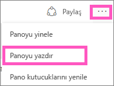
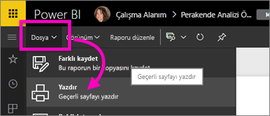

# Power BI hizmetinden yazdırma
Power BI hizmetinden bir panonun tamamını, pano kutucuğunu, rapor sayfasını veya rapor görselini yazdırın. Raporlar yalnızca sayfa sayfa yazdırılabilir; tek seferde raporun tamamını yazdıramazsınız.

> [!NOTE]
> Yazdırma özelliği yalnızca Power BI hizmetinde kullanılabilir ve Power BI Desktop ile kullanılamaz.
> 
> 

Amanda'nın panosundan ve raporundan yazdırma işlemi gerçekleştirmesini izleyin. Ardından kendiniz denemek için videonun altındaki adım adım yönergeleri uygulayın.

<iframe width="560" height="315" src="https://www.youtube.com/embed/jtlLGRKBvXY" frameborder="0" allowfullscreen></iframe>

## Pano yazdırma
1. Yazdırmak istediğiniz panoyu açın.
2. Sağ üst köşedeki üç nokta (...) simgesini seçin ve **Panoyu yazdır** seçeneğini belirleyin.
   
    
3. Tarayıcınızın Yazdır penceresi açılır. Ayarları ve yazdırma hedefini seçip **Yazdır** seçeneğini belirleyin.
   
   > [!NOTE]
   > Göreceğiniz yazdırma iletişim kutusu, kullandığınız tarayıcıya bağlıdır.
   > 
   > 
   
    

## Pano kutucuğu yazdırma
1. [Kutucuğu Odak modunda açmak için](service-focus-mode.md) üç nokta ve Odak simgesini seçin.
   
    
2. Kutucuğu [tam ekran modunda](service-fullscreen-mode.md) açmak için üst taraftaki gezinti çubuğundan tam ekran simgesini  seçin.
3. Seçenekler menüsünün gösterilmesi için kutucuğun üzerine gelin.
   
    
4. Yazdır simgesini  seçin.     
   
   > [!NOTE]
   > Göreceğiniz yazdırma iletişim kutusu, kullandığınız tarayıcıya göre değişir.
   > 
   > 

## Rapor sayfası yazdırma
Tek seferde yalnızca bir rapor sayfası yazdırılabilir.

1. Raporu Okuma Görünümü'nde veya Düzenleme Görünümü'nde açın.
2. Geçerli rapor sayfasını yazdırmak için **Dosya** > **Yazdır** seçeneğini belirleyin.
   
    
3. Tarayıcınızın Yazdır penceresi açılır.
   
   > [!NOTE]
   > Göreceğiniz yazdırma iletişim kutusu, kullandığınız tarayıcıya göre değişir.
   > 
   > 

## Rapor görseli yazdırma
1. [Görseli Odak modunda açmak için](service-focus-mode.md) kutucuğun üzerine gelin ve sağ üst köşeden Odak simgesini  seçin.
2. Yukarıdaki *Rapor sayfası yazdırma* bölümünde bulunan 2. ve 3. adımları uygulayın.

## Önemli noktalar ve sorun giderme
* S: **Yazdır** düğmesini bulamıyorum.    
* C: Power BI Desktop sürümünde yazdırma desteklenmez.  Yazdırma yalnızca Power BI hizmetinde çalışır.
* S: Tüm rapor sayfalarını tek seferde yazdıramıyorum.    
* C: Doğru. Rapor sayfaları yalnızca tek tek yazdırılabilir.
* S: PDF olarak yazdıramıyorum.    
* Y: Bu seçeneği yalnızca tarayıcınızda PDF sürücüsünü yapılandırmış olmanız halinde görürsünüz.    
* S: **Yazdır** seçeneğini belirlediğimde görüntülediğim ekran burada gösterilen ile aynı değil.    
* Y: Yazdır ekranları, tarayıcı ve yazılım sürümüne göre değişiklik gösterir.
* S: Çıktım doğru ölçeklendirilmemiş.  Panom sayfaya sığmıyor. Ölçeklendirme ve yönlendirme ile ilgili diğer sorular.    
* Y: Yazdırılan kopyanın, içeriğin Power BI hizmetinde göründüğü haliyle aynı olacağını garanti edemiyoruz. Ölçeklendirme, kenar boşlukları, görsel ayrıntıları, yönlendirme ve boyut gibi konular Power BI tarafından denetlenmez. Bu gibi sorunlarla ilgili yardım almak için, kullandığınız tarayıcıya yönelik belgelere göz atın.      

## Sonraki adımlar
[İş arkadaşlarınızla ve diğer kişilerle pano ve rapor paylaşma](service-share-dashboards.md)

Başka bir sorunuz mu var? [Power BI Topluluğu'na başvurun](http://community.powerbi.com/)

