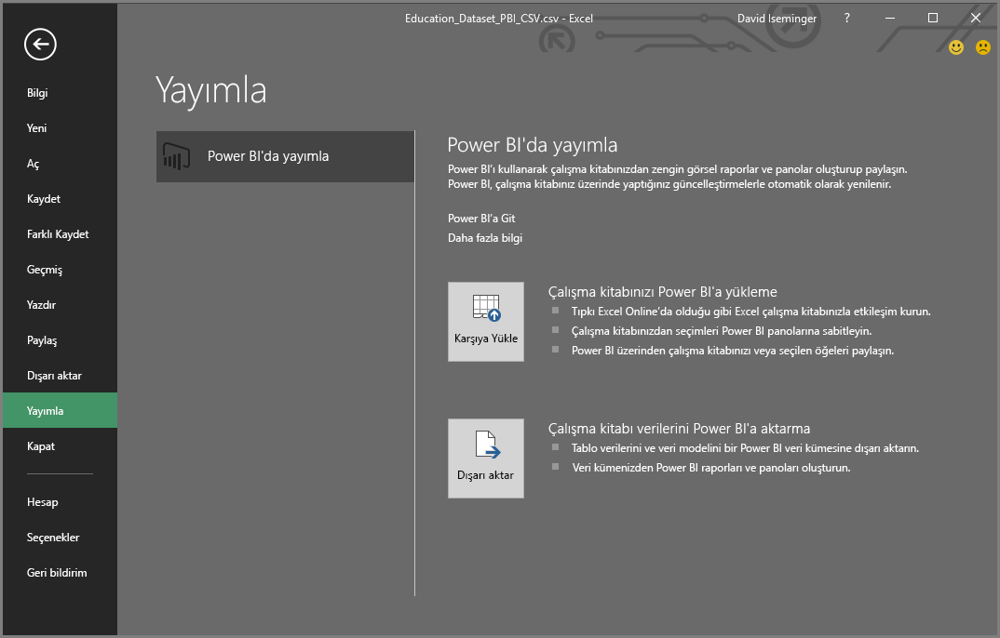
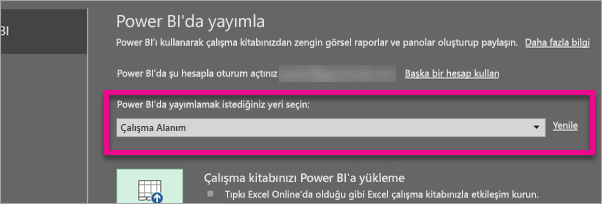
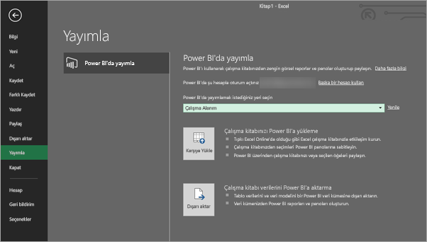
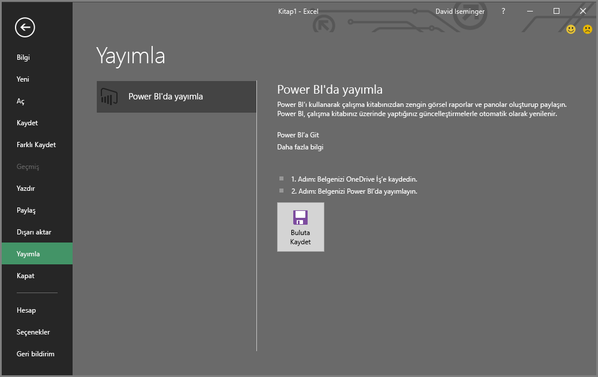
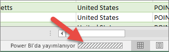

# Microsoft Excel’deki içeriği Power BI’da yayımlama
Excel 2016 veya üzeri bir sürümü kullanarak Excel çalışma kitaplarınızı, çalışma kitabı verilerine dayalı olarak son derece etkileşimli raporlar ve panolar oluşturabileceğiniz [Power BI](https://powerbi.microsoft.com) çalışma alanınızda doğrudan yayımlayabilirsiniz. Daha sonra öngörülerinizi, kuruluşunuzdaki diğer kişilerle paylaşabilirsiniz.

Power BI’da çalışma kitabı yayımlarken göz önünde bulundurmanız gereken birkaç nokta vardır:

* Office, OneDrive İş (buraya kaydedilen çalışma kitapları kullanılıyorsa) ve Power BI’da oturum açmak için kullandığınız hesap aynı olmalıdır.
* Power BI tarafından desteklenen herhangi bir içerik barındırmayan veya boş bir çalışma kitabını yayımlayamazsınız.
* Şifreli veya parola korumalı çalışma kitaplarını ya da Information Protection Management özellikli çalışma kitaplarını yayımlayamazsınız.
* Power BI'da içerik yayımlayabilmeniz için modern kimlik doğrulama etkinleştirilmiş (varsayılan) olmalıdır. Devre dışı bırakılırsa Dosya menüsündeki Yayımla seçeneği kullanılamaz.

## Excel çalışma kitabınızı yayımlama
Excel çalışma kitabınızı yayımlamak için Excel’de **Dosya** > **Yayımla**’yı seçip ardından **Karşıya Yükle** veya **Dışarı Aktar** seçeneğini belirleyin.

Çalışma kitabınızı Power BI’a **yüklerseniz** çalışma kitabınızla, Excel Online ile olduğu gibi etkileşim kurabilirsiniz. Ayrıca, çalışma kitabınızdaki seçimleri Power BI panolarına sabitleyebilir ve Power BI üzerinden çalışma kitabınızı veya seçili öğeleri paylaşabilirsiniz.

**Dışarı Aktar** seçeneğini belirlerseniz tablo verilerini ve veri modelini, daha sonra Power BI raporları ve panoları oluşturmak üzere bir Power BI veri kümesine dışarı aktarabilirsiniz.

### Yerel dosya yayımlama
Excel, yerel Excel dosyalarının yayımlanmasını destekler. Dosyaların OneDrive İş'e veya SharePoint Online'a kaydedilmesi gerekmez.

> [!IMPORTANT]
> Office 365 aboneliğiyle yerel dosyaları, yalnızca Excel 2016 (veya üzeri bir sürüm) kullanıyorsanız yayımlayabilirsiniz. Excel 2016 tek başına yüklemeleri, yalnızca çalışma kitabı OneDrive İş veya SharePoint Online’a kaydedildiğinde Power BI’a yayımlayabilir.
> 

**Yayımla**'yı seçtiğinizde, yayımlamak istediğiniz çalışma alanını seçebilirsiniz. Çalışma alanı aşağıdaki resimde gösterildiği gibi, erişiminiz olan kişisel çalışma alanınız veya bir grup çalışma alanı olabilir.

Çalışma kitabınızı Power BI’a aktarmak için iki seçenek vardır.

Yayımlandıktan sonra, yayımladığınız çalışma kitabı içeriği Power BI’a, yerel dosyadan ayrı bir şekilde içeri aktarılır. Dosyayı Power BI’da güncelleştirmek istiyorsanız güncelleştirilmiş sürümü yeniden yayımlamanız gerekir. Dilerseniz zamanlanmış yenileme yapılandırarak çalışma kitabında veya Power BI’daki veri kümesinde bulunan verileri yenileyebilirsiniz.

### Tek başına Excel yüklemesinden yayımlama
Tek başına Excel yüklemesinden yayımlarken, çalışma kitabının OneDrive İş’e kaydedilmesi gerekir. **Buluta Kaydet** seçeneğini belirleyin ve OneDrive İş’te bir konum seçin.

Çalışma kitabınız OneDrive'a kaydedildikten sonra **Yayımla** seçeneğini belirlediğinizde, çalışma kitabınızı Power BI’a aktarmaya yönelik iki seçenek görürsünüz: **Karşıya Yükle** veya **Dışarı Aktar**.

#### Çalışma kitabınızı Power BI'a yükleme
**Karşıya Yükle** seçeneğini belirlediğinizde çalışma kitabınız Power BI’da tıpkı Excel Online’da göründüğü gibi görünecektir. Ancak Excel Online’dan farklı olarak, öğeleri çalışma sayfalarınızdan panolara sabitlemenize olanak veren seçeneklere sahip olacaksınız.

Çalışma kitabınızı Power BI'da düzenleyemezsiniz. Veriler üzerinde bazı değişiklikler yapmanız gerekirse **Düzenle**’ye tıklayıp çalışma kitabınızı Excel Online’da düzenlemeyi veya bilgisayarınızdaki Excel’de açmayı tercih edebilirsiniz. Yaptığınız değişiklikler OneDrive İş’teki çalışma kitabına kaydedilir.

**Karşıya yüklediğinizde** Power BI’da herhangi bir veri kümesi oluşturulmaz. Çalışma kitabınız, çalışma alanı gezinti bölmesindeki Raporlar bölümünde görünür. Power BI'a yüklenen çalışma kitaplarında özel bir Excel simgesi bulunur. Bu simge, söz konusu çalışma kitaplarının karşıya yüklendiğini belirtir.

Yalnızca çalışma sayfalarında veri varsa veya Power BI’da görmek istediğiniz PivotTable’lar ve Grafikler söz konusuysa **Karşıya Yükle** seçeneğini belirleyin.

Excel’deki Power BI’a yayımla bölümünde bulunan Karşıya Yükle seçeneği, kullanım açısından tarayıcınızdaki Power BI hizmetinde yer alan **Veri Al > Dosyalar > OneDrive İş > Power BI üzerinde Excel’e Bağlanın, Yönetin ve Görüntüleyin** seçeneğine benzer bir deneyim sunar.

#### Çalışma kitabı verilerini Power BI'a aktarma
**Dışarı Aktar** seçeneğini belirlediğinizde tablo ve/veya veri modellerindeki desteklenen tüm veriler Power BI’da yeni bir veri kümesine aktarılır. Çalışma kitabınızdaki Power View sayfaları, Power BI’da rapor olarak yeniden oluşturulur.

Çalışma kitabınızı düzenlemeye devam edebilirsiniz. Değişiklikleriniz kaydedildikten sonra, genellikle yaklaşık bir saat içinde Power BI’daki veri kümesi ile eşitlenir. Daha hızlı güncelleştirmelere ihtiyacınız varsa Excel’den **Yayımla** seçeneğini belirleyip değişikliklerinizin anında dışarı aktarılmasını sağlayabilirsiniz. Raporlardaki ve panolardaki görselleştirmeleriniz de güncelleştirilir.

Verileri bir veri modeline yüklemek için Al ve Dönüştür veya Power Pivot özelliklerini kullandıysanız ya da çalışma kitabınız, Power BI'da görmek istediğiniz görselleştirmeler içeren Power View sayfaları içeriyorsa **Yayımla** seçeneğini belirleyin.

**Dışarı Aktar** seçeneğini kullanmak, tarayıcınızdaki Power BI’da yer alan **Veri Al > Dosya > OneDrive İş > Excel verilerini Power BI’a aktarın** adımlarını kullanmaya çok benzer.

## Yayımlama
Seçeneklerden birini belirlediğinizde Excel, geçerli hesabınızı kullanarak Power BI'da oturum açıp çalışma kitabınızı Power BI çalışma alanınızda yayımlar. Yayımla işleminin ilerlemesini görmek için, Excel’deki durum çubuğunu izleyebilirsiniz.

İşlem tamamlandığında, doğrudan Excel’den Power BI’a gidebilirsiniz.

## Sonraki adımlar
[Power BI'daki Excel verileri](service-excel-workbook-files.md)  
Başka bir sorunuz mu var? [Power BI Topluluğu'na başvurun](https://community.powerbi.com/)

