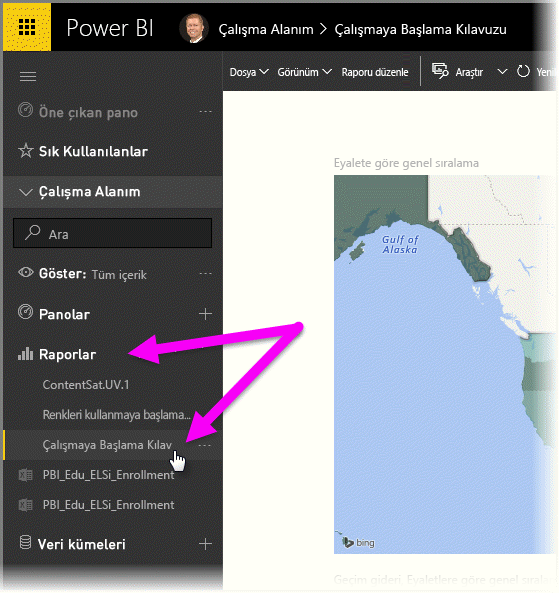
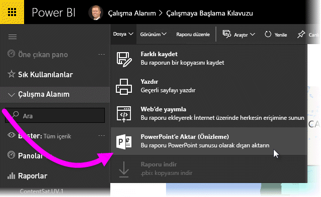
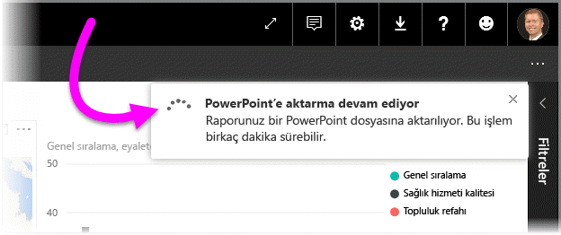
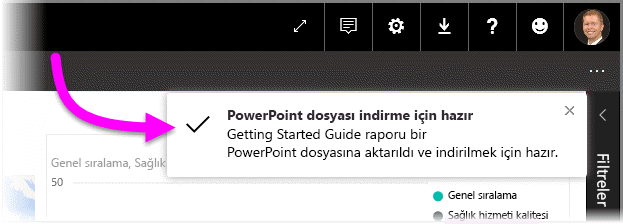
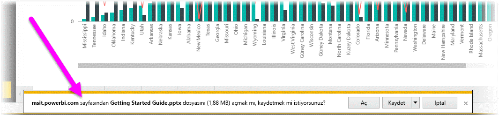
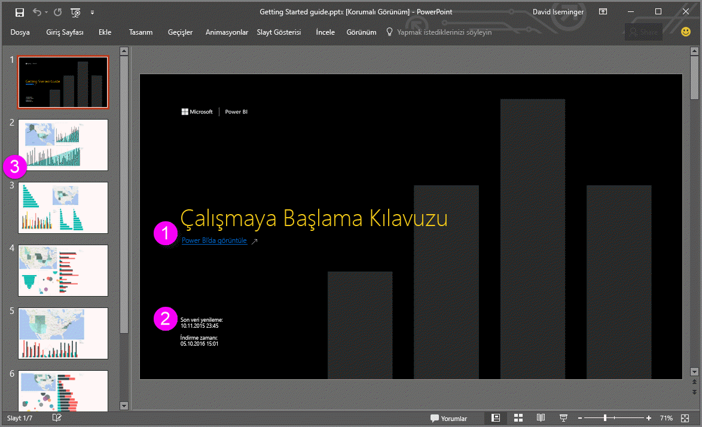
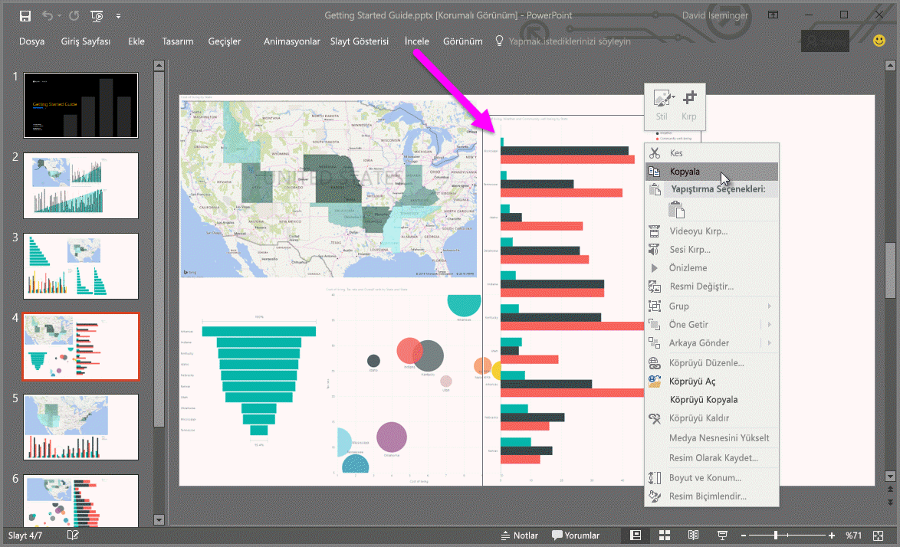

# Raporları Power BI'dan PowerPoint'e aktarma (Önizleme)
Power BI sayesinde artık raporunuzu **Microsoft PowerPoint**'te yayımlayabilir ve Power BI raporunuzu temel alan bir slayt destesini kolayca oluşturabilirsiniz. **PowerPoint'e aktardığınızda**, aşağıdakiler gerçekleşir:

* Power BI raporundaki her sayfa, PowerPoint'te tek bir slayt olur
* Power BI raporundaki her sayfa, PowerPoint'e yüksek çözünürlüklü tek bir görüntü olarak aktarılır
* Power BI raporundaki metin kutuları, PowerPoint'te düzenlenebilir metin kutuları olur
* PowerPoint'te Power BI raporuna bağlanan bir bağlantı oluşturulur

**Power BI raporunuzu** **PowerPoint**'e kolayca aktarabilirsiniz. Sonraki bölümde açıklanan adımları uygulamanız yeterlidir.

## Power BI raporunuzu PowerPoint'e aktarma
Power BI hizmetinde sol gezinti bölmesindeki **Raporlar** bölümünü seçerek bu bölümü genişletin, ardından tuval üzerinde görüntülemek için raporunuzu seçin. Ayrıca, bir raporu **Çalışma Alanım** veya **Sık Kullanılanlar** bölümünüzden (rapor bu konumlardan birinde bulunuyorsa) seçebilirsiniz.

PowerPoint'e aktarmak istediğiniz rapor tuvalde görüntülendiği zaman, aşağıdaki görüntüde gösterildiği gibi Power BI hizmetindeki menü çubuğunda **Dosya > PowerPoint'e aktar (Önizleme)** seçeneğini belirleyin.

Power BI hizmeti tarayıcı penceresinin sağ üst köşesinde, raporun PowerPoint'e aktarıldığını belirten bir bildirim başlığı görürsünüz. Bu işlem birkaç dakika sürebilir ve rapor dışarı aktarılırken Power BI'da çalışmaya devam edebilirsiniz.

İşlem tamamlandıktan sonra bildirim başlığı, Power BI hizmetinin dışarı aktarma işlemini tamamladığını belirtecek şekilde değişir.

Dosyanız artık, tarayıcınızın indirilen dosyaları görüntülediği konumda kullanılabilir. Aşağıdaki görüntüde, tarayıcı pencerenizin alt kısmında bulunan bir indirme başlığı olarak gösterilmektedir.

İşte bu kadar kolay. Dosyayı indirebilir, PowerPoint ile açabilir ve ardından herhangi bir PowerPoint destesi ile aynı şekilde dosyayı değiştirebilir veya geliştirebilirsiniz.

## Dışarı aktarılan PowerPoint dosyanızı kullanıma alma
Power BI'dan aktarılan PowerPoint dosyasını açtığınızda, ilgi çekici ve kullanışlı birkaç öğeyle karşılaşırsınız. Aşağıdaki görüntüye bir göz atın, ardından bu ilgi çekici özelliklerden bazılarının açıklandığı aşağıdaki numaralı öğeleri inceleyin.

1. Slayt destesinin ilk sayfasında raporunuzun adı, ayrıca slayt destesi için temel alınan raporu **Power BI'da Görüntülemenizi** sağlayan bir bağlantı bulunur.
2. Dışarı aktarılan rapor için temel alınan *son veri yenileme* ve Power BI raporunun bir PowerPoint dosyasına aktarıldığı tarih ve saat olan *indirme zamanı* tarihi ve saati gibi raporla ilgili bazı kullanışlı bilgiler de elde edersiniz.
3. Sol gezinti bölmesinde gösterildiği gibi her rapor sayfası ayrı bir slayttır.

Tek bir slayta gittiğinizde her rapor sayfasının bağımsız bir görüntü olduğunu fark edersiniz.

>[!NOTE]
> Yeni davranış doğrultusunda her rapor sayfası için bir görsel bulunur. Her görsel için bağımsız bir görüntünün sağlandığı eski davranış artık kullanılmamaktadır. 
 

Buradan sonra PowerPoint destenizle veya yüksek çözünürlüklü görüntülerden biriyle ne yapacağınız size kalmıştır!

## Sınırlamalar
**PowerPoint'e Aktar** özelliği ile çalışırken dikkat edilmesi gereken bazı önemli noktalar ve sınırlamalar vardır.

* **R görselleri** şu anda desteklenmemektedir. Bu türdeki tüm görseller, görselin desteklenmediğini belirten bir hata iletisi ile birlikte PowerPoint'e boş bir görüntü olarak aktarılır.
* **Sertifikalanmış** **özel görseller** desteklenir. Bir özel görseli nasıl sertifikalatacağınız dahil olmak üzere, sertifikalı özel görseller hakkında daha fazla bilgi için bkz. [getting a custom visual certified (Özel görselleri sertifikalatma)](power-bi-custom-visuals-certified.md). Sertifikalatılmamış özel görseller desteklenmez ve görselin desteklenmediğini belirten bir hata iletisi ile birlikte PowerPoint'e boş bir görüntü olarak aktarılır.
* **Sertifikalı özel görseller** desteklenir. Power BI'da kullanımı onaylanan sertifikalı özel görseller belirli kod gereksinimlerini karşılar ve katı güvenlik testlerinden geçmiştir. [**Sertifikalı özel görseller** hakkında daha fazla bilgi edinebilirsiniz](power-bi-custom-visuals-certified.md).
* 15'ten fazla rapor sayfası içeren raporlar şu anda dışarı aktarılamaz.
* Raporu PowerPoint'e aktarma işlemi birkaç dakika sürebilir, bu nedenle lütfen sabırlı olun. Raporun yapısı ve Power BI hizmeti üzerindeki geçerli yük gibi etmenler gereken zamanı etkileyebilir.
* Power BI hizmetinde **PowerPoint'e aktar (Önizleme)** menü öğesi kullanılamıyorsa bunun nedeni büyük olasılıkla kiracı yöneticisinin özelliği devre dışı bırakmış olmasıdır. Ayrıntılar için lütfen kiracı yöneticinizle iletişime geçin.
* Arka plan görüntüleri grafiğin sınırlayıcı alanına göre kırpılır. Arka plan görüntülerini PowerPoint'e aktarmadan önce arka plan görüntülerini kaldırmak kesinlikle önerilir.
* Vurgulama ve filtreleme, detaya gitme vb. gibi **oturum içi etkileşim** özellikleri, PowerPoint'e aktarma işlemi için henüz desteklenmiyor. Dışarı aktarılan PowerPoint, özgün görselleri raporda kaydedilen şekilde gösterir.
* PowerPoint sayfaları, Power BI raporundaki özgün sayfa büyüklüklerinden veya boyutlarından bağımsız olarak her zaman standart 9:16 boyutunda oluşturulur.
* Power BI kiracı etki alanınızın dışındaki bir kullanıcıya ait raporlar (örneğin, kuruluşunuzun dışındaki birine ait olan ve sizinle paylaşılan raporlar) PowerPoint'te yayımlanamaz.
* Bir panoyu kuruluşunuzun dışındaki biriyle (yani Power BI kiracınızda bulunmayan bir kullanıcıyla) paylaştığınızda bu kullanıcı, paylaşılan panonun ilişkili raporlarını PowerPoint'e aktaramaz. Örneğin, siz aaron@contoso.com iseniz david@cohowinery.com ile paylaşımda bulunabilirsiniz. Ancak, david@cohowinery.com ilişkili raporları PowerPoint'e aktaramaz.
* Daha önce belirtildiği gibi, her rapor sayfası PowerPoint dosyasına tek bir görüntü olarak aktarılır. 

## Sonraki adımlar
[Excel'de Çözümle](service-analyze-in-excel.md)

[Excel data in Power BI (Power BI'daki Excel verileri)](service-excel-workbook-files.md)

[Getting a custom visual certified (Özel görselleri sertifikalatma)](power-bi-custom-visuals-certified.md)

