# Power BI'dan Web'de yayımlama

Power BI'daki **Web'de yayımla** özelliği sayesinde etkileşimli Power BI görselleştirmelerini blog gönderileri, web siteleri, e-postalar veya sosyal medya üzerinden dilediğiniz cihazda görüntülemek üzere çevrimiçi ortamlara ekleyebilirsiniz.

Ayrıca yayımladığınız görselleri kolayca düzenleyebilir, güncelleştirebilir, yenileyebilir veya paylaşımdan kaldırabilirsiniz.

> [!WARNING]
> **Web'de yayımla** işlevini kullanarak yayımladığınız rapor veya görseller, İnternet üzerindeki herkes tarafından görüntülenebilir. Bu raporları görüntülemek için herhangi bir kimlik doğrulaması kullanılmaz. Web'de yayımla özelliğini yalnızca İnternet üzerindeki herkesin (kimliği doğrulanmamış genel kullanıcılar) görmesi için uygun olan raporlar ve veriler için kullanın. Buna raporlarınızda toplam şeklinde gösterilen ayrıntı düzeyindeki veriler de dahildir. Bu raporu yayımlamadan önce verileri ve görselleştirmeleri herkesle paylaşma izniniz olduğundan emin olun. Gizli veya özel bilgileri yayımlamayın. Bu konuda şüpheleriniz varsa yayımlamadan önce kuruluşunuzun ilkelerini inceleyin.

## Web'de yayımla özelliğini kullanma

**Web'de yayımla** özelliğini, kişisel veya grup çalışma alanlarında bulunan ve düzenleme izinlerine sahip olduğunuz raporlarda kullanabilirsiniz.  Web'de yayımla özelliğini sizinle paylaşılan raporlarda veya verilerin güvenliğini satır düzeyi güvenlik ile sağlayan raporlarda kullanamazsınız. Web'de yayımla özelliğinin desteklenmediği tüm durumların listesi için aşağıdaki **Sınırlamalar** bölümüne bakın. Lütfen Web'de yayımla özelliğini kullanmadan önce bu makalenin üst kısmındaki **Uyarı** bölümünü inceleyin.

Bu özelliğin nasıl çalıştığını görmek için aşağıdaki *kısa videoyu* izleyebilirsiniz. Ardından, adımları takip ederek kendiniz yapmayı deneyebilirsiniz.

<iframe width="560" height="315" src="https://www.youtube.com/embed/UF9QtqE7s4Y" frameborder="0" allowfullscreen></iframe>

Aşağıdaki adımlar **Web'de yayımla** özelliğinin nasıl kullanılacağını açıklamaktadır.

1. Çalışma alanınızda bulunan ve düzenleme yetkisine sahip olduğunuz bir raporda **Dosya > Web'de yayımla**'yı seçin.
   
   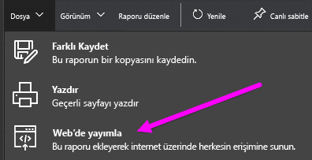

2. İletişim kutusundaki içeriği gözden geçirin ve aşağıdaki iletişim kutusunda gösterildiği şekilde **Ekleme kodu oluştur**'u seçin.
   
   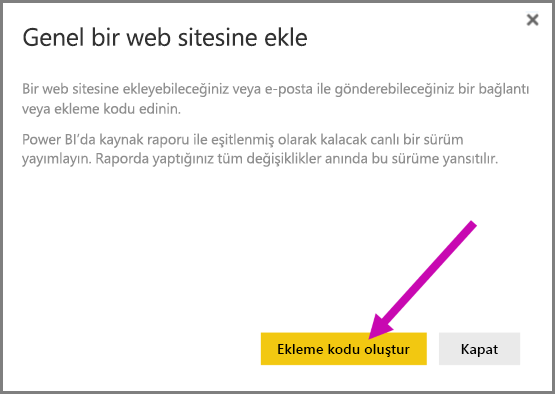

3. Sonraki iletişim kutusunda gösterilen uyarıyı gözden geçirin ve verilerin genel bir web sitesine eklenmeye uygun olduğunu onaylayın. Uygunsa **Yayımla**'yı seçin.
   
   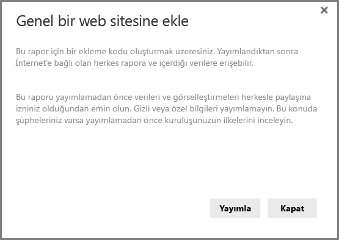

4. Sonraki iletişim kutusunda verilen bağlantıyı e-posta ile gönderebilir, kod içine ekleyebilir (iFrame gibi) veya doğrudan web ya da blog sayfanıza yapıştırabilirsiniz.
   
   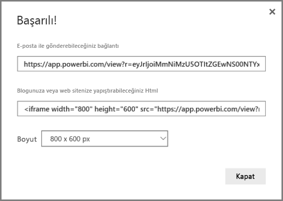

5. Rapor için önceden bir ekleme kodu oluşturduysanız ekleme kodu hemen görünür. Her rapor için yalnızca bir ekleme kodu oluşturabilirsiniz.
   
   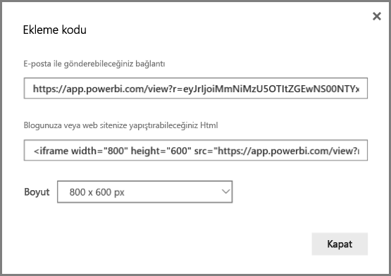

## Görüntüleme modlarına ilişkin ipuçları ve püf noktaları

İçeriği bir blog gönderisine eklediğinizde genelde belirli bir ekran boyutuna sığdırmanız gerekir.  iFrame etiketindeki yükseklik ve genişlik ayarlarını da istediğiniz şekilde düzenleyebilirsiniz ancak raporunuzun iFrame içindeki alana sığdığından da emin olmanız gerekir. Bu nedenle, raporu düzenlerken uygun Görünüm Modunu ayarlamanız gerekir.

Aşağıdaki tabloda Görünüm Modu ve raporun eklendiği zaman nasıl görüneceği hakkında bilgiler verilmiştir.

| Görünüm Modu | Eklendiğinde nasıl görüneceği |
| --- | --- |
|  |**Sayfaya sığdır**, raporunuzun yüksekliğini ve genişliğini dikkate alır. Sayfanızı 16:9 veya 4:3 gibi "Dinamik" oranlara ayarladıysanız içeriğiniz belirlediğiniz iFrame içine sığacak şekilde ölçeklendirilir. **Sayfaya sığdır** ayarını kullanan raporlar bir iFrame'e eklendiğinde **sinemaskop** etkisine maruz kalabilir. Bu durumda içerik iFrame içine sığacak şekilde ölçeklendirildikten sonra iFrame alanında gri renkli arka plan gösterilir. Bu etkiyi en aza indirmek için iFrame yükseklik/genişlik ayarını uygun şekilde değiştirin. |
|  |**Gerçek boyut**, raporunuzun rapor sayfasındaki boyutunu korumasını sağlar. Bunun sonucunda iFrame içinde kaydırma çubukları görüntülenebilir. Kaydırma çubuklarının gösterilmemesi için iFrame yükseklik ve genişlik ayarını değiştirin. |
|  |**Genişliğe uydur**, içeriğin iFrame içindeki yatay alana uydurulmasını sağlar. Kenarlık gösterilmeye devam eder ancak içerik yatay boşluğun tamamını kullanacak şekilde ölçeklendirilir. |

## iFrame yükseklik ve genişlik ayarlarıyla ilgili ipuçları ve püf noktaları

Web'de yayımla özelliğini kullanarak elde ettiğiniz ekleme kodu aşağıdakine benzer olacaktır:

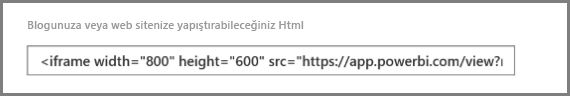

Genişlik ve yükseklik değerlerini el ile değiştirerek eklediğiniz sayfada nasıl görüneceğini tam olarak belirleyebilirsiniz.

Daha iyi bir yerleşim sağlamak için iFrame'in yükseklik değerine 56 piksel ekleyebilirsiniz. Bu değer, alt çubuğun geçerli boyutunu karşılar. Rapor sayfanızda Dinamik boyut kullanılıyorsa aşağıdaki tabloda verilen değerleri kullanarak sinemaskop etkisine maruz kalmadan düzgün bir yerleşim sağlayabilirsiniz.

| Oran | Boyut | Boyut (Genişlik x Yükseklik) |
| --- | --- | --- |
| 16:9 |Küçük |640 x 416 piksel |
| 16:9 |Orta |800 x 506 piksel |
| 16:9 |Büyük |960 x 596 piksel |
| 4:3 |Küçük |640 x 536 piksel |
| 4:3 |Orta |800 x 656 piksel |
| 4:3 |Büyük |960 x 776 piksel |

## Ekleme kodlarını yönetme

**Web'de yayımla** özelliğini kullanarak oluşturduğunuz ekleme kodlarını Power BI hizmetinin **Ayarlar** menüsünden yönetebilirsiniz. Ekleme kodlarını yöneterek belirli bir kodun içindeki hedef görseli veya raporu kaldırabilir (ekleme kodunu geçersiz kılabilir) veya ekleme kodunu tekrar alabilirsiniz.

1. **Web'de yayımla** özelliğiyle oluşturduğunuz ekleme kodlarını yönetmek için **Ayarlar** menüsünü açıp **Ekleme kodlarını yönet**'i seçin.
   
   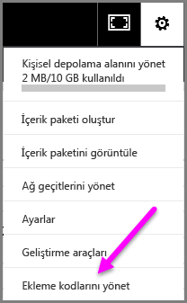

2. Aşağıdaki resimde olduğu gibi oluşturmuş olduğunuz ekleme kodlarının listesi açılır.
   
   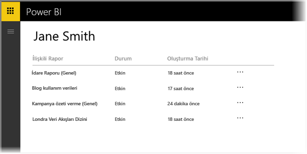

3. Listedeki her **Web'de yayımla** ekleme kodu girişi için ekleme kodunu alabilir veya ekleme kodunu silebilirsiniz. Bu durumda, ilgili rapor veya görsel bağlantıları artık çalışmaz.
   
   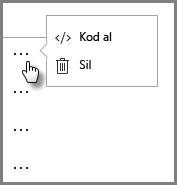

4. **Sil**'i seçerseniz ekleme kodunu silmek istediğinizden emin olup olmadığınız sorulur.
   
   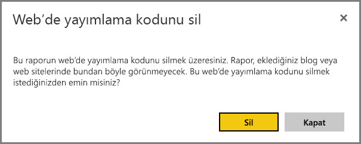

## Raporları güncelleştirme ve veri yenileme

**Web'de yayımla** ekleme kodunuzu oluşturup paylaştıktan sonra yaptığınız değişiklikler rapora yansıtılır. Ancak, yaptığınız güncelleştirmelerin kullanıcılarınız tarafından görünmesinin zaman alacağını lütfen unutmayın. Raporlarda yapılan güncelleştirmelerin Web'de yayımla ekleme kodlarına yansıtılması bir saate kadar sürebilir.

**Web'de yayımla** özelliğini kullanarak bir ekleme kodu aldığınızda ilgili ekleme kodu bağlantısı hemen etkin hale gelir ve bağlantıyı kullanan herkes ilgili içeriği görüntüleyebilir.  İlk Web'de yayımla eyleminden sonra, Web'de yayımla bağlantısının ilgili olduğu raporlarda veya görsellerde yapılan güncelleştirmelerin kullanıcılarınıza iletilmesi yaklaşık bir saate kadar sürebilir.

Daha fazla bilgi edinmek için bu makalenin ilerleyen bölümlerinde bulunan **Nasıl çalışır?** bölümünü inceleyin. Güncelleştirmelerin hemen kullanılabilir hale gelmesini istiyorsanız ekleme kodunu silip yeni bir kod oluşturabilirsiniz.

## Veri yenileme

Veri yenileme işlemleri eklediğiniz raporlara veya görsellere otomatik olarak yansıtılır. Yenilenen verilerin ekleme kodlarından görünür hale gelmesi yaklaşık 1 saat sürebilir. Rapor tarafından kullanılan veri kümesinin zamanlamasındaki **yenileme** seçeneğini belirleyerek otomatik yenilemeyi devre dışı bırakabilirsiniz.  

## Özel görseller

Özel görseller **Web'de yayımla** işlevinde desteklenmektedir. Web'de yayımla özelliğini kullandığınızda yayımladığınız görseli paylaştığınız kullanıcıların raporu görüntülemek için özel görselleri etkinleştirmesine gerek yoktur.

## Sınırlamalar

**Web’de yayımla** özelliği Power BI hizmetindeki veri kaynaklarının ve raporların çoğu için desteklenmektedir ancak aşağıdaki öğeler **şu anda Web’de yayımla işlevinde desteklenmez ve kullanılamaz**:

1. Satır düzeyi güvenlik kullanan raporlar.
2. Azure Analysis Services, Analysis Services - Çok Boyutlu ve şirket içi ortamda barındırılan Analysis Services - Tablo da dahil olmak üzere herhangi bir Canlı Bağlantı veri kaynağını kullanan raporlar.
3. Doğrudan veya bir kuruluş içerik paketi aracılığıyla sizinle paylaşılmış olan raporlar.
4. Düzenleme yetkisine sahip bir üye olmadığınız gruplardaki raporlar.
5. "R" Görselleri şu an için Web'de yayımla özelliği tarafından desteklenmemektedir.
6. Web’de yayımlanan bir rapordaki görsellerden Verileri dışarı aktarma
7. ArcGIS Maps for Power BI görselleri
8. [Gizli veya özel bilgilerin güvenliğini sağlama](#publish-to-web-from-power-bi)

## Kiracı ayarı

Power BI yöneticileri web'de yayımlama özelliğini etkinleştirebilir veya devre dışı bırakabilir. Ayrıca belirli gruplara erişimi de kısıtlayabilirler. Ekleme kodu oluşturup oluşturamayacağınız bu ayara göre belirlenir.

|Öne çıkan özelliği |Tüm kuruluş için etkindir |Tüm kuruluş için devre dışıdır |Belirli güvenlik grupları   |
|---------|---------|---------|---------|
|Rapora ilişkin **Dosya** menüsündeki **Web'de yayımla** seçeneği.|Tüm kullanıcılar için etkindir|Hiçbir kullanıcı için görünmez|Yalnızca yetkili kullanıcılar veya gruplar için görünür.|
|**Ayarlar** bölümündeki **Ekleme kodlarını yönet** seçeneği|Tüm kullanıcılar için etkindir|Tüm kullanıcılar için etkindir|Tüm kullanıcılar için etkindir  * **Sil** seçeneği yalnızca yetkili kullanıcılar veya gruplar için görünür. * **Kod al** seçeneği tüm kullanıcılar için etkindir.|
|Yönetici portalındaki **Ekleme kodları** seçeneği|Durum olarak şunlardan biri görüntülenir: * Etkin * Desteklenmiyor * Engellendi|Durum olarak **Devre dışı** görüntülenir|Durum olarak şunlardan biri görüntülenir: * Etkin * Desteklenmiyor * Engellendi  Bir kullanıcı, kiracı ayarına göre yetkilendirilmemişse durum, **İhlal edildi** olarak görüntülenir.|
|Mevcut yayımlanmış raporlar|Tümü etkindir|Tümü devre dışıdır|Raporlar tüm kullanıcılar için görünür olmaya devam eder.|

## Ekleme kodu durum sütununu anlama

**Web'de yayımla** ekleme kodlarınızın bulunduğu **Ekleme kodlarını yönet** sayfasını görüntülediğinizde bir durum sütunu olduğunu görürsünüz. Ekleme kodları varsayılan olarak etkindir ancak aşağıda listelenmiş olan durumlarla karşılaşabilirsiniz.

| Durum | Açıklama |
| --- | --- |
| **Etkin** |Rapor İnternet kullanıcıları tarafından görüntülenebilir ve raporla etkileşim kurulabilir. |
| **Engellendi** |Rapor içeriği [Power BI Hizmet Kullanım Koşulları](https://powerbi.microsoft.com/terms-of-service)'nı ihlal ediyor. Microsoft tarafından engellendi. İçeriğin bir hata sonucu engellendiğini düşünüyorsanız desteğe başvurun. |
| **Desteklenmiyor** |Raporun veri kümesi satır düzeyi güvenlik veya desteklenmeyen başka bir yapılandırma kullanıyor. Listenin tamamı için **Sınırlamalar** bölümüne bakın. |
| **İhlal edildi** |Ekleme kodu, tanımlanmış kiracı ilkesi kapsamının dışındadır. Bu genellikle, bir ekleme kodu oluşturulduktan sonra kiracıdaki web'de yayımlama ayarının, ekleme koduna sahip kullanıcı dışlanacak şekilde değiştirilmesiyle ortaya çıkar. Kiracı ayarı devre dışıysa veya kullanıcının artık ekleme kodu oluşturmasına izin verilmiyorsa mevcut ekleme kodları **İhlal edildi** durumunda görüntülenir. |

## Web'de yayımla içeriğiyle ilgili sorunları bildirme

Bir web sitesine eklenmiş olan **Web'de yayımla** içeriğiyle ilgili bir sorunu bildirmek için aşağıdaki resimde gösterilen şekilde alt çubuktaki **Bayrak** simgesini kullanın. Microsoft'a sorunu açıklayan bir e-posta göndermeniz istenir. Microsoft, içeriği Power BI Hizmet Kullanım Koşulları çerçevesinde değerlendirerek gerekli eylemi gerçekleştirecektir.

Sorun bildirmek için gördüğünüz Web'de yayımla raporunun alt çubuğundaki **bayrak** simgesini seçin.

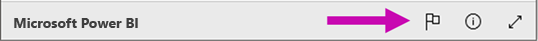

## Lisanslama ve Fiyatlandırma

**Web'de yayımla** özelliğini kullanabilmek için Microsoft Power BI kullanıcısı olmanız gerekir. Raporunuzu kullanan kişilerin (okuyucular, görüntüleyenler) Power BI kullanıcısı olması gerekmez.

## Nasıl çalışır? (teknik bilgiler)

**Web'de yayımla** özelliğini kullanarak bir ekleme kodu oluşturduğunuzda rapor, İnternet üzerindeki kullanıcılara açık hale gelir. Rapor herkese açık olduğundan görüntüleyenler, ilerleyen zamanlarda sosyal medya üzerinden kolayca paylaşabilir. Kullanıcılar genel URL'yi doğrudan açarak veya bir web sayfasında ya da blogda eklenmiş biçimde raporu görüntüledikçe Power BI, rapor tanımını ve raporu görüntülemek için gerekli olan sorguların sonuçlarını önbelleğe alır. Bu yaklaşım sayesinde rapor binlerce kullanıcı tarafından aynı anda görüntülenebilir ve herhangi bir performans kaybı yaşanmaz.

Önbellek uzun ömürlü olduğundan rapor tanımını güncelleştirmeniz (Görünüm modunu değiştirme gibi) durumunda veya rapor verilerini yenilediğinizde değişikliklerin, raporun kullanıcılar tarafından kullanılan sürümüne uygulanması yaklaşık bir saat sürebilir. Bu nedenle çalışmanızı önceden planlayıp **Web'de yayımla** ekleme kodunu ancak gerekli ayarları tamamladıktan sonra oluşturmanız önerilir.

Başka bir sorunuz mu var? [Power BI Topluluğu'na başvurun](http://community.powerbi.com/)
