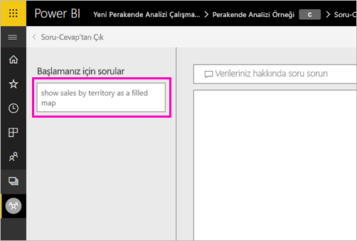
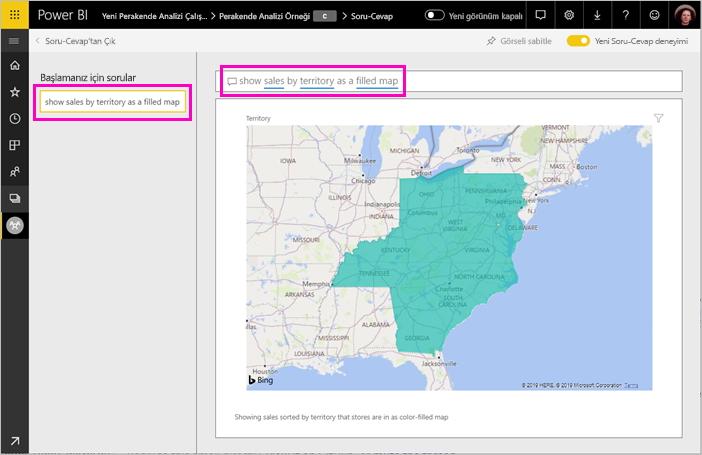

# Power BI Soru-Cevap için öne çıkan sorular oluşturma
Bir veri kümeniz varsa kendi öne çıkan sorularınızı bu veri kümesine ekleyebilirsiniz. Power BI soru- cevap bu soruları, veri kümesini temel alan raporlar kullanmasını iş arkadaşlarınıza gösterir.  Öne çıkan sorular, iş arkadaşlarınıza bir veri kümesi ile ilgili sorabilecekleri soru türleri hakkında fikirler verir. Ne tür öne çıkan sorular ekleyeceğiniz size bağlıdır; sık kullanılan sorular, ilgi çekici sonuçlar görüntüleyen sorular veya uygun şekilde ifade etmesi zor olabilecek sorular sorabilirsiniz.

> [!NOTE]
> Soru- cevap öne çıkan sorular kullanılmak üzere kullanılabilir [iPad, iPhone ve iPod Touch cihazlarıyla iOS için Microsoft Power BI uygulamasında](consumer/mobile/mobile-apps-ios-qna.md) ve Power BI Desktop soru- cevap Soru oluşturma yalnızca Power BI hizmetinde (app.powerbi.com) kullanılabilir.
> 

## Öne çıkan soru oluşturma

Bu makalede [Perakende Analizi örneği](sample-datasets.md) kullanılacaktır. Kendiniz bir veri kümesini Keşfetmenin denemek için bu adım adım yönergeleri izleyin.

1. Panoda Soru-Cevap soru kutusunu seçin.   Soru-Cevap bölümünde, veri kümesinde görünen terimlerin yer aldığı faydalı bir listenin görüntülendiğini fark edersiniz.
2. Bu listeye eklemek için Power BI'ın sağ üst köşedeki dişli simgesini seçin.  
   
3. **Ayarlar** &gt; **Veri kümeleri** &gt; **Retail Analysis Sample** &gt; **Öne Çıkan Soru-Cevap soruları** seçeneğini belirleyin.  
4. **Soru ekle**'yi seçin.
   
   
5. Sorunuzu metin kutusuna yazdıktan sonra **Uygula**'yı seçin.   İsteğe bağlı olarak **Soru ekle**'yi seçip başka bir soru daha ekleyebilirsiniz.  
   
6. Power BI Retail Analysis Sample panosuna geri gidin ve imlecinizi Soru-Cevap soru kutusuna yerleştirin.   
   
7. Yeni eklenen **Sales by territory as a map** (Harita olarak bölgeye göre satışlar) öne çıkan sorusunun ilk sırada olduğunu görürsünüz. Bu soruyu seçin.  
8. Cevap bir doldurulmuş harita görselleştirmesi olarak görüntülenir.  
   

## Sonraki adımlar

- [Tüketiciler için soru- cevap](consumer/end-user-q-and-a.md)  
- [Pano ve raporlarda soru- cevap kullanma](power-bi-tutorial-q-and-a.md)  
- [Power BI - Temel Kavramlar](consumer/end-user-basic-concepts.md)  

Başka bir sorunuz mu var? [Power BI Topluluğu'na başvurun](http://community.powerbi.com/)

