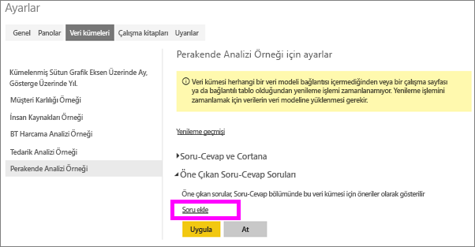
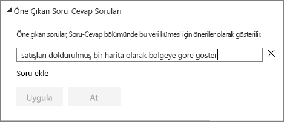
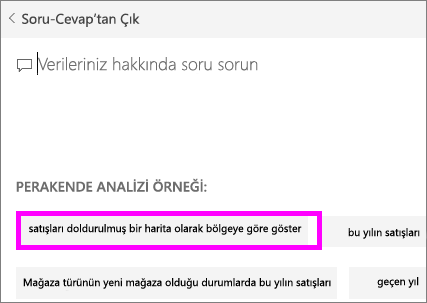
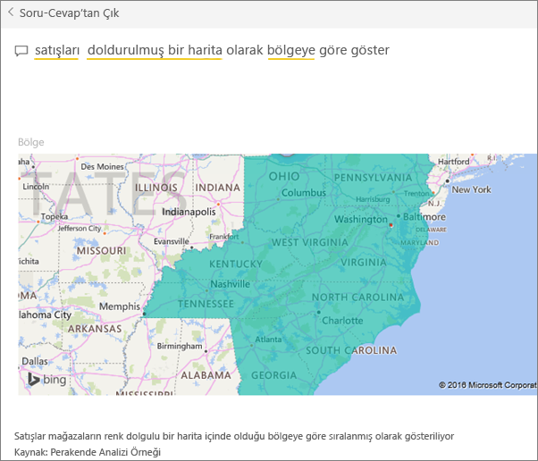

# Power BI Soru-Cevap için öne çıkan sorular oluşturma
Bir veri kümeniz varsa kendi öne çıkan sorularınızı bu veri kümesine ekleyebilirsiniz.  Böylece Power BI Soru-Cevap bu soruları, veri kümenizi kullanan iş arkadaşlarınıza gösterir.  Öne çıkan sorular, iş arkadaşlarınıza bir veri kümesi ile ilgili sorabilecekleri soru türleri hakkında fikirler verir. Ne tür öne çıkan sorular ekleyeceğiniz size bağlıdır; sık kullanılan sorular, ilgi çekici sonuçlar görüntüleyen sorular veya uygun şekilde ifade etmesi zor olabilecek sorular sorabilirsiniz.

Will'in Power BI Soru-Cevap bölümünde bazı öne çıkan sorular sorduğu ve veri kümesini araştırmak için bu öne çıkan soruları kullandığı videoyu izleyin. Ardından kendiniz denemek için videonun altındaki adım adım yönergeleri uygulayın.

<iframe width="560" height="315" src="https://www.youtube.com/embed/E1mIAyEXuF4" frameborder="0" allowfullscreen></iframe>

> [!NOTE]
> Soru-Cevap öne çıkan soruları, [iPad, iPhone ve iPod touch cihazlarında iOS için Microsoft Power BI uygulamasında](mobile-apps-ios-qna.md) da kullanılabilir.
> 
> 

Bu makalede [Perakende Analizi örneği](sample-datasets.md) kullanılacaktır.

1. Soru-Cevap soru kutusunu seçin.   Soru-Cevap bölümünde, veri kümesinde görünen terimlerin yer aldığı faydalı bir listenin görüntülendiğini fark edersiniz.
2. Bu listeye ekleme yapmak için PowerBI'ın sağ üst köşesindeki dişli simgesini seçin.  
   
3. **Ayarlar** &gt; **Veri kümeleri** &gt; **Retail Analysis Sample** &gt; **Öne Çıkan Soru-Cevap soruları** seçeneğini belirleyin.  
4. **Soru ekle**'yi seçin.
   
   
5. Sorunuzu metin kutusuna yazdıktan sonra **Uygula**'yı seçin.   İsteğe bağlı olarak **Soru ekle**'yi seçip başka bir soru daha ekleyebilirsiniz.  
   
6. Power BI Retail Analysis Sample panosuna geri gidin ve imlecinizi Soru-Cevap soru kutusuna yerleştirin.   
   
7. Yeni eklenen **Sales by territory as a map** (Harita olarak bölgeye göre satışlar) öne çıkan sorusunun ilk sırada olduğunu görürsünüz. Bu soruyu seçin.  
8. Cevap bir doldurulmuş harita görselleştirmesi olarak görüntülenir.  
   

### Sonraki adımlar
[Power BI'daki Soru-Cevap](service-q-and-a.md)  
[Eğitim: Power BI Soru-Cevap'a Giriş](power-bi-visualization-introduction-to-q-and-a.md)  
[Power BI - Temel Kavramlar](service-basic-concepts.md)  
Başka bir sorunuz mu var? [Power BI Topluluğu'na başvurun](http://community.powerbi.com/)

