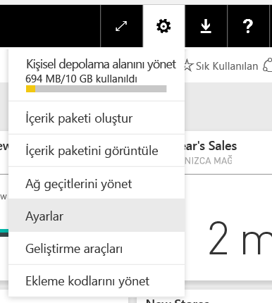
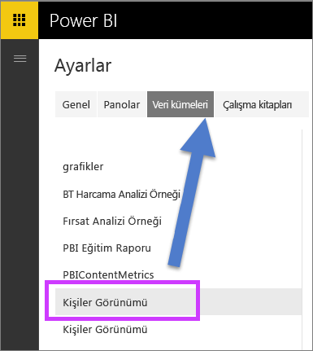
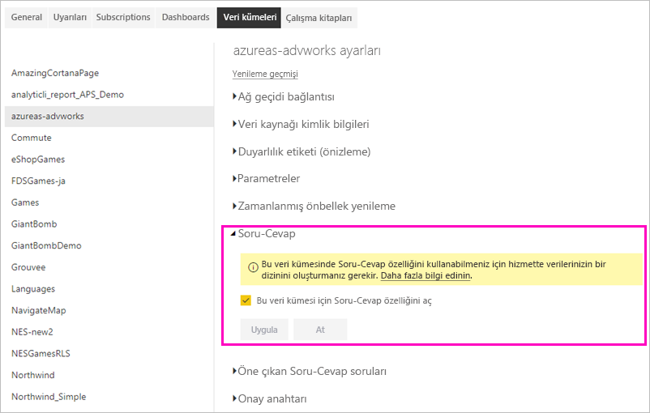

# Power BI'da canlı bağlantılar için Soru-Cevap özelliğini etkinleştirme
## Şirket içi veri ağ geçidi nedir?  Canlı bağlantı nedir?
Power BI'daki veri kümelerini Power BI'a aktarılabilir veya bunlarla canlı bağlantı kurabilirsiniz. Canlı bağlantı veri kümeleri genellikle "şirket içi" olarak anılır. Canlı bağlantılar bir [ağ geçidi](service-gateway-onprem.md) kullanılarak yönetilir, canlı sorgular kullanılarak veriler ve sorgular gönderilip alınır.

## Şirket içi veri ağ geçidi veri kümeleri için Soru-Cevap
Bir ağ geçidi üzerinden eriştiğiniz veri kümeleriyle Soru-Cevap özelliğini kullanmak istiyorsanız önce bunları etkinleştirmeniz gerekir.

Bunlar etkinleştirildikten sonra Power BI, veri kaynağınızın bir dizinini oluşturur ve bu verilerin bir alt kümesini Power BI'a yükleyerek, soru sorulmasına olanak tanır. İlk dizinin oluşturulması birkaç dakika sürebilir. Power BI, dizini korur ve verileriniz değiştikçe otomatik olarak güncelleştirir. Soru-Cevap özelliğinin bu veri kümeleriyle kullanımı Power BI'da yayımlanan verilerle aynı şekilde davranış gösterir. Soru-Cevap deneyiminde kullanılabilen özelliklerin tamamı her iki durumda da desteklenir.

Siz Power BI'da soru sordukça Soru-Cevap, veri kümenizin bir dizinini kullanarak, sorunuzun yanıtlanması için oluşturulacak en iyi görseli ve kullanılacak rapor sayfasını belirler. Olası en iyi yanıtı belirledikten sonra Soru-Cevap, grafikleri ve grafları doldurmak için ağ geçidi aracılığıyla veri kaynağından canlı veriler getirmek üzere DirectQuery'yi kullanır. Sonuç olarak, her koşulda Power BI Soru-Cevap doğrudan, temel alınan veri kaynağındaki en güncel verileri gösterir.

Power BI Soru-Cevap özelliği yanıtlar için temel alınan modelin nasıl sorgulanacağını belirlemek üzere veri kaynağınızdaki metin ve şema değerlerini kullandığından, yeni veya silinen belirli metin değerleri için yapılan aramalar (örneğin, yeni eklenen bir metin kaydındaki bir müşteri adını sorma), en son değerlerle güncelleştirilen dizinden yararlanır. Power BI, değişiklikleri 60 dakikalık bir zaman penceresinde değerlendirerek, metin ve şema dizinini otomatik olarak güncel tutar.

Daha fazla bilgi için bkz.

* [Şirket içi veri ağ geçidi](service-gateway-onprem.md) nedir?
* [Tüketiciler için Power BI Soru-Cevap](consumer/end-user-q-and-a.md)

## Soru-Cevap özelliğini etkinleştirme
Veri ağ geçidini ayarladıktan sonra Power BI'dan verilerinize bağlanın.  Şirket içi verilerinizi kullanarak bir pano oluşturun veya şirket içi verilerin kullanıldığı bir .pbix dosyasını karşıya yükleyin.  Sizinle paylaşılan panolarda, raporlarda ve veri kümelerinde zaten şirket içi verileriniz olabilir.

1. Power BI hizmetinin sağ üst köşesinde bulunan dişli simgesini  ve **Ayarlar**’ı seçin.
   
   
2. **Veri kümeleri**'ni seçin ve Soru-Cevap için etkinleştirilecek veri kümesini belirleyin.
   
   
3. **Soru-Cevap**’ı genişletin, **Bu veri kümesi için Soru-Cevap özelliğini aç** onay kutusunu işaretleyip **Uygula**'yı seçin.
   
    

## Hangi veriler önbelleğe alınır ve gizlilik nasıl korunur?
Şirket içi verileriniz için Soru-Cevap özelliğini etkinleştirdiğinizde verilerinizin bir alt kümesi hizmette önbelleğe alınır. Bu önbelleğe alma işlemi, Soru-Cevap özelliğinin makul bir performansla çalışmasını sağlamak için yapılır. Power BI, önbelleğe alma işlemine 24 karakterden daha uzun değerleri dahil etmez. **Bu veri kümesi için Soru-Cevap özelliğini aç** seçeneğinin işaretini kaldırarak Soru-Cevap özelliğini devre dışı bırakmanız veya veri kümenizi silmeniz halinde önbellek birkaç saat içinde silinir.

## Önemli noktalar ve sorun giderme
Bu özelliğin bazı sınırlamaları vardır:

* Özellik şimdilik yalnızca SQL Server 2016 Analysis Services Tablolu veri kaynakları için kullanılabilir. Özellik tablo verileriyle çalışacak şekilde en iyi duruma getirilmiştir. Soru-Cevap deneyimini henüz çok boyutlu olarak desteklenmiyor. Zamanla, şirket içi veri ağ geçidi tarafından desteklenen daha fazla veri kaynağı kullanıma sunulacaktır.
* Başlangıç olarak SQL Server Analysis Services'de tanımlanan satır düzeyi güvenlik için tam destek mevcut değildir. Soru-Cevap'ta soru sorarken soruların yazılırken "otomatik tamamlanması", bir kullanıcının erişim sahibi olmadığı dize değerlerini gösterebilir. Ancak rapor ve grafik görselleri için modelde tanımlanan RLS dikkate alınır, bu nedenle temel alınan hiçbir sayısal veri açığa çıkmaz. Bu davranışının denetlenmesine yönelik seçenekler ileride gerçekleştirilecek güncelleştirmelerde kullanıma sunulacaktır.
* Nesne düzeyi güvenlik (OLS) desteklenmez. Soru-Cevap, nesne düzeyi güvenliğe uymaz ve tablo veya sütun adlarını bunlara erişimi olmayan kullanıcılara açıklayabilir. Veri değerlerinin de uygun bir şekilde güvenlik altına alındığından emin olmak için RLS'yi etkinleştirmelisiniz. 
* Canlı bağlantılar yalnızca şirket içi veri ağ geçidi ile desteklenir. Sonuç olarak bu özellik kişisel ağ geçidi ile kullanılamaz.

## Sonraki adımlar

- [On-premises data gateway (Şirket içi veri ağ geçidi)](service-gateway-onprem.md)  
- [Veri kaynağınızı yönetme - Analysis Services](service-gateway-enterprise-manage-ssas.md)  
- [Power BI hizmetinde tasarımcılara yönelik temel kavramlar](service-basic-concepts.md)  
- [Power BI Soru-Cevap Özelliğine Genel Bakış](consumer/end-user-q-and-a.md)  

Başka bir sorunuz mu var? [Power BI Topluluğu'na sorun](https://community.powerbi.com/)

