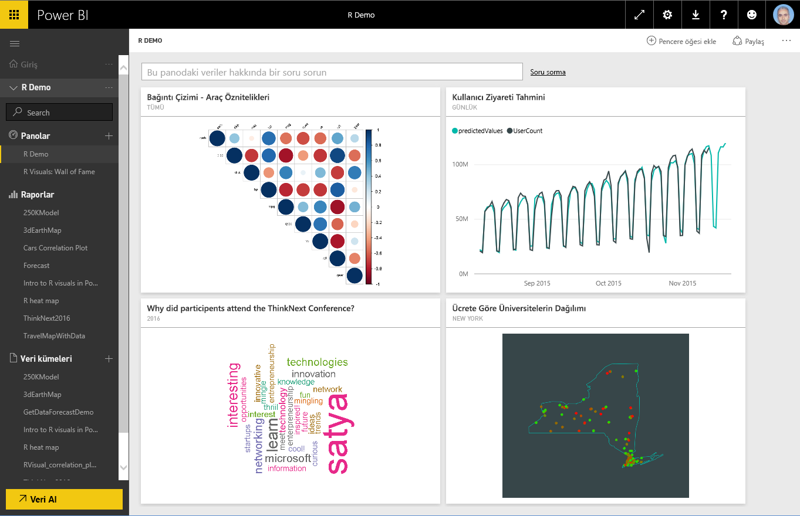
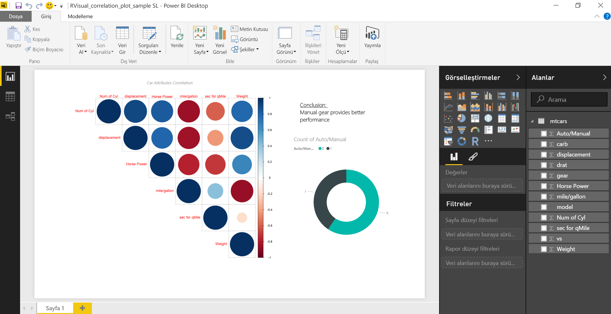
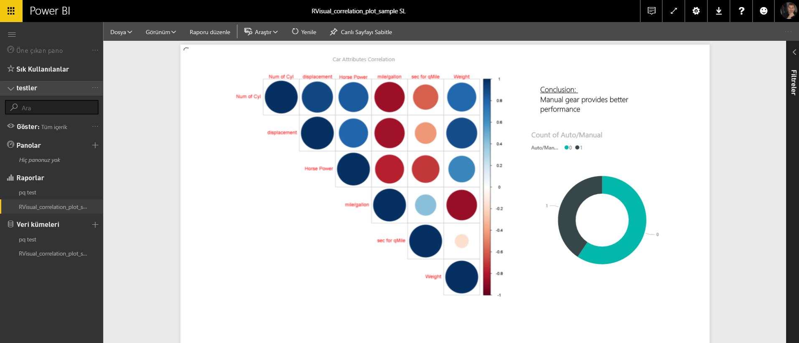
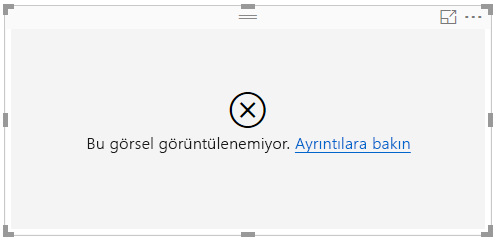
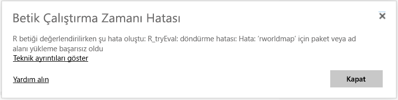
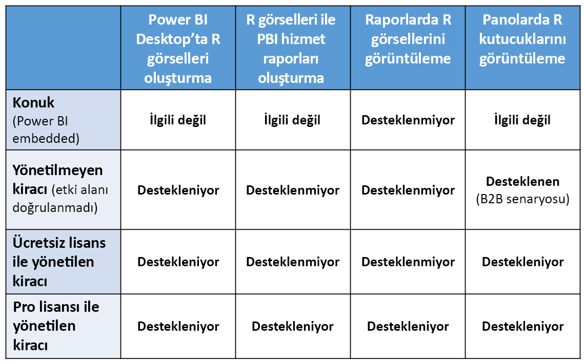

# Power BI hizmetinde R görselleri oluşturma
Power BI hizmeti, R betikleriyle oluşturulan görselleri görüntülemeyi ve bu görsellerle etkileşim kurmayı destekler. R betikleriyle oluşturulan ve genellikle *R görselleri* olarak adlandırılan görseller, R'ın zengin analizlerini ve görselleştirme gücünü kullanarak tahmin etme özelliği gibi gelişmiş veri şekillendirme özellikleri ve analizler sunabilir.

> [!NOTE]
> [R programlama dili](https://www.r-project.org/); istatistikçiler, veri bilimciler ve iş analistleri arasında en yaygın kullanılan programlama dilleri arasındadır. R dili, yaygın olarak kullanılan [R Kullanıcı Grupları](http://msdsug.microsoft.com/)'nın yanı sıra 7.000'den fazla eklenti paketi sunan bir açık kaynak topluluğuna sahiptir. Power BI hizmetinde dağıtılan R sürümü *Revolution R Open 3.2.2.* sürümüdür.
> 
> 

Aşağıdaki görüntüde, gelişmiş analizler için kullanılan bir R görseli koleksiyonu içeren bir Power BI panosu gösterilmektedir.

R görselleri, aşağıdaki görüntüde gösterilen rapora benzer bir [Power BI Desktop raporunda](desktop-get-the-desktop.md) oluşturulur.

Rapor **Power BI Desktop**'ta oluşturulduktan sonra, bir veya daha fazla R görseli içeren raporunuzu Power BI hizmetinde yayımlayabilirsiniz. R görselleri şu anda yalnızca **Power BI Desktop**'ta oluşturulabilir ve ardından Power BI hizmetinde yayımlanabilir. R görselleri oluşturma hakkında daha fazla bilgi için bkz. [CR programlama dilini kullanarak Power BI görselleri oluşturma (Power BI Desktop)](desktop-r-visuals.md).

Hizmette R paketlerinin tümünün desteklenmediğini unutmayın. Şu anda Power BI hizmetinde desteklenen paketlerin listesi için, bu makalenin sonunda bulunan desteklenen paketler bölümüne bakın.

Nasıl çalıştığını görmek ve kullanmayı denemek için birkaç R görseli içeren bu [örnek Power BI Desktop dosyasını](http://download.microsoft.com/download/D/9/A/D9A65269-D1FC-49F8-8EC3-1217E3A4390F/RVisual_correlation_plot_sample SL.pbix) (.pbix dosyası) indirebilirsiniz.

**Power BI Desktop**'ta oluşturulan ve ardından Power BI hizmetinde yayımlanan R görselleri çoğunlukla Power BI hizmetindeki diğer görseller gibi çalışır; R görselleri ile etkileşim kurabilir, bu görsellere filtre uygulayabilir, görselleri bir panoya sabitleyebilir veya başkalarıyla paylaşabilirsiniz. Pano ve görsel paylaşma hakkında daha fazla bilgi için bkz. [panoları iş arkadaşlarınızla ve diğer kişilerle paylaşma](service-share-dashboards.md). R görsellerinin diğer görsellerden farkı, araç ipuçlarını gösterememesi ve diğer görsellere filtre uygulamak için kullanılamamasıdır.

Aşağıdaki görüntüde görebileceğiniz gibi, Power BI hizmetindeki R görselleri, hem panolarda hem de raporlarda büyük ölçüde diğer görseller gibi görünüp bu şekilde davranır ve kullanıcıların, görseli oluşturan, temel alınan R betiğini bilmeleri gerekmez.

## R betiklerinin güvenliği
R görselleri, güvenlik veya gizlilik riskleri taşıyan kodlar içerebilecek R betiklerinden oluşturulur.

Bu risklerle en çok, yazarın betiği kendi bilgisayarında çalıştırdığı yazma aşamasında karşılaşılır.

Power BI hizmeti, kullanıcıları ve hizmeti güvenlik risklerine karşı korumak için bir *korumalı alan* teknolojisi uygular.

Bu *korumalı alan* yaklaşımı, Power BI hizmetinde çalıştırılan R betiklerine, İnternet'e veya R görselini oluşturmak için gerekli olmayan diğer kaynaklara erişme gibi konularda bazı kısıtlamalar getirir.

## R betik hatası deneyimi
Bir R betiği hatayla karşılaştığında R görseli çizilmez ve bir hata iletisi görüntülenir. Hata hakkında ayrıntılı bilgi için, aşağıdaki görüntüde gösterilen şekilde, tuvaldeki R görseli hatasında **Ayrıntılara göz atın** seçeneğini belirleyin.

Başka bir örnek olarak, aşağıdaki görüntüde, Azure'da bir R paketinin eksik olması nedeniyle R betiği çalıştırılamadığında görünen hata iletisi gösterilmektedir.

## Lisanslama
R görselleri için raporlarda işleme, yenileme, filtre uygulama ve çapraz filtre özelliklerine yönelik olarak [Power BI Pro](service-self-service-signup-for-power-bi.md) lisansı gerekir. Power BI Pro lisansları ve bunların ücretsiz lisanslardan farkı hakkında daha fazla bilgi edinmek için bkz. [Power BI Pro içeriği nedir?](service-premium.md)

Power BI'ın ücretsiz kullanıcıları, yalnızca kendileriyle paylaşılan kutucukları kullanabilir. Daha fazla bilgi için bkz. [Power BI Pro'yu satın alma](service-admin-purchasing-power-bi-pro.md).

Aşağıdaki tabloda, lisanslama türüne göre R görseli özellikleri açıklanmaktadır.

## Bilinen Sınırlamalar
Power BI hizmetindeki R görselleri için bazı sınırlamalar söz konusudur:

* R görseli desteği, şu sayfada belirtilen paketlerle sınırlıdır <make this a link to the supported packages page per my excel>. Şu anda özel paketler için destek bulunmamaktadır.
* Veri boyutu sınırlamaları: R görseli tarafından çizim için kullanılan veri 150.000 satırla sınırlıdır. 150.000'den fazla satır seçilirse yalnızca ilk 150.000 satır kullanılır ve görüntünün üzerinde bir ileti görüntülenir.
* Hesaplama süresi sınırlaması: Bir R görseli hesaplaması 60 saniyeden uzun sürerse betik zaman aşımına uğrar ve bir hata oluşur.
* R görselleri; veri güncelleştirmeleri, filtre uygulama ve vurgulama işlemleri ardından yenilenir. Ancak, görüntünün kendisi etkileşimli değildir ve araç ipuçlarını desteklemez.
* R görselleri diğer görselleri vurgulama işlemine yanıt verir ancak diğer öğelere çapraz filtreleme uygulamak için R görselindeki öğelere tıklayamazsınız.
* R görselleri şu anda *Saat* veri türü için desteklenmemektedir. Bunun yerine lütfen Tarih/Saat veri türünü kullanın.
* R Görselleri **Web'de yayımla** özelliği kullanılırken görüntülenmez.
* R görselleri şu anda pano ve rapor yazdırma özelliğiyle yazdırılamaz
* R görselleri şu anda Analysis Services'in DirectQuery modunda desteklenmemektedir
* Çince, Japonca ve Korece yazı tiplerinin Power BI hizmetinde düzgün çalışması için şu ek adımları izlemeniz gerekir:
  
  * İlk olarak, *showtext* R paketini ve tüm bağımlılıklarını yükleyin. Bunu, şu betiği çalıştırarak da yapabilirsiniz:
    
        *install.packages("showtext")*
  * Ardından, R betiğinin başına şu satırı ekleyin:
    
        powerbi_rEnableShowTextForCJKLanguages =  1

## R paketlerine genel bakış
R paketleri, iyi tanımlanmış bir biçimde bir araya getirilen R işlevlerinden, verilerden ve derlenmiş kodlardan oluşan koleksiyonlardır. R yüklendiğinde, standart bir paket kümesi ile birlikte gelir. Diğer paketleri ise ayrı olarak indirebilir ve yükleyebilirsiniz. Yükleme işleminin ardından kullanılabilmesi için R paketleri oturuma da yüklenmelidir. Ücretsiz R paketlerinin birincil kaynağı, açılımı [Comprehensive R Archive Network](https://cran.r-project.org/web/packages/available_packages_by_name.html) olan CRAN'dir.

**Power BI Desktop** her tür R paketini sınırlama olmaksızın kullanabilir. R paketlerini **Power BI Desktop**'ta kullanmak üzere kendiniz yükleyebilirsiniz (örneğin, [RStudio IDE](https://www.rstudio.com/) kullanarak).

**Power BI hizmetindeki** R görselleri, [bu makalede](service-r-packages-support.md) bulunan **Desteklenen Paketler** bölümündeki paketler tarafından desteklenmektedir. Desteklenen paketler listesinde ilginizi çeken bir paket bulamazsanız seçtiğiniz paket için destek isteyebilirsiniz. Destek isteme hakkında daha fazla bilgi için bkz. [Power BI hizmetindeki R paketleri](service-r-packages-support.md).

### R paketleri Gereksinimleri ve Sınırlamaları
R paketlerine yönelik birçok gereksinim ve sınırlama bulunmaktadır:

* Power BI hizmeti, R paketlerini çoğunlukla GPL-2, GPL-3, MIT+ ve bu tür ücretsiz ve açık kaynaklı yazılım lisanslarıyla destekler.
* Power BI hizmeti, CRAN'de yayımlanan paketleri destekler. Hizmet, kişisel veya özel R paketlerini desteklemez. Kullanıcılarımıza, kişisel paketlerinin Power BI hizmetinde kullanılması isteğinde bulunmadan önce bu paketlerini CRAN'de kullanılabilir hale getirmelerini öneririz.
* **Power BI Desktop**, R paketlerine yönelik iki çeşitlemeye sahiptir:
  
  * R görselleri için, özel R paketleri de dahil olmak üzere herhangi bir paket yükleyebilirsiniz
  * Özel R görselleri içinse otomatik paket yüklemesinde yalnızca genel CRAN paketleri desteklenir.
* Güvenlik ve gizlilik nedenleriyle, World-Wide Web üzerinden istemci-sunucu sorguları sağlayan R paketleri (RgoogleMaps gibi) şu anda hizmette desteklenmez. Bu tür denemeler yapıldığında ağ engellenir. Desteklenen ve desteklenmeyen R paketlerinin listesi için bkz. [Power BI hizmetindeki R paketleri](service-r-packages-support.md).
* Yeni bir R paketi eklemeye yönelik onay süreci birçok bağımlılık gerektirir; hizmete yüklenmesi gereken bazı bağımlılıklar desteklenmemektedir.

### Desteklenen Paketler:
Desteklenen R paketlerinin uzun listesi (ve desteklenmeyen paketlerin kısa listesi) için şu makaleye bakın:

* [Power BI hizmetindeki R paketleri](service-r-packages-support.md)

