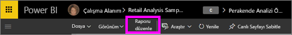
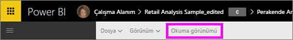

# Power BI hizmeti raporlarındaki Okuma görünümü ve Düzenleme görünümü
Power BI hizmetinde (Power BI Desktop uygulamasında değil) raporları görüntülemek ve onlarla etkileşim kurmak için kullanabileceğiniz iki mod vardır: Okuma görünümü ve Düzenleme görünümü.  

Okuma görünümü tüm kullanıcılar tarafından, Düzenleme görünümü ise yalnızca rapor oluşturanlar ve rapor sahipleri tarafından kullanılabilir. Okuma görünümü rapor *tüketicileri* için tasarlanmıştır ve bunlar, raporları Uygulamalardan veya kendileriyle yapılan paylaşımlardan açan iş arkadaşlarınızdır. Okuma görünümü, belirli bir raporu görüntüleyen herkesin aynı raporu ve aynı görselleştirmeleri, aynı filtreler uygulanmış halde görmesini sağlar.  Tüketiciler raporlarla etkileşim kurabilir ancak değişiklikleri kaydedemez.

>**NOT**: Belirli durumlarda satır düzeyi güvenlik ve veri izinleri nedeniyle rapor tüketicilerinin görüntülediği veriler farklı olabilir. 

Düzenleme görünümü yalnızca raporu oluşturan veya uygulama çalışma alanının üyesi ya da yöneticisi olarak raporun ortak sahiplerinden biri olan kişiler tarafından kullanılabilir.

## Okuma görünümü

Okuma görünümü, verilerle oynayıp bilgi sahibi olmanın eğlenceli ve güvenli bir yoludur. Okuma görünümü, [Düzenleme görünümü](service-interact-with-a-report-in-editing-view.md) kadar etkileşimli olmasa da verilerinizi keşfetmenizi sağlayacak birçok seçenek sunmaktadır. Bu görünüm özellikle [sizinle paylaşılmış olan](service-share-dashboards.md) ve yalnızca Okuma görünümü'nde açılabilen raporları görüntülemek için idealdir.

Daha fazla bilgi için bkz. [Power BI raporları için Okuma görünümü](service-interact-with-a-report-in-reading-view.md).

## Düzenleme görünümü
Power BI'daki Düzenleme Görünümü'nde ([Okuma Görünümü](service-interact-with-a-report-in-reading-view.md) ile karşılaştırıldığında) alanlar ekleme ve kaldırma, görselleştirme türünü değiştirme, yeni görselleştirmeler oluşturma ve rapora görselleştirmeler ve sayfalar ekleme ve bunları silme yoluyla verilerinizi ayrıntılı olarak kullanabilirsiniz.

Daha fazla bilgi için bkz. [Power BI raporları için Düzenleme görünümü](service-interact-with-a-report-in-editing-view.md)

## Düzenleme görünümü ile Okuma görünümü arasında geçiş yapma
Yalnızca raporu oluşturanların ve rapor sahiplerinin raporları Düzenleme görünümü'nde açabileceğini unutmayın.

1. Raporlar varsayılan olarak Okuma görünümü'nde açılır. **Raporu düzenle** seçeneğinin görünmesi, Okuma görünümü'nün etkin olduğunu gösterir. **Raporu düzenle** seçeneğinin gri renkte olması, raporu Düzenleme görünümü'nde açma izninizin olmadığı anlamına gelir.

   

2. **Raporu Düzenle** seçeneği gri renkte değilse tıklayarak raporu Düzenleme görünümü'nde açabilirsiniz. 
   
   
   
   Rapor şimdi Düzenleme görünümü'ndedir ve Okuma görünümü'nde son kullandığınız [görüntü ayarlarını](power-bi-report-display-settings.md) kullanır.

2. **Okuma görünümü**'ne dönmek için üst gezinti çubuğunda Okuma görünümü'nü seçin.
   
    

Okuma görünümü'nde raporunuzla etkileşim kurmanın, öngörüler keşfetmek ve sorularınıza cevap bulmak için verilerinizi ayrıntılı olarak incelemenin çok çeşitli yolları vardır.  Sıradaki [Okuma görünümü'nde bir raporla etkileşim kurma](service-interact-with-a-report-in-editing-view.md) konu başlığında bunlar ayrıntılı olarak listelenmekte ve açıklanmaktadır.

### Sonraki adımlar
[Okuma görünümünde bir raporla etkileşim kurma](service-interact-with-a-report-in-editing-view.md)    
[Power BI'daki raporlar](service-reports.md)   bölümüne dönün  
Başka bir sorunuz mu var? [Power BI Topluluğu'na başvurun](http://community.powerbi.com/) 

