# Power BI'da gerçek zamanlı akış
Power BI'ın gerçek zamanlı akış özelliği ile gerçek zamanlı olarak veri akışı gerçekleştirebilir ve panoları güncelleştirebilirsiniz. Power BI'da oluşturulabilen tüm görseller, gerçek zamanlı verileri ve görselleri görüntüleyecek ve güncelleştirecek şekilde de oluşturulabilir. Cihazlar ve akış verisi kaynakları; fabrika algılayıcıları, sosyal medya kaynakları, hizmet kullanım ölçümleri ve zamana duyarlı verilerin toplanıp aktarılabileceği başka herhangi bir kaynak olabilir.

Bu makalede, Power BI'da nasıl gerçek zamanlı akış veri kümesi ayarlayacağınız gösterilmektedir. Ancak bu konuya değinmeden önce, kutucuklarda (ve panolarda) görüntülenecek şekilde tasarlanmış gerçek zamanlı veri kümesi türlerini ve bu veri kümelerinin nasıl farklılık gösterdiğini anlamakta yarar vardır.

## Gerçek zamanlı veri kümesi türleri
Gerçek zamanlı panolarda görüntülenecek şekilde tasarlanmış üç gerçek zamanlı veri türü vardır:

* Gönderim veri kümesi
* Akış veri kümesi
* PubNub akış veri kümesi

İlk olarak bu veri kümelerinin birbirlerinden nasıl ayrıldığını anlayacak, ardından da her birine nasıl veri göndereceğimize değineceğiz.

### Gönderim veri kümesi
Veriler, bir **gönderim veri kümesi** ile Power BI hizmetine gönderilir. Veri kümesi oluşturulduğunda Power BI hizmeti, verileri depolamak için hizmette otomatik olarak yeni bir veri kümesi oluşturur. Alınan verilerin devamlı olarak depolandığı bir temel alınan veritabanı bulunduğundan söz konusu verilerle raporlar oluşturulabilir. Söz konusu raporlar ve ilgili görseller de diğer rapor görselleri gibidir, bu; görsel oluşturmak için Power BI görsellerinin, veri uyarılarının, sabitlenen pano kutucuklarının ve daha fazlasının dahil olduğu, Power BI’ın rapor oluşturma özelliklerinin tümünü kullanabileceğiniz anlamına gelir.

Gönderim veri kümesi kullanılarak rapor oluşturulduğunda, raporun içerdiği görsellerin tümü bir panoya sabitlenebilir. Bu panoda, veriler her güncelleştirildiğinde görseller de gerçek zamanlı olarak güncelleştirilir. Hizmette bulunan pano, her yeni veri alındığında kutucuk yenileme işlemi tetikler.

Gönderim veri kümesinden alınan sabitlenmiş kutucuklar hakkında göz önünde bulundurulması gereken iki önemli nokta vardır:

* Tüm rapor *canlı sabitleme sayfası* seçeneği kullanılarak sabitlendiğinde, veriler otomatik olarak **güncelleştirilmez**.
* Bir panoya görsel sabitledikten sonra, doğal dilde gönderim veri kümesi hakkında soru sormak için **Soru-Cevap**'ı kullanabilirsiniz. **Soru-Cevap** sorgusu yaptığınızda, elde edilen görseli panoya tekrar sabitleyebilirsiniz, böylece bu pano *da* gerçek zamanlı olarak güncelleştirilir.

### Akış veri kümesi
**Akış veri kümesiyle**, yine veriler Power BI hizmetine gönderilir ama önemli bir fark vardır: Power BI verileri yalnızca geçici bir önbellekte depolar ve bunun süresi hızla dolar. Geçici önbellek, yalnızca kısa süreli bir zaman algısına sahip görsellerin (bir saatlik zaman penceresi bulunan çizgi grafiği gibi) görüntülenmesinde kullanılır.

**Akış veri kümesi** kullanırken, temel alınan veritabanı *bulunmadığı* için, akıştan gelen verileri kullanarak rapor görselleri *oluşturamazsınız*. Bu nedenle, filtreleme, Power BI görselleri ve diğer rapor işlevleri gibi rapor işlevlerinden yararlanamazsınız.

Bir akış veri kümesini görselleştirmenin tek yolu kutucuk eklemek ve akış veri kümesini **özel akış verileri** veri kaynağı olarak kullanmaktır. **Akış veri kümelerini** temel alan özel akış kutucukları gerçek zamanlı verilerin hızlı bir şekilde görüntülenmesi için en iyi duruma getirilir. Verileri bir veritabanına girmek veya veritabanından okumak gerekmediğinden verilerin Power BI hizmetine gönderilmesi ve görselin güncelleştirilmesi arasında çok az bir gecikme olur.

Uygulamada, akış veri kümeleri ve onlara eşlik eden akış görselleri, veri gönderme ve görselleştirme arasındaki gecikmenin en aza indirilmesinin yüksek düzeyde önemli olduğu durumlarda tercih edilecek en iyi seçenektir. Ayrıca en iyi uygulama olarak, verilerin başka bir toplama işlemi yapılmadan, olduğu gibi görselleştirilebileceği bir şekilde gönderilmesini sağlayabilirsiniz. Olduğu gibi kullanılmaya hazır verilere örnek olarak sıcaklıklar ve önceden hesaplanmış ortalamalar verilebilir.

### PubNub akış veri kümesi
**PubNub** akış veri kümeleri söz konusu olduğunda Power BI web istemcisi, mevcut bir PubNub veri akışını okumak için PubNub SDK'sını kullanır ve Power BI hizmeti tarafından veri depolanmaz.

**Akış veri kümelerinde** olduğu gibi, **PubNub akış veri kümesinde** de Power BI’da temel alınan bir veritabanı bulunmaz. Bu nedenle, akışı sağlanan verilere ilişkin rapor görselleri oluşturamaz, filtreleme ve Power BI görselleri gibi rapor özelliklerinden yararlanamazsınız. Benzer şekilde, **PubNub akış veri kümesi**, yalnızca panoya bir kutucuk eklenip PubNub veri akışı kaynak olarak yapılandırılarak görselleştirilebilir.

**PubNub akış veri kümesini** temel alan kutucuklar gerçek zamanlı verilerin hızlı bir şekilde gösterilmesi için en iyi duruma getirilmiştir. Power BI ile PubNub veri akışı arasında doğrudan bağlantı bulunduğundan verilerin Power BI hizmetine gönderilmesi ve görselin güncelleştirilmesi arasında çok az bir gecikme olur.

### Akış veri kümesi matrisi
Aşağıdaki tabloda (veya matriste), gerçek zamanlı akış için kullanılabilen üç veri kümesi türü açıklanmış ve her birine ilişkin özellikler ile sınırlamalar listelenmiştir.

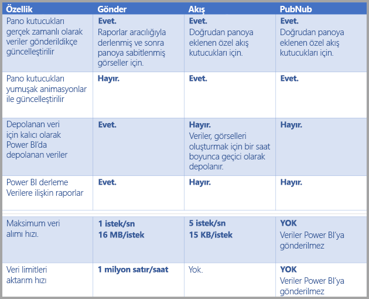

> [!NOTE]
> Gönderilebilecek veri miktarına yönelik **Gönderme** sınırlarıyla ilgili bilgi için [bu makaleyi](developer/automation/api-rest-api-limitations.md) okuyun.

## Veri kümelerine veri gönderme
Önceki bölümde, gerçek zamanlı akış için kullanabileceğiniz gerçek zamanlı başlıca üç veri kümesi türü ve bunların nasıl değişiklik gösterdiği açıklanmıştır. Bu bölümde ise söz konusu veri kümelerine ilişkin veri oluşturma ve gönderme işlemlerinin nasıl gerçekleştirileceği anlatılmaktadır.

Bir veri kümesine veri göndermenin başlıca üç yolu vardır:

* Power BI REST API'lerini kullanma
* Akış Veri Kümesi UI'sini kullanma
* Azure Stream Analytics'i kullanma

Sırayla bu yaklaşımların her birine göz atalım.

### Veri göndermek için Power BI REST API'lerini kullanma
**Power BI REST API’leri**, **gönderim** veri kümelerinde ve **akış** veri kümelerinde veri oluşturmak ve bu veri kümelerine veri göndermek için kullanılabilir. Power BI REST API'lerini kullanarak bir veri kümesi oluşturduğunuzda, *defaultMode* bayrağı, veri kümesinin gönderim veya akış olup olmadığını belirtir. *defaultMode* bayrağı ayarlanmamışsa veri kümesi, varsayılan olarak **gönderim** veri kümesi biçimindedir.

*defaultMode* değeri *pushStreaming* olarak ayarlanırsa, veri kümesi hem **gönderim***hem de***akış** veri kümesi olur ve her iki veri kümesi türünün de sağladığı avantajları sunar. 

> [!NOTE]
> *defaultMode* bayrağı *pushStreaming* olarak ayarlanmış şekilde veri kümeleri kullanılırken, bir isteğin **akış** veri kümelerine yönelik 15 KB'lık boyut kısıtlamasını aşması ancak **gönderim** veri kümelerine yönelik 16MB'lık boyut kısıtlamasını ihlal etmemesi halinde, istek başarılı olur ve veriler gönderim veri kümesinde güncelleştirilir. Ancak, tüm akış kutucukları geçici olarak başarısız olur.

Bir veri kümesi oluşturulduktan sonra, [**PostRows** API](https://docs.microsoft.com/rest/api/power-bi/pushdatasets/datasets_postrows)'sini kullanarak veri göndermek için REST API'lerini kullanın.

REST API'lere yönelik tüm istekler **Azure AD OAuth** kullanılarak güvence altına alınır.

### Akış Veri Kümesi UI'sini kullanarak veri gönderme
Aşağıdaki görüntüde gösterildiği şekilde Power BI hizmetinde **API** yaklaşımını seçerek bir veri kümesi oluşturabilirsiniz.

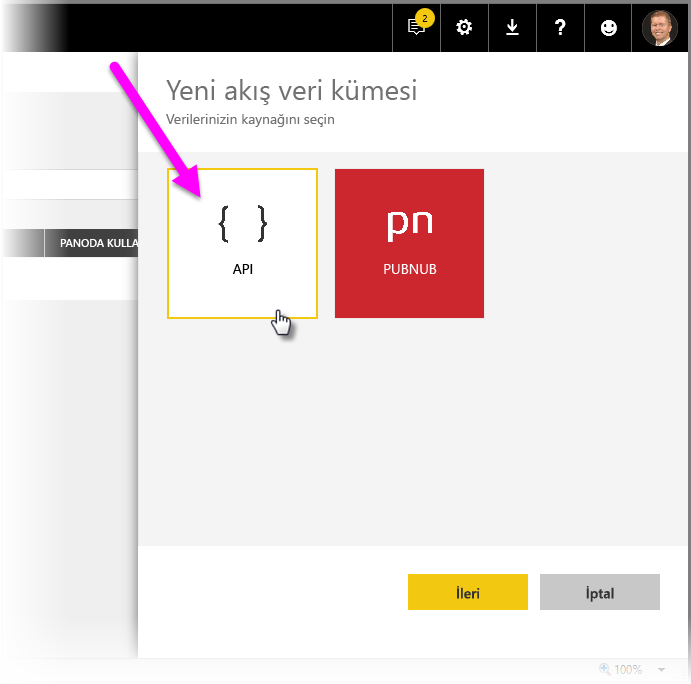

Yeni akış veri kümesini oluştururken, aşağıda gösterildiği gibi, yapılan işlem üzerinde önemli bir etkisi olan **Geçmiş veri çözümlemesi** seçeneğini etkinleştirmeyi tercih edebilirsiniz.

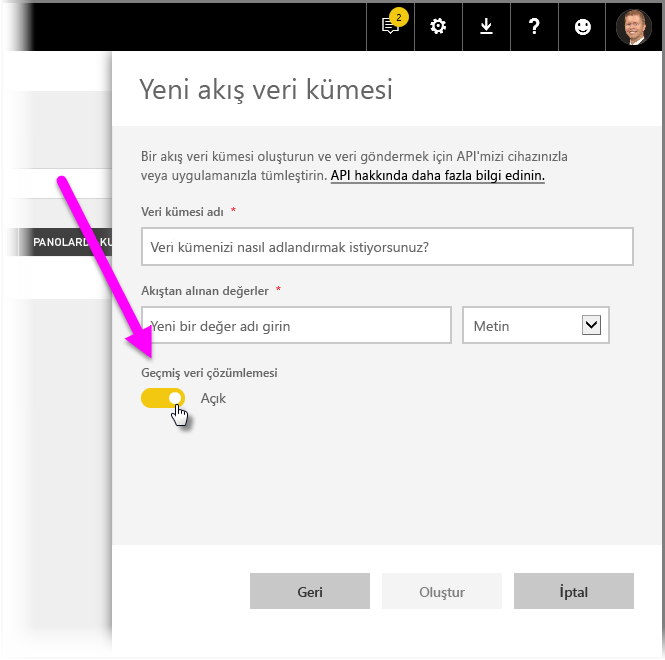

**Geçmiş veri çözümlemesi** devre dışıyken (varsayılan olarak devre dışıdır), bu makalede önceden de belirtildiği gibi bir **akış veri kümesi** oluşturursunuz. **Geçmiş veri çözümlemesi** *etkinken*, oluşturulan veri kümesi hem **akış veri kümesi** ve hem de **gönderim veri kümesi** haline gelir. Bu makalenin önceki kısımlarında belirtildiği gibi, bu işlem, *defaultMode* seçeneği *pushStreaming* olarak ayarlanan bir veri kümesi oluşturmak için Power BI REST API'lerinin kullanılmasıyla eşdeğerdir.

> [!NOTE]
> Önceki paragrafta belirtildiği üzere, Power BI hizmeti UI'si kullanılarak oluşturulan akış veri kümeleri için Azure AD kimlik doğrulaması gerekli değildir. Bu tür veri kümelerinde, veri kümesi sahibi satır anahtarı içeren bir URL alır. Bu URL, istek sahibine Azure AD OAuth taşıyıcı belirtecini kullanmadan verileri veri kümesine gönderme yetkisi verir. Ancak, Azure AD (AAD) yaklaşımının da verileri veri kümesine gönderme konusunda işe yaradığını göz önünde bulundurun.
> 
> 

### Azure Stream Analytics'i kullanarak veri gönderme
Power BI'ı **Azure Stream Analytics**'teki (ASA) bir çıkış olarak ekleyebilir ve ardından bu veri akışlarını Power BI hizmetinde gerçek zamanlı olarak kullanabilirsiniz. Bu bölümde, söz konusu işlemin nasıl gerçekleştirildiği ile ilgili teknik ayrıntılar açıklanmaktadır.

Azure Stream Analytics, *defaultMode* seçeneği (*defaultMode* ile ilgili bilgi edinmek için bu makalenin önceki bölümlerine bakın) *pushStreaming* olarak ayarlandığında Power BI'a yönelik çıkış veri akışını oluşturmak için Power BI REST API'lerini kullanır. Böylece hem **gönderim** hem de **akış** avantajlarına sahip bir veri kümesi elde edilmiş olur. Veri kümesinin oluşturulması sırasında Azure Stream Analytics, **retentionPolicy** bayrağını da *basicFIFO* olarak ayarlar; bu ayarla birlikte, gönderim veri kümesini destekleyen veritabanı 200.000 satır depolayabilir. Bu sınır aşıldığında, satırlar ilk giren ilk çıkar (FIFO) düzeninde bırakılır.

> [!CAUTION]
> Azure Stream Analytics sorgunuz sonucunda Power BI'a yönelik çok hızlı bir çıkış sağlanırsa (örneğin, saniyede bir veya iki kez) Azure Stream Analytics bu çıkışları tek bir istekte toplamaya başlar. Bu, istek boyutunun akış kutucuğu sınırını aşmasına neden olabilir. Bu durumda, önceki bölümlerde belirtildiği gibi, akış kutucukları işlenemez. Böyle durumlarda gerçekleştirilebilecek en iyi uygulama, Power BI'a yönelik veri çıkış hızını azaltmaktır. (Örneğin, her saniyede maksimum değer yerine 10 saniyenin üzerindeki bir maksimum değere ayarlayın.)
> 
> 

## Power BI'da gerçek zamanlı akış veri kümenizi ayarlama
Artık gerçek zamanlı akışa yönelik başlıca üç veri kümesi türünden bahsettiğimize ve verileri veri kümesine göndermek için izleyebileceğiniz önde gelen üç yolu da ele aldığımıza göre, gerçek zamanlı akış veri kümenizi Power BI'da çalıştırma vakti geldi.

Gerçek zamanlı akışa başlamak için akış verilerinin Power BI'da kullanılabileceği iki yoldan birini seçmeniz gerekir:

* Akış verilerinden görseller içeren **kutucuklar**
* Power BI'da kalan akış verilerinden oluşturulan **veri kümeleri**

Her iki seçenekte de **Akış verilerini** Power BI'da ayarlamanız gerekir. Bunu gerçekleştirmek için, panonuzda (mevcut veya yeni bir pano) **Kutucuk ekle**'yi ve ardından **Özel akış verileri**'ni seçin.

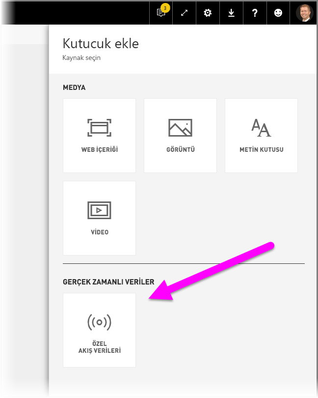

Henüz akış verilerini ayarlamadıysanız endişelenmenize gerek yok. Başlamak için **verileri yönet**'i seçin.

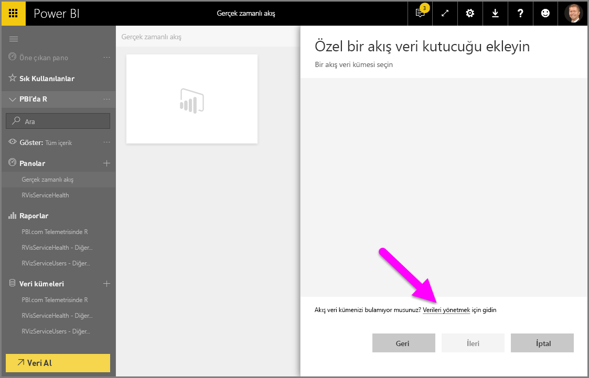

Bu sayfada, önceden oluşturduğunuz bir akış veri kümesinin bulunması halinde akış veri kümenizin uç noktasını metin kutusuna girebilirsiniz. Henüz yoksa bir akış veri kümesi oluşturmak için kullanabileceğiniz seçenekleri görmek üzere sağ üst köşede bulunan artı simgesini ( **+** ) seçin.

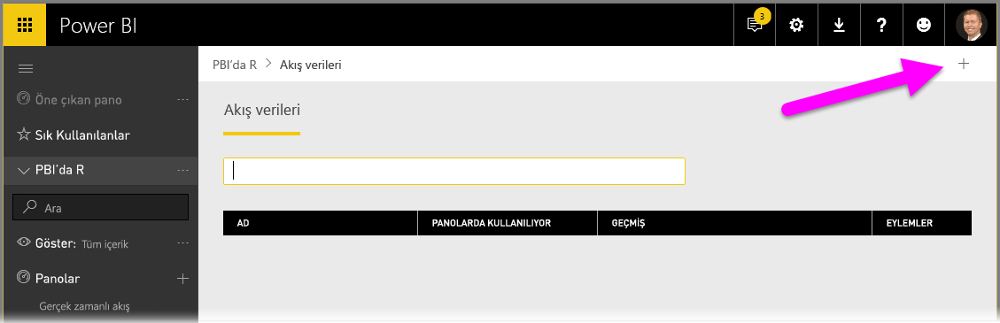

**+** simgesine tıkladığınızda, iki seçenek görürsünüz:

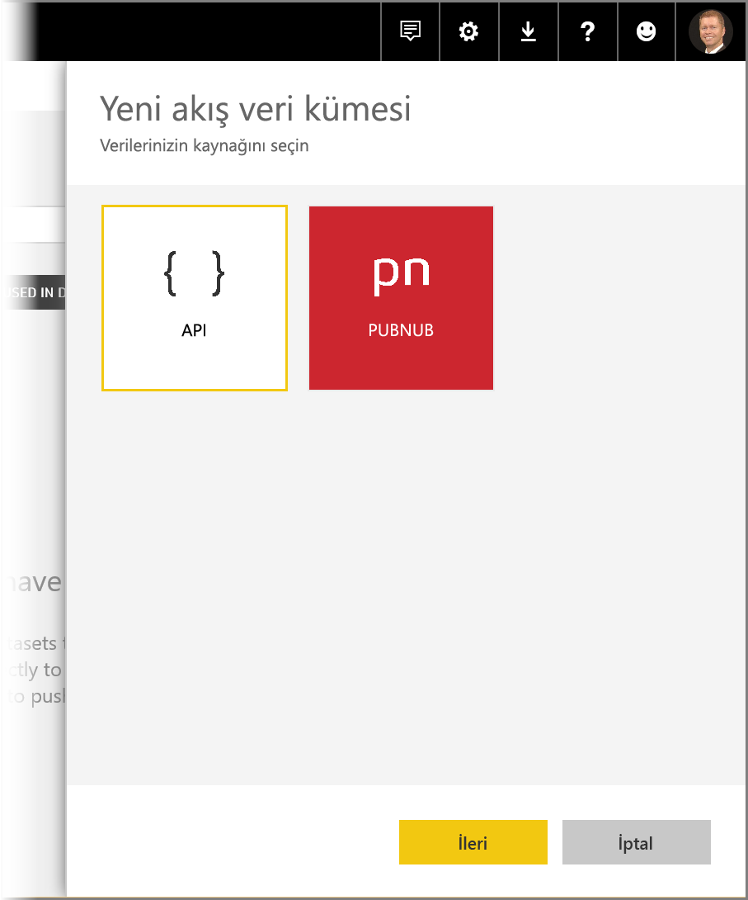

Bir sonraki bölümde bu seçenekler anlatılmakta ve akış veri kaynağından bir akış **kutucuğu** veya **veri kümesi** oluşturma konusunda ayrıntılı bilgiler verilmektedir. Daha sonra bu bilgileri rapor oluştururken kullanabilirsiniz.

## Size en uygun seçenekle akış veri kümenizi oluşturma
Power BI ile kullanılıp görselleştirilebilen gerçek zamanlı bir akış verileri akışı oluşturmanın iki yolu vardır:

* **Power BI REST API** ile gerçek zamanlı akış uç noktası kullanma
* **PubNub**

Sonraki bölümlerde sırayla her iki seçenek de incelenmektedir.

### POWER BI REST API'sini kullanma
**Power BI REST API** - Son zamanlarda Power BI REST API'de yapılan iyileştirmeler, gerçek zamanlı akışı, geliştiriciler için daha kolay hale getirmek üzere tasarlanmıştır. **Yeni akış veri kümesi** penceresinde **API** seçeneğini belirlediğinizde, Power BI'ın uç noktanıza bağlanmasını ve bunu kullanmasını sağlamaya yönelik girişlerle karşılaşırsınız:

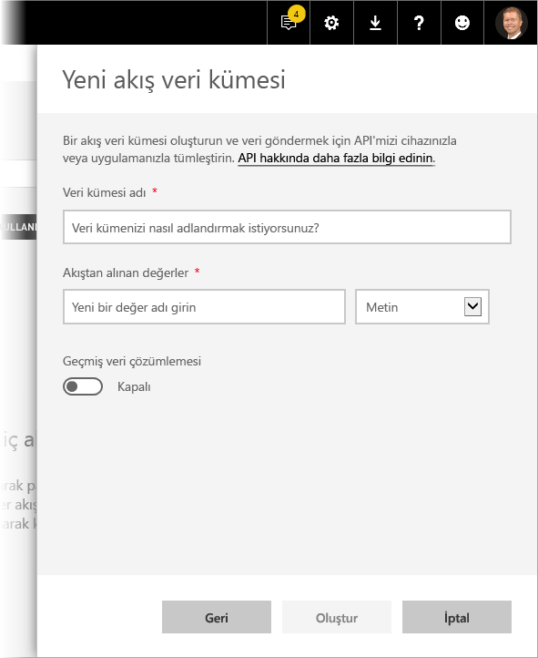

Power BI'ın bu veri akışı yoluyla gönderilen verileri depolamasını istiyorsanız *Geçmiş veri çözümlemesi*'ni etkinleştirin; böylece, toplanan veri akışı üzerinde raporlama ve analiz işlemleri gerçekleştirebilirsiniz. Ayrıca [API hakkında daha fazla bilgi edinebilirsiniz](https://docs.microsoft.com/rest/api/power-bi/).

Veri akışınızı başarılı bir şekilde oluşturduktan sonra bir REST API URL uç noktası edinirsiniz. Böylece uygulamanız, oluşturduğunuz Power BI **akış verileri** veri kümesine verilerinizi göndermek üzere *POST* isteklerini kullanarak bu uç noktayı çağırabilir.

*POST* istekleri yaparken, istek gövdesinin, Power BI kullanıcı arabiriminde sağlanan örnek JSON ile eşleştiğinden emin olmanız gerekir. Örneğin, JSON nesnelerinizi bir dizi halinde kaydırın.

### PubNub'ı kullanma
**PubNub** akışının Power BI ile tümleştirilmesi sonucunda, düşük gecikmeli **PubNub** veri akışlarınızı kullanabilir (veya yenilerini oluşturabilir) ve Power BI'da bunlardan faydalanabilirsiniz. **PubNub**'ı ve ardından **Sonraki** seçeneğini belirlediğinizde, aşağıdaki pencereyi görürsünüz:

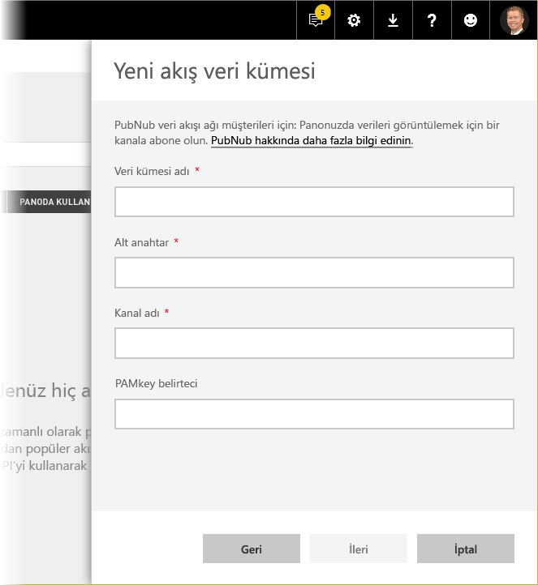

> [!WARNING]
> PubNub kanalları, PubNub Access Manager (PAM) kimlik doğrulaması anahtarı kullanılarak güvence altına alınabilir. Bu anahtar, panoya erişimi olan tüm kullanıcılar ile paylaşılır. [PubNub erişim denetimi hakkında daha fazla bilgi edinebilirsiniz](https://www.pubnub.com/docs/web-javascript/pam-security).
> 
> 

**PubNub** veri akışları genellikle yüksek hacimlidir ve özgün biçimlerindeyken depolama ve geçmiş çözümleme için her zaman uygun değildir. PubNub verilerinin geçmiş çözümlemesi için Power BI'ı kullanabilmek için ham PubNub akışını toplamanız ve Power BI'a göndermeniz gerekir. Bunu yapmanın bir yolu da [Azure Akış Analizi](https://azure.microsoft.com/services/stream-analytics/) kullanmaktır.

## Power BI'da gerçek zamanlı akış kullanma örneği
İşte Power BI'da gerçek zamanlı akışın nasıl çalıştığına yönelik kısa bir örnek. Gerçek zamanlı akışın sizin için önemini kavramak üzere bu örnekle birlikte ilerleyebilirsiniz.

Bu örnekte, **PubNub**'da bulunan ve genel olarak erişilebilen bir akış kullanılmaktadır. Adımlar şunlardır:

1. **Power BI hizmeti**'nde bir pano seçin (veya yeni pano oluşturun) ve **Kutucuk ekle** > **Özel Akış Verileri** seçeneğini belirleyip **İleri** düğmesini seçin.
   
   
2. Henüz bir akış veri kaynağınız yoksa, **verileri yönet** bağlantısını seçin (**İleri** düğmesinin hemen üzerinde bulunur), ardından pencerenin sağ üst tarafında bulunan bağlantıdan **+ Akış veri kümesi ekle** seçeneğini belirleyin. **PubNub**'ı seçin ve ardından **Sonraki** seçeneğini belirleyin.
3. Veri kümenize bir ad verdikten sonra pencereye aşağıdaki değerleri yapıştırın ve **Sonraki** seçeneğini belirleyin:
   
   *Alt anahtar:*
   
       sub-c-5f1b7c8e-fbee-11e3-aa40-02ee2ddab7fe
   *Kanal:*
   
       pubnub-sensor-network
   
   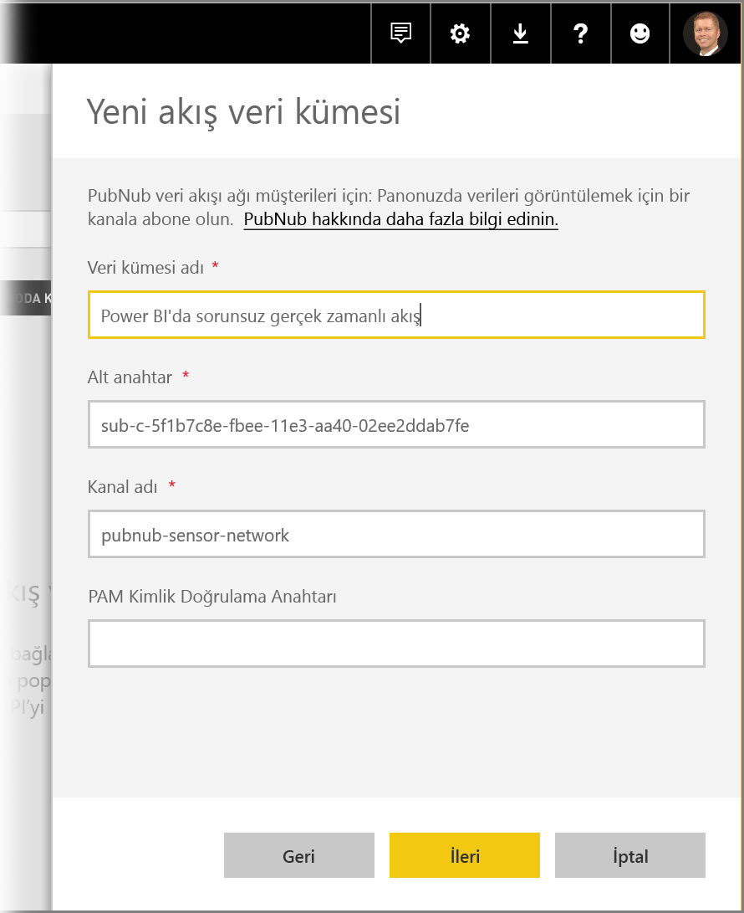
4. Aşağıdaki pencerede, yalnızca varsayılanları seçin (otomatik olarak doldurulur) ve ardından **Oluştur** seçeneğini belirleyin.
   
   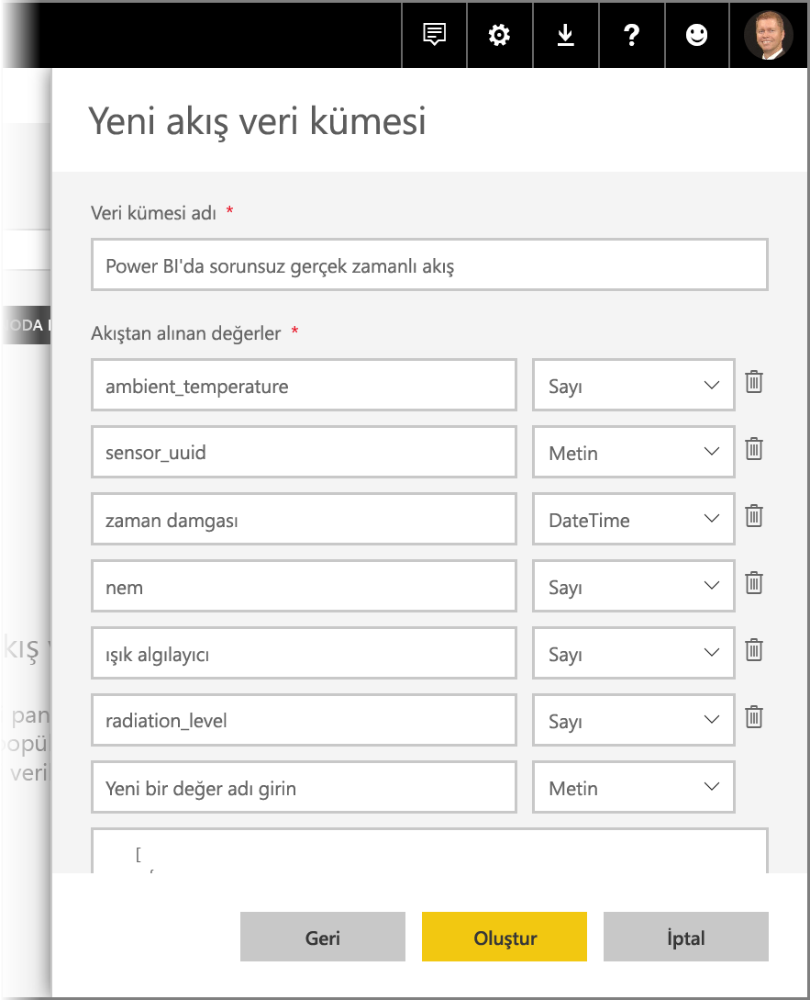
5. Power BI çalışma alanınızda yeni bir pano oluşturun ve ardından bir kutucuk ekleyin. (İhtiyaç duyarsanız gerekli adımlar için yukarıya bakın.) Artık bir kutucuk oluşturup **Özel Akış Verileri**'ni seçtiğinizde, birlikte çalışacağınız bir akış veri kümesine sahip olursunuz. Gerçekleştirebileceğiniz işlemlere göz atabilirsiniz. Çizgi grafiklere *sayı* alanları ekler ve ardından başka kutucuklar oluşturursanız aşağıdakine benzer gerçek zamanlı bir pano elde edebilirsiniz:
   
   

Örnek veri kümesiyle gerçekleştirebileceğiniz işlemleri deneyin. Daha sonra kendi veri kümelerinizi oluşturun ve Power BI'a canlı veri akışı yapın.

## Sorular ve cevaplar
Burada, Power BI'daki gerçek zamanlı akış hakkında sık sorulan bazı sorular ve cevapları bulunmaktadır.

#### Gönderim veri kümelerinde filtre kullanabilir miyim? Peki ya akış veri kümelerindeki?
Ne yazık ki akış veri kümelerinde filtreleme desteklenmez. Gönderim veri kümeleri için rapor oluşturabilir, raporu filtreleyebilir ve ardından filtrelenmiş görselleri bir panoya sabitleyebilirsiniz. Ancak, panoda bulunan bir görselde uygulanan filtreyi değiştirmek mümkün değildir.

Bundan bağımsız olarak, canlı rapor kutucuğunu panoya sabitleyebilir, bu sayede filtreleri değiştirebilirsiniz. Ancak veri gönderildikçe canlı rapor kutucukları gerçek zamanlı olarak güncelleştirilmez; **More** (Daha fazla) menüsündeki *pano kutucuklarını yenile* seçeneğini kullanarak görseli el ile güncelleştirmeniz gerekir.

Milisaniyelik duyarlılığa sahip *Tarih/Saat* alanları içeren gönderim veri kümelerine filtre uygulanırken, *denklik* işleçleri desteklenmez. Ancak, büyüktür (>) veya küçüktür (<) gibi işleçler düzgün şekilde çalışır.

#### Bir gönderim veri kümesindeki son değeri nasıl görürüm? Peki ya akış veri kümelerinde?
Akış veri kümeleri, en son verileri görüntülemek için tasarlanmıştır. Son sayısal değerleri kolayca görmek için **Kart** akış görselini kullanabilirsiniz. Ne yazık ki kart, *Tarih/Saat* veya *Metin* türündeki verileri desteklemez.
Şemada bir zaman damgasına sahip olduğunuzu varsayarsak, gönderim veri kümelerinde son N filtresi içeren bir rapor görseli oluşturmayı da deneyebilirsiniz.

#### Power BI Desktop'ta gönderim veya akış veri kümelerine bağlanabilir miyim?
Ne yazık ki şu anda böyle bir özellik sunulmamaktadır.

#### Önceki soruyu göz önünde bulundurduğumuzda, gerçek zamanlı veri kümeleri üzerinde nasıl modelleme yapabilirim?
Veriler kalıcı olarak depolanmadığı için akış veri kümesi üzerinde modelleme yapmak mümkün değildir. Bir gönderim veri kümesine ölçü ve ilişki eklemek için veri kümesini/tablo REST API'lerini güncelleştirme özelliğini kullanabilirsiniz. 

#### Gönderim veri kümesindeki tüm değerleri nasıl temizleyebilirim? Peki ya akış veri kümelerindeki?
Gönderim veri kümesinde Delete Rows REST API çağrısını kullanabilirsiniz. Şu anda, akış kümelerindeki verileri silmek mümkün değildir, ancak veriler, bir saatin ardından kendi kendine silinir.

#### Power BI’a yönelik olarak ayarladığım Azure Akış Analizi çıkışı Power BI’da görünmüyor. Bunun nedeni nedir?
Sorunu gidermek için kullanabileceğiniz bir denetim listesi aşağıda verilmiştir:

1. Azure Akış Analizi işini yeniden başlatma (GA akış sürümünden önce oluşturulan işler için yeniden başlatma gerekir)
2. Azure Akış Analizi'ndeki Power BI bağlantınızı yeniden yetkilendirmeyi deneme
3. Azure Akış Analizi çıkışında hangi çalışma alanını belirttiniz? Power BI hizmetinde bu (aynı) çalışma alanını mı denetliyorsunuz?
4. Azure Akış Analizi sorgusu açık bir şekilde Power BI çıkışına mı yönlendirilmiş? (INTO anahtar sözcüğü kullanılarak)
5. Azure Akış Analizi işi üzerinde veri akışı mevcut mu? Veri kümesi, yalnızca aktarılmakta olan veriler bulunduğunda oluşturulur.
6. Herhangi bir uyarı veya hata olup olmadığını görmek için Azure Akış Analizi günlüklerine bakabilir misiniz?

## Otomatik sayfa yenileme

Otomatik sayfa yenileme, bir rapor sayfası düzeyinde çalışır ve rapor yazarlarının yalnızca sayfa kullanılırken etkin olan bir sayfadaki görseller için yenileme aralığı ayarlamasına olanak sağlar. Otomatik sayfa yenileme yalnızca DirectQuery veri kaynakları için kullanılabilir. Minimum yenileme aralığı, raporun hangi tür çalışma alanında yayımlandığına ve Premium çalışma alanları için kapasite yönetimi ayarlarına bağlıdır.

[Otomatik sayfa yenileme](desktop-automatic-page-refresh.md) makalesinde otomatik sayfa yenileme hakkında daha fazla bilgi edinin.

## Sonraki adımlar
Burada, Power BI'da gerçek zamanlı akış kullanırken faydalı bulabileceğiniz birkaç bağlantı yer almaktadır:

* [Gerçek zamanlı verilerle Power BI REST API'sine genel bakış](https://docs.microsoft.com/rest/api/power-bi/)
* [Azure Akış Analizi](https://azure.microsoft.com/services/stream-analytics/)

