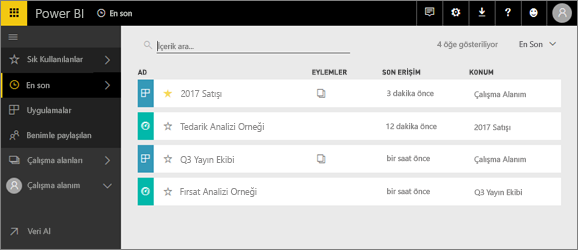
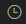
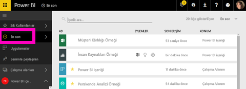

# Power BI hizmetinde **son görüntülenen** içerik

## Son görüntülenen içerik nedir?
Son görüntülenen içerik, en son ziyaret ettiğiniz öğeleri (maksimum 20 öğe) içerir.  Söz konusu öğeler şunları içerir: tüm çalışma alanlarınızdaki panolar, raporlar, uygulamalar ve çalışma kitapları.

Aşağıdaki videoda Amanda, **Son görüntülenen** içerik listelerinin nasıl doldurulduğunu göstermektedir. Bu videoyu izledikten sonra kendiniz denemek için videonun altında bulunan adım adım yönergeleri uygulayın.

<iframe width="560" height="315" src="https://www.youtube.com/embed/G26dr2PsEpk" frameborder="0" allowfullscreen></iframe>

## Son görüntülenen içeriği görüntüleme
En son ziyaret ettiğiniz beş öğeyi görmek için, sol gezinti bölmesinde **Son görüntülenen** sekmesinin sağındaki oku seçin.  Burada, son görüntülenen içeriği seçip açabilirsiniz. Yalnızca son görüntülenen beş öğe listelenir.

Son ziyaret ettiğiniz öğe sayısı beşten fazlaysa Son görüntülenen ekranını açmak için **Tümünü göster**'i seçin. (Aşağıya bakın.) Sol gezinti bölmesinde **Son görüntülenen**'i veya Son görüntülenen simgesini  seçebilirsiniz.

Bu ekranda, [**Panolar**](service-dashboards.md), [**Raporlar**](service-reports.md), **Çalışma Kitapları** sekmelerinde ve [**Uygulamalar**](service-install-use-apps.md) ekranında olduğu gibi içeriklerle etkileşim kurabilirsiniz.

## Sonraki adımlar
[Power BI hizmeti Uygulamaları](service-install-use-apps.md)

Başka bir sorunuz mu var? [Power BI Topluluğu'na başvurun](http://community.powerbi.com/)

