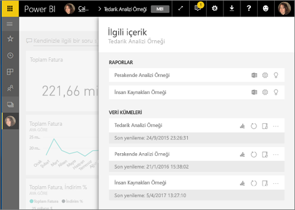
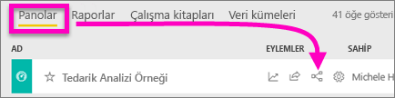
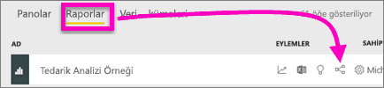
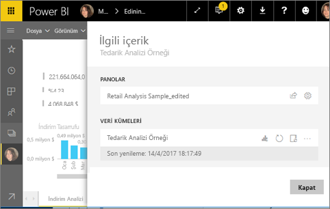
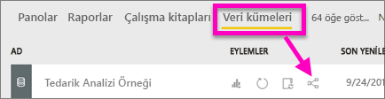
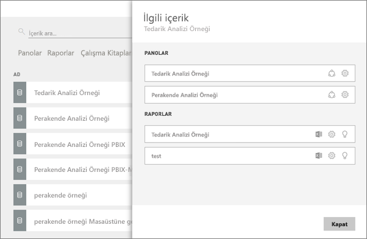

# Power BI hizmetinde ilişkili içeriği görüntüleme
**İlişkili içerik** bölmesi, Power BI hizmet içeriğinizin (panolar, raporlar ve veri kümeleri) birbirine nasıl bağlı olduğunu gösterir.  Ayrıca, bu bölmeden yenileme, yeniden adlandırma, öngörü oluşturma gibi ortak görevleri ve çok daha fazlasını yapabilirsiniz. Bir ilgili rapor veya pano seçin, ardından seçiminiz Power BI çalışma alanınızda açılır.   

Büyük olasılıkla keşfettiğiniz üzere raporlar veri kümeleri temelinde oluşturulmuştur, rapor görselleştirmeleri daha sonra panolara sabitlenir ve pano görselleri raporlara geri bağlanır. Peki hangi panoların Pazarlama raporunuzdaki görselleştirmeleri barındırdığını nasıl bilebilirsiniz? Bu panoları nasıl bulabilirsiniz? Tedarik panonuz birden fazla veri kümesine ait görselleştirmeleri mi kullanıyor? Öyleyse bunların adları nedir ve bunları nasıl açabilir ve düzenleyebilirsiniz? İK veri kümeniz herhangi bir raporda veya panoda kullanılıyor mu ya da herhangi bir bozuk bağlantıya neden olmadan taşınabilir mi? Bu ve benzeri tüm soruların cevapları **İlişkili içerik** bölmesinde verilebilir.  Bölme, ilişkili içeriği görüntülemenin yanı sıra içerik üzerinde işlem yapmanıza ve ilişkili içerik arasında kolayca gezinmenize olanak tanır.

> [!NOTE]
> İlişkili içerik özelliği, akış veri kümeleri için çalışmaz.
> 
> 

## Bir panonun ilişkili içeriğini görüntüleme
Bir panonun ilişkili içeriğini görüntüleyen Will'i izleyin. Ardından Tedarik Analizi örneği veri kümesinde kendiniz denemek için videonun altındaki adım adım yönergeleri uygulayın.

<iframe width="560" height="315" src="https://www.youtube.com/embed/B2vd4MQrz4M#t=3m05s" frameborder="0" allowfullscreen></iframe>

**İlişkili içerik** bölmesini açmak için en azından bir panoyu *görüntüleme* izinleriniz olmalıdır. Bu örnekte [Tedarik Analizi örneğini](sample-procurement.md) kullanıyoruz.

**1. Yöntem**

Bir çalışma alanında **Panolar** sekmesini seçin ve ardından **İlişkilileri görüntüle** simgesini   seçin.

 

**2. Yöntem**

Bir pano açıkken, üst menü çubuğundan    seçeneğini belirleyin.

**İlişkili içerik** bölmesi açılır. Panoya sabitlenmiş görselleştirmeleri bulunan tüm raporları ve bunların ilişkili veri kümelerini gösterir. Bu panoda, 3 farklı rapordan sabitlenmiş görselleştirmeler bulunur ve bu raporlar 3 farklı veri kümesine dayanır.

Burada ilişkili içerik üzerinde doğrudan işlem yapabilirsiniz.  Örneğin, açmak için bir rapor adı seçin.  Listelenen bir raporda [Excel'de çözümleme](service-analyze-in-excel.md), [yeniden adlandırma](service-rename.md) veya [öngörüler alma](service-insights.md) işlemleri için bir simge seçin. Bir veri kümesinde [yeni bir rapor oluşturma](service-report-create-new.md), [yenileme](refresh-data.md), yeniden adlandırma, [Excel'de çözümleme](service-analyze-in-excel.md), [öngörüler alma](service-insights.md) işlemleri için bir simge seçin veya veri kümesinin **Ayarlar** penceresini açın.  

## Bir raporun ilişkili içeriğini görüntüleme
**İlişkili içerik** bölmesini açmak için en azından bir raporu *görüntüleme* izinleriniz olmalıdır. Bu örnekte [Tedarik Analizi örneğini](sample-procurement.md) kullanıyoruz.

**1. Yöntem**

Bir çalışma alanında **Raporlar** sekmesini ve ardından **İlişkilileri görüntüle** simgesini   seçin.

 
**2. Yöntem**

Raporu [Okuma görünümü](service-reading-view-and-editing-view.md)'nde açın ve üst menü çubuğundan    seçeneğini belirleyin.

**İlişkili içerik** bölmesi açılır. İlişkili veri kümesini ve en az bir kutucuğu rapordan sabitlenmiş olan tüm panoları gösterir. Bu raporda, 2 farklı panoya sabitlenmiş görselleştirmeler bulunur.

Burada ilişkili içerik üzerinde doğrudan işlem yapabilirsiniz.  Örneğin, açmak için bir pano adı seçin.  Listedeki bir panoda [panoyu başkalarıyla paylaşmak](service-share-dashboards.md) için bir simge seçin veya panonun **Ayarlar** penceresini açın. Veri kümesinde [yeni bir rapor oluşturma](service-report-create-new.md), [yenileme](refresh-data.md), yeniden adlandırma, [Excel'de çözümleme](service-analyze-in-excel.md), [öngörüler alma](service-insights.md) işlemleri için bir simge seçin veya veri kümesinin **Ayarlar** penceresini açın.  

## Bir veri kümesinin ilişkili içeriğini görüntüleme
**İlişkili içerik** bölmesini açmak için en azından bir veri kümesini *görüntüleme* izinleriniz olmalıdır. Bu örnekte [Tedarik Analizi örneğini](sample-procurement.md) kullanıyoruz.

Bir çalışma alanında **Veri kümeleri** sekmesini seçin ve **İlişkilileri görüntüle** simgesini   bulun.

**İlişkili içerik** bölmesini açmak için simgeyi seçin.

Burada ilişkili içerik üzerinde doğrudan işlem yapabilirsiniz.  Örneğin, açmak için bir pano veya rapor adı seçin.  Listedeki bir panoda [panoyu başkalarıyla paylaşmak](service-share-dashboards.md) için bir simge seçin veya panonun **Ayarlar** penceresini açın. Bir raporda [Excel'de çözümleme](service-analyze-in-excel.md), [yeniden adlandırma](service-rename.md) veya [öngörüler alma](service-insights.md) işlemleri için bir simge seçin.  

## Sınırlamalar ve sorun giderme
* Tarayıcınız yeterli alana sahip değilse **İlişkilileri görüntüle** işlemi için bir seçenek göremezsiniz ancak İlişkilileri görüntüle simgesini    yine de görürsünüz. **İlişkili içerik** bölmesini açmak için simgeyi seçin.
* Bir raporun İlişkili içeriğini görmek için [Okuma görünümü](service-reading-view-and-editing-view.md)'nde olmanız gerekir.
* İlişkili içerik Power BI Desktop'ta kullanılamaz.
* İlişkili içerik özelliği, akış veri kümeleri için çalışmaz.

## Sonraki adımlar
* [Power BI hizmeti ile çalışmaya başlama](service-get-started.md)
* Başka bir sorunuz mu var? [Power BI Topluluğu'na başvurun](http://community.powerbi.com/)

