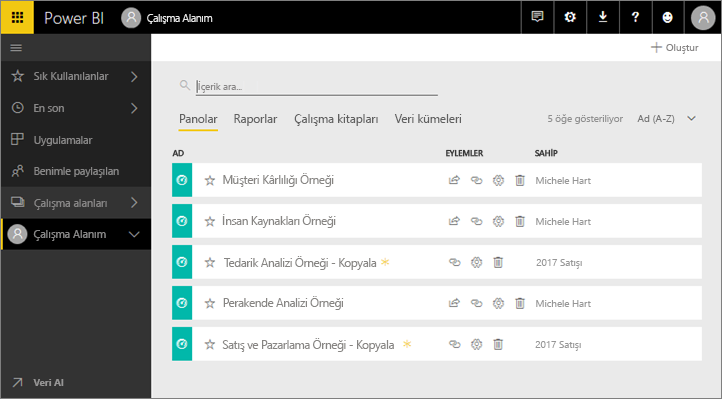
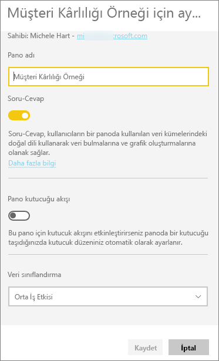
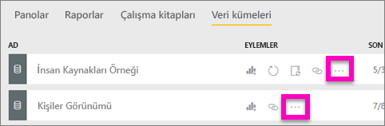
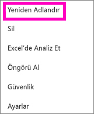
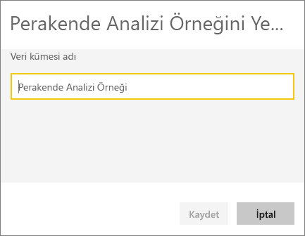
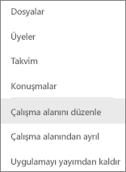
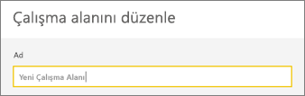
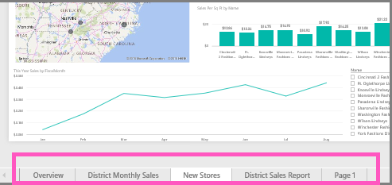
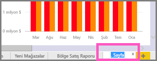
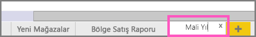

# Power BI hizmetinde hemen hemen her şeyi yeniden adlandırabilirsiniz
Bu makalede, Power BI hizmetindeki bir panoyu, raporu, rapor sayfasını, çalışma kitabını, veri kümesini, uygulamayı ve çalışma alanını yeniden adlandırma ile ilgili bilgiler sunulmaktadır.

**Adı değiştirebilir miyim?**

| İçerik türü | Yazar veya oluşturan mıyım? | Benimle paylaşılıyor mu? |
| --- | --- | --- |
| Bir çalışma alanındaki pano |Evet |Hayır |
| Bir çalışma alanındaki rapor |Evet |Hayır |
| Bir çalışma alanındaki çalışma kitabı |Evet |Hayır |
| Bir çalışma alanındaki veri kümesi |Evet |Hayır |
| Uygulama çalışma alanı |Sahibiyseniz veya Yönetici izinlerine sahipseniz evet |Hayır |
| Yayımlanan uygulamalar |Yönetici izinleriniz varsa uygulama adı, Uygulama ekranından olmasa da uygulama çalışma alanından değiştirilebilir ve yeni bir adla yeniden yayımlanabilir |Hayır |
| Uygulama içeriği (pano, rapor, çalışma kitabı ve veri kümesi) |Yönetici izinleriniz varsa uygulamanın içeriği, Uygulama ekranından olmasa da uygulama çalışma alanından yeniden adlandırılabilir ve yeni bir adla yeniden yayımlanabilir |Hayır |
| **Benimle paylaşılan** bölümündeki içerik |Hayır |Hayır |

## Bir panoyu, raporu veya çalışma kitabını yeniden adlandırma
1. Bir çalışma alanında işleme başlayın ve **Panolar**, **Raporlar**  veya **Çalışma Kitapları** sekmesini seçin. Yeniden adlandırmak için öğenin üzerine gelin ve dişli simgesini  seçin. Dişli simgesinin olmaması yeniden adlandırma iznine sahip olmadığınız anlamına gelir.
   
   
2. Ayarlar sayfasında, yeni adı yazın ve **Kaydet** seçeneğini belirleyin.
   
   

## Bir veri kümesini yeniden adlandırma
1. Bir çalışma alanında işleme başlayın ve **Veri Kümeleri** sekmesini seçin.
   
   
2. Yeniden adlandırmak için öğenin üzerine gelin, üç nokta (...) simgesini ve ardından **Yeniden Adlandır**'ı seçin.  
   
      
   
   > [!NOTE]
   > Açılan menüdeki seçenekler değişiklik gösterir.
   > 
   > 
3. Ayarlar sayfasında, yeni adı yazın ve **Kaydet** seçeneğini belirleyin.
   
     

## Bir Uygulama çalışma alanını yeniden adlandırma
Yönetici izinlerine sahip olan herkes bir uygulama çalışma alanını adlandırabilir.

1. Yeniden adlandırmak istediğiniz çalışma alanında işleme başlayın.
2. Sağ üst köşede üç nokta (...) simgesini seçin ve **Çalışma alanını düzenle** seçeneğini belirleyin. Bu seçeneği görmüyorsanız bu çalışma alanını yeniden adlandırma izniniz yoktur. 
   
    
3. Yeni bir çalışma alanı adı yazın ve **Kaydet** seçeneğini belirleyin.
   
   

## Rapordaki bir sayfayı yeniden adlandırma
Power BI raporunuzdaki bir sayfanın adını sevmiyor musunuz?  Yeni bir ad yalnızca tek tık kadar uzağınızda. [Rapor Düzenleme görünümü'nde](service-interact-with-a-report-in-editing-view.md) sayfalar yeniden adlandırılabilir.

1. [Düzenleme Görünümü](consumer/end-user-reading-view.md)'nde raporu açın.
2. Power BI penceresinin alt tarafında rapor sayfa sekmelerini bulun.
   
    
3. Sekmeyi seçerek, yeniden adlandırmak istediğiniz rapor sayfasını açın.
4. Vurgulamak için sekmedeki ada çift tıklayın.  
   
    
5. Yeni bir rapor sayfası adı yazın ve ENTER tuşuna basın.
   
    

## Önemli noktalar ve sorun giderme
* Yeniden adlandırılacak öğe sizinle paylaşıldıysa veya bir içerik paketinde bulunuyorsa parçasıysa dişli simgesini görmez ve Ayarlar'a erişemezsiniz.
* **Veri Kümeleri** sekmesinde üç nokta (...) simgesini görmüyorsanız tarayıcı pencerenizi genişletin.

Başka bir sorunuz mu var? [Power BI Topluluğu'na başvurun](http://community.powerbi.com/)

