# Veri kümesini içeri aktararak Power BI hizmetinde yeni bir rapor oluşturma
[Power BI'daki raporlar](service-reports.md) başlıklı makaleyi okudunuz ve artık kendi raporlarınızı oluşturmak isteyebilirsiniz. Rapor oluşturmanın birçok farklı yolu vardır. Biz bu makalede ilk olarak Power BI hizmetini kullanarak bir Excel veri kümesinden çok basit bir rapor oluşturacağız. Rapor oluşturma işlemiyle ilgili temel bilgileri kavradığınızda, sayfanın en altında bulunan **Sonraki adımlar** bölümündeki bağlantıları kullanarak raporlarla ilgili daha ileri düzey konulara göz atabilirsiniz.  

> **İPUCU**: Mevcut bir raporu kopyalayarak rapor oluşturmak için bkz. [Bir raporu kopyalama](power-bi-report-copy.md)
> 
### Önkoşullar
- Power BI hizmeti (Power BI Desktop kullanarak raporları oluşturmak için bkz. [Masaüstü rapor görünümü](desktop-report-view.md))  
- Perakende Analizi örnek veri kümesi

## Veri kümesini içeri aktarma
Bu rapor oluşturma yöntemi için bir veri kümesi ve boş bir tuval ile başlayacağız. Birlikte ilerleyebilmemiz için [Retail Analysis Sample adlı Excel veri kümesini indirin](http://go.microsoft.com/fwlink/?LinkId=529778) ve bunu OneDrive İş'e (önerilir) veya yerel bir konuma kaydedin.

1. Raporu bir Power BI hizmeti çalışma alanında oluşturacağımızdan mevcut bir çalışma alanını seçin veya yenisini oluşturun.
   
   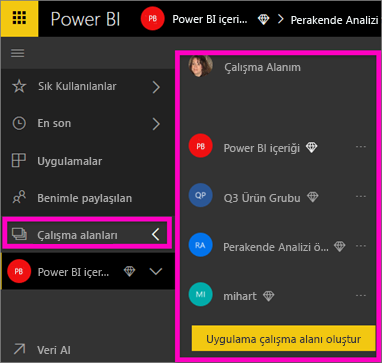
2. Sol gezinti bölmesinin alt tarafında yer alan **Veri al** seçeneğini belirleyin.
   
   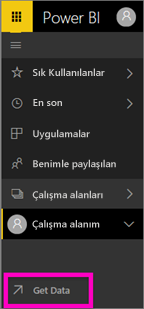
3. **Dosyalar**'ı seçin ve Retail Analysis Sample dosyasını kaydettiğiniz konuma gidin.
   
    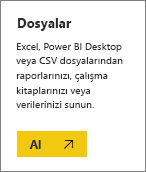
4. Bu alıştırma için **İçeri aktar** seçeneğini belirleyin.
   
   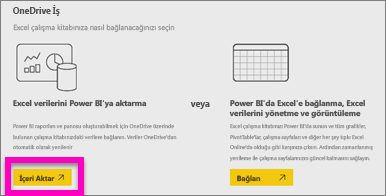
5. Veri kümesi içeri aktarıldıktan sonra **Veri kümesini görüntüle**'yi seçin.
   
   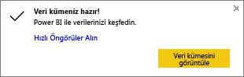
6. Veri kümesi görüntülendiğinde rapor düzenleyicisi açılır.  Boş bir tuval ve rapor düzenleme araçları görürsünüz.
   
   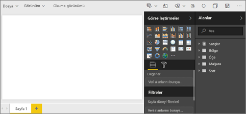

> **İPUCU**: Rapor düzenleme tuvalini daha önce hiç kullanmadıysanız veya bilgilerinizi tazelemeniz gerekiyorsa devam etmeden önce [Rapor düzenleyicisi ile ilgili bir tura katılın](service-the-report-editor-take-a-tour.md).
> 
> 

## Rapora Radyal Ölçer ekleme
Veri kümemiz içeri aktarıldığına göre bazı soruları yanıtlamaya başlayalım.  Pazarlama Müdürümüz (CMO) bu yılki satış hedeflerimize ne kadar yaklaştığımızı öğrenmek istiyor. Bu tür bilgilerin görüntülenmesi için Ölçer, [iyi bir görselleştirme seçimi](power-bi-report-visualizations.md) olacaktır.

1. Alanlar bölmesinde **Sales** > **This Year Sales** > **Değer** seçeneğini belirleyin.
   
    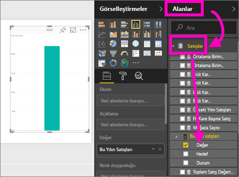
2. **Görselleştirmeler** bölmesinden Ölçer şablonunu  seçerek görseli bir Ölçere dönüştürün.
   
    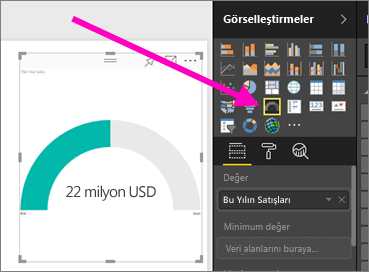
3. **Sales** > **This Year Sales** > **Hedef** alanını **Hedef değer** kutusuna sürükleyin. Hedefimize çok yakın olduğumuzu görüyoruz.
   
    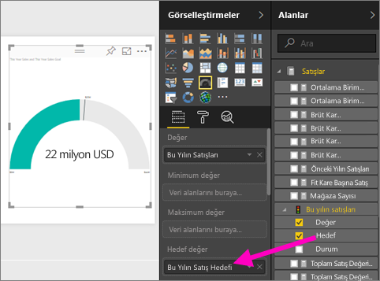
4. Şimdi [raporunuzu kaydedebilirsiniz](service-report-save.md).
   
   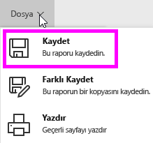

## Rapora alan grafiği ve dilimleyici ekleme
Pazarlama müdürümüzün birkaç sorusuna daha yanıt bulmamız gerekiyor. Pazarlama müdürümüz, bu yıla ait satış verileriyle bir önceki yıla ait verileri karşılaştırmamızı istiyor. Ayrıca, sonuçları bölge temelinde görmek istiyor.

1. Öncelikle tuvalde biraz yer açalım. Ölçer görselleştirmesini seçin ve sağ üst köşeye taşıyın. Ardından, köşelerden birini tutup sürükleyerek görseli küçültün.
2. Ölçerin seçimini kaldırın. Alanlar bölmesinde **Sales** > **This Year Sales** > **Değer** ve ardından **Sales** > **Last Year Sales** seçeneğini belirleyin.
   
    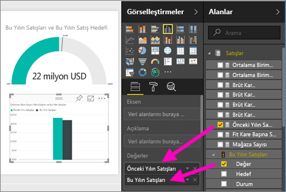
3. **Görselleştirmeler** bölmesinden Alan grafiği şablonunu  seçerek görseli bir Alan grafiğine dönüştürün.
4. **Eksen** kutusuna eklemek üzere **Time** > **Period** seçeneğini belirleyin.
   
    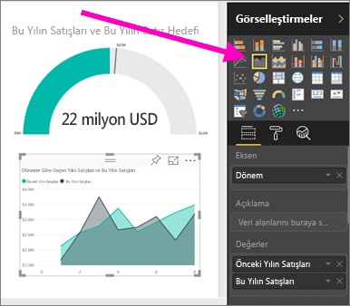
5. Görselleştirmeyi zaman aralığına göre sıralamak için üç noktayı seçin ve **Döneme Göre Sırala** seçeneğini belirleyin.
6. Şimdi de dilimleyiciyi ekleyelim. Tuvalde boş bir alanı ve sonra Dilimleyici     şablonunu seçin. Bu işlemin ardından, tuvalimize boş bir dilimleyici eklenir.
   
        
7. Alanlar bölmesinde **District** > **District** seçeneğini belirleyin. Dilimleyiciyi taşıyın ve yeniden boyutlandırın.
   
    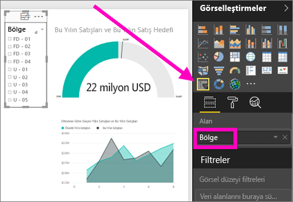  
8. Bölgeye göre belirli desenler ve öngörüler bulmak için dilimleyiciyi kullanın.
   
     

Verilerinizi keşfetmeye ve görsel öğeleri eklemeye devam edin. Özellikle ilgi çekici bilgiler bulduğunuzda [panoya sabitleyin](service-dashboard-pin-tile-from-report.md).

## Sonraki adımlar
* [Rapora yeni bir sayfa ekleme](power-bi-report-add-page.md)  
* [Görselleştirmeleri bir panoya sabitlemeyi](service-dashboard-pin-tile-from-report.md) öğrenin   
* Başka bir sorunuz mu var? [Power BI Topluluğu'na başvurun](http://community.powerbi.com/)

