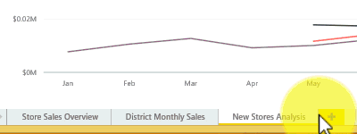

# Power BI'daki bir raporda bulunan sayfaları yeniden sıralama
Power BI'da raporlar bir veya daha fazla sayfadan oluşur.  Her sayfanın at kısmında bir sekme bulunur.  Bir raporu yeniden sıralamak için söz konusu sekmeyi seçmeniz ve yeni konumuna sürüklemeniz yeterlidir.

### Sonraki adımlar
[Power BI'daki raporlar](service-reports.md) ile ilgili daha fazla bilgi edinin  
[Power BI - Temel Kavramlar](service-basic-concepts.md)  
Başka bir sorunuz mu var? [Power BI Topluluğu'na başvurun](http://community.powerbi.com/)

