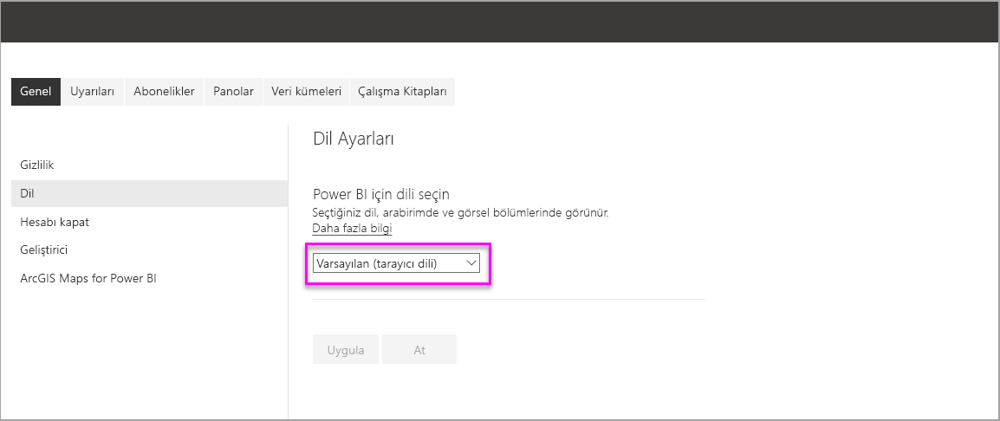
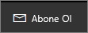
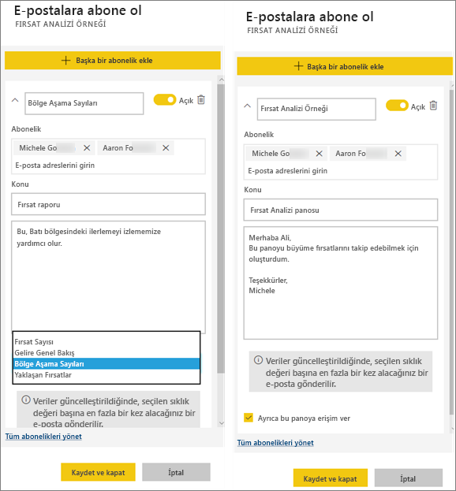
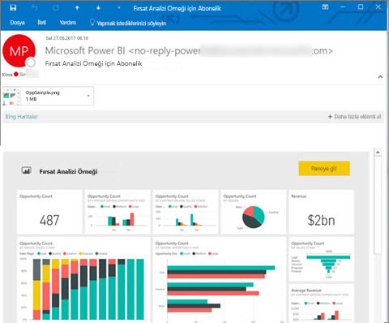
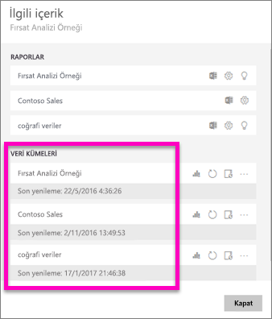
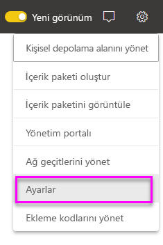
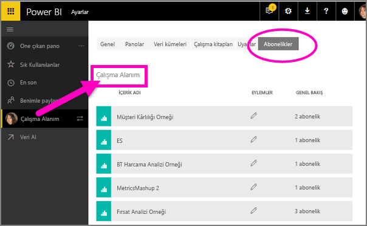

# Power BI hizmetinde bir rapora veya panoya abone olma
En önemli panolarınıza ve raporlarınıza ilişkin en güncel verilere sahip olmak hiç bu kadar kolay olmamıştı. Kendinizi ve iş arkadaşlarınızı en fazla önem verdiğiniz rapor sayfalarına ve panolara abone yaptığınızda Power BI, gelen kutunuza e-posta yoluyla bir anlık görüntü gönderir. Power BI'da e-postaları hangi sıklıkla (günde bir ila haftada bir) almak istediğinizi seçebilirsiniz. 

E-posta ve anlık görüntü, Power BI ayarlarında belirtilen dil ayarını kullanır (bkz. [Power BI için desteklenen diller ve ülkeler/bölgeler](supported-languages-countries-regions.md)). Dil tanımlanmazsa, Power BI geçerli tarayıcınızın yerel ayarına göre seçilen dili kullanır. Dil tercihinizi görmek veya belirlemek için sırasıyla dişli simgesini  > **Ayarlar > Genel > Dil** seçeneklerini belirleyin. 

Abonelikler yalnızca Power BI hizmetinde oluşturulabilir. Aldığınız e-postanın "rapora veya panoya git" bağlantısı içerdiğini göreceksiniz. Power BI uygulamalarının yüklü olduğu mobil cihazlarda bu bağlantı seçildiğinde uygulama başlatılır (Power BI web sitesinde varsayılan olarak gerçekleştirilen, raporu veya panoyu açma işleminin aksine).

## Gereksinimler
- Abonelik **oluşturma** bir Power BI Pro özelliğidir ve bu aboneliği oluşturmak için içeriği (pano veya rapor) düzenleme izinlerine sahip olmanız gerekir. 
- Abonelik e-postaları yalnızca ilişkili bir veri kümesi güncelleştirildiğinde ya da yenilendiğinde gönderildiğinden, abonelikler güncelleştirilmeyen veya yenilenmeyen veri kümelerinde çalışmaz.

## Bir panoya veya rapor sayfasına abone olma
Panoya veya rapora abone olma süreci çok benzerdir. Aynı düğmeyi kullanarak kendinizi (ve başkalarını) Power BI hizmet panolarına ve raporlarına abone yapabilirsiniz.
 
geçin.

1. Panoyu veya raporu açın.
2. Üstteki menü çubuğundan **Abone ol** seçeneğini belirleyin veya zarf simgesini  seçin.
   
   

3. Aboneliği açıp kapatmak için sarı kaydırıcıyı kullanın.  Kaydırıcı Kapalı olarak ayarlandığında abonelik silinmez. Aboneliği silmek için çöp kutusu simgesini seçin.

4. E-posta iletisinin ayrıntıları doldurun. E-postanız önceden doldurulur, ancak aboneliğe başkalarını da ekleyebilirsiniz. Yalnızca aynı etki alanındaki e-posta adresleri eklenebilir (daha ayrıntılı bilgi edinmek için aşağıdaki **Önemli noktalar ve sorun giderme** bölümüne bakın). Rapor veya pano [Premium kapasitede](service-premium.md) barındırılıyorsa tek tek e-posta adreslerini ve grup diğer adlarını kullanarak başkalarını abone yapabilirsiniz. Rapor veya pano Premium kapasitede barındırılmıyorsa, başkalarını tek tek e-posta adreslerini kullanarak yine abone yapabilirsiniz, ancak bu kişilerin de Power BI Pro lisansları olmalıdır.

    Aşağıdaki ekran görüntülerinde, bir rapora abone olduğunuzda aslında bir rapor *sayfasına* abone olduğunuzu görebilirsiniz.  Bir rapordaki birden çok sayfaya abone olmak için **Başka bir abonelik ekle**’yi seçip farklı bir sayfa seçin. 
      
     

5. Aboneliği kaydetmek için **Kaydet ve kapat** seçeneğini belirleyin. Abone olanlar, temel alınan veri kümelerinden herhangi biri değiştiğinde e-posta yoluyla panonun veya rapor sayfasının bir anlık görüntüsünü alır. Pano veya rapor günde birden fazla kez yenilenirse yalnızca ilk yenilemeden sonra e-posta gönderilir.  
   
    
   
   > [!TIP]
   > E-postayı hemen görmek mi istiyorsunuz? Panoyla ilişkili veri kümelerinden birini veya raporla ilişkili veri kümesini yenileyerek bir e-posta tetikleyin. (Veri kümesi için düzenleme izinlerine sahip değilseniz bu izinlere sahip birisinden söz konusu işlemi sizin için gerçekleştirmesini istemeniz gerekir.) Hangi veri kümelerinin kullanıldığını öğrenmek için panodan **İlişkilileri görüntüle** simgesini  seçerek **İlişkili içerik**’i açın ve sonra yenile simgesini  seçin. 
   > 
   > 
   
   

## E-posta zamanlamasını belirleyen unsurlar
Aşağıdaki tabloda, ne sıklıkla e-posta alacağınız açıklanmaktadır. Bu tamamen panonun veya raporun temel aldığı veri kümesinin bağlantı yöntemine (DirectQuery, Canlı bağlantı, Power BI'a aktarma ya da OneDrive'da veya SharePoint Online'daki Excel dosyası) ve belirlenen abonelik seçeneklerine (günlük, haftalık ya da hiçbiri) bağlıdır.

|  | **DirectQuery** | **Live Connect** | **Zamanlanmış yenileme (içeri aktarma)** | **OneDrive'daki/SharePoint Online'daki Excel dosyası** |
| --- | --- | --- | --- | --- |
| **Rapor/pano ne sıklıkla yenilenir?** |15 dakikada bir |Power BI her 15 dakikada bir değişiklikleri denetler ve veri kümesi değiştiyse rapor yenilenir. |Kullanıcı hiçbiri, günlük veya haftalık seçeneğini belirleyebilir. Günlük olarak en fazla 8 yenileme gerçekleştirilebilir. Haftalık seçeneği, aslında kullanıcının yenilemeyi haftada bir kadar az ve günlük ayarı sıklığında olacak şekilde oluşturup ayarladığı haftalık bir zamanlamadır. |Saatte bir |
| **Kullanıcı, abonelik e-posta zamanlaması üzerinde ne kadar denetim sahibidir?** |Seçenekler şunlardır: günlük veya haftalık |Seçenek yok: Raporun yenilenmesi durumunda günde en fazla bir kez olmak üzere kullanıcıya e-posta gönderilir. |Yenileme zamanlaması günlükse seçenekler günlük ve haftalıktır.  Yenileme zamanlaması haftalıksa tek seçenek haftalıktır. |Seçenek yok: Veri kümesi her güncelleştirildiğinde kullanıcıya günde en fazla bir kez olmak üzere e-posta gönderilir. |

## Aboneliklerinizi yönetme
Aboneliği yalnızca oluşturan kişi yönetebilir.  Aboneliklerinizi yönetmeye yönelik ekrana 2 farklı şekilde ulaşabilirsiniz.  İlki **E-postalara abone olun** iletişim kutusundan **Tüm abonelikleri yönet** seçeneğini belirlemektir. (Yukarıdaki 4. adımın altında yer alan ekran görüntülerine bakın.) İkincisi ise üstteki menü çubuğundan Power BI dişli simgesini  seçip **Ayarlar** seçeneğini belirlemektir.

Görüntülenecek abonelikler o sırada etkin olan çalışma alanına bağlıdır.  Tüm çalışma alanları için aboneliklerinizi aynı anda görmek için **Çalışma Alanım**'ın etkin olduğundan emin olun. Çalışma alanlarının anlaşılması konusunda yardım almak için bkz. [Power BI'daki Çalışma Alanları](service-create-distribute-apps.md).

Pro lisansının süresi dolarsa, pano veya rapor sahibi tarafından silinirse veya aboneliğin oluşturulması için kullanılan kullanıcı hesabı silinirse abonelik sona erer.

## Önemli noktalar ve sorun giderme
* Pano e-posta abonelikleri için, satır düzeyi güvenlik (RLS) uygulanan kutucuklar varsa bunlar görüntülenmez.  Rapor e-posta abonelikleri için, veri kümesi RLS kullanıyorsa bir abonelik oluşturamazsınız.
* Rapor sayfası abonelikleri rapor sayfasının adıyla ilişkilidir. Bir rapor sayfasına abone olduktan sonra sayfayı yeniden adlandırırsanız aboneliğinizi yeniden oluşturmanız gerekir
* Kuruluşunuz, Power BI’da e-posta aboneliği kullanımını sınırlayan Azure Active Directory’deki belirli ayarları yapılandırabilir.  Bu sınırlamaların bazıları kaynak erişimi sırasında Multi-Factor Authentication gereksinimi veya IP aralığı kısıtlamaları olabilir.
* Kendiniz dışındaki kullanıcıları abone yaparken canlı bağlantı veri kümeleri kullanan raporlara/panolara yönelik e-posta abonelikleri şu anda desteklenmiyor.
* E-posta abonelikleri ve canlı bağlantı veri kümeleri için yalnızca veri değişikliği olduğunda e-posta alırsınız. Bu nedenle, bir yenileme gerçekleşir ancak veri değişikliği olmazsa Power BI size e-posta göndermez.
* E-posta abonelikleri çoğu [özel görseli](power-bi-custom-visuals.md) desteklemez.  Bu konudaki tek istisna, [sertifikalı](power-bi-custom-visuals-certified.md) özel görsellerdir.  
* E-posta abonelikleri şu anda R tarafından desteklenen özel görselleri desteklemiyor.  
* Pano kutucuklarına satır düzeyi güvenlik (RLS) uygulandıysa, söz konusu kutucuklar görüntülenmez.
* Diğer kullanıcıları satır düzeyi güvenlik (RLS) uygulanmış olan bir rapora abone yapamazsınız.
* E-posta abonelikleri raporun varsayılan filtresi ve dilimleyici durumları ile gönderilir. Abone olduktan sonra varsayılanlarda yaptığınız hiçbir değişiklik e-postada gösterilmez.    
* E-posta abonelikleri, Power BI Desktop hizmete canlı bağlanma özelliği ile oluşturulmuş rapor sayfalarında henüz desteklenmemektedir.    
* Özellikle pano abonelikleri için belirli kutucuk türleri henüz desteklenmemektedir.  Bu kutucuk türleri şunlardır: akış kutucukları, video kutucukları ve özel web içeriği kutucukları.     
* Bir panoyu kiracınız dışındaki bir iş arkadaşıyla paylaşıyorsanız bu iş arkadaşı için bir de abonelik oluşturma imkanınız olmaz. Bu nedenle, siz aaron@xyz.com kişisiyseniz anyone@ABC.com kişisiyle paylaşım yapabilirsiniz, ancak henüz anyone@ABC.com kişisini abone yapamazsınız ve bu kişi paylaşılan içeriğe abone olamaz.      
* E-posta boyutu sınırları nedeniyle, çok büyük resimler içeren panolarda veya raporlarda abonelikler başarısız olabilir.    
* Power BI, 2 aydan daha uzun bir süredir ziyaret edilmemiş panolar ve raporlar ile ilişkili veri kümelerinde yenilemeyi otomatik olarak duraklatır.  Ancak bir panoya veya rapora abonelik eklerseniz bu abonelik ziyaret edilmese bile duraklatılmaz.    
* Abonelik e-postalarını almıyorsanız Kullanıcı Asıl Adınızın (UPN) e-posta alabildiğinden emin olun. [Power BI ekibi şu anda bu gereksinimi esnetmek için çalışıyor](https://community.powerbi.com/t5/Issues/No-Mail-from-Cloud-Service/idc-p/205918#M10163), bu nedenle takipte kalın. 
* Panonuz veya raporunuz Premium kapasitedeyse iş arkadaşlarını her seferinde bir e-posta adresi girerek abone yapmak yerine abonelikler için grup e-postası diğer adını kullanabilirsiniz. Diğer adlar için geçerli Active Directory temel alınır. 

## Sonraki adımlar
* Başka bir sorunuz mu var? [Power BI Topluluğu'na sorun](http://community.powerbi.com/)    
* [Blog gönderisini okuyun](https://powerbi.microsoft.com/blog/introducing-dashboard-email-subscriptions-a-360-degree-view-of-your-business-in-your-inbox-every-day/)

