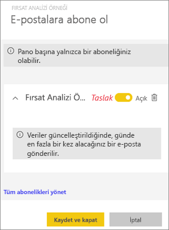
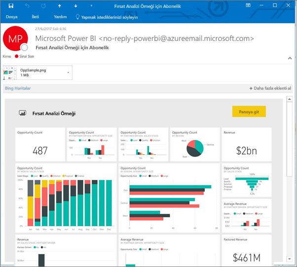
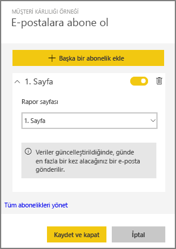
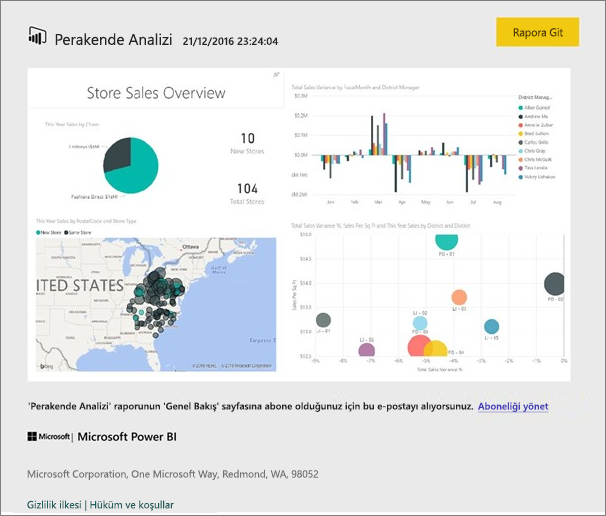
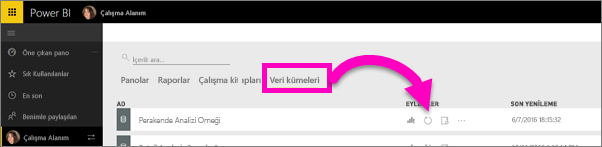

# Power BI hizmetinde bir rapora veya panoya abone olma (app.powerbi.com)
En önemli panolarınıza ve raporlarınıza ilişkin en güncel verilere sahip olmak hiç bu kadar kolay olmamıştı. Sizin için en fazla önem taşıyan rapor sayfalarına ve panolara abone olduğunuzda Power BI, gelen kutunuza e-posta yoluyla bir anlık görüntü gönderir. Power BI'da e-postaları hangi sıklıkla (günde bir ila haftada bir) almak istediğinizi seçebilirsiniz. 

E-posta ve anlık görüntü, Power BI ayarlarında belirtilen dil ayarını kullanır (bkz. [Power BI için desteklenen diller ve ülkeler/bölgeler](supported-languages-countries-regions.md)). Dil tanımlanmazsa, Power BI geçerli tarayıcınızın yerel ayarına göre seçilen dili kullanır. Dil tercihinizi görmek veya belirlemek için dişli simgesini  seçin ve **Ayarlar > Genel > Dil** seçeneğini belirleyin. 

> [!NOTE]
> Abonelikler yalnızca Power BI hizmetinde oluşturulabilir. Aldığınız e-postanın "rapora/panoya git" bağlantısı içerdiğini göreceksiniz. Power BI uygulamalarının yüklü olduğu mobil cihazlarda bu bağlantı seçildiğinde uygulama başlatılır (Power BI web sitesinde varsayılan olarak gerçekleştirilen, raporu veya panoyu açma işleminin aksine).
> 
> 

Sirui'nin bir rapor için e-posta aboneliği ayarlamasını izleyin. Ardından kendiniz denemek için videonun altındaki adım adım yönergeleri uygulayın.

<iframe width="560" height="315" src="https://www.youtube.com/embed/saQx7G0pxhc" frameborder="0" allowfullscreen></iframe>

## Gereksinimler
Abonelik **oluşturma** bir Power BI Pro özelliğidir ve içerik (pano veya rapor) için görüntüleme veya düzenleme izinlerine sahip olmanız gerekir.

## Bir panoya abone olma

1. Panoyu açın.
2. Üstteki menü çubuğundan **Abone ol** seçeneğini belirleyin veya zarf simgesini  seçin.
   
   
3. Aboneliği açıp kapatmak için sarı kaydırıcıyı kullanın.  Kaydırıcı Kapalı olarak ayarlandığında abonelik silinmez. Aboneliği silmek için çöp kutusu simgesini seçin.
   
   
4. Aboneliği kaydetmek için **Kaydet ve kapat** seçeneğini belirleyin. Temel alınan veri kümelerinden herhangi biri değiştiğinde e-posta yoluyla panonun bir ekran görüntüsünü alırsınız. Panoda günde birden fazla yenileme işlemi gerçekleştiriliyorsa yalnızca ilk yenilemeden sonra e-posta üzerinden anlık görüntüyü alırsınız.
   
   
   
   > [!TIP]
   > E-postayı hemen görmek mi istiyorsunuz? Panoyla ilişkili veri kümelerinden birini yenileyerek bir e-posta tetikleyin. (Veri kümesi için düzenleme izinlerine sahip değilseniz bu izinlere sahip birisinden söz konusu işlemi sizin için gerçekleştirmesini istemeniz gerekir.) Panonun oluşturulmasında hangi veri kümelerinin kullanıldığını öğrenmek için panodan **İlişkilileri görüntüle** simgesini  seçerek **İlişkili içerik**’i açın ve sonra yenile simgesini  seçin. 
   > 
   > 
   
   

## Bir rapor sayfasına abone olma
1. Raporu [Okuma görünümü](service-reading-view-and-editing-view.md)'nde açın.
2. Üstteki menü çubuğundan **Abone ol** seçeneğini belirleyin.
   
   
3. Tek seferde yalnızca bir rapor sayfasına abone olabilirsiniz. Açılan menüden istediğiniz rapor sayfasını seçin.
   
   
   
   Rapor sayfaları eklemeye devam edin.
4. Her bir sayfaya ilişkin aboneliği açıp kapatmak için sarı kaydırıcıyı kullanın.  Kaydırıcı Kapalı olarak ayarlandığında abonelik silinmez. Aboneliği silmek için çöp kutusu simgesini seçin.
   
   
5. Aboneliği kaydetmek için **Kaydet ve kapat** seçeneğini belirleyin. Rapor yenilendiğinde her rapor sayfasının anlık görüntüsünü içeren bir e-posta alırsınız. Raporun yenilenmediği günler anlık görüntü almazsınız.  Raporda günde birden fazla yenileme gerçekleşiyorsa yalnızca ilk yenilemeden sonra e-posta ile anlık görüntü alırsınız.
   
   
   
   > [!TIP]
   > E-postayı hemen görmek mi istiyorsunuz? Veri kümenizi açıp **Şimdi yenile** seçeneğini belirleyerek bir e-postayı tetikleyebilirsiniz. Veri kümesi için düzenleme izinlerine sahip değilseniz bu izinlere sahip birisinden bu işlemi sizin için gerçekleştirmesini istemeniz gerekir.
   > 
   > 
   > 
   > 

## Raporlar için e-posta zamanlamasını belirleme
Aşağıdaki tabloda, ne sıklıkla e-posta alacağınız açıklanmaktadır. Bu tamamen panonun veya raporun temel aldığı veri kümesinin bağlantı yöntemine (DirectQuery, Canlı bağlantı, Power BI'a aktarma ya da OneDrive'da veya SharePoint Online'daki Excel dosyası) ve belirlenen abonelik seçeneklerine (günlük, haftalık ya da hiçbiri) bağlıdır.

|  | **DirectQuery** | **Live Connect** | **Zamanlanmış yenileme (içeri aktarma)** | **OneDrive'daki/SharePoint Online'daki Excel dosyası** |
| --- | --- | --- | --- | --- |
| **Rapor/pano ne sıklıkla yenilenir?** |15 dakikada bir |Power BI her 15 dakikada bir değişiklikleri denetler ve veri kümesi değiştiyse rapor yenilenir. |Kullanıcı hiçbiri, günlük veya haftalık seçeneğini belirleyebilir. Günlük olarak en fazla 8 yenileme gerçekleştirilebilir. Haftalık seçeneği, aslında kullanıcının yenilemeyi haftada bir kadar az ve günlük ayarı sıklığında olacak şekilde oluşturup ayarladığı haftalık bir zamanlamadır. |Saatte bir |
| **Kullanıcı, abonelik e-posta zamanlaması üzerinde ne kadar denetim sahibidir?** |Seçenekler şunlardır: günlük veya haftalık |Seçenek yok: Raporun yenilenmesi durumunda günde en fazla bir kez olmak üzere kullanıcılara e-posta gönderilir. |Yenileme zamanlaması günlükse seçenekler günlük ve haftalıktır.  Yenileme zamanlaması haftalıksa tek seçenek haftalıktır. |Seçenek yok: Veri kümesi her güncelleştirildiğinde kullanıcıya günde en fazla bir kez olmak üzere e-posta gönderilir. |

## Aboneliklerinizi yönetme
Aboneliklerinizi yönetmeye yönelik ekrana 2 farklı şekilde ulaşabilirsiniz.  İlki **E-postalara abone olun** iletişim kutusundan **Tüm abonelikleri yönet** seçeneğini belirlemektir. (Yukarıdaki 3. adıma bakın.) İkincisi ise üstteki menü çubuğundan Power BI dişli simgesini  seçip **Ayarlar** seçeneğini belirlemektir.

Görüntülenecek abonelikler o sırada etkin olan çalışma alanına bağlıdır.  Tüm çalışma alanları için aboneliklerinizi aynı anda görmek için **Çalışma Alanım**'ın etkin olduğundan emin olun. Çalışma alanlarının anlaşılması konusunda yardım almak için bkz. [Power BI'daki Çalışma Alanları](service-create-distribute-apps.md).

Pro lisansının süresi dolarsa abonelik sona erer; pano veya rapor, sahibi tarafından silinir ve aboneliğin oluşturulması için kullanılan kullanıcı hesabı silinir.

## Önemli noktalar ve sorun giderme
* İçerik paketlerinden veya Power BI uygulamalarından gelen raporlar için abone olma seçeneği şu anda kullanılamaz. Ancak geçici bir çözüm kullanılabilir: Raporun/panonun kopyasını oluşturun ve abonelikleri söz konusu sürüme ekleyin.
* Rapor sayfası abonelikleri rapor sayfasının adıyla ilişkilidir. Bir rapor sayfasına abone olduktan sonra sayfayı yeniden adlandırırsanız aboneliğinizi yeniden oluşturmanız gerekir
* E-posta abonelikleri ve canlı bağlantı veri kümeleri için yalnızca veri değişikliği olduğunda e-posta alırsınız. Bu nedenle, bir yenileme gerçekleşir ancak veri değişikliği olmazsa Power BI size e-posta göndermez.
* E-posta abonelikleri çoğu [özel görseli](power-bi-custom-visuals.md) desteklemez.  Bu konudaki tek istisna, [sertifikalı](power-bi-custom-visuals-certified.md) özel görsellerdir.  
* E-posta abonelikleri raporun varsayılan filtresi ve dilimleyici durumları ile gönderilir. Abone olmadan önce varsayılanlarda yaptığınız hiçbir değişiklik e-postada gösterilmez.    
* E-posta abonelikleri, Power BI Desktop hizmete canlı bağlanma özelliği ile oluşturulmuş rapor sayfalarında henüz desteklenmemektedir.    
* Özellikle pano abonelikleri için belirli kutucuk türleri henüz desteklenmemektedir.  Bu kutucuk türleri şunlardır: akış kutucukları, video kutucukları ve özel web içeriği kutucukları.     
* Kiracınızda bulunmayan bir iş arkadaşınızla pano paylaşmanız durumunda, iş arkadaşınız panoya veya ilişkili rapor sayfalarına abone olamaz. Örneğin, aaron@xyz.com iseniz anyone@ABC.com ile paylaşımda bulunabilirsiniz.  Ancak anyone@ABC.com, paylaşılan içeriğe abone olamaz.    
* E-posta boyutu sınırları nedeniyle, çok büyük resimler içeren panolarda veya raporlarda abonelikler başarısız olabilir.    
* Power BI, 2 aydan daha uzun bir süredir ziyaret edilmemiş panolar ve raporlar ile ilişkili veri kümelerinde yenilemeyi otomatik olarak duraklatır.  Ancak bir panoya veya rapora abonelik eklerseniz bu abonelik ziyaret edilmese bile duraklatılmaz.    
* Abonelik e-postalarını almıyorsanız Kullanıcı Asıl Adınızın (UPN) e-posta alabildiğinden emin olun. [Power BI ekibi şu anda bu gereksinimi esnetmek için çalışıyor](https://community.powerbi.com/t5/Issues/No-Mail-from-Cloud-Service/idc-p/205918#M10163), bu nedenle takipte kalın. 
* Gönderilmiş raporlar ve panolar, Power BI dil ayarınızı kullanır. İngilizce varsayılan dildir. Dil tercihinizi görmek veya belirlemek için dişli simgesini  seçin ve **Ayarlar > Genel > Dil** seçeneğini belirleyin.

## Sonraki adımlar
* Başka bir sorunuz mu var? [Power BI Topluluğu'na sorun](http://community.powerbi.com/)    
* [Blog gönderisini okuyun](https://powerbi.microsoft.com/blog/introducing-dashboard-email-subscriptions-a-360-degree-view-of-your-business-in-your-inbox-every-day/)

