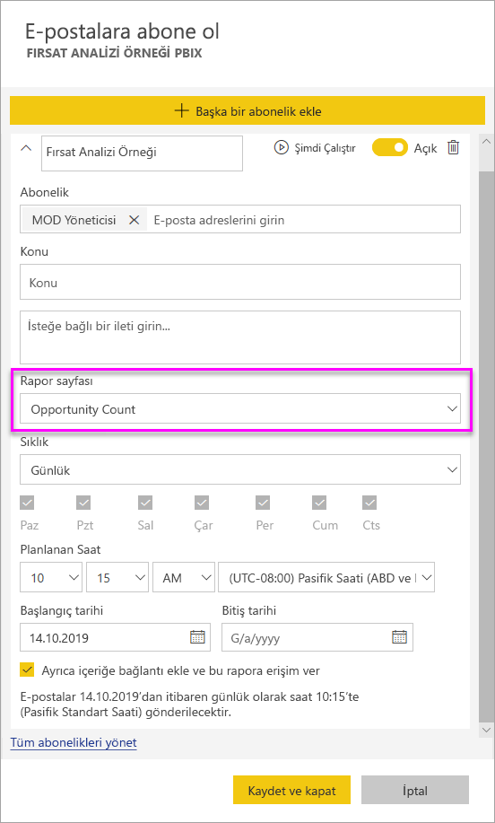

# Kendinizi ve başkalarını Power BI hizmetinde raporlara ve panolara abone yapma

Kendinizi ve iş arkadaşlarınızı, sizin için en önemli rapor sayfalarına, panolara ve sayfalandırılmış raporlara abone yapabilirsiniz. Power BI e-posta abonelikleri şunları yapmanızı sağlar:

- Power BI’da e-postaları hangi sıklıkla almak istediğinize karar verme: günlük, haftalık, saatlik, aylık veya ilk veri yenilemesinden sonra günde bir kez.
- Günlük, haftalık, saatlik veya aylık seçtiyseniz, e-postayı almak istediğiniz saati seçme.
- Her Power BI raporu veya panosu için 24 farklı abonelik ayarlama.  Sayfalandırılmış raporlar için ayarlayabileceğiniz abonelik sayısıyla ilgili bir sınırlama yoktur.
- Raporun bir resmini ve raporun hizmetteki bağlantısını içeren bir e-posta gönderilmesini sağlama.  Power BI uygulamalarının yüklü olduğu mobil cihazlarda bu bağlantı seçildiğinde rapor veya pano Power BI web sitesinde açılmaz. Bunun yerine Power BI uygulaması başlatılır.
- Sayfalandırılmış rapora abone olduysanız, tam raporu ekleme.
- Power BI içeriğiniz Premium kapasitede barındırılıyorsa kiracınızın dışındaki kullanıcılara e-posta gönderme.  Yöneticiler Power BI yönetim merkezindeki mevcut dış paylaşım denetimi ayarlarından yararlanarak kimlerin dış kullanıcılara e-posta abonelikleri gönderme erişimi olacağını denetleyebilir.

 

## Gereksinimler

Aşağıdaki kullanıcılar tarafından abonelik **oluşturulabilir**:

- Power BI Pro lisansı olan kullanıcılar 
- Premium bir çalışma alanında veya uygulamada içerik görüntüleyen kullanıcılar, burada bulunan içeriğe Power BI Pro lisansı olmadan da abone olabilir. 

Kendinize abonelik oluşturmak için içeriği (pano veya rapor) düzenleme izinleriniz olması gerekmez, ancak başkası için abonelik oluşturacaksanız düzenleme izinleriniz olmalıdır.

## Bir panoya, rapor sayfasına veya sayfalandırılmış rapora abone olma

Panoya, rapora veya sayfalandırılmış rapora abone olma süreçleri birbirine benzerdir. Aynı düğmeyi kullanarak Power BI hizmet panolarına ve raporlarına abone olabilirsiniz.

Sayfalandırılmış raporlara abone olmak biraz farklıdır. Ayrıntıları için bkz. [Kendinizi ve başkalarını Power BI hizmetinde sayfalandırılmış rapora abone yapma](consumer/paginated-reports-subscriptions.md).
 
.

1. Panoyu veya raporu açın.
2. Üstteki menü çubuğundan **Abone ol** seçeneğini belirleyin veya zarf simgesini  seçin.
   
    

1. Aboneliği açıp kapatmak için sarı kaydırıcıyı kullanın. Kaydırıcı **Kapalı** olarak ayarlandığında abonelik silinmez. Aboneliği silmek için çöp kutusu simgesini seçin.

2. E-postanız zaten **Abone ol** kutusundadır. Aboneliğe aynı etki alanındaki başka e-posta adresleri de ekleyebilirsiniz. Rapor veya pano [Premium kapasitede](/service-premium-what-is) barındırılıyorsa, sizin etki alanınızda olup olmadıklarına bakılmaksızın tek tek e-posta adreslerini ve grup diğer adlarını abone yapabilirsiniz. Rapor veya pano Premium kapasitede barındırılmıyorsa, başkalarını yine abone yapabilirsiniz ama o kişilerin de Power BI Pro lisansları olmalıdır. Ayrıntılar için aşağıdaki [Önemli noktalar ve sorun giderme](#considerations-and-troubleshooting) bölümüne bakın.

3. E-posta iletisinin **Konu** ve **İleti** ayrıntılarını doldurun.

4. Aboneliğiniz için **Sıklık** seçin:  **Günlük**, **Saatlik**, **Haftalık**, **Aylık**, veya **Veri Yenilemesinden Sonra (Günlük)** . Abonelik e-postasını yalnızca belirli günlerde almak için **Saatlik** veya **Haftalık** seçeneklerinden birini belirleyip bunu hangi günlerde almak istediğinizi belirtin. Örneğin abonelik e-postasını yalnızca iş günleri almak istiyorsanız **Haftalık** seçeneğini belirtin ve **Cts** ile **Paz** kutularının işaretini kaldırın. **Aylık** seçerseniz abonelik e-postalarını ayın hangi günlerinde almak istediğinizi belirtin.

5. **Günlük**, **Saatlik**, **Aylık** veya **Haftalık**’ı seçerseniz abonelik için **Zamanlanan Saat**’i de seçebilirsiniz. Bir saat ya da 15, 30 veya 45 dakika geçince çalıştırabilirsiniz. Sabah (AM) veya öğleden sonra/akşam (PM) ayarını seçin. Saat dilimini de belirtebilirsiniz. **Saatlik**’i seçerseniz aboneliğin başlamasını istediğiniz **Zamanlanan Saat**’i belirtin. E-posta, bu ayardan sonraki her saat çalışır.

6. Varsayılan olarak, aboneliğinizin başlangıç tarihi aboneliği oluşturduğunuz tarihtir. İsterseniz bir bitiş tarihi belirleyebilirsiniz. Siz bir bitiş tarihi ayarlamazsanız, otomatik olarak başlangıç tarihinden bir yıl sonrası olarak belirlenir. Bu tarihi, aboneliğiniz bitmeden önce gelecekte istediğiniz herhangi bir tarihle değiştirebilirsiniz (en fazla 9999 yıl). Abonelik bitiş tarihine ulaşıldığında, siz yeniden etkinleştirene kadar abonelik durdurulur. Zamanlanan bitiş tarihinden önce, süreyi uzatmayı isteyip istemediğinizi soran bildirimler alırsınız.

    Aşağıdaki ekran görüntüsünde, bir rapora abone olduğunuzda aslında bir rapor _sayfasına_ abone olduğunuzu görebilirsiniz. Bir rapordaki birden çok sayfaya abone olmak için **Başka bir abonelik ekle**’yi seçip farklı bir sayfa seçin.
     
      

1. (İsteğe bağlı) Power BI’daki içeriğe götüren bir bağlantı eklenip eklenmeyeceğini ve kullanıcılara abone yaptığınız içeriğe erişim verilip verilmeyeceğini seçin.  Bağlantı eklemeyi seçerseniz en iyi deneyimi elde etmek için tüm kullanıcıların rapora erişimi olduğundan emin olun.
2. **Kaydet ve kapat**’ı seçin. Abone olan kişiler seçtiğiniz sıklıkta ve saatlerde e-postayla pano veya rapor sayfasının anlık görüntüsünü alır. Toplamda rapor veya pano başına en fazla 24 abonelik oluşturabilirsiniz ve her abonelik için benzersiz alıcılar, saatler ve sıklıklar sağlayabilirsiniz. Panonuz veya raporunuz için **Veri Yenilemesinden Sonra** olarak ayarlanan tüm abonelikler, yine de yalnızca zamanlanmış ilk yenilemeden sonra e-posta gönderir.

    > [!TIP]
    > Abonelikten e-postayı hemen mi yoksa isteğe bağlı olarak herhangi bir zamanda mı göndermek istiyorsunuz? Göndermek istediğiniz panonun veya raporun abonelikleri için **Şimdi Çalıştır**’ı seçin. Bu abonelik için herkese e-posta gönderildiğine ilişkin bir bildirim görürsünüz. Bu eylemi uygularsanız, Rapor veya pano başına günde 24 zamanlanmış abonelik çalıştırması sınırınızda bu hesaba katılmaz. Temel alınan veri kümesi için bir veri yenilemesi TETİKLEMEZ.
    >

## Aboneliklerinizi yönetme

Aboneliği yalnızca oluşturan kişi yönetebilir. Aboneliklerinizi yönetmeye yönelik ekrana iki farklı şekilde ulaşabilirsiniz. İlki **E-postalara abone olun** iletişim kutusundan **Tüm abonelikleri yönet** seçeneğini belirlemektir (yukarıdaki 4. adıma bakın). İkincisi ise üstteki menü çubuğundan Power BI dişli simgesini  seçip **Ayarlar** seçeneğini belirlemektir.

Görüntülenen abonelikler o sırada etkin olan çalışma alanına bağlıdır. Tüm çalışma alanları için aboneliklerinizi aynı anda görmek için **Çalışma Alanım**'ın etkin olduğundan emin olun. Çalışma alanlarının anlaşılması konusunda yardım almak için bkz. [Power BI'daki Çalışma Alanları](service-create-workspaces.md).

Aşağıdaki durumlardan herhangi birinde abonelik sona erer:

- Pro lisansının süresi dolmuştur.
- Sahibi panoyu veya raporu silmiştir.
- Aboneliği oluştururken kullanılan kullanıcı hesabı silinmiştir.

Power BI yöneticileri aboneliklerle ilgili ayrıntıları görüntülemek için Power BI denetim günlüklerini kullanabilir. Bu ayrıntılar şunlardır:

- Oluşturan
- Oluşturma Tarihi
- Abone Olunan İçerik
- Alıcılar
- Sıklık
- Değiştiren/
- Değiştirme Tarihi

## Önemli noktalar ve sorun giderme

### Genel

- E-posta aboneliklerinin, alıcılarına teslim edilmesi nadiren beş dakikadan uzun sürebilir. Bu durumda, veri yenilemenizin çalıştırılmasını ve zamanında teslimden emin olunması için e-posta aboneliklerinin farklı zamanlarda e-postayla gönderilmesini öneririz. Sorun devam ederse, Power BI desteğiyle iletişime geçin.
- Abonelik e-postalarının istenmeyen posta klasörüne gitmesini önlemek için, kişilerinize Power BI e-posta diğer adını ([no-reply-powerbi@microsoft.com](mailto:no-reply-powerbi@microsoft.com)) ekleyin. Microsoft Outlook kullanıyorsanız diğer ada sağ tıklayın ve **Outlook kişilerine ekle**’yi seçin.
- Kendiniz dışındaki kullanıcıları abone yaparken, sayfalandırılmış raporlar haricinde canlı bağlantı veri kümeleri kullanan raporlara ve panolara yönelik e-posta abonelikleri şu anda desteklenmiyor. Güvenlik bağlamınızı kullanarak diğer kullanıcıları sayfalandırılmış raporlara abone yapabilirsiniz. [Sayfalandırılmış raporlara abone olma](consumer/paginated-reports-subscriptions.md) hakkında daha fazla bilgi edinin.
- Power BI, 2 aydan daha uzun bir süredir ziyaret edilmemiş panolar ve raporlar ile ilişkili veri kümelerinde yenilemeyi otomatik olarak duraklatır. Ancak bir panoya veya rapora abonelik eklerseniz bu abonelik ziyaret edilmese bile duraklatılmaz.
- Abonelik e-postalarını almıyorsanız Kullanıcı Asıl Adınızın (UPN) e-posta alabildiğinden emin olun.
- Panonuz veya raporunuz Premium kapasitedeyse iş arkadaşlarını her seferinde bir e-posta adresi girerek abone yapmak yerine abonelikler için grup e-postası diğer adını kullanabilirsiniz. Diğer adlar için geçerli Active Directory temel alınır.

### Panolar

- Üzerinde 25’ten fazla sabitlenmiş kutucuk veya 4 sabitlenmiş canlı rapor sayfası olan panolar, kullanıcılara gönderilen abonelik e-postalarında tam olarak işlenemeyebilir. Bu sayıdan fazla kutucuk bulunan panolara abonelik engellenmez. Ancak, sorunlarla karşılaşırsanız desteklenmeyen olarak kabul edilirler. Desteklenen aralıkta yer almak için bunları uygun şekilde değiştirmeyi değerlendirin.
- E-posta aboneliklerinin, alıcılarına teslim edilmesi nadiren beş dakikadan uzun sürebilir. Bu durumda, veri yenilemenizin çalıştırılmasını ve zamanında teslimden emin olunması için e-posta aboneliklerinin farklı zamanlarda e-postayla gönderilmesini öneririz. Sorun devam ederse, Power BI desteğiyle iletişime geçin.
- Pano e-posta abonelikleri için, satır düzeyi güvenlik (RLS) uygulanan kutucuklar varsa, bu kutucuklar görüntülenmez.
- Pano abonelikleri için belirli kutucuk türleri henüz desteklenmiyor. Bu kutucuk türleri şunlardır: akış kutucukları, video kutucukları ve özel web içeriği kutucukları.
- Bir panoyu kiracınız dışındaki bir iş arkadaşıyla paylaşıyorsanız, pano Premium çalışma alanında veya uygulamada *yer almadığı* sürece bu iş arkadaşı için bir de abonelik oluşturamazsınız. Bu nedenle, siz aaron@contoso.com kişisiyseniz anyone@fabrikam.com kişisiyle paylaşım yapabilirsiniz, ancak henüz anyone@fabrikam.com kişisini abone yapamazsınız ve bu kişi paylaşılan içeriğe abone olamaz.

### Raporlar

- Rapor e-posta abonelikleri için, veri kümesi RLS kullanıyorsa, kendiniz için bir abonelik oluşturabilirsiniz. Başkalarını, sayfalandırılmış raporlar haricinde satır düzeyi güvenlik (RLS) uygulanmış bir rapora abone yapamazsınız. Güvenlik bağlamınızı kullanarak diğer kullanıcıları sayfalandırılmış raporlara abone yapabilirsiniz. [Sayfalandırılmış raporlara abone olma](consumer/paginated-reports-subscriptions.md) hakkında daha fazla bilgi edinin.
- Rapor sayfası abonelikleri rapor sayfasının adıyla ilişkilidir. Rapor sayfasına abone olduktan sonra sayfayı yeniden adlandırırsanız aboneliğinizi yeniden oluşturmanız gerekir.
- Kuruluşunuz, Power BI’da e-posta aboneliği kullanımını sınırlayan Azure Active Directory’deki belirli ayarları yapılandırabilir. Bu sınırlamaların bazıları kaynak erişimi sırasında çok faktörlü kimlik doğrulaması gereksinimi veya IP aralığı kısıtlamaları olabilir.
- E-posta abonelikleri çoğu [özel görselleri](developer/power-bi-custom-visuals.md) desteklemez. Bu konudaki tek istisna, [sertifikalı](developer/power-bi-custom-visuals-certified.md) özel görsellerdir.
- E-posta abonelikleri şu anda R tarafından desteklenen özel görselleri desteklemiyor.
- E-posta abonelikleri raporun varsayılan filtresi ve dilimleyici durumları ile gönderilir. Abone olduktan sonra varsayılanlarda yaptığınız hiçbir değişiklik e-postada gösterilmez. Sayfalandırılmış raporlar bu özelliği destekler ve abonelik başına belirli parametre değerleri ayarlamanıza olanak tanır.

## Sonraki adımlar

- [Kendinizi ve başkalarını Power BI hizmetinde sayfalandırılmış rapora abone yapma](consumer/paginated-reports-subscriptions.md)
- Başka bir sorunuz mu var? [Power BI Topluluğu'na sorun](https://community.powerbi.com/)    
- [Blog gönderisini okuyun](https://powerbi.microsoft.com/blog/introducing-dashboard-email-subscriptions-a-360-degree-view-of-your-business-in-your-inbox-every-day/)
