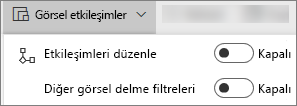
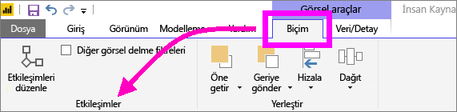
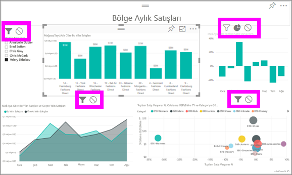

# Power BI raporlarındaki görselleştirme etkileşimleri
Bir rapor için düzenleme izinleriniz varsa, bir rapor sayfasındaki görsellerin birbirlerini nasıl etkileyeceğini değiştirmek için **Görsel etkileşimleri** kullanabilirsiniz. 

Varsayılan olarak, bir rapor sayfasındaki görselleştirmeleri kullanıp sayfadaki diğer görselleştirmeler için çapraz filtreleme ve çapraz vurgulama işlemleri gerçekleştirebilirsiniz.
Örneğin, bir harita görselleştirmesinde bir eyaleti seçtiğinizde görselleştirme, yalnızca söz konusu eyaletle ilgili verilerin görüntülenmesi için çizgi grafiği filtreler ve sütun grafiğini vurgular.
Bkz. [Filtreleme ve vurgulama hakkında](power-bi-reports-filters-and-highlighting.md). Ayrıca, [ayrıntılara gitmeyi](power-bi-visualization-drill-down.md) destekleyen bir görselleştirmeniz varsa, bir görselleştirmenin ayrıntısına inmek rapor sayfasındaki diğer görselleştirmeleri varsayılan olarak etkilemez. Ancak bu varsayılan davranışların her ikisi de geçersiz kılınabilir ve etkileşimler, görselleştirme temelinde ayarlanabilir.

Bu makalede, Power BI hizmeti [Düzenleme görünümü](service-interact-with-a-report-in-editing-view.md) ve Power BI Desktop'ta **Görsel etkileşimlerin** nasıl kullanılacağı gösterilmektedir. Sizinle bir rapor paylaşıldığında Görsel etkileşimler ayarlarını değiştiremezsiniz.

> [!NOTE]
> Görselleştirmeleri filtrelemek ve vurgulamak için **Filtreler**  bölmesini kullandığınızda gerçekleşen davranış ile burada açıklanan davranış arasındaki farkı belirtmek için *çapraz filtreleme* ve *çapraz vurgulama* terimleri kullanılmıştır.  
> 
> 

<iframe width="560" height="315" src="https://www.youtube.com/embed/N_xYsCbyHPw?list=PL1N57mwBHtN0JFoKSR0n-tBkUJHeMP2cP" frameborder="0" allowfullscreen></iframe>

1. Etkin duruma getirmek için bir görselleştirmeyi seçin.  
2. **Görsel Etkileşimler** seçeneklerini görüntüleyin.
    - Power BI hizmetinde, rapor menü çubuğundan açılır listeyi seçin.

       

    - Masaüstü'nde **Biçim > Etkileşimler**’i seçin.

        

3. Görselleştirme etkileşimi denetimlerini etkinleştirmek için **Etkileşimleri düzenle**’yi seçin. Power BI, rapor sayfasındaki diğer tüm görselleştirmelere çapraz filtreleme ve çapraz vurgulama simgeleri ekler.
   
    
3. Seçili görselleştirmenin, diğer görselleştirmeler üzerinde nasıl bir etkisi olması gerektiğini belirleyin.  Ayrıca, isteğe bağlı olarak, bu işlemi rapor sayfasındaki tüm görselleştirmeler için yineleyebilirsiniz.
   
   * Görselleştirmeyi çapraz filtrelemesi gerekiyorsa **filtre** simgesini  seçin.
   * Görselleştirmeyi çapraz vurgulaması gerekiyorsa **vurgu** simgesini  seçin.
   * Herhangi bir etkisinin olmaması gerekiyorsa **etkisi yok** simgesini  seçin.

4. Ayrıntıya gitme denetimlerini etkinleştirmek için **Diğer görsel delme filtreleri**’ni seçin.  Bundan sonra bir görselleştirmede ayrıntıya indiğinizde (ve çıktığınızda), rapor sayfasındaki diğer görselleştirmeler geçerli ayrıntıya gitme seçiminizi yansıtacak şekilde değişir. 

   

### Sonraki adımlar
[Rapor filtrelerini kullanma](power-bi-how-to-report-filter.md)

[Raporlarda filtreleme ve vurgulama](power-bi-reports-filters-and-highlighting.md)

[Power BI - Temel Kavramlar](service-basic-concepts.md)

Başka bir sorunuz mu var? [Power BI Topluluğu'na başvurun](http://community.powerbi.com/)

