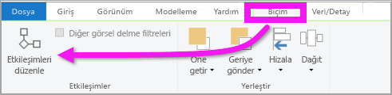
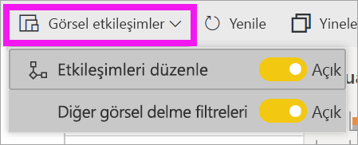
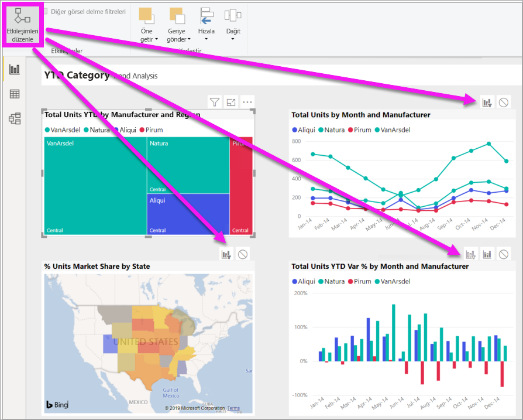
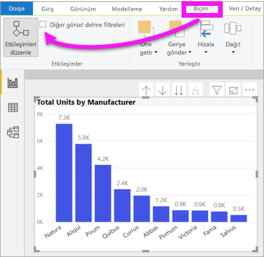

# Power BI raporunda görsellerin etkileşim kurma biçimini değiştirme
Bir rapor için düzenleme izinleriniz varsa, bir rapor sayfasındaki görsellerin birbirlerini nasıl etkileyeceğini değiştirmek için **Görsel etkileşimleri** kullanabilirsiniz. 

## Görsel etkileşimlere giriş
Varsayılan olarak, bir rapor sayfasındaki görselleştirmeleri kullanıp sayfadaki diğer görselleştirmeler için çapraz filtreleme ve çapraz vurgulama işlemleri gerçekleştirebilirsiniz.
Örneğin, bir harita görselleştirmesinde bir eyaleti seçtiğinizde görselleştirme, yalnızca söz konusu eyaletle ilgili verilerin görüntülenmesi için çizgi grafiği filtreler ve sütun grafiğini vurgular.
Bkz. [Filtreleme ve vurgulama hakkında](power-bi-reports-filters-and-highlighting.md). Ayrıca, [ayrıntılara gitmeyi](consumer/end-user-drill.md) destekleyen bir görselleştirmeniz varsa, bir görselleştirmenin ayrıntısına inmek rapor sayfasındaki diğer görselleştirmeleri varsayılan olarak etkilemez. Ancak bu varsayılan davranışların her ikisi de geçersiz kılınabilir ve etkileşimler, görselleştirme temelinde ayarlanabilir.

Bu makalede, Power BI Desktop'ta **görsel etkileşimlerin** nasıl kullanılacağı gösterilir. İşlem, Power BI hizmeti [Düzenleme görünümüyle](service-interact-with-a-report-in-editing-view.md) aynıdır. Yalnızca Okuma görünüm erişiminiz varsa veya rapor sizinle paylaşıldıysa, görsel etkileşimler ayarlarını değiştiremezsiniz.

Görselleştirmeleri *filtrelemek* ve *vurgulamak* için **Filtreler** bölmesini kullandığınızda gerçekleşen davranış ile burada açıklanan davranış arasındaki farkı belirtmek için *çapraz filtreleme* ve *çapraz vurgulama* terimleri kullanılmıştır.  

> [!NOTE]
> Bu videoda Power BI Desktop'ın ve Power BI hizmetinin eski sürümleri kullanılır. 
>
>

<iframe width="560" height="315" src="https://www.youtube.com/embed/N_xYsCbyHPw?list=PL1N57mwBHtN0JFoKSR0n-tBkUJHeMP2cP" frameborder="0" allowfullscreen></iframe>

## Görsel etkileşim denetimlerini etkinleştirme
Rapor üzerinde düzenleme izinleriniz varsa görsel etkileşim denetimlerini açabilir ve rapor sayfanızda görselleştirmelerin birbirlerini nasıl filtrelediğini ve vurguladığını özelleştirebilirsiniz. 

1. Etkin duruma getirmek için bir görselleştirmeyi seçin.  
2. **Görsel Etkileşimler** seçeneklerini görüntüleyin.
    

    - Masaüstü'nde **Biçim > Etkileşimler**’i seçin.

        

    - Power BI hizmetinde, raporu Düzenleme görünümünde açın ve rapor menü çubuğunda açılan listeyi seçin.

        

3. Görselleştirme etkileşimi denetimlerini görüntülemek için **Etkileşimleri düzenle**’yi seçin. Power BI, rapor sayfasındaki diğer tüm görselleştirmelere filtreleme ve vurgulama simgeleri ekler. Ağaç haritasının çizgi grafiğe çapraz filtreleme ve sütun grafiğe de çapraz vurgulama uyguladığını görebiliriz. Şimdi seçilen görselleştirmenin rapor sayfasındaki diğer görselleştirmelerle etkileşim kurma biçimini değiştirebilirsiniz.
   
    

## Etkileşim davranışını değiştirme
Rapor sayfanızda her görselleştirmeyi teker teker seçerek görselleştirmelerinizin etkileşim kurma biçimini öğrenin.  Bir veri noktasını, çubuğu veya şekli seçin ve bunun diğer görselleştirmeler üzerindeki etkisini izleyin. Tercih ettiğiniz davranışı görmüyorsanız, etkileşimleri değiştirebilirsiniz. Bu değişiklikler raporla birlikte kaydedilir, dolayısıyla hem siz hem de rapor tüketicileriniz aynı görsel etkileşim deneyimini elde eder.

Başlangıç olarak görselleştirmeyi seçerek etkinleştirin.  Sayfadaki diğer tüm görselleştirmelerin şimdi etkileşim simgeleri görüntülediğine dikkat edin. Uygulanmış olan simge kalın yazı tipiyle gösterilir. Ardından **seçili görselleştirmenin** diğer görselleştirmeler üzerinde nasıl bir etkisi olmasını istediğinizi belirleyin.  Ayrıca, isteğe bağlı olarak, bu işlemi rapor sayfasındaki tüm görselleştirmeler için yineleyebilirsiniz.

Seçili görselleştirme:
   
   * sayfadaki diğer görselleştirmelerden birine çapraz filtre uygulayacaksa, söz konusu görselleştirmenin sağ üst köşesindeki **filtre** simgesini seçin .
   * sayfadaki diğer görselleştirmelerden birine çapraz vurgulama uygulayacaksa, **vurgu** simgesini seçin .
   * sayfadaki diğer görselleştirmelerden hiçbirini etkilemeyecekse, **etki yok** simgesini seçin .

## Detaylandırılabilir görselleştirmelerin etkileşimlerini değiştirme
[Bazı Power BI görselleştirmeleri detaylandırılabilir](consumer/end-user-drill.md). Varsayılan olarak bir görselleştirmeyi detaylandırdığınızda, bu işlem rapor sayfasındaki diğer görselleştirmeleri etkilemez. Ama bu davranış değiştirilebilir. 

> [!TIP]
> [İnsan Kaynakları örnek PBIX dosyasını](https://download.microsoft.com/download/6/9/5/69503155-05A5-483E-829A-F7B5F3DD5D27/Human%20Resources%20Sample%20PBIX.pbix) kullanarak bunu kendiniz deneyin. **New hires** sekmesinde detaya gitme özelliği olan bir sütun grafik vardır.
>

1. Detaylandırılabilir görseli seçip etkin duruma getirin. 

2. Detaya gitme simgesini seçerek detaya gitmeyi açın.

    

2. Menü çubuğunda **Biçim** > **Diğer görselleri detaylandırma filtreleri**'ni seçin.  Bundan sonra bir görselleştirmede ayrıntıya indiğinizde (ve çıktığınızda), rapor sayfasındaki diğer görselleştirmeler geçerli ayrıntıya gitme seçiminizi yansıtacak şekilde değişir. 

    

3. Tercih ettiğiniz davranışı görmüyorsanız, etkileşimleri [yukarıda açıklandığı gibi](#change-the-interaction-behavior) değiştirebilirsiniz.
    
## Sonraki adımlar
[Power BI raporlarındaki filtreleme ve vurgulama](power-bi-reports-filters-and-highlighting.md)