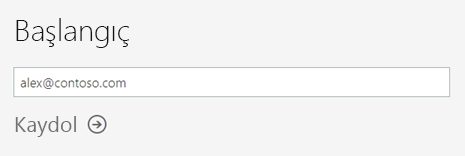
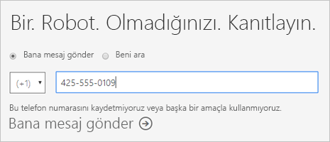
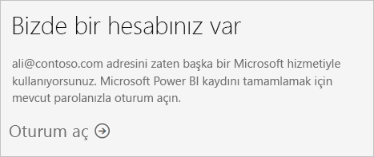
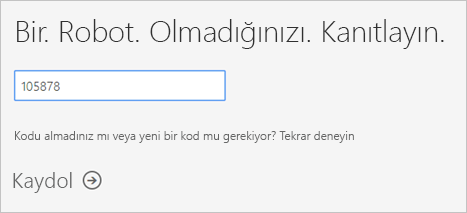
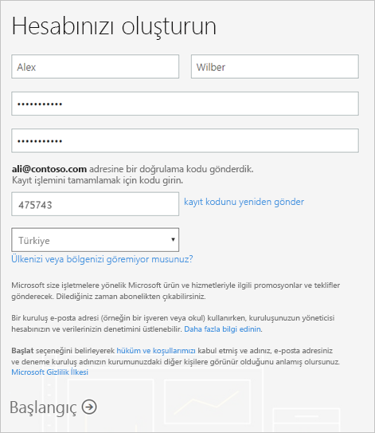
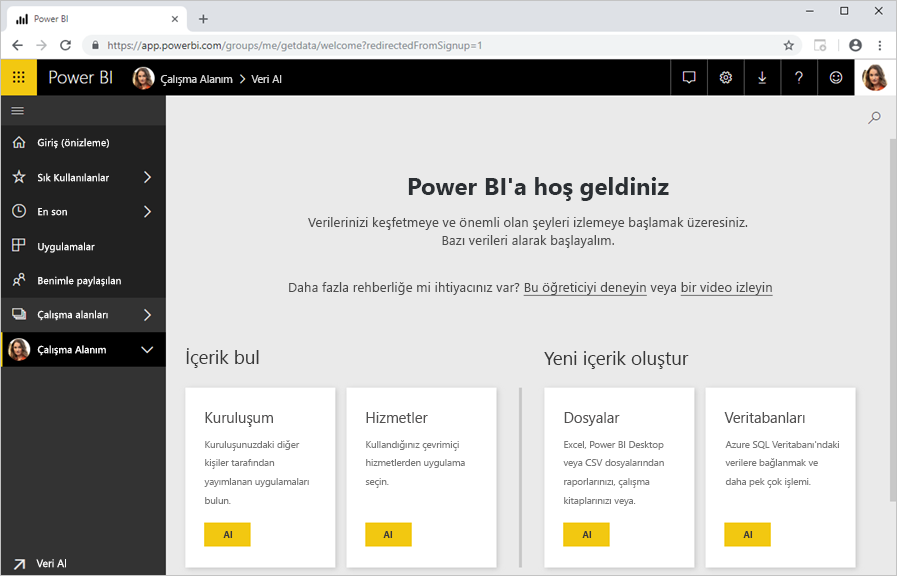

# Power BI'a bireysel olarak kaydolma

Power BI, kişisel veri analizi ve görselleştirme aracınız olabileceği gibi grup projeleri, departmanlar veya tüm şirket için analiz ve karar mekanizması olarak da kullanılabilir. Bu makalede bireysel olarak Power BI’a nasıl kaydolacağınız açıklanır. Power BI yöneticisiyseniz bkz. [Kuruluşunuzda Power BI lisansları](service-admin-licensing-organization.md).

## Desteklenen e-posta adresleri

Kayıt işlemine başlamadan önce, Power BI'a kaydolmak için kullanabileceğiniz e-posta adresi türlerini öğrenmeniz önemlidir:

* Power BI'a kaydolmak için bir iş veya okul e-posta adresi kullanmanız gerekir. Tüketici e-posta hizmetleri veya telekomünikasyon sağlayıcıları tarafından sağlanan e-posta adreslerini kullanarak kaydolamazsınız. Bunlar outlook.com, hotmail.com, gmail.com ve diğer adreslerdir.

* Kaydolduktan sonra, kişisel hesaplarınız dahil herhangi bir e-posta adresini kullanarak Power BI içeriğinizi görmeleri için [konuk kullanıcıları davet edebilirsiniz](https://docs.microsoft.com/azure/active-directory/active-directory-b2b-what-is-azure-ad-b2b).

* Power BI'a kaydolurken .gov veya .mil adreslerini kullanabilirsiniz ama bunun için farklı bir işlem gerekir. Daha fazla bilgi için bkz. [ABD Kamu kuruluşunuzu Power BI hizmetine kaydetme](service-govus-signup.md).

## Power BI hesabına kaydolma

Power BI hesabına kaydolmak için şu adımları izleyin. Bu işlemi tamamladıktan sonra Çalışma Alanım'ı kullanarak Power BI’ı kendi kendinize denemek, Power BI Premium kapasitesine atanmış bir Power BI çalışma alanından içerik kullanmak veya bireysel bir Power BI Pro Deneme Sürümü başlatmak için kullanabileceğiniz bir Power BI (ücretsiz) lisansına sahip olursunuz. Daha fazla bilgi için bkz. [Lisans türüne göre Power BI özellikleri](service-features-license-type.md). 

1. [Kaydolma sayfasına](https://signup.microsoft.com/signup?sku=a403ebcc-fae0-4ca2-8c8c-7a907fd6c235) gidin.

1. E-posta adresinizi girin, sonra da **Kaydol**'u seçin.

    

1. Buna benzer bir ileti alırsanız, bir seçenek belirterek doğrulama kodunu alın ve ardından bu yordamın sonraki adımından devam edin.

    

    Buna benzer bir ileti alırsanız, adımları tamamlayarak oturum açın ve Power BI'ı kullanın.

    

1. Aldığınız kodu girin, sonra da **Kaydol**'u seçin.

    

1. E-postanızı denetleyip buna benzer bir ileti alıp almadığınıza bakın.

    

1. Sonraki ekranda, bilgilerinizi ve e-postadaki doğrulama kodunu girin. Bölge seçin, bu ekranda bağlantısı verilen ilkeleri gözden geçirin, sonra da **Başlat**'ı seçin.

    

1. Bundan sonra [Power BI oturum açma sayfasına](https://powerbi.microsoft.com/landing/signin/) gidersiniz ve Power BI'ı kullanmaya başlayabilirsiniz.

    

## Deneme süresi sonu

Kaydolma işlemini tamamladıktan sonra Power BI hizmetinde Power BI Pro deneme sürümüne kaydolabilirsiniz. Bu deneme süresi sona erdiğinde, lisansınız Power BI (ücretsiz) lisansına geri döner. Bu gerçekleştikten sonra, artık Power BI Pro lisansı gerektiren özelliklere erişemezsiniz. Daha fazla bilgi için bkz. [Lisans türüne göre özellikler](service-features-license-type.md).

Power BI (ücretsiz) lisansı yeterliyse başka bir şey yapmanız gerekmez. Power BI Pro özelliklerinden yararlanmak için Power BI Pro lisansı satın alma konusunu görüşmek üzere BT yöneticinize başvurun.

## Kayıt işleminin sorunlarını giderme

Çoğu durumda, açıklanan işlemi yaparak Power BI'a kaydolabilirsiniz. Kaydolmanızı engelleyebilecek bazı sorunlar olası geçici çözümleriyle birlikte aşağıdaki tabloda açıklanmıştır.

| Belirti / Hata İletisi | Neden ve Geçici Çözüm |
| ----------------------- | -------------------- |
| <strong>Kişisel e-posta adresleri (örneğin nancy@gmail.com)</strong> Kayıt sırasında aşağıdakine benzer bir ileti alırsınız:    *Kişisel bir e-posta adresi girdiniz: Şirket verilerinizi güvenli bir şekilde depolayabilmemiz için lütfen iş e-posta adresinizi girin.*    veya    *Bu, kişisel bir e-posta adresi gibi görünüyor. Şirketinizdeki diğer kişilerle bağlantı kurmanızı sağlayabilmemiz için iş e-posta adresinizi girin. Endişelenmeyin. Adresinizi kimseyle paylaşmayacağız.* | Power BI, tüketici e-posta hizmetleri veya telekomünikasyon sağlayıcıları tarafından sağlanan e-posta adreslerini desteklemez.    Kaydolma işlemini tamamlamak için iş yeriniz veya okulunuz tarafından atanmış bir e-posta adresini kullanarak yeniden deneyin.    Hâlâ kaydolamadıysanız ve daha ileri düzey bir kurulum işlemi yapmak istiyorsanız [yeni bir Office 365 deneme sürümü aboneliğine kaydolup söz konusu e-posta adresini buraya kaydolmak için kullanabilirsiniz](service-admin-signing-up-for-power-bi-with-a-new-office-365-trial.md).    Ayrıca, mevcut bir kullanıcının [sizi konuk olarak davet etmesini](service-admin-azure-ad-b2b.md) de sağlayabilirsiniz. |
| **Self servis kayıt devre dışı**: Kayıt sırasında şuna benzer bir ileti alırsınız:    *Kayıt işleminizi tamamlayamadık. Microsoft Power BI için kayıt işlemi, BT departmanınız tarafından devre dışı bırakılmış. Kayıt işleminizi tamamlamak için BT departmanınız ile iletişim kurun.*    veya    *Bu, kişisel bir e-posta adresi gibi görünüyor. Şirketinizdeki diğer kişilerle bağlantı kurmanızı sağlayabilmemiz için iş e-posta adresinizi girin. Endişelenmeyin. Adresinizi kimseyle paylaşmayacağız.* | Kuruluşunuzun BT yöneticisi Power BI için self servis kaydolma özelliğini devre dışı bırakmıştır.    Kaydolma işlemini tamamlamak için, BT yöneticinize başvurun ve ondan [kaydı etkinleştirmek için yönergeleri izlemesini](service-admin-licensing-organization.md#enable-or-disable-individual-user-sign-up-in-azure-active-directory) isteyin.    [Office 365'e bir iş ortağı aracılığıyla kaydolmanız](service-admin-syndication-partner.md) durumunda da bu sorunla karşılaşabilirsiniz. |
| **E-posta adresiniz bir Office 365 kimliği değil** Kayıt sırasında şuna benzer bir ileti alırsınız:    *contoso.com adresinizi bulamadık.  İşte veya okulda farklı bir kimlik mi kullanıyorsunuz?    Bu kimlikle oturum açmayı deneyin, işe yaramazsa BT departmanınızla iletişime geçin.* | Kuruluşunuz Office 365 ve diğer Microsoft hizmetlerinde oturum açmak için sizin e-posta adresinizden farklı kimlikler kullanıyor.  Örneğin, e-posta adresiniz Nancy.Smith@contoso.com, kimliğiniz ise nancys@contoso.com olabilir.    Kaydolma işlemini tamamlamak için kuruluşunuzun Office 365 veya diğer Microsoft hizmetlerinde oturum açmak üzere size atadığı kimliği kullanın.  Bunun ne olduğunu bilmiyorsanız BT yöneticinize başvurun.    Hâlâ kaydolamadıysanız ve daha ileri düzey bir kurulum işlemi yapmak istiyorsanız [yeni bir Office 365 deneme sürümü aboneliğine kaydolup söz konusu e-posta adresini buraya kaydolmak için kullanabilirsiniz](service-admin-signing-up-for-power-bi-with-a-new-office-365-trial.md). |

## Sonraki adımlar

[Power BI Pro'yu satın alma](service-admin-purchasing-power-bi-pro.md)  
[Bireysel kullanıcılar için Power BI Hizmet sözleşmesi](https://powerbi.microsoft.com/terms-of-service/)  

Başka bir sorunuz mu var? [Power BI Topluluğu'na sorun](https://community.powerbi.com/)
