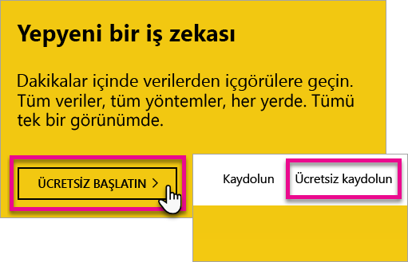
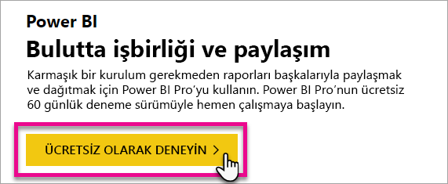
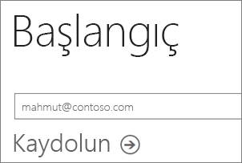
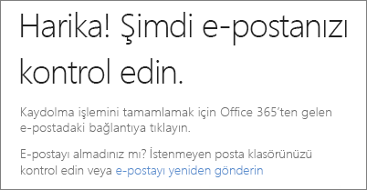
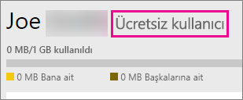
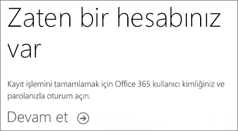
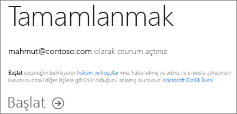
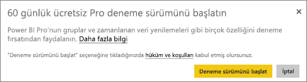
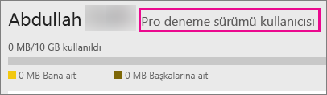

# Power BI'a bireysel olarak kaydolma
Power BI'a kaydolmayı ve Power BI'ı kişisel rapor ve görselleştirme ihtiyaçlarınız için kullanmaya nasıl başlayacağınızı öğrenin.

Power BI, kişisel rapor ve görselleştirme aracınız olabileceği gibi grup projeleri, departmanlar veya tüm şirket için analiz ve karar mekanizması olarak da kullanılabilir.

Bu makalede, Power BI hizmetine kaydolmaya ve hizmeti kullanmaya başlamaya yönelik seçenekleriniz ele alınmaktadır. Ücretsiz Power BI ile Power BI Pro arasındaki farklar hakkında daha fazla bilgi için bkz. [Ücretsiz Power BI ve Power BI Pro](service-free-vs-pro.md).

## Birkaç seçeneğiniz vardır
Bireysel olarak Power BI'a kaydolmak ve hizmeti kullanmaya başlamak için birkaç farklı seçeneğiniz bulunmaktadır. Ücretsiz kaydolmayı seçebilir veya bir Power BI Pro aboneliği satın alabilirsiniz. Ücretsiz hesaba kaydolursanız hizmette 60 günlük Power BI Pro ücretsiz deneme sürümünden yararlanabilirsiniz.

Office 365 kullanan bir kuruluşa bağlıysanız yine de ücretsiz hesaba kaydolabilirsiniz. BT Yöneticinizin de Power BI Pro'yu satın almaya ve lisansları atamaya yönelik birkaç seçeneği bulunmaktadır. BT Yöneticilerine sunulan seçenekler ile ilgili daha fazla bilgi için bkz. [Power BI Pro'yu satın alma](service-admin-purchasing-power-bi-pro.md).

> [!NOTE]
> Bir kuruluşa bağlıysanız bireysel kayıt devre dışı bırakılmış olabilir. Kaydın devre dışı bırakıldığını belirten bir hata alırsanız, daha fazla bilgi için BT bölümünüze başvurun.

## Kaydolmak için ne yapmanız gerekiyor?

Power BI'a kaydolmak için çalışan bir e-posta adresiniz olmalıdır. Kişisel e-posta adresi Power BI'a kaydolurken çalışmaz.

### Power BI ile hangi e-posta adresi kullanılabilir?
Power BI'a kaydolmak için bir iş veya okul e-posta adresi kullanmanız gerekir. Tüketici e-posta hizmetleri veya telekomünikasyon sağlayıcıları tarafından sağlanan e-posta adreslerini kullanarak Power BI'a kaydolamazsınız. Bunlar outlook.com, hotmail.com, gmail.com ve diğer adreslerdir.

Kişisel bir e-posta adresiyle kaydolmaya çalışırsanız iş veya okul e-posta adresinizi kullanmanız gerektiğini belirten bir ileti alırsınız.

> [!NOTE]
> Power BI'a .gov veya .mil adresleriyle kaydolabilirsiniz. Bilgi edinmek için, [ABD Kamu kuruluşunuzu Power BI hizmetine kaydetme](https://docs.microsoft.com/en-us/power-bi/service-govus-signup) konusunu gözden geçirin.
>

> [!NOTE]
> Kaydolduktan sonra, kişisel hesaplarınız dahil herhangi bir e-posta adresini kullanarak Power BI kiracınızdaki içeriği görmeleri için [konuk kullanıcıları davet edebilirsiniz](https://docs.microsoft.com/en-us/azure/active-directory/active-directory-b2b-what-is-azure-ad-b2b).
>

## Hangisine ihtiyacınız var?
Her bir lisans türünün sunduğu imkanları gözden geçirerek ihtiyacınızı belirleyebilirsiniz. Ücretsiz sürüm kullanıcıları, paylaşım ve işbirliği özellikleri hariç olmak üzere işlevlerin çoğuna erişebilir. Power BI Pro kullanıcıları hizmetteki tüm özellikleri kullanabilir ancak bunlar ücretsiz olarak sunulmaz. Herhangi bir içerik paylaşımı yapmanız gerekmiyorsa Ücretsiz sürüm sizin için uygun olabilir. [Power BI Fiyatlandırma sayfasında](https://powerbi.microsoft.com//pricing/) daha fazla bilgi edinebilirsiniz.

Bu makalenin geri kalanında her bir seçenek için nasıl kaydolunacağı anlatılmaktadır.

## Power BI'a (ücretsiz) bireysel olarak kaydolma
Power BI'a kaydolmanın en hızlı yolu, bir Power BI (ücretsiz) hesabı edinmektir. Bu hesap ücretsiz olup hizmette bulunan özelliklerin birçoğunu kullanmanıza olanak sağlar.

> [!NOTE]
> Sizi zaten tanıdığımızı belirten bir ileti alırsanız https://app.powerbi.com adresine giderek oturum açmayı deneyin.
> 
> 

Power BI'a kaydolmak için şunları yapabilirsiniz.

1. [powerbi.com](https://powerbi.microsoft.com) adresine gidin.
2. **Start Free** (Ücretsiz Olarak Başla) veya **Sign up free** (Ücretsiz kaydolun) seçeneklerinden birini belirleyin.

    
3. Başlangıç sayfasında Power BI altındaki **Try Free >** (Ücretsiz olarak deneyin) seçeneğini belirleyin.

    
4. Kaydolacağınız e-posta adresini girin ve **Sign up**'ı (Kaydol) seçin. E-posta adresinizin, kayıt işlemi için uygun olduğundan emin olun. Kullanabileceğiniz e-posta adresleri hakkında daha fazla bilgi için bkz. [Power BI ile hangi e-posta adresi kullanılabilir?](#what-email-address-can-be-used-with-power-bi).

    
5. E-postanızı kontrol etmenizi bildiren bir ileti alırsınız.

    
6. E-posta adresinizi doğrulamak için e-posta içindeki bağlantıyı seçin. Bu seçim sizi kayıt işlemi akışına geri yönlendirir. Kendinizle ilgili bazı ek bilgiler vermeniz gerekebilir.
7. Ardından, https://app.powerbi.com adresine yönlendirilirsiniz. Böylece, Power BI'ı ücretsiz sürüm kullanıcısı olarak kullanmaya başlayabilirsiniz.

### Bunu hizmette nasıl görürsünüz?
Bir ücretsiz hesaba sahip olduğunuzu, hizmetteyken **dişli** simgesine gidip **Kişisel depolama alanını yönet** seçeneğini belirleyerek doğrulayabilirsiniz.

### Zaten kaydolmuş bir kuruluşa bağlıysanız ne olur?
Hesabınız mevcut bir kuruluşa bağlıysa bu hesapla oturum açmanızı isteyen bir ileti alırsınız. **Devam** seçeneğini belirleyin ve Office 365 oturumunuzu açın.

Daha sonra, **Başlat**'ı seçmenizi isteyen bir ileti görürsünüz.

## Hizmet içi Power BI Pro 60 günlük deneme sürümü
Ücretsiz hesaba kaydolduktan sonra Pro'yu 60 gün süreyle ücretsiz denemeyi seçebilirsiniz. Deneme süresi boyunca Pro'nun tüm özelliklerine erişebilirsiniz. Power BI Pro, Power BI ücretsiz sürümünün tüm özelliklerinin yanı sıra ek paylaşım ve işbirliği özellikleri içermektedir. Daha fazla bilgi için bkz. [Power BI Fiyatlandırması](https://powerbi.microsoft.com/pricing). Power BI Pro'nun 60 günlük ücretsiz deneme sürümü için Power BI'da oturum açın ve şu Power BI Pro özelliklerinden birini deneyin:

* [Uygulama çalışma alanı oluşturma](service-create-distribute-apps.md)
* [Bir panoyu paylaşma](service-share-dashboards.md)

Bu özelliklerden herhangi birini denediğinizde, ücretsiz denemenizi başlatmanız istenir. Ayrıca, dişli simgesine gidip **Kişisel depolama alanını yönet**'i seçerek de ücretsiz denemenizi başlatabilirsiniz. Ardından, sağdaki **Pro'yu ücretsiz dene** seçeneğini belirleyin.

Daha sonra **Deneme sürümünü başlat**'ı seçin.

>[!NOTE]
>Bu ürün içi Power BI Pro deneme sürümü avantajından faydalanan kullanıcılar, Office 365 yönetim portalında Power BI Pro Deneme Sürümü kullanıcıları olarak değil, Power BI ücretsiz sürüm kullanıcıları olarak görünür. Ancak, Power BI'daki **depolama alanını yönet** bölümünde Power BI Pro Deneme Sürümü kullanıcıları olarak görünürler.

>[!NOTE]
>Bir BT Yöneticisi olarak, Power BI deneme sürümü lisansları edinip kuruluşunuzdaki kullanıcıların deneme sürümü koşullarını ayrı ayrı kabul etmesine gerek kalmadan bunları kuruluşunuzdaki birden çok kullanıcıya dağıtmak istiyorsanız [Power BI Pro aboneliği deneme sürümüne](https://portal.office.com/Signup/MainSignup15.aspx?OfferId=d59682f3-3e3b-4686-9c00-7c7c1c736085&dl=POWER_BI_PRO) kaydolabilirsiniz. Yönetici deneme sürümüne kaydolmak isterseniz Office 365 Genel veya Faturalama Yöneticisi olmanız ya da yeni bir kiracı oluşturmanız gerekir. Daha fazla bilgi için bkz. [Power BI Pro'yu satın alma](service-admin-purchasing-power-bi-pro.md).
> 
> [!NOTE]
> Power BI Premium kullanılabilirliği ve 1 Haziran 2017 tarihli Ücretsiz Power BI teklifine ilişkin değişikliklerle, Uzatılmış Pro Deneme Sürümü için uygun bir aday haline gelebilirsiniz. Daha fazla bilgi için bkz. [Uzatılmış Pro Deneme Sürümünü etkinleştirme](service-extended-pro-trial.md).
> 
> 

### Bunu hizmette nasıl görürsünüz?
Bir Pro deneme sürümü hesabına sahip olup olmadığınızı, hizmetteyken <strong>dişli* simgesine gidip Kişisel depolama alanını yönet seçeneğini belirleyerek**</strong> doğrulayabilirsiniz.

## Tam Power BI Pro aboneliği mi istiyorsunuz?
Power BI Pro lisansını bireysel olarak kullanmanın bir yolu yoktur. Lisansı satın almak ve hesabınıza atamak için BT Yöneticinize danışmanız gerekir. Daha fazla bilgi için bkz. [Power BI Pro'yu satın alma](service-admin-purchasing-power-bi-pro.md).

## Sorun giderme
Çoğu durumda, Power BI'a kaydolma işlemi, yukarıda verilen self servis kayıt süreci uygulanarak tamamlanabilir. Ancak, self servis kayıt işleminin çeşitli nedenlerle tamamlanamadığı durumlar olabilir.  Aşağıdaki tabloda, kayıt işlemini tamamlama konusunda en çok karşılaşılan sorunların nedenleri ve bu sorunlara yönelik geçici çözümler açıklanmıştır.

|                                                                                                                                                                                                                          **Belirti / Hata İletisi**                                                                                                                                                                                                                           |                                                                                                                                                                                                                                                                                                                                                **Neden ve Geçici Çözüm**                                                                                                                                                                                                                                                                                                                                                |
|--------------------------------------------------------------------------------------------------------------------------------------------------------------------------------------------------------------------------------------------------------------------------------------------------------------------------------------------------------------------------------------------------------------------------------------------------------------------------------|------------------------------------------------------------------------------------------------------------------------------------------------------------------------------------------------------------------------------------------------------------------------------------------------------------------------------------------------------------------------------------------------------------------------------------------------------------------------------------------------------------------------------------------------------------------------------------------------------------------------------------------------------------------------------------------------------------------------|
| <strong>Kişisel e-posta adresi (ör. nancy@gmail.com)</strong> Kayıt sırasında aşağıdaki gibi bir ileti alırsınız:    *Kişisel bir e-posta adresi girdiniz: Şirket verilerinizi güvenli bir şekilde depolayabilmemiz için lütfen iş e-posta adresinizi girin.*    ya da    *Bu, kişisel bir e-posta adresi gibi görünüyor. Şirketinizdeki diğer kişilerle bağlantı kurmanızı sağlayabilmemiz için iş e-posta adresinizi girin. Endişelenmeyin. Adresinizi kimseyle paylaşmayacağız.* |                          Power BI, tüketici e-posta hizmetleri veya telekomünikasyon sağlayıcıları tarafından sağlanan e-posta adreslerini desteklemez.    Kaydolmayı tamamlamak için iş yeriniz veya okulunuz tarafından atanmış bir e-posta adresini kullanarak yeniden deneyin.    Hâlâ kaydolamadıysanız ve daha ileri düzey bir kurulum işlemi yapmak istiyorsanız [yeni bir Office 365 deneme sürümü aboneliğine kaydolup söz konusu e-posta adresini buraya kaydolmak için kullanabilirsiniz](service-admin-signing-up-for-power-bi-with-a-new-office-365-trial.md).    Kullanıcı hesabının [Azure B2B konuğu](https://docs.microsoft.com/en-us/azure/active-directory/active-directory-b2b-what-is-azure-ad-b2b) olarak davet edilmesini sağlayın.                           |
|            **Self servis kayıt işlemi devre dışı** Kayıt sırasında aşağıdaki gibi bir ileti alırsınız:    *Kayıt işleminizi tamamlayamadık. Microsoft Power BI için kayıt işlemi, BT departmanınız tarafından devre dışı bırakılmış. Kayıt işleminizi tamamlamak için BT departmanınız ile iletişim kurun.*    ya da    *Bu, kişisel bir e-posta adresi gibi görünüyor. Şirketinizdeki diğer kişilerle bağlantı kurmanızı sağlayabilmemiz için iş e-posta adresinizi girin. Endişelenmeyin. Adresinizi kimseyle paylaşmayacağız.*             |                             Kuruluşunuzun BT yöneticisi Power BI için self servis kaydolma özelliğini devre dışı bırakmıştır.    Kaydolmayı tamamlamak için BT yöneticinize başvurun ve sayfanın aşağısında verilen yönergeleri izleyerek mevcut kullanıcıların Power BI'a kaydolmasına ve yeni kullanıcıların mevcut kiracınıza katılmasına izin vermesini isteyin.    Office 365'e bir iş ortağı aracılığıyla kaydolduysanız da bu sorunla karşılaşabilirsiniz. [Daha fazla bilgi](service-admin-syndication-partner.md)    [Kuruluşunuzda Power BI](https://support.office.com/en-ca/article/Power-BI-in-your-Organization-d7941332-8aec-4e5e-87e8-92073ce73dc5#BKMK_HowCanIAllowO365Tenant)                              |
|                                                                                          **E-posta adresiniz bir Office 365 kimliği değil** Kayıt sırasında aşağıdaki gibi bir ileti alırsınız:    *contoso.com adresinizi bulamadık.  İşte veya okulda farklı bir kimlik mi kullanıyorsunuz?    Bu kimlikle oturum açmayı deneyin, işe yaramazsa BT departmanınızla iletişime geçin.*                                                                                           | Kuruluşunuz Office 365 ve diğer Microsoft hizmetlerinde oturum açmak için sizin e-posta adresinizden farklı kimlikler kullanıyor.  Örneğin, e-posta adresiniz Nancy.Smith@contoso.com, kimliğiniz ise nancys@contoso.com olabilir.    Kaydolmayı tamamlamak için kuruluşunuzun Office 365 veya diğer Microsoft hizmetlerinde oturum açmak üzere atadığı kimliği kullanın.  Bunun ne olduğunu bilmiyorsanız BT yöneticinize başvurun.    Hâlâ kaydolamadıysanız ve daha ileri düzey bir kurulum işlemi yapabiliyorsanız [yeni bir Office 365 deneme sürümü aboneliğine kaydolup söz konusu e-posta adresini buraya kaydolmak için kullanabilirsiniz](service-admin-signing-up-for-power-bi-with-a-new-office-365-trial.md). |

## Sonraki adımlar
[Kuruluşunuz için Power BI (ücretsiz)](service-admin-service-free-in-your-organization.md)  
[Power BI Pro'yu satın alma](service-admin-purchasing-power-bi-pro.md)  
[Bireysel kullanıcılar için Power BI Hizmet sözleşmesi](https://powerbi.microsoft.com/terms-of-service/)  
[Power BI Premium nedir?](service-premium.md)  
[Power BI Premium teknik incelemesi](https://aka.ms/pbipremiumwhitepaper)  

Başka bir sorunuz mu var? [Power BI Topluluğu'na sorun](http://community.powerbi.com/)

