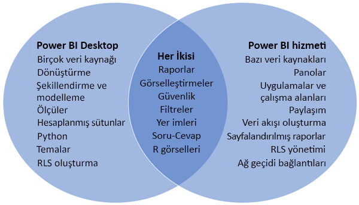
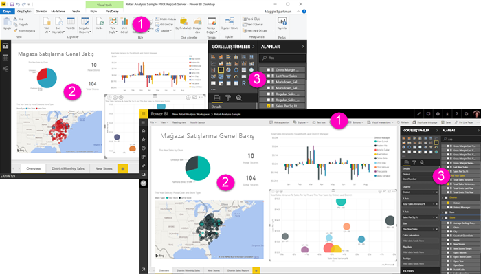

# Power BI Desktop ile Power BI hizmetini karşılaştırma

Power BI Desktop ile Power BI hizmetinin karşılaştırıldığı Venn diyagramında, ortadaki alan bu ikisinin nasıl kesiştiğini gösterir. Bazı görevleri hem Power BI Desktop'ta hem de hizmette gerçekleştirebilirsiniz. Ama Venn diyagramının iki yanında, uygulamanın ve hizmetin benzersiz özellikleri yer alır.  

**Power BI Desktop** eksiksiz bir veri analizi ve rapor oluşturma aracıdır. Ücretsiz uygulamayı yerel bilgisayarınıza yüklediğinizde, birçok farklı veri kaynağına bağlanabilir ve bunları bir veri modelinde birleştirebilirsiniz (çoğunlukla modelleme olarak adlandırılır). [Power BI Desktop ile çalışmaya başlama kılavuzu](desktop-getting-started.md) bu işlemde size yol gösterir.

**Power BI hizmeti**, ekiplerin ve kuruluşların basit rapor düzenlemesine ve işbirliği yapmasına yönelik bulut tabanlı çevrimiçi bir hizmettir. Power BI hizmetinde de veri kaynaklarına bağlanabilirsiniz ama modelleme sınırlıdır. 

İş zekası projelerinde çalışan rapor tasarımcılarının çoğu, rapor oluşturmak için **Power BI Desktop** uygulamasını ve sonra raporlarını başkalarıyla paylaşmak için **Power BI hizmetini** kullanır.

## Rapor düzenleme

Hem uygulamada hem de hizmette *raporları* oluşturabilir ve düzenleyebilirsiniz. Bir rapor, görseller ve görsel koleksiyonları içeren bir veya birden çok sayfadan oluşabilir. Gezintiyi geliştirmek için raporlarınıza yer işaretleri, düğmeler, filtreler ve detaylandırma ekleyebilirsiniz.

Power BI Desktop'taki ve hizmetteki rapor düzenleyicileri birbirine benzer. Bunlar üç bölümden oluşur:  

1. Üst gezinti çubukları (Power BI Desktop ile hizmette farklıdır)    
2. Rapor tuvali     
3. **Alanlar**, **Görsel Öğeler** ve **Filtreler** bölmeleri

Bu videoda, Power BI Desktop'taki rapor düzenleyicisi gösterilir. 

<iframe width="560" height="315" src="https://www.youtube.com/embed/IkJda4O7oGs" frameborder="0" allowfullscreen></iframe>

## Power BI hizmetinde işbirliği yapma

Raporlarınızı oluşturduktan sonra, bunları *Power BI hizmetinde* iş arkadaşlarınızla işbirliği yapabileceğiniz bir **çalışma alanına** kaydedebilirsiniz. Bu raporların üstünde *panolar* oluşturursunuz. Sonra bu panoları ve raporları kuruluşunuz içindeki ve dışındaki rapor kullanıcılarıyla paylaşırsınız. Raporunuzun kullanıcıları bunları Power BI hizmetinde, Düzenleme görünümünde değil [Okuma görünümünde](consumer/end-user-reading-view.md) görüntüler. Rapor oluşturucularına sağlanan özelliklerin tümüne erişemezler. 

## Sonraki adımlar

[Power BI Desktop nedir?](desktop-what-is-desktop.md)

Power BI hizmetinde [rapor oluşturma](service-report-create-new.md)

[Rapor tasarımcıları için temel kavramlar](service-basic-concepts.md)

Başka bir sorunuz mu var? [Power BI Topluluğu'na başvurun](http://community.powerbi.com/)

