# Power BI hizmetindeki veri uyarıları
Panolarınızdaki veriler belirlediğiniz sınırları aşacak şekilde değiştiğinde bunu size bildirecek uyarılar ayarlayın. 

Power BI Pro lisansınız varsa veya bir [Premium kapasiteden](service-premium.md) sizinle pano paylaşıldıysa kutucuklar için uyarılar ayarlayabilirsiniz. Uyarılar yalnızca rapor görsellerinden sabitlenmiş olan kutucuklarda ve yalnızca ölçekler, KPI'ler ve kartlar için ayarlanabilir. Uyarılar rapordan panoya sabitlenmiş olan akış veri kümelerinden oluşturulan görseller için de ayarlanabilir ancak **Kutucuk ekle** > **Özel akış verileri** menüsü kullanılarak doğrudan panoda oluşturulmuş olan akış kutucukları için ayarlanamaz. 

Panonuzu paylaşsanız dahi ayarladığınız uyarıları yalnızca siz görebilirsiniz. Veri uyarıları platformlar arasında tamamen eşitlenir. Veri uyarılarını [Power BI mobil uygulamalarında](mobile-set-data-alerts-in-the-mobile-apps.md) ve Power BI hizmetinde ayarlayıp görüntüleyebilirsiniz. Uyarılar Power BI Desktop'ta kullanılamaz. İsterseniz uyarıları [Microsoft Flow'u kullanarak otomatikleştirilmiş ve tümleşik hale getirebilirsiniz](https://flow.microsoft.com) - [kendiniz deneyin](service-flow-integration.md).

> [!WARNING]
> Veri tabanlı uyarı bildirimleri, verileriniz hakkında bilgi verir. Power BI verilerini bir mobil cihazda görüntülüyorsanız ve cihazınız çalınırsa, Power BI hizmetini kullanarak veri tabanlı uyarı kurallarının tümünü devre dışı bırakmanızı öneririz.
> 
> 

## Power BI hizmetinde veri uyarısı oluşturma
Amanda'nın, panosundaki kutucuklara uyarı eklemesini izleyin. Ardından, videonun altında yer alan adım adım yönergeleri izleyerek bu işlemi kendiniz deneyin.

<iframe width="560" height="315" src="https://www.youtube.com/embed/JbL2-HJ8clE" frameborder="0" allowfullscreen></iframe>

Bu örnekte Perakende Analizi örneği panosu kullanılmıştır.

1. İşleme bir panodan başlayın. Panodaki bir ölçek, KPI veya kart kutucuğundaki üç nokta simgesini seçin.
   
   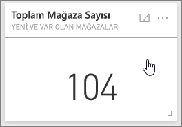
2. Zil simgesini  seçerek **Toplam mağaza sayısı** için bir veya daha fazla uyarı ekleyin.
   
1. Başlamak için **+ Uyarı kuralı ekle**'yi seçin kaydırıcının **Açık** konumda olduğundan emin olun ve uyarınıza bir ad verin. Başlıklar, uyarılarınızı kolayca ayırt etmenizi sağlar.
   
   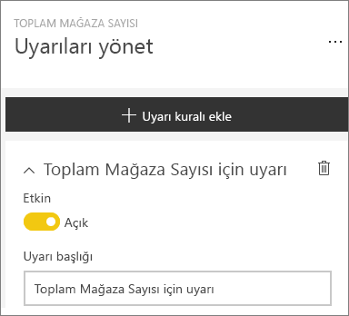
4. Sayfayı aşağı kaydırıp uyarıyla ilgili ayrıntıları girin.  Bu örnekte toplam mağaza sayısı 100'ün üzerine çıktığında bizi günde bir kez bilgilendiren bir uyarı oluşturacağız. Uyarılar, Bildirim merkezinde görüntülenecek. Ayrıca Power BI bize bir e-posta da gönderecek.
   
   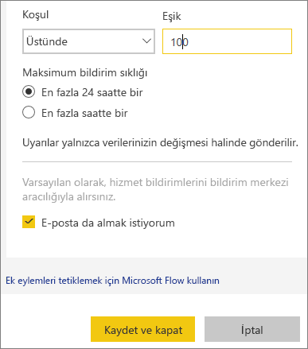
5. **Kaydet**'i seçin.

## Uyarı alma
Takip edilen veriler belirlediğiniz eşiklerden birine ulaşırsa birden fazla işlem gerçekleşir. Öncelikle Power BI son uyarının gönderilmesinin üzerinden bir saat veya 24 saat (belirlediğiniz seçeneğe bağlı olarak) geçip geçmediğini kontrol eder. Veriler eşiği geçtiği sürece uyarı gönderilir.

Ardından, Power BI, bildirim merkezinize ve isteğe bağlı olarak gelen kutunuza uyarı gönderir. Uyarılarda doğrudan verilerinize ulaşabileceğiniz bir bağlantı da bulunur. Bağlantıya tıklayarak ilgili kutucuğa gidebilir; araştırma, paylaşma ve daha fazla bilgi edinme işlevlerini kullanabilirsiniz.  

1. Uyarının e-posta gönderme ayarını etkinleştirdiyseniz, Gelen Kutunuzda aşağıdakine benzer bir ileti görürsünüz.
   
   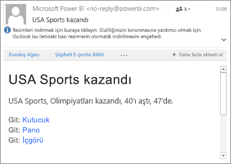
2. Power BI, **Bildirim merkezinize** bir ileti ekler ve ilgili kutucukta yeni uyarı simgesi görüntüler.
   
   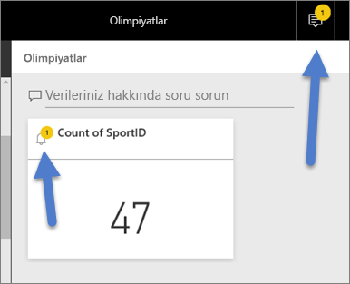
3. Uyarıyla ilgili ayrıntılı bilgileri görmek için Bildirim merkezinizi açın.
   
    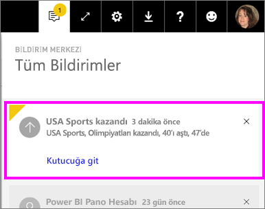
   
   > [!NOTE]
   > Uyarılar yalnızca yenilenen verilerde çalışır. Veriler yenilendiğinde Power BI bu veriler için bir uyarı ayarlanıp ayarlanmadığını kontrol eder. Veriler bir uyarı eşiğine ulaştığında bir uyarı tetiklenir.
   > 
   > 

## Uyarıları yönetme
Uyarıları yönetmek için kullanabileceğiniz birçok farklı yöntem vardır: Pano kutucuğunun kendisinden, Power BI Ayarlar menüsünden, [iPhone'daki Power BI mobil uygulaması](mobile-set-data-alerts-in-the-mobile-apps.md) veya [Windows 10 için Power BI mobil uygulamasında](mobile-set-data-alerts-in-the-mobile-apps.md) yer alan kutucuktan.

### Kutucuğun kendisinden
1. Kutucuklara ilişkin uyarıları değiştirmek veya kaldırmak için zil simgesini  seçerek **Uyarıları yönet** penceresini yeniden açın. İlgili kutucuk için ayarladığınız tüm uyarılar görüntülenir.
   
    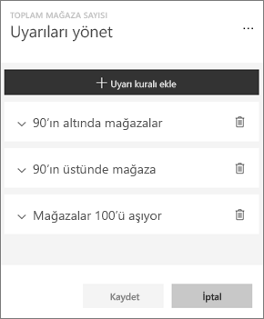geçin.
2. Bir uyarıyı değiştirmek için adının sol tarafındaki oku seçin.
   
    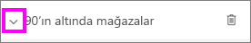geçin.
3. Bir uyarıyı silmek için adının sağ tarafındaki çöp kutusunu seçin.
   
      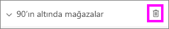

### Power BI Ayarlar menüsünden
1. Power BI menü çubuğundaki dişli simgesini seçin.
   
    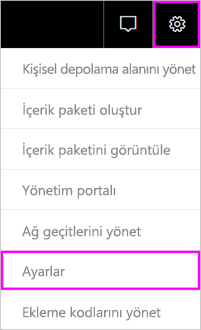geçin.
2. **Ayarlar** bölümünden **Uyarılar**'ı seçin.
   
    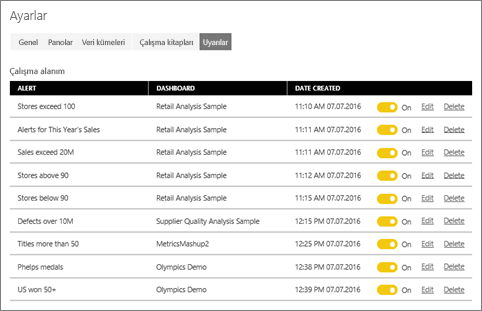
3. Bu sayfadan uyarıları etkinleştirebilir ve devre dışı bırakabilir, **Uyarıları yönet** penceresini açarak değişiklik yapabilir veya uyarıları silebilirsiniz.

## İpuçları ve sorun giderme
* Şu an için Bing kutucukları veya tarih/saat ölçülerine sahip kart kutucuklarında uyarılar desteklenmemektedir.
* Uyarılar yalnızca sayısal veri türleriyle çalışır.
* Uyarılar yalnızca yenilenen verilerde çalışır. Sabit veriler üzerinde çalışmazlar.
* Uyarılar, akış veri kümelerinde yalnızca KPI/kart/ölçek rapor görseli oluşturup bunu panoya sabitlemeniz durumunda çalışır.

## Sonraki adımlar
[Veri uyarısı içeren bir Microsoft Flow akışı oluşturma](service-flow-integration.md)    
[Mobil cihazınızda veri uyarısı oluşturma](mobile-set-data-alerts-in-the-mobile-apps.md)    
[Power BI nedir?](power-bi-overview.md)    
Başka bir sorunuz mu var? [Power BI Topluluğu'na sorun](http://community.powerbi.com/)

