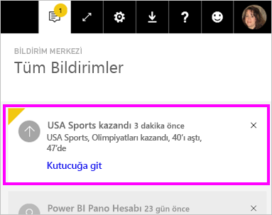

# Power BI hizmetinde veri uyarıları

Panolarınızdaki veriler belirlediğiniz sınırları aşacak şekilde değiştiğinde bunu size bildirecek uyarılar ayarlayın.

Çalışma Alanım’daki kutucuklar için uyarılar ayarlayabilirsiniz. Ayrıca, bir kullanıcı [Premium kapasitede](service-premium-what-is.md) bir pano paylaşırsa alacağınız uyarılar da ayarlayabilirsiniz. Power BI Pro lisansınız varsa başka bir çalışma alanındaki kutucuklar için de uyarılar ayarlayabilirsiniz. Uyarılar yalnızca rapor görsellerinden sabitlenmiş olan kutucuklarda ve yalnızca ölçekler, KPI'ler ve kartlar için ayarlanabilir. Bir rapordan panoya sabitlediğiniz akış veri kümelerinden oluşturulan görseller üzerinde uyarılar ayarlanabilir. **Kutucuk ekle** > **Özel akış verileri** kullanılarak doğrudan pano üzerinde oluşturulan akış kutucukları üzerinde uyarılar ayarlanamaz.

Panonuzu paylaşsanız dahi ayarladığınız uyarıları yalnızca siz görebilirsiniz. Panosunun sizdeki görünümü üzerinde belirlediğiniz uyarıları pano sahibi bile göremez. Veri uyarıları platformlar arasında tamamen eşitlenir. Veri uyarılarını [Power BI mobil uygulamalarında](consumer/mobile/mobile-set-data-alerts-in-the-mobile-apps.md) ve Power BI hizmetinde ayarlayıp görüntüleyebilirsiniz. Bujlar Power BI Desktop'ta kullanılamaz. Uyarıları Power Automate ile de otomatikleştirebilir ve tümleştirebilirsiniz. Bu işlemi bu [Power Automate ve Power BI](service-flow-integration.md) makalesinde kendiniz deneyebilirsiniz.

> [!WARNING]
> Veri tabanlı uyarı bildirimleri, verileriniz hakkında bilgi verir. Power BI verilerini bir mobil cihazda görüntülüyorsanız ve cihazınız kaybolur ya da çalınırsa, Power BI hizmetini kullanarak veri tabanlı uyarı kurallarının tümünü devre dışı bırakmanızı öneririz.

## Power BI hizmetinde veri uyarısı oluşturma

Amanda'nın, panodaki kutucuklara uyarı eklemesini izleyin. Ardından, videonun altında yer alan adım adım yönergeleri izleyerek bu işlemi kendiniz deneyin.

<iframe width="560" height="315" src="https://www.youtube.com/embed/JbL2-HJ8clE" frameborder="0" allowfullscreen></iframe>

Bu örnekte Perakende Analizi örneği panosu kullanılmıştır. Örneği takip etmek için [Perakende Analizi örneğini alın](sample-retail-analysis.md#get-the-content-pack-for-this-sample).

1. İşleme bir panodan başlayın. **Toplam mağaza sayısı** kutucuğundan üç noktayı seçin.

   

1. Zil simgesini  seçerek **Toplam Mağaza Sayısı** için bir veya daha fazla uyarı ekleyin.

1. Başlamak için **+ Uyarı kuralı ekle**'yi seçin kaydırıcının **Etkin** kaydırıcısının **Açık** konumda olduğundan emin olun ve uyarınıza bir ad verin. Başlıklar, uyarılarınızı kolayca ayırt etmenizi sağlar.

   

1. Sayfayı aşağı kaydırıp uyarıyla ilgili ayrıntıları girin.  Bu örnekte toplam mağaza sayısı 100'ün üzerine çıktığında size günde bir kez bilgilendiren bir uyarı oluşturacaksınız.

   

    Uyarılar, **Bildirim merkezi**’nde görüntülenecek. Power BI, onay kutusunu seçerseniz size uyarı hakkında bir e-posta da gönderir.

1. **Kaydet ve kapat**’ı seçin.

## Uyarı alma

Takip edilen veriler belirlediğiniz eşiklerden birine ulaşırsa birkaç şey gerçekleşir. Öncelikle Power BI son uyarının üzerinden bir saat veya 24 saat (belirlediğiniz seçeneğe bağlı olarak) geçip geçmediğini kontrol eder. Veriler eşiği geçerse uyarı gönderilir.

Ardından Power BI, **Bildirim merkezi**’ne bir uyarı ve isteğe bağlı olarak bir e-posta gönderir. Uyarılarda doğrudan verilerinize ulaşabileceğiniz bir bağlantı da bulunur. Bağlantıya tıklayarak ilgili kutucuğa gidebilir; araştırma, paylaşma ve daha fazla bilgi edinme işlevlerini kullanabilirsiniz.  

* Uyarının e-posta gönderme ayarını etkinleştirdiyseniz, Gelen Kutunuzda aşağıdakine benzer bir ileti görürsünüz.

   

* Power BI, **Bildirim merkezinize** bir ileti ekler ve ilgili kutucukta yeni uyarı simgesi görüntüler.

   

* **Bildirim merkezi**, uyarı ayrıntılarını gösterir.

    

   > [!NOTE]
   > Uyarılar yalnızca yenilenen veriler üzerinde çalışır. Veriler yenilendiğinde Power BI bu veriler için bir uyarı ayarlanıp ayarlanmadığını kontrol eder. Veriler bir uyarı eşiğine ulaştıysa Power BI uyarı tetikler.

## Uyarıları yönetme

Uyarılarınızı yönetmenin birçok yolu vardır:

* Pano kutucuğundan.

* Power BI Ayarlar menüsünden.

* [Power BI mobil uygulamalarındaki](consumer/mobile/mobile-set-data-alerts-in-the-mobile-apps.md) bir kutucukta.

### Pano kutucuğundan

1. Kutucuklara ilişkin uyarıları değiştirmek veya kaldırmak için zil simgesini **Uyarı simgesi** seçerek  penceresini yeniden açın.

    Power BI, ilgili kutucuk için ayarladığınız tüm uyarıları gösterir.

    

1. Bir uyarıyı değiştirmek için adının sol tarafındaki oku seçin.

    

1. Bir uyarıyı silmek için adının sağ tarafındaki çöp kutusunu seçin.

      

### Power BI Ayarlar menüsünden

1. Power BI menü çubuğundaki dişli simgesini ve **Ayarlar** öğesini seçin.

    dokunun.

1. **Ayarlar** bölümünden **Uyarılar**'ı seçin.

    

1. Bu sayfadan uyarıları etkinleştirebilir ve devre dışı bırakabilir, **Uyarıları yönet** penceresini açarak değişiklik yapabilir veya uyarıları silebilirsiniz.

## Önemli noktalar ve sorun giderme

* Tarih/saat ölçülerine sahip kart kutucuklarında uyarılar desteklenmemektedir.
* Uyarılar yalnızca sayısal veri türleriyle çalışır.
* Uyarılar yalnızca yenilenen veriler üzerinde çalışır. Sabit veriler üzerinde çalışmaz.
* Uyarılar, akış veri kümelerinde yalnızca KPI, kart veya ölçek rapor görseli oluşturup bunu panoya sabitlemeniz durumunda çalışır.

## Sonraki adımlar

* [Veri uyarısı içeren bir Power Automate akışı oluşturma](service-flow-integration.md).

* [Mobil cihazınızda veri uyarısı oluşturma](consumer/mobile/mobile-set-data-alerts-in-the-mobile-apps.md).

* [Power BI nedir?](fundamentals/power-bi-overview.md)

Başka bir sorunuz mu var? [Power BI Topluluğu'na sorun](https://community.powerbi.com/)
